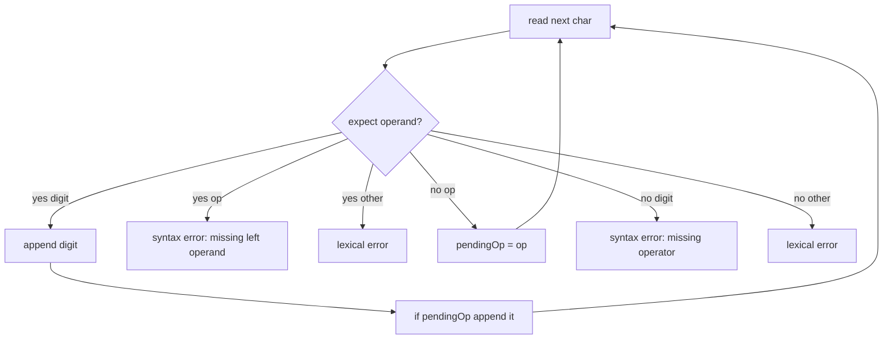
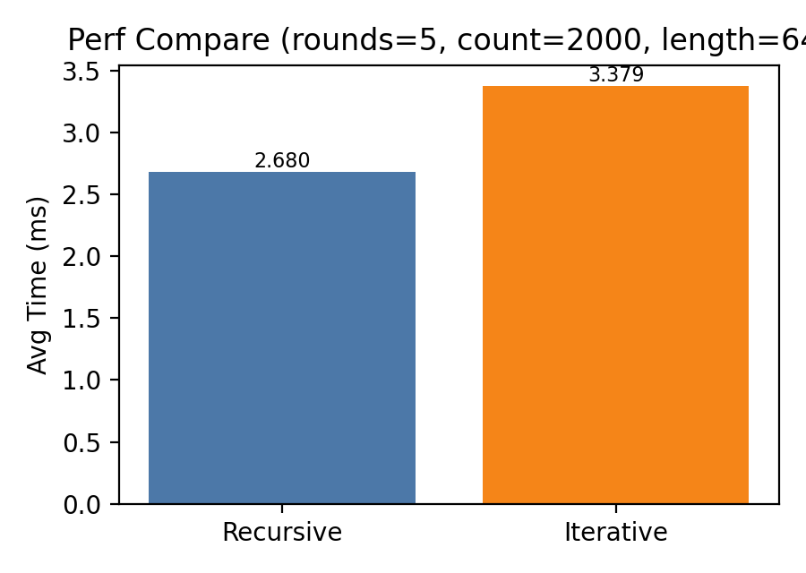

# 中山大学计算机学院

# 《编译器构造实验》Lab1 实验报告

## 后缀表达式（Postfix）

课程：编译器构造实验（DCS292）  
实验名称：Lab1 后缀表达式  
姓名：梁力航  
学号：23336128  
日期：2026-03-25

\newpage

## 目录

1. 实验目标
2. 实验环境
3. 输入语言定义
4. 设计与实现
5. 编译与运行
6. 运行日志示例
7. 样例测试与结果
8. 单元测试（加分项）
9. 性能比较（加分项）
10. 文档生成
11. 实验结论
12. 实验心得与反思
13. 附录：脚本与依赖

\newpage

## 1. 实验目标

实现一个面向简单中缀表达式（仅含单个数字与 `+`、`-` 运算符）的后缀表达式转换程序，并在原始实验软装置的基础上完成如下改进：

1. 将 `Parser.lookahead` 改为非静态成员，符合面向对象设计。
2. 消除 `rest()` 的尾递归，改为循环逻辑。
3. 扩展错误处理，支持错误分类与定位；可选实现错误恢复。
4. 增加文档化注释并生成 Javadoc。
5. 加分项：JUnit 单元测试与性能比较。

## 2. 实验环境

| 项目 | 说明                                  |
| ---- | ------------------------------------- |
| 语言 | Java                                  |
| JDK  | 1.5+（本机测试：OpenJDK 11.0.24 LTS） |
| 平台 | macOS / Windows cmd                   |

## 3. 输入语言定义

表达式语言为：

- 终结符：`digit`（0-9）、`+`、`-`
- 不允许空格或任何空白字符

等价的简单文法可表述为：

```
Expr  -> Term (('+'|'-') Term)*
Term  -> digit
```

## 4. 设计与实现

### 4.1 状态机式解析（替代尾递归）

通过 `expectOperand` 状态变量与 `pendingOp` 记录最近的运算符，实现循环式扫描，避免递归调用开销。

### 4.2 错误分类与定位

错误分类分为：
| 错误类型 | 触发条件 | 示例 |
| --- | --- | --- |
| 词法错误 | 空白字符/非法字符 | `1 +2`, `1a+2` |
| 语法错误 | 缺少运算符/缺少运算量/空表达式 | `95+2`, `9-5+-2`, 空输入 |

定位策略：按字符扫描，记录 1-based 位置。  
输出策略：

- stdout：输出后缀表达式，若有错误追加 ` (error)`
- stderr：输出详细错误信息
- `--recover`：尝试跳过错误字符继续扫描并报告更多错误

### 4.3 流程示意图



## 5. 编译与运行

### macOS / Linux

```bash
./build.sh
./run.sh
./run.sh --recover
./run.sh --quiet < testcases/tc-001.infix
```

### Windows cmd

```bat
build.bat
run.bat
run.bat --recover
run.bat --quiet < testcases\tc-001.infix
```

## 6. 运行日志示例

### 6.1 正确输入

```
$ printf '9-5+2\n' | java -cp bin Postfix
Input an infix expression and output its postfix notation:
95-2+
End of program.
```

### 6.2 语法错误（缺少运算符）

```
$ printf '95+2\n' | java -cp bin Postfix
Input an infix expression and output its postfix notation:
9 (error)
End of program.
SYNTAX error at position 2: missing operator
```

### 6.3 词法错误（空白字符）

```
$ printf '1 +2\n' | java -cp bin Postfix
Input an infix expression and output its postfix notation:
1 (error)
End of program.
LEXICAL error at position 2: whitespace not allowed
```

## 7. 样例测试与结果

使用 `testcases/` 中的 4 个样例进行验证：
| 用例 | 输入 | 期望输出 | 实际输出 | 结论 |
| --- | --- | --- | --- | --- |
| tc-001 | `9-5+2` | `95-2+` | `95-2+` | 通过 |
| tc-002 | `1-2+3-4+5-6+7-8+9-0` | `12-3+4-5+6-7+8-9+0-` | `12-3+4-5+6-7+8-9+0-` | 通过 |
| tc-003 | `95+2` | `9 (error)` | `9 (error)` | 通过 |
| tc-004 | `9-5+-2` | `95- (error)` | `95- (error)` | 通过 |

## 8. 单元测试（加分项）

JUnit 覆盖典型正常与异常路径，包含：

- 正确输入 2 个
- 语法错误、词法错误等 4 个

运行命令：

```bash
./test.sh
```

## 9. 性能比较（加分项）

### 9.1 测试配置

参数：`rounds=5, exprCount=2000, length=64`

### 9.2 数据与图表

| 版本      | 平均耗时 (ms) |
| --------- | ------------- |
| Recursive | 2.680         |
| Iterative | 3.379         |



说明：迭代版包含更多错误检测逻辑，且微基准易受 JVM 预热与系统负载影响，因此本次结果中迭代版略慢是合理的。

## 10. 文档生成

Javadoc 已生成至 `doc/` 目录，包含 `Parser`、`ParseResult` 等类的说明文档。

## 11. 实验结论

1. 将 `lookahead` 改为非静态成员更符合面向对象设计，避免多实例共享状态导致的不确定行为。
2. 尾递归改循环可降低栈开销，但实际性能仍取决于实现细节与 JVM 优化。
3. 错误分类与定位提升了程序鲁棒性，`--recover` 可以在一次运行中报告更多错误。

## 12. 实验心得与反思

1. **关于“功能正确”与“工程可用”的差异**  
   最初实验程序只关注转换结果，默认输入永远正确；真实开发中，这种前提通常不成立。  
   本次补充错误分类、定位和恢复后，程序在“可解释性”和“可维护性”方面有明显提升。

2. **关于静态成员与面向对象设计**  
   将 `lookahead` 设为 `static` 在单实例下可工作，但会引入跨实例共享状态问题。  
   本次改为实例字段后，Parser 的职责边界更清晰，也更符合后续扩展（并发、多实例）需求。

3. **关于性能实验的认识**  
   “去尾递归一定更快”是常见直觉，但实际性能取决于具体实现与运行时优化。  
   本次结果中迭代版略慢，核心原因是新增了更多错误检测路径，这提醒我做性能对比时要保证功能等价、统计口径一致。

4. **关于跨平台脚本的实践**  
   同时维护 `.sh` 与 `.bat` 脚本后，能明显感受到平台差异（换行、路径分隔符、重定向行为）。  
   这部分工作虽然不是算法核心，但对课程提交和复现实验结果非常关键。

5. **后续可改进方向**

- 增加括号与乘除支持，扩展文法和优先级处理。
- 将错误恢复从“跳过字符”升级为更系统的同步策略。
- 引入 CI 自动化（编译、测试、文档生成）进一步提升规范性。

## 13. 附录：脚本与依赖

- `build.sh / build.bat`：编译
- `run.sh / run.bat`：运行
- `test.sh / test.bat`：JUnit + 样例对比
- `doc.sh / doc.bat`：Javadoc
- `perf.sh / perf.bat`：性能比较
- `lib/`：JUnit 4.13.2 + Hamcrest 1.3
