## 编译原理 Complier Principles

赵帅

计算机学院

中山大学

## Content

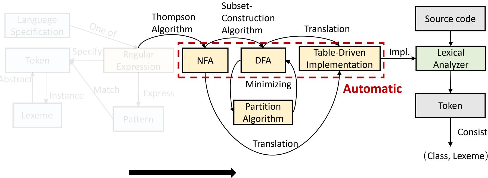  
From Specification to Implementation

## Finite Automata[有穷自动机]

• REs is only a language specification[只是定义了语言]

◆ to construct a token recognizer for languages given by regular expressions

## • How do we go from specification to implementation?

◆ Regular expressions can be implemented using finite automata

◆ There are two types of automata

 NFAs (nondeterministic finite automata) [非确定的有穷自动机]

 DFAs (deterministic finite automata) [确定的有穷自动机]

Finite Automata(FA) [有穷自动机]

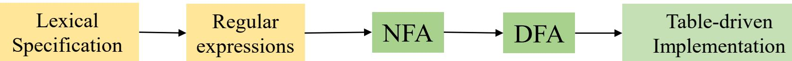

## Finite Automata[有穷自动机]

• Regular Expression = specification[正则表达是定义]

• Finite Automata = implementation[自动机是实现]

• Automaton (pl. automata): a machine or program

• Finite automaton (FA): a program with a finite number of states

• Finite Automata are similar to transition diagrams

◆ They have states and labelled edges

◆ There are one unique start state and one or more than one final states

## Transition Diagram[转换图]

## • Node[节点]: state

◆ Each state represents a condition that may occur in the process

◆ Initial state (Start): only one, circle marked with ‘start’

◆ Final state (Accepting): may have multiple, double circle

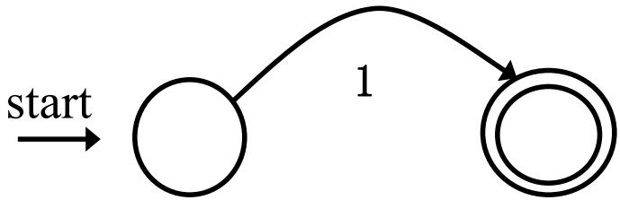

• Edge[边]: transition. directed, labeled with the symbol(s)

◆ From one state to another on the input

## FA: Language

• An FA is a program for classifying strings (return: accept, reject) ◆ In other words, a program for recognizing a language

◆ For a given string ‘x’, if there is a transition sequence for ‘x’ to move from the start state to a certain accepting state, then we say ‘x’ is accepted by the FA. Otherwise, rejected

• Language of FA = set of strings accepted by that FA $\mathsf { L } ( \mathsf { F A } ) \equiv \mathsf { L } ( \mathsf { R E } )$

## Example

• Are the following strings acceptable?

$$
\bullet 0 ^ { \mathrm { ~ ~ } } \vee
$$

$$
\$ 1
$$

$$
\bullet 1 1 1 1 0 ~ \textup { V }
$$

$$
\bullet 1 1 1 0 1 \times
$$

$$
\bullet 1 1 1 0 0 \times
$$

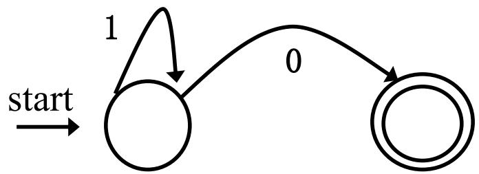

$$
\bullet 1 1 1 1 1 1 0 \vee
$$

• What language does the state graph recognize? $\textstyle \sum = \{ 0 , 1 \}$ • Any number of ‘1’s followed by a single 0

## DFA and NFA

• Deterministic Finite Automata (DFA): the machine can exist in only one state at any given time[确定的有限状态机]

◆ One transition per input per state

◆ No ε-moves

◆ Takes only one path through the state graph

• Nondeterministic Finite Automata (NFA): the machine can exist in multiple states at the same time[非确定的有限状态机]

◆ Can have multiple transitions for one input in a given state

◆ Can have ε-moves

◆ Can choose which path to take

 An NFA accepts if some of these paths lead to accepting state at the end of input

## State Graph

• 5 components ( ∑, S, n, F, δ )

◆ An input alphabet Σ

◆ A set of states S

◆ A start state ${ \mathfrak { n } } \in { \mathfrak { s } }$

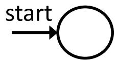

◆ A set of accepting states F ⊆ S

◆ A set of transitions δ: $S _ { \mathbf { a } } \xrightarrow [ ] { \mathbf { I n p u t } } S _ { \mathbf { b } }$

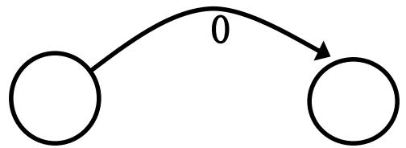

## Comparison of NFA and DFA

• NFA: There are many possible moves: to accept a string, we only need one sequence of moves that lead to a final state

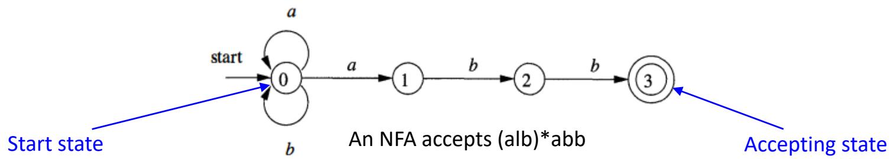

− Input string: aabb

− Successful sequence:

$$
\displaystyle 0 { \overset { a } { \to } } 0 { \overset { a } { \to } } 1 { \overset { b } { \to } } 2 { \overset { b } { \to } } 3
$$

− Unsuccessful sequence: $\displaystyle 0 { \overset { a } { \to } } 0 { \overset { a } { \to } } 0 { \overset { b } { \to } } 0 { \overset { b } { \to } } 0$

## Comparison of NFA and DFA

• DFA: There is only one possible sequence of moves, either lead to a final state and accept or the input string is rejected

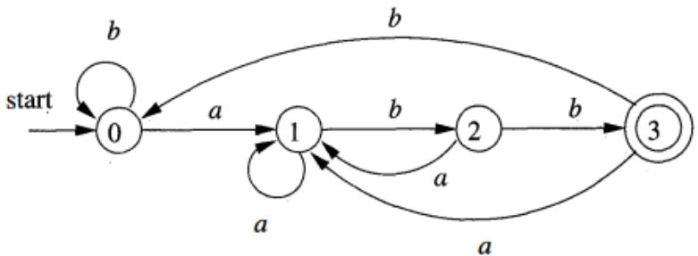  
A DFA accepts (alb)\*abb

− Input string: aabb

− Successful sequence: $\displaystyle 0 { \overset { a } { \to } } 1 { \overset { a } { \to } } 1 { \overset { b } { \to } } 2 { \overset { b } { \to } } 3$

## Transition Table

• FA can also be represented using transition table

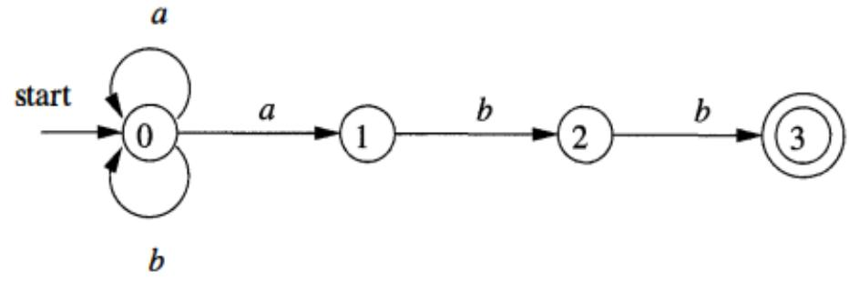

<table><tr><td> STATE</td><td>b a</td><td>E</td></tr><tr><td>0</td><td>{0,1}</td><td>0</td></tr><tr><td>1</td><td>?</td><td>W</td></tr><tr><td></td><td>028 @</td><td>W@</td></tr><tr><td>２３</td><td>@ 0</td><td></td></tr></table>

• Advantage

◆ We can easily find the transitions on a given state and input.

## • Disadvantage

◆ It takes a lot of space, when the input alphabet is large, yet most states do not have any moves on most of the input symbols.

 Need finite memory $0 ( | \mathsf { S } | ^ { \ast } | \Sigma | )$

## Content

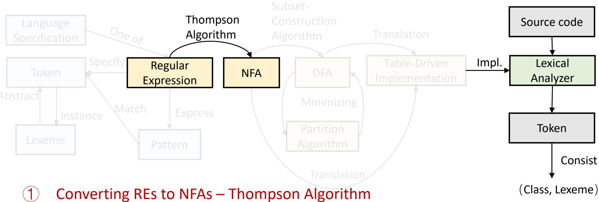

Converting NFAs to DFAs

③ Perform DFA minimization

④ Converting DFAs to table-driven implementations

## Construct NFA for RE

Basic: processing atomic REs

（ Thompson算法）

• NFA for 

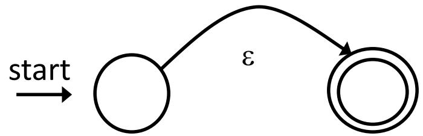

• NFA for single character a

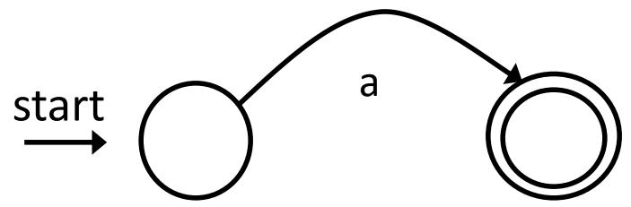

## Construct NFA for RE

Inductive: processing compound Res

$$
\scriptstyle \mathrm { R = A } \mid \mathsf { B }
$$

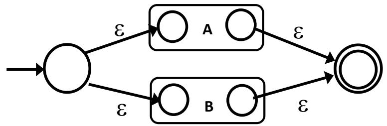

$$
\scriptstyle \mathsf { R } = \mathsf { A } \mathsf { B }
$$

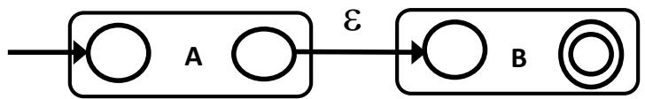

$$
\pmb { \mathrm { R } } \pmb { = } \pmb { \mathrm { A } } ^ { * }
$$

## Example

• Convert “(a|b)\*abb” to NFA

(a|b)

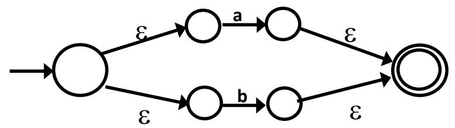

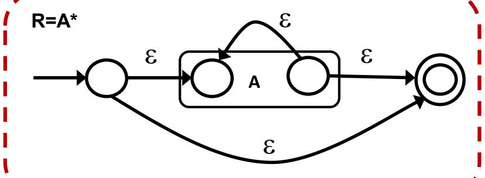  
(a|b)\*

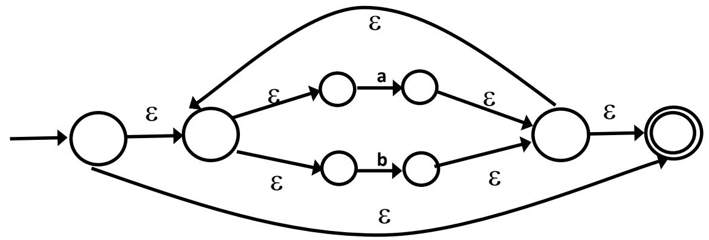

## Example

## • Convert “(a|b)\*abb” to NFA

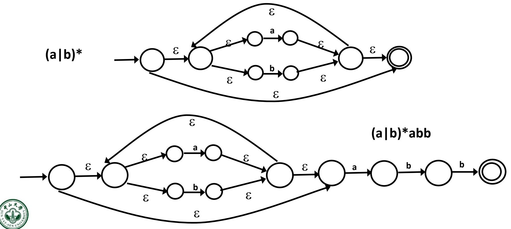

## Revisit

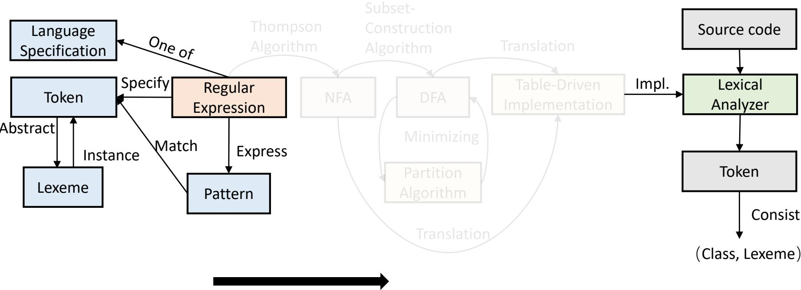  
From Specification to Implementation

## Revisit

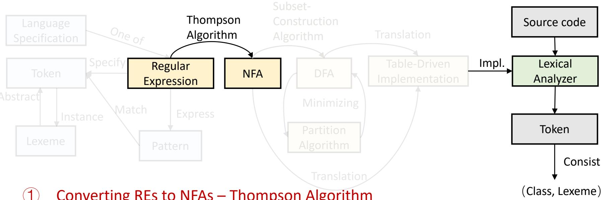

① Converting REs to NFAs – Thompson Algorithm

② Converting NFAs to DFAs – Subset-Construction Algorithm

③ Perform DFA minimization

④ Converting DFAs to table-driven implementations

## Revisit

⚫ Specification: Regular Expression

⚫ Compound Regular Expression

⚫ E.g., (ab)\*, (a|b)\*, (a\*b\*)\*

⚫ Removing Ambiguity: keyword first, maximal match, the one listed first

⚫ Implementation: Finite Automata

⚫ Non-Deterministic Finite Automata (NFA)

⚫ Deterministic Finite Automata (DFA)

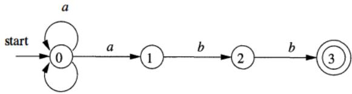

⚫ Transition Table

⚫ Thompson Algorithm

⚫ From REs to NFAs (systemic way)

⚫ Use  to connect small NFAs

<table><tr><td> STATE</td><td>a b</td><td>E</td></tr><tr><td>0</td><td>{0,1}</td><td>000:</td></tr><tr><td></td><td>000</td><td></td></tr><tr><td>１2</td><td>0280</td><td></td></tr><tr><td>3</td><td></td><td>0</td></tr></table>

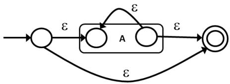

## Content

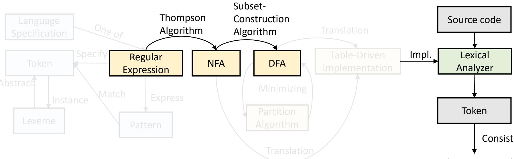

Converting REs to NFAs – Thompson Algorithm

② Converting NFAs to DFAs – Subset-Construction Algorithm

③ Perform DFA minimization

④ Converting DFAs to table-driven implementations

## From NFA to DFA

## • NFA and DFA are equivalent

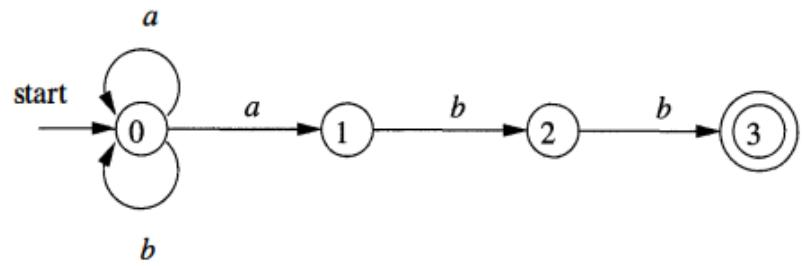

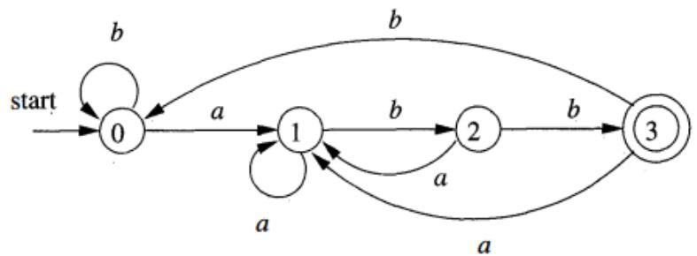

To show this we must prove every DFA can be converted into an NFA which accepts the same language, and vice-versa

## From NFA to DFA

## • Theorem: L(NFA) ≡ L(DFA)

◆ Both recognize regular languages L(RE)

◆对于每个NFA M存在一个DFA M'，使得 L(M)=L(M’) NFA与NFA描述能力相同!

• Resulting DFA consumes more memory than NFA ◆ Potentially larger transition table as shown later

• But DFAs are faster to execute

◆ For DFAs, number of transitions == length of input

◆ For NFAs, number of potential transitions can be larger

◆ NFA→ DFA conversion is needed because the speed of DFA far outweighs its extra memory consumption

## From NFA to DFA

## • Recall DFA

◆ Every state must have exactly one transition defined for every letter

◆ ε-moves are not allowed

 NFAs have multiple transition, while DFAs can only have one transition in one time

## • Subset construction[子集构造法]

◆ Each state of the constructed DFA corresponds to a set of NFA states

 After reading input $a _ { 1 } a _ { 2 } \ldots a _ { n }$ , the DFA is in that state which corresponds to the set of states that the NFA can reach, from its start state, following paths labeled $a _ { 1 } a _ { 2 } \dots a _ { n }$

## From NFA to DFA

## • Two problem need to solve

◆ Eliminate ε-transition

◆ Eliminate multiple transitions from a state on a single character

## • The ε-closure of a set of states

◆ The set of all states reachable by a series of zero or more ε-transitions from the set of states

◆ That is, about a set I

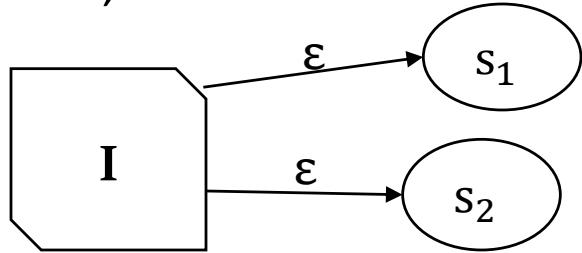

$$
\varepsilon { \mathrm { - c l o s u r e ( I ) } } = \mathbf { I } \cup \{ s _ { 1 } , s _ { 2 } \}
$$

## From NFA to DFA: Algorithm

## Notion in the algorithm

• ε-closure(s)

The set of all states reachable by a series of zero or more ε-transitions from state s

## • ε-closure(T)

The set of all states reachable by a series of zero or more ε-transitions from the set of states T

• ???????? $( T , a ) = \{ t | s \in T$ ?????? $s { \stackrel { a } { \to } } t \}$

Set of NFA states to which there is a transition on input symbol a from some state s in T

initially, E-closure(so) is the only state in Dstates,and it is unmarked;   
while ( there is an unmarked state T in Dstates ） {   
mark T;   
for(each input symbol α） {   
U = e-closure(move(T,@));   
if ( U is not in Dstates )   
add U as an unmarked state to Dstates;   
Dtran[T,a] = U;   
  
！

Then, we will give a simple explanation by using the following symbols:

• I is a set of states,

• a is a character in the alphabet

• $m o v e ( I , a ) = \{ t | s \in I \ a n d \ s \stackrel { a } {  } t \}$

$I _ { a } = \mathsf { \varepsilon - c l o s u r e } ( m o v e ( I , a ) )$

## Example

• Step1: Start by constructing ε-closure of the start state

◆ ?? = ε-closure(state $0 ) = \{ 0 , 1 , 3 \}$

◆ {0, 1, 3} is a new state for DFA, marked T0

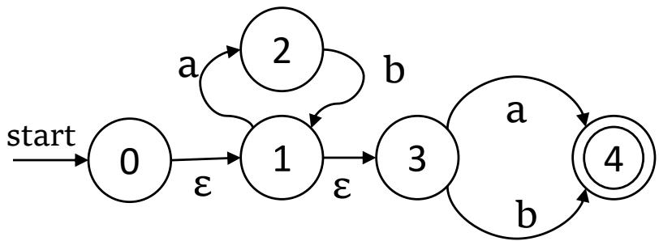

<table><tr><td rowspan=1 colspan=1>1</td><td rowspan=1 colspan=1> $1 \%$ </td><td rowspan=1 colspan=1> $1 6$ </td><td rowspan=1 colspan=1>Accept</td></tr><tr><td rowspan=1 colspan=1>{0,1,3} mark TO</td><td rowspan=1 colspan=1></td><td rowspan=1 colspan=1></td><td rowspan=1 colspan=1></td></tr><tr><td rowspan=1 colspan=1></td><td rowspan=1 colspan=1></td><td rowspan=1 colspan=1></td><td rowspan=1 colspan=1></td></tr><tr><td rowspan=1 colspan=1></td><td rowspan=1 colspan=1></td><td rowspan=1 colspan=1></td><td rowspan=1 colspan=1></td></tr><tr><td rowspan=1 colspan=1></td><td rowspan=1 colspan=1></td><td rowspan=1 colspan=1></td><td rowspan=1 colspan=1></td></tr></table>

## Example Cont.

• Step1: Start by constructing ε-closure of the start state ◆ ?? = ε-closure(state 0) = {0, 1, 3}

• Step2: Keep getting ε-closure(move(??, x)) for each character x in Σ

◆ Computing for the new state until there are no more new states

◆ ?? ={0, 1, 3}, move(??, a) = {2, 4}, ε-closure({2, 4}) = {2, 4}

◆ ???? = ε-closure(move(??, a)) = {2, 4}

◆ ???? = ε-closure(move(??, b)) = {4}

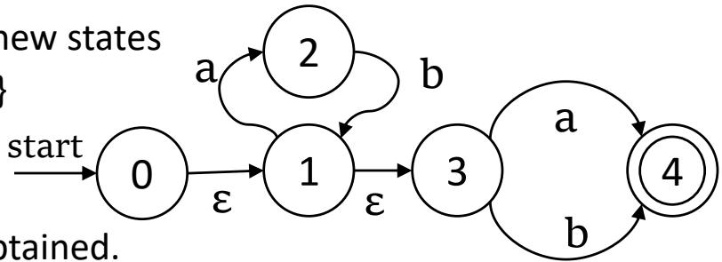

◆ {2, 4} and {4} are sets of state that have never been obtained.

<table><tr><td rowspan=1 colspan=1></td><td rowspan=1 colspan=1> $1 6$ </td><td rowspan=1 colspan=1>lb</td><td rowspan=1 colspan=1>Accept</td></tr><tr><td rowspan=1 colspan=1>{0,1,3} mark TO</td><td rowspan=1 colspan=1>{2,4} mark T1</td><td rowspan=1 colspan=1>{4} mark T2</td><td rowspan=1 colspan=1></td></tr><tr><td rowspan=1 colspan=1>{2,4}T1</td><td rowspan=1 colspan=1></td><td rowspan=1 colspan=1></td><td rowspan=1 colspan=1></td></tr><tr><td rowspan=1 colspan=1>{4}T2</td><td rowspan=1 colspan=1></td><td rowspan=1 colspan=1></td><td rowspan=1 colspan=1></td></tr><tr><td rowspan=1 colspan=1></td><td rowspan=1 colspan=1></td><td rowspan=1 colspan=1></td><td rowspan=1 colspan=1></td></tr></table>

## Example Cont.

• Step1: Start by constructing ε-closure of the start state

◆ ?? = ε-closure(state 0) = {0, 1, 3}

• Step2: Keep getting ε-closure(move(??, x)) for each character x in Σ

◆ For T1 = {2, 4}

$I _ { a } = \mathtt { \varepsilon - c l o s u r e } ( \mathsf { m o v e } ( \{ 2 , 4 \} , \mathsf { a } ) ) = \{ \}$ dead state [text book 3.8.3]

$I _ { b } = \mathtt { \varepsilon - c l o s u r e } ( \mathsf { m o v e } ( \{ 2 , 4 \} , \mathsf { b } ) ) = \{ 1 , 3 \}$ new state

◆ For T2 = {4}, ….

◆ Stop, when there are no more new states

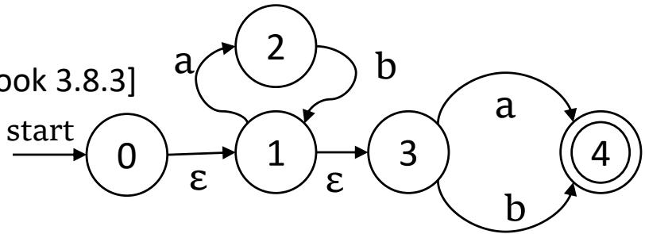

<table><tr><td rowspan=1 colspan=1>I</td><td rowspan=1 colspan=1> $1 6$ </td><td rowspan=1 colspan=1> $1 6 0$ </td><td rowspan=1 colspan=1>Accept</td></tr><tr><td rowspan=1 colspan=1>{0,1,3} mark To</td><td rowspan=1 colspan=1>{2,4}  mark T1</td><td rowspan=1 colspan=1>{4} mark T2</td><td rowspan=1 colspan=1></td></tr><tr><td rowspan=1 colspan=1>{2,4}T1</td><td rowspan=1 colspan=1></td><td rowspan=1 colspan=1>{1,3} mark T3</td><td rowspan=1 colspan=1></td></tr><tr><td rowspan=1 colspan=1>{4}T2</td><td rowspan=1 colspan=1></td><td rowspan=1 colspan=1></td><td rowspan=1 colspan=1></td></tr><tr><td rowspan=1 colspan=1>{1,3} T3</td><td rowspan=1 colspan=1>{2,4} T1</td><td rowspan=1 colspan=1>{4} T2</td><td rowspan=1 colspan=1></td></tr></table>

## Example Cont.

• Step1: Start by constructing ε-closure of the start state ◆ ?? = ε-closure(state 0) = {0, 1, 3}

• Step2: Keep getting ε-closure(move(??, x)) for each character x in Σ

◆ Stop, when there are no more new states

• Step3: Mark as accepting for those states that contain an accepting state start

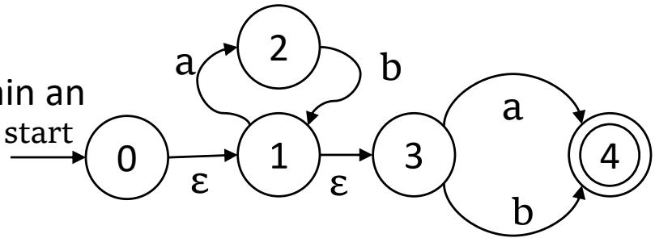

<table><tr><td rowspan=1 colspan=1></td><td rowspan=1 colspan=1> $1 \%$ </td><td rowspan=1 colspan=1> $1 6 0$ </td><td rowspan=1 colspan=1>Accept</td></tr><tr><td rowspan=1 colspan=1>{0,1,3} mark TO</td><td rowspan=1 colspan=1>{2,4} mark T1</td><td rowspan=1 colspan=1>{4}mark T2</td><td rowspan=1 colspan=1>TO No</td></tr><tr><td rowspan=1 colspan=1>{2,4}T1</td><td rowspan=1 colspan=1></td><td rowspan=1 colspan=1>{1,3} mark T3</td><td rowspan=1 colspan=1>T1 Yes</td></tr><tr><td rowspan=1 colspan=1>{4} T2</td><td rowspan=1 colspan=1></td><td rowspan=1 colspan=1></td><td rowspan=1 colspan=1>T2 Yes</td></tr><tr><td rowspan=1 colspan=1>{1,3}T3</td><td rowspan=1 colspan=1>{2,4} T1</td><td rowspan=1 colspan=1>{4} T2</td><td rowspan=1 colspan=1>T3 No</td></tr></table>

## Example Cont.

## • Construct DFA

<table><tr><td rowspan=1 colspan=1>I</td><td rowspan=1 colspan=1> $1 6$ </td><td rowspan=1 colspan=1>Ib</td><td rowspan=1 colspan=1>Accept</td></tr><tr><td rowspan=1 colspan=1>{0, 1,3} T0</td><td rowspan=1 colspan=1>{2,4}  mark T1</td><td rowspan=1 colspan=1>{4} mark T2</td><td rowspan=1 colspan=1>TO No</td></tr><tr><td rowspan=1 colspan=1>{2,4} T1</td><td rowspan=1 colspan=1></td><td rowspan=1 colspan=1>{1,3} mark T3</td><td rowspan=1 colspan=1>T1 Yes</td></tr><tr><td rowspan=1 colspan=1>{4} T2</td><td rowspan=1 colspan=1></td><td rowspan=1 colspan=1></td><td rowspan=1 colspan=1>T2 Yes</td></tr><tr><td rowspan=1 colspan=1>{1,3}T3</td><td rowspan=1 colspan=1>{2,4} T1</td><td rowspan=1 colspan=1>{4} T2</td><td rowspan=1 colspan=1>T3 No</td></tr></table>

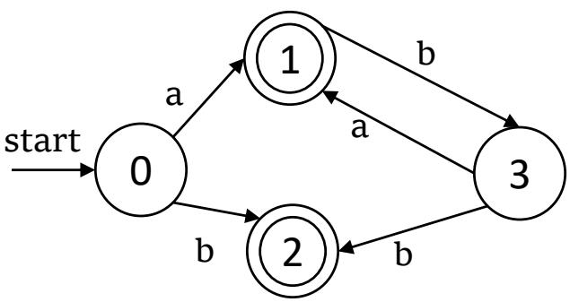

## Content

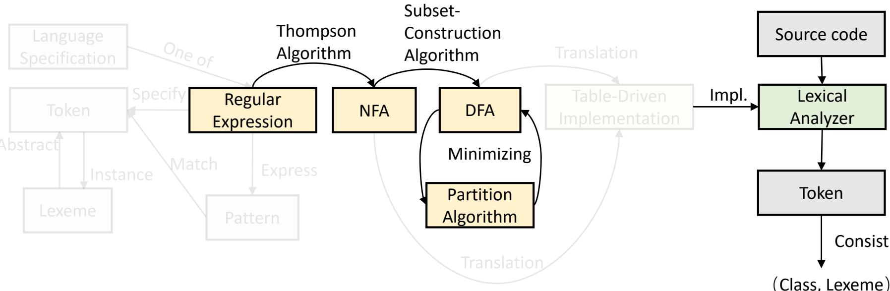

① Converting REs to NFAs – Thompson Algorithm

② Converting NFAs to DFAs – Subset-Construction Algorithm

③ Perform DFA minimization – Partition Algorithm

④ Converting DFAs to table-driven implementations

## Minimizing DFA

• Theory: Given any DFA, there is an equivalent DFA containing a minimum number of states, and this minimum-state DFA is unique

## • Equivalent States

If s and t are two states, they are equivalent if and only if:

① s and t are both accepting states or both non-accepting states.

② For each character $x \in \Sigma$ , s and t have transitions on x to the equivalent states

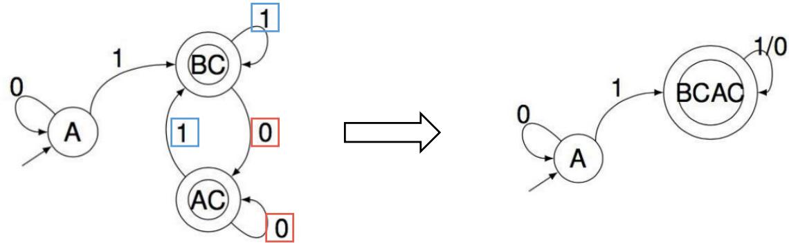  
States BC and AC do not need differentiation

## Minimization Algorithm

## • The algorithm

Partitioning the states of a DFA into groups of states that cannot be distinguished (i.e., equivalent)

First, split the set of states into two sets, one consists of all accepting states and the other consists of all non-accepting states.

Consider the transitions on each character ‘x’ of the alphabet for each subset, and determine whether all the states in the subset are equivalent, or the subset should be split.

③ Continue this process until no further splitting of sets occurs

## Simple Example for Minimizing DFA

## • Step 1：Divide the states into two sets

Initial sets: {non-accepting states}, {accepting states} Initial: {A} , {BC, AC}

## • Step 2: check if the states are equivalent

For {BC, AC}

BC on ‘0’ → AC, AC on ‘0’ → AC

BC on ‘1’ → BC, AC on ‘1’ → BC

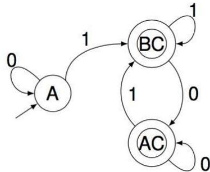

No way to distinguish BC from AC on any string starting with ‘0’ or ‘1’

Final: {A}, {BCAC}

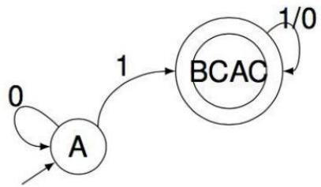

## Example: Minimization

## ① Initial

{S, A, B} and {C, D, E, F}, {non-accepting states} and {accepting states}

② Consider all states in each subset, check the transitions for each $x \in \Sigma$ Now we have two subsets {C,D,E,F} and {S,A,B}

For $I _ { 1 } = \{ { \mathsf { C } } , { \mathsf { D } } , { \mathsf { E } } , { \mathsf { F } } \}$

$$
\begin{array} { r l } & { \left\{ C , D , E , F \right\} \xrightarrow { a } \left\{ C , F \right\} \Rightarrow \left\{ C , D , E , F \right\} \xrightarrow { a } \left\{ C , D , E , F \right\} \xrightarrow { a } \left\{ C , D , E , F \right\} \xrightarrow { a } } \\ & { \left\{ C , D , E , F \right\} \xrightarrow { b } \left\{ D , E \right\} \Rightarrow \left\{ C , D , E , F \right\} \xrightarrow { b } \left\{ C , D , E , F \right\} \xrightarrow { b } } \end{array}
$$

All the states in {C, D, E, F} are equivalent

Now we still have {C,D,E,F} and $\{ \mathsf { S } , \mathsf { A } , \mathsf { B } \}$

For each character ${ \mathsf { x } } \in \{ { \mathsf { a } } , { \mathsf { b } } \} .$ all the states in {C, D, E, F} have the same transition on x.

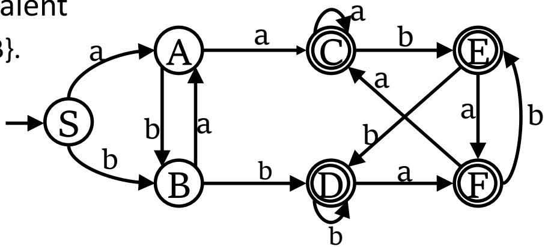

## Example: Minimization Cont.

## ① Initial

{S, A, B} and $\{ \mathsf { C } , \mathsf { D } , \mathsf { E } , \mathsf { F } \}$

② Consider all states in each subset, check the transitions for all $x \in \Sigma$ For $I _ { 1 } = \{ { \mathsf { C } } , { \mathsf { D } } , { \mathsf { E } } , { \mathsf { F } } \} _ { \ast }$ , all states in $I _ { 1 }$ are equivalent.

For $I _ { 2 } = \{ { \mathsf { S } } , { \mathsf { A } } , { \mathsf { B } } \} ,$ for each states, check ${ \pmb x } \in \{ { \sf a } , { \sf b } \}$

Check character a

$\{ S \} \stackrel { a } {  } \{ A \} , \{ A \} \stackrel { a } {  } \{ C \} , \{ B \} \stackrel { a } {  } \{ A \} \Rightarrow \{ S , B \} \stackrel { a } {  } \{ A \} , \{ A \} \stackrel { a } {  } \{ C , D , E , F \} \Rightarrow \{ S , B \}$ B} and A have different transition on $a \ \Rightarrow \ \{ { \mathsf { S } } , { \mathsf { B } } \}$ and A are not equivalent. a

So split {S, A, B} to {S, B} and {A}.   
Now we have {C, D, E, F}, {S, B}, {A}.

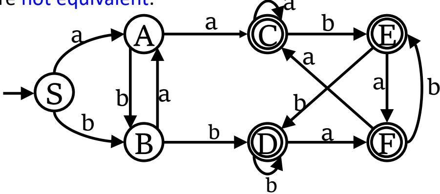

## Example: Minimization Cont.

① Initial

{S, A, B} and $\{ { \mathsf C } , { \mathsf D } , { \mathsf E } , { \mathsf F } \}$

## ② Consider all states in each subset, check the transitions for all $x \in \Sigma$

For $I _ { 1 } = \{ { \mathsf { C } } , { \mathsf { D } } , { \mathsf { E } } , { \mathsf { F } } \} ,$ , all states in $I _ { 1 }$ are equivalent. Now we still have {C,D,E,F} and {S,A,B}.

For $I _ { 2 } = \{ { \mathsf { S } } , { \mathsf { A } } , { \mathsf { B } } \} ,$ for each states, check ${ \pmb x } \in \{ { \mathsf { a } } , { \mathsf { b } } \}$

Now we have {C, D, E, F}, {S, B}, {A}.

Keep checking the subset {S, B}.

$$
\{ S , B \} { \overset { a } { \to } } \{ A \}
$$

$\{ S \} \stackrel { b } { \to } \{ B \} , \{ B \} \stackrel { b } { \to } \{ C , D , E , F \} \Rightarrow \mathbb { S }$ and B are not equivalent.

So split {S, B} to {S} and {B}.

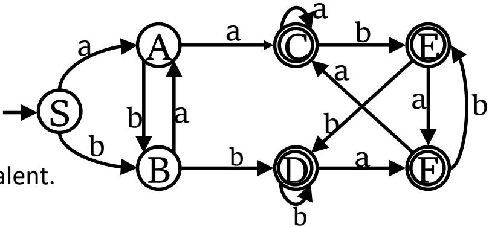

Now we have $\{ \mathsf { C } , \mathsf { D } , \mathsf { E } , \mathsf { F } \} , \{ \mathsf { S } \} , \{ \mathsf { B } \} , \{ \mathsf { A } \}$

Since all states in $\{ \mathsf { C } , \mathsf { D } , \mathsf { E } , \mathsf { F } \}$ are equivalent and $\{ \mathsf { S } \} , \{ \mathsf { B } \} , \{ \mathsf { A } \}$ each contain only one state, no further splitting of sets will occur. Stop this process.

## Example: Minimization Cont.

③ Finally, get the subsets and draw min DFA

{C, D, E, F}, {S}, {A}, {B}

{C, D, E, F} is denoted as {C}

{??} $\stackrel { a } {  } \{ A \}$

{??} $\stackrel { b } {  } \{ B \}$

{??} $\underset { b } { \overset { a } {  } } \{ C , D , E , F \}$

{??} ՜ {??}

Minimization DFA

{??} $\overset { a } { \underset { h } {  } } \{ A \}$

{??} $\stackrel { \upsilon } {  } \{ C , D , E , F \}$

{??, $D , E , F \} { \overset { a } { \underset { b } {  } } } \{ C , D , E , F \}$

$$
\{ C , D , E , F \} \stackrel { \sim } { \to } \{ C , D , E , F \}
$$

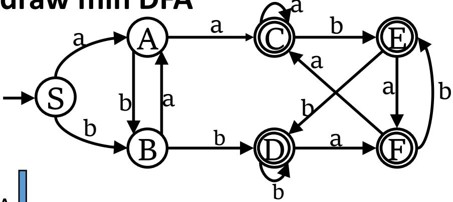

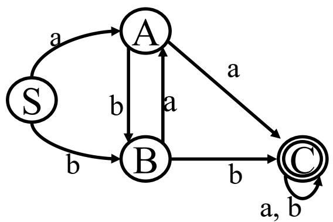

## Example

## • Is the DFA minimal?

1. Initial: {0,3} and {1,2}

2. Check all states in {1,2} state 2 have no transition, state 1 have transition on b. {1} and {2} are not equivalent. Now we have {0,3} {1} {2}.

3. Check all states in {0,3} Move({0,3}, a) = {1} Move({0,3}, b) = {2}. 0 and 3 are equivalent states. Result: {0,3} {1} {2}.

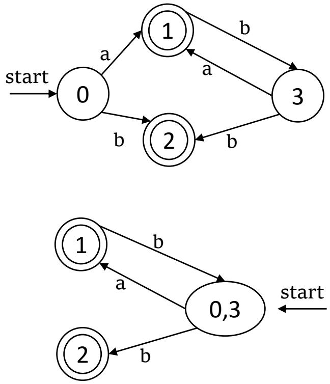

## NFA → DFA: Space Complexity[复杂度]

• NFA may be in many states at any time

• How many different possible states in DFA?

◆ If there are N states in NFA, the DFA must be in some subset of those N states

◆ How many non-empty subsets are there?

$$
\mathsf { \Omega } \mathsf { \Omega } \mathsf { \Omega } \circ 2 ^ { N } - 1
$$

• The resulting DFA has ${ \ O } ( 2 ^ {  { \mathbb { N } } } )$ space complexity, where N is number of original states in NFA

◆ For real languages, the NFA and DFA have about same number of states

## NFA → DFA: Time Complexity[复杂度]

## • DFA execution

◆ Requires $\mathsf { O } ( | \mathsf { X } | )$ steps, where $| \mathsf { X } |$ is the input length

◆ Each step takes constant time

 If current state is S and input is c, then read T[S, c]

Deterministic:

 Update current state to state T[S, c]

For input c,

unique transition

◆ Time complexity = O(|X|)

## • NFA execution

◆ Requires $\mathsf { O } ( | \mathsf { X } | )$ steps, where |X| is the input length

◆ Each step takes $\mathsf { O } ( N ^ { 2 } )$ time, where N is the number of states

 Current state is a set of potential states, up to N

Non-deterministic:

For input c,

- Each union operation takes O(N) time

form current state,

◆ Time complexit $\mathsf { y } = \mathsf { O } ( | \mathsf { X } | ^ { * } N ^ { 2 } )$

your can transit to any

states (including itself)

## Revisit

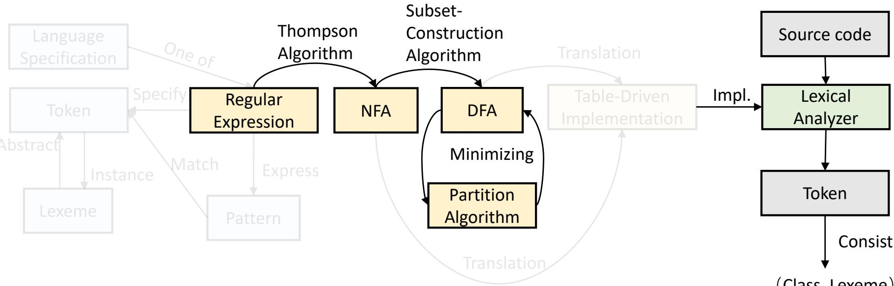

① Converting REs to NFAs – Thompson Algorithm

② Converting NFAs to DFAs – Subset-Construction Algorithm

③ Perform DFA minimization – Partition Algorithm

④ Converting DFAs to table-driven implementations

## Construct NFA for RE (Revisit)

Basic: processing atomic REs

（ Thompson算法）

• NFA for 

• NFA for single character a

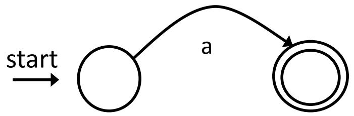

## Construct NFA for RE (Revisit)

Inductive: processing compound Res

$$
R = A \mid B
$$

$$
\mathsf { R } { = } \mathsf { A B }
$$

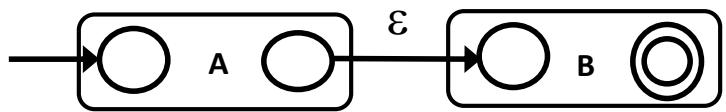

$$
\mathsf { R } = \mathsf { A } ^ { * }
$$

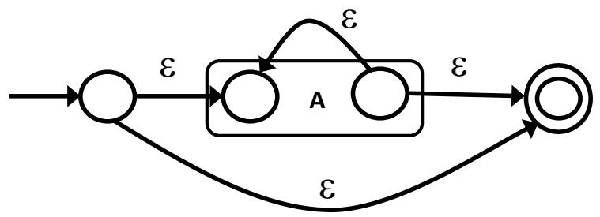

## From NFA to DFA (Revisit)

## Notion in the algorithm

• ε-closure(s)

The set of all states reachable by a series of zero or more ε-transitions from state s

## • ε-closure(T)

The set of all states reachable by a series of zero or more ε-transitions from the set of states T

• ???????? $( T , a ) = \{ t | s \in T$ ?????? $s { \stackrel { a } { \to } } t \}$

Set of NFA states to which there is a transition on input symbol a from some state s in T

initially, E-closure(so) is the only state in Dstates,and it is unmarked;   
while ( there is an unmarked state T in Dstates ） {   
mark T;   
for (each input symbol α ） {   
U = e-closure(move(T,@));   
if ( U is not in Dstates )   
add U as an unmarked state to Dstates;   
Dtran[T,a] = U;   
  
！

Then, we will give a simple explanation by using the following symbols:

• I is a set of states,

• a is a character in the alphabet

• $m o v e ( I , a ) = \{ t | s \in I \ a n d \ s \stackrel { a } {  } t \}$

$I _ { a } = \mathsf { \varepsilon - c l o s u r e } ( m o v e ( I , a ) )$

## From NFA to DFA (Revisit)

• Step1: Start by constructing ε-closure of the start state ◆ ?? = ε-closure(state 0) = {0, 1, 3}

• Step2: Keep getting ε-closure(move(??, x)) for each character x in Σ

◆ Stop, when there are no more new states

• Step3: Mark as accepting for those states that contain an accepting state start

<table><tr><td rowspan=1 colspan=1></td><td rowspan=1 colspan=1> $1 \%$ </td><td rowspan=1 colspan=1> $1 6 0$ </td><td rowspan=1 colspan=1>Accept</td></tr><tr><td rowspan=1 colspan=1>{0,1,3} mark TO</td><td rowspan=1 colspan=1>{2,4} mark T1</td><td rowspan=1 colspan=1>{4}mark T2</td><td rowspan=1 colspan=1>TO No</td></tr><tr><td rowspan=1 colspan=1>{2,4}T1</td><td rowspan=1 colspan=1></td><td rowspan=1 colspan=1>{1,3} mark T3</td><td rowspan=1 colspan=1>T1 Yes</td></tr><tr><td rowspan=1 colspan=1>{4} T2</td><td rowspan=1 colspan=1></td><td rowspan=1 colspan=1></td><td rowspan=1 colspan=1>T2 Yes</td></tr><tr><td rowspan=1 colspan=1>{1,3}T3</td><td rowspan=1 colspan=1>{2,4} T1</td><td rowspan=1 colspan=1>{4} T2</td><td rowspan=1 colspan=1>T3 No</td></tr></table>

## Minimizing DFA (Revisit)

## • Step 1：Divide the states into two sets

Initial sets: {non-accepting states}, {accepting states} Initial: {A} , {BC, AC}

## • Step 2: check if the states are equivalent

For {BC, AC}

BC on ‘0’ → AC, AC on ‘0’ → AC

BC on ‘1’ → BC, AC on ‘1’ → BC

No way to distinguish BC from AC on any string starting with ‘0’ or ‘1’

Final: {A}, {BCAC}

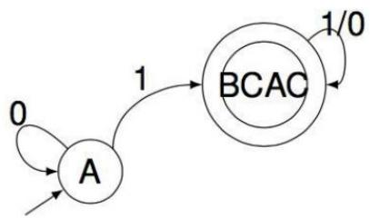

## Content

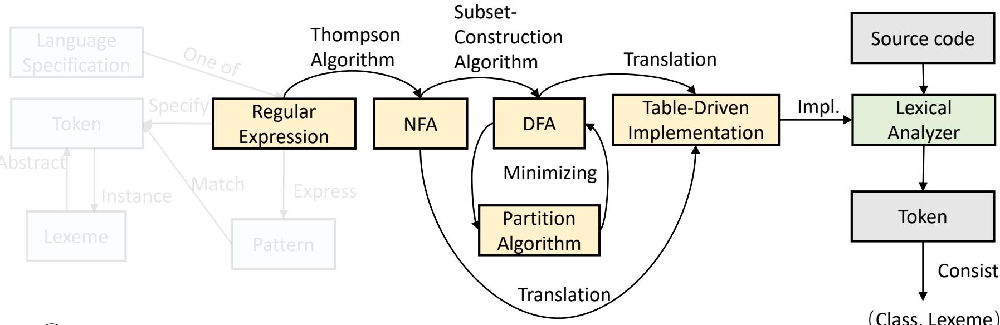

① Converting REs to NFAs – Thompson Algorithm

② Converting NFAs to DFAs – Subset-Construction Algorithm

③ Perform DFA minimization – Partition Algorithm

④ Converting DFAs to table-driven implementations

## Implementation in Practice[实际实现]

## • Lex[词法分析器]: RE → NFA → DFA → Table

◆ Converts regular expressions to NFA

◆ Converts NFA to DFA

◆ Performs DFA state minimization to reduce space

◆ Generate the transition table from DFA

◆ Performs table compression to further reduce space

• Most other automated lexers also choose DFA over NFA

◆ Trade off space for speed

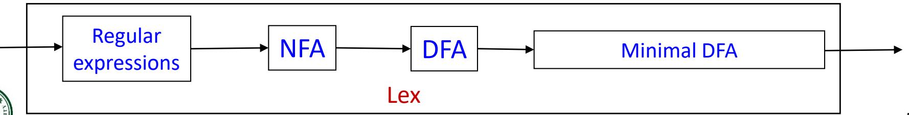

## Lexical Analyzer Generated by Lex

• A Lex program is turned into a transition table and actions, which are used by a FA simulator

• Automaton need to recognize lexemes matching any of the patterns in a program

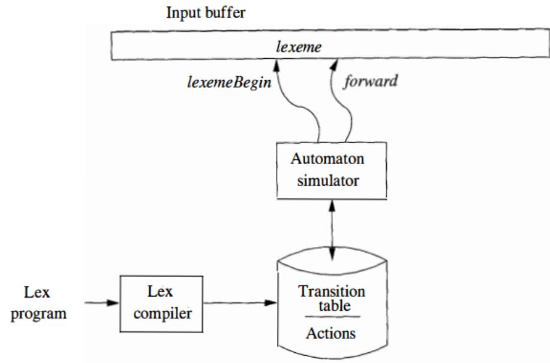

<table><tr><td>STATE</td><td></td><td></td><td>E</td></tr><tr><td>0</td><td>a {0,1}</td><td>b</td><td>0</td></tr><tr><td></td><td>0</td><td>028</td><td></td></tr><tr><td>１２３</td><td>0</td><td></td><td>000</td></tr><tr><td></td><td>0</td><td>0</td><td></td></tr><tr><td></td><td></td><td></td><td></td></tr></table>

## Lex: Example

• Three patterns, three NFAs

<table><tr><td>a</td><td>{action1}</td></tr><tr><td>abb</td><td>{action2}</td></tr><tr><td>a*b+</td><td>{action3}</td></tr></table>

• Combine three NFAs into a single NFA Add start state 0 and ε-transitions

Any one is possible, if you haven’t read any input symbol

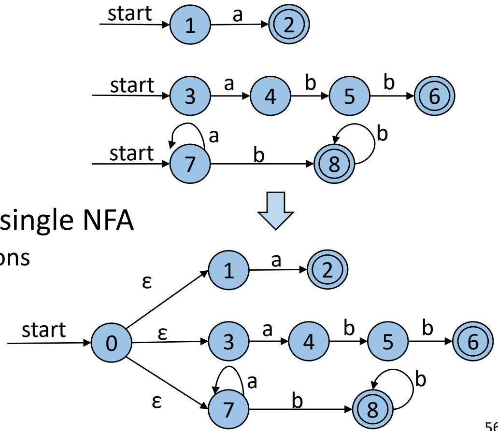

## Lex: Example

• Input: aaba

◆ $\mathtt { \varepsilon - c l o s u r e } ( 0 ) = \{ 0 , 1 , 3 , 7 \}$

◆ Empty states after reading the fourth input symbol

 There are no transitions out of state 8

 Back $\mathsf { u p } ,$ looking for a set of states that include an accepting state

◆ State $8 : \mathsf { a } ^ { * } \mathsf { b } +$ has been matched

◆ Select aab as the lexeme, execute action3

 Return to parser indicating that token with pattern $\mathtt { a } ^ { * } \mathtt { b } +$ has been found

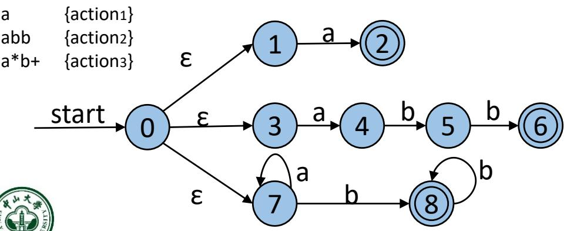

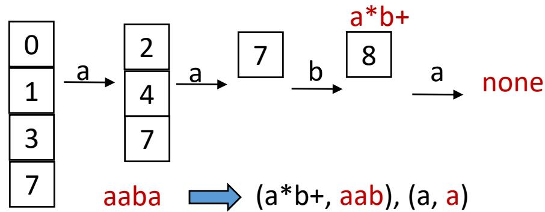

## Lex: Example

• DFA’s for lexical analyzer

• Input: abba

◆ Sequence of states entered: $0 1 3 7 \to 2 4 7 \to 5 8 \to 6 8$

◆ At the final a, there is no transition out of state 68  68 itself is an accepting state that reports pattern abb

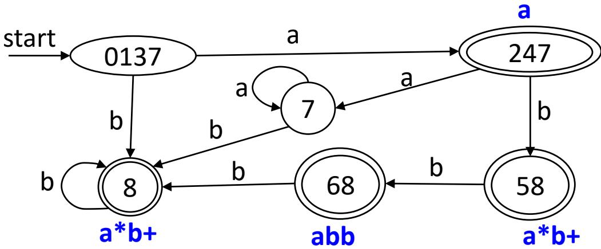

## How Much Should We Match?[匹配多少]

## • In general, find the longest match possible

◆ We have seen examples

◆ One more example: input string aabbb …

 Have many prefixes that match the third pattern

 Continue reading b’s until another a is met

 Report the lexeme to be the initial a’s followed by as many b’s as there are

## • If same length, appearing first takes precedence[先出现的优先]

◆ String abb matches both the second and third pattern

◆ We consider it as a lexeme for pattern2, since that pattern listed first

$$
\begin{array} { l l l } { { 1 } } & { { \qquad a } } & { { \qquad \{ a \subset \dag | 0 \cap _ { 1 } \} } } \\ { { 2 } } & { { \qquad a \uplus \dag } } & { { \qquad \{ a \subset \dag | 0 \cap _ { 2 } \} } } \\ { { 3 } } & { { \qquad a ^ { * } b + } } & { { \qquad \{ a \subset \dag | 0 \cap _ { 3 } \} } } \end{array}
$$

## How to Match Keywords?[匹配关键字]

• Example: to recognize the following tokens

◆ Identifiers: letter( letter | digit )\*

◆ Keywords: if, then, else

• Approach 1: make REs for keywords and place them before REs for identifiers so that they will take precedence

◆ Will result in a more bloated[臃肿] finite state machine

• Approach 2: recognize keywords and identifiers using the same RE but differentiate using special keyword table

◆ Will result in more streamlined finite state machine

◆ But extra table lookup is required

• Usually approach 2 is more efficient than 1

## Lex: Example

• Three patterns, three NFAs

<table><tr><td>a</td><td>{action1}</td></tr><tr><td>abb</td><td>{action2}</td></tr><tr><td>a*b+</td><td>{action3}</td></tr></table>

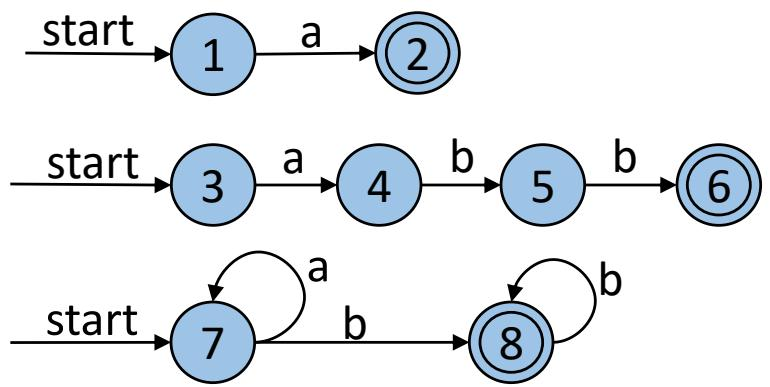

• Combine three NFAs into a single NFA Add start state 0 and ε-transitions

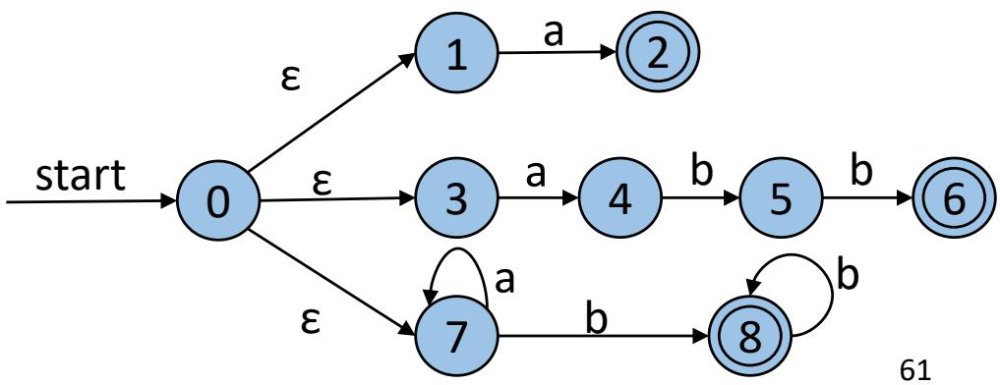

## Lex: Example

## • Input: abbb

$\mathtt { \varepsilon - c l o s u r e } ( 0 ) = \{ 0 , 1 , 3 , 7 \}$

◆ Select aab as the lexeme, execute {action3}

 Return to parser indicating that token with pattern $\mathtt { a } ^ { * } \mathtt { b } +$ has been found

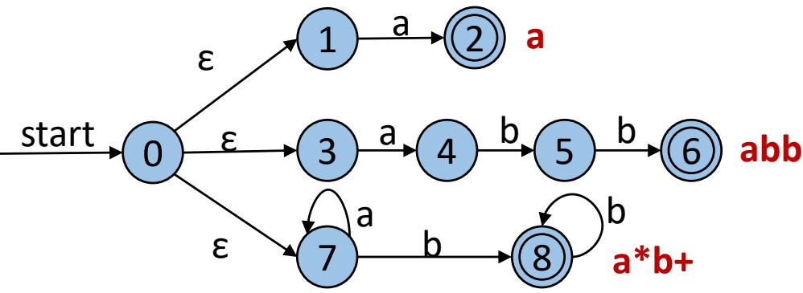

Q: 这个例子中，有几处二义性问题？

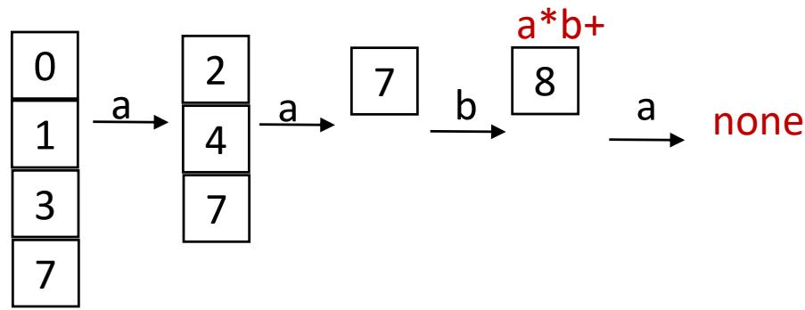

Why not a?

Why not $a ^ { \ast } b + ?$ [二义性问题]

## Lex: Example

• The accepting states are labeled by the pattern that is identified by that state.

◆ {6,8} can accept abb and $\mathtt { a } ^ { * } \mathtt { b } +$

◆ Since the abb is listed first, it is the pattern of {6,8}.

<table><tr><td rowspan=1 colspan=1>一</td><td rowspan=1 colspan=1>Ia</td><td rowspan=1 colspan=1>Ib</td></tr><tr><td rowspan=1 colspan=1>{0, 1, 3,7}</td><td rowspan=1 colspan=1>{2, 4, 7}</td><td rowspan=1 colspan=1>{8}</td></tr><tr><td rowspan=1 colspan=1>{2, 4,7}a</td><td rowspan=1 colspan=1>{7}</td><td rowspan=1 colspan=1>{5, 8}</td></tr><tr><td rowspan=1 colspan=1>{8}     a*b+</td><td rowspan=1 colspan=1></td><td rowspan=1 colspan=1>{8}</td></tr><tr><td rowspan=1 colspan=1>{7}</td><td rowspan=1 colspan=1>{7}</td><td rowspan=1 colspan=1>{8}</td></tr><tr><td rowspan=1 colspan=1>{5, 8} a*b+</td><td rowspan=1 colspan=1></td><td rowspan=1 colspan=1>{6, 8}</td></tr><tr><td rowspan=1 colspan=1>{6, 8}  abb,a*b+</td><td rowspan=1 colspan=1></td><td rowspan=1 colspan=1>{8}</td></tr></table>

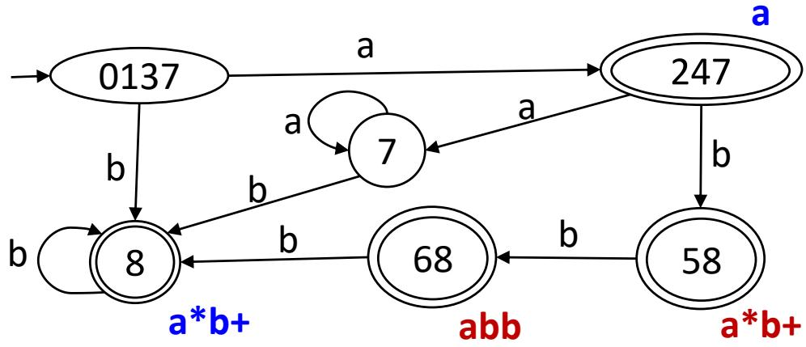  
Dragon book Fig. 3.54

## Lex: Example

## • Question

◆Is this DFA minimal?

◆are 8, 68, 58 really equivalent?

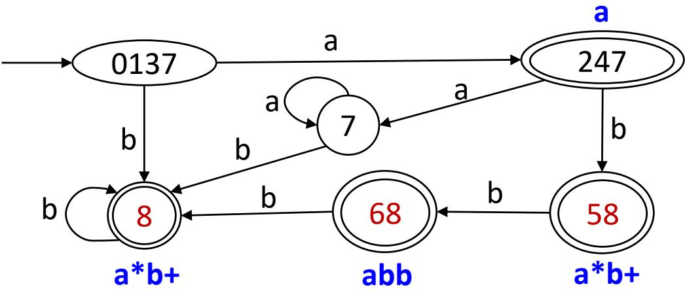

## Lex: Example

## • Depends on the language and the implementation approach

## ◆if abb is a keyword

 Approach 1: identify abb explicitly by FA with precedence.

 Approach 2: identify abb by an extra table

## • Initial partition:

◆Non-accepting, accepting

◆ {0137, 7}, {247}, {8, 58}, {68}

## • Split {0137, 7}

◆move to different partitions on ‘a’

## • Split {8, 58}

◆move to different partitions on ‘b’

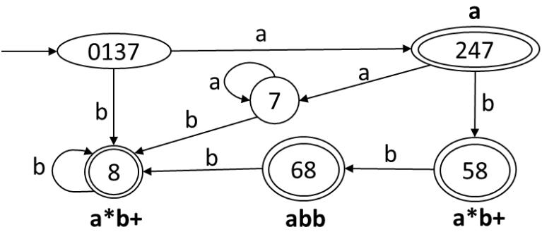

## Lex: Example

## • Depends on the language and the implementation approach

## ◆if abb is a keyword

 Approach 1: identify abb explicitly by FA

 Approach 2: identify abb by an extra table

◆ Or it is just an identifier

## • Initial partition:

◆non-accepting: {0137, 7},

◆accepting a: {247},

◆accepting a\*b+: {58, 68, 8},

## • Cannot split {58, 68, 8}

◆No move on $\prime _ { \mathsf { a } } \prime$

◆ Move to {68, 8} on ‘b’

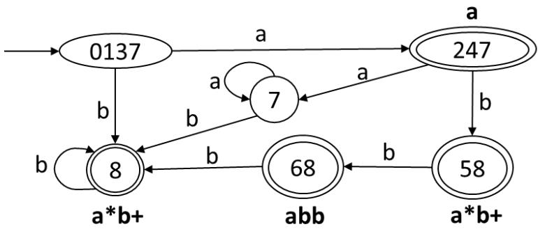

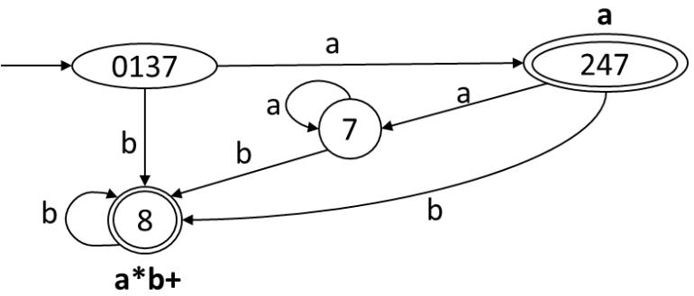

## The Limits of Regular Languages

• For $\scriptstyle \sum = \{ \mathsf { a } , \mathsf { b } \}$

• The set of strings S over this alphabet consisting of a single b surrounded by the same number of a.

S = {b, aba, aabaa, aaabaaa, …}

$$
\mathsf { L } = \{ a ^ { n } b a ^ { n } | \mathsf { n } \geq 0 \}
$$

the regular expression is?

$$
\bf { a } ^ { * } \bf { b } \bf { a } ^ { * } \Sigma \times
$$

This set cannot be described by a regular expression

## The Limits of Regular Languages

$\bullet \mathsf { L } = \{ a ^ { n } b \mathsf { a } ^ { n } | \mathsf { n } \geq 0 \}$ is not a Regular Language

◆ FA does not have any memory (FA cannot count)

 The above L requires to keep count of a’s before seeing b’s

• Matching parenthesis is not a RL[括号匹配不是正则语言]

• Any language with nested structure is not a RL if … if … else … else

• Regular Languages

◆ Weakest formal languages that are widely used [最弱的形式语言]

• We need a more powerful formalism

## Beyond Regular Language

• Regular languages are expressive enough for tokens

◆ Can express identifiers, strings, comments, etc.

• However, it is the weakest (least expressive) language

◆ Many languages are not regular

◆ C programming language is not

 The language matching braces $" \{ \{ \dots \} \} ^ { \prime \prime }$ is also not

◆ FA does not have any memory (FA cannot count)

$$
\textsf { a L } = \{ a ^ { n } b ^ { n } | \textsf { n } \geq 1 \}
$$

 Crucial for analyzing languages with nested structures[嵌套结构] (e.g. nested for loop in C language)

• We need a more powerful language for parsing

◆ Later, we will discuss context-free languages (CFGs)

## Summary

Lexical Specification

Regular expressions

NFA

DFA

Table-driven Implementation

## Transition Flow

## 1. Converting REs to NFA

• Thompson Algorithm(Inductive method)

## 2. Converting NFA to DFA

• Subset-Construction Algorithm[子集构造法]

## 3. Minimizing DFA

• Partition Algorithm[分割法]

## Summary

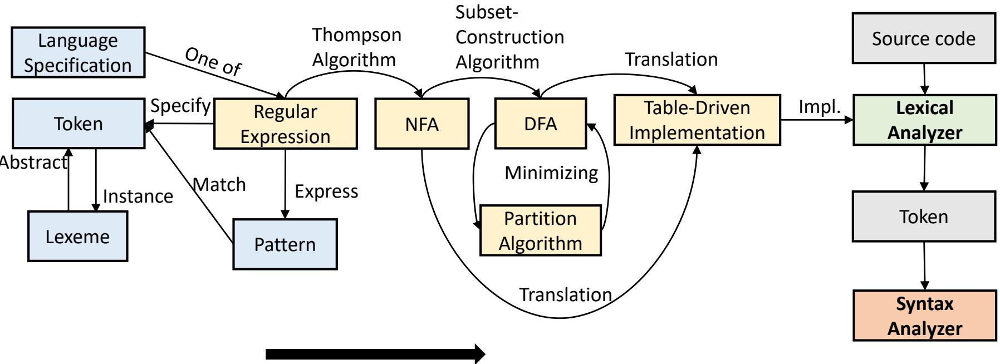  
From Specification to Implementation

## Further Reading

## • Dragon Book

## ◆Comprehensive Reading:

 Section Section 3.6–3.7, 3.9.6 for finite automata and related transformation.

## ◆Skip Reading:

 Section 3.9.1–3.9.5 for regular expressions directly to DFAs.

## Exercise

• The graph describes NFA or DFA? Why? NFA.

A: ε-transition,

B: multiple transitions for input $\mathbf { \Delta } ^ { \prime } \mathbf { 1 } ^ { \prime }$

## • What is the RE?

$$
0 ^ { \ast } 1 + 2 ^ { \ast }
$$

• Then, what is the NFA of $0 + 1 + 2 + ?$

$$
\operatorname* { s t a r t } \limits _ {  } \infty \int \limits _ { 0 } ^ { \infty } 0 \int \limits _ { 0 } ^ { 1 } t \cdot \sum \limits _ { \prime } ^ { 2 } t \frac { 1 } { ( t - 1 ) } d t
$$

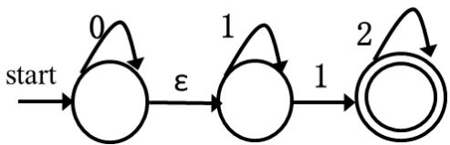

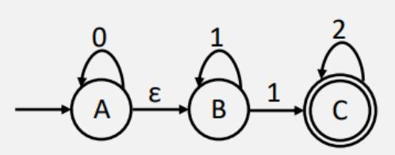

## Exercise

<table><tr><td rowspan=1 colspan=1>Que.</td><td rowspan=1 colspan=1>The behavior of a NFA can be simulated by a DFA</td></tr><tr><td rowspan=1 colspan=1>a.</td><td rowspan=1 colspan=1>always</td></tr><tr><td rowspan=1 colspan=1>b.</td><td rowspan=1 colspan=1> sometime</td></tr><tr><td rowspan=1 colspan=1>C</td><td rowspan=1 colspan=1>Never</td></tr><tr><td rowspan=1 colspan=1>d.</td><td rowspan=1 colspan=1>Depend on NFA</td></tr><tr><td rowspan=1 colspan=1></td><td rowspan=1 colspan=1></td></tr></table>

## Exercise

<table><tr><td>Que.</td><td>What is the complement[补集] of the language accepted by the NFA shown below? Assume ∑= {a} and ε is the empty string</td></tr><tr><td>a</td><td></td></tr><tr><td>b.</td><td>m 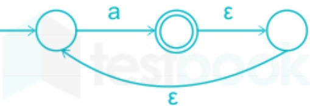</td></tr><tr><td>C.</td><td>a</td></tr><tr><td>d.</td><td>{,a}</td></tr><tr><td></td><td></td></tr></table>

## Exercise

• Convert $( { \mathsf { a } } | { \mathsf { b } } ) ^ { * }$ abb $( { \mathsf { a } } | { \mathsf { b } } ) ^ { * }$ into NFA

• Thompson construction: $R E  N F A$

(a|b)→(a|b)\*   
abb   
(a|b)\*abb(a|b)\*

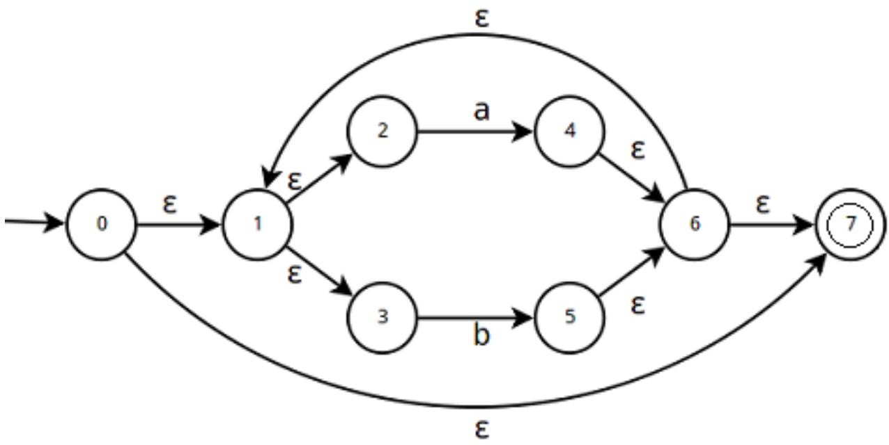

## Exercise

• Convert (a|b)\*abb(a|b)\* into NFA • Thompson construction: $R E  N F A$ $( \mathsf { a } | \mathsf { b } ) { \to } ( \mathsf { a } | \mathsf { b } ) ^ { * }$ abb (a|b)\*abb(a|b)\*

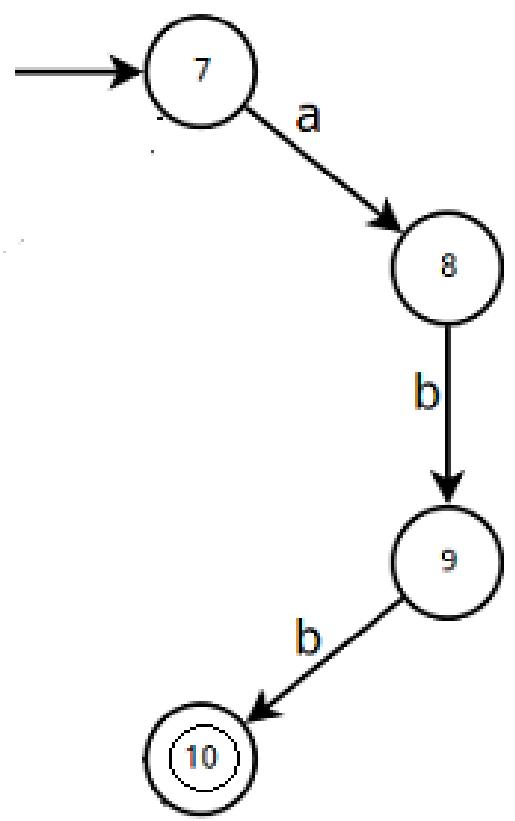

## Exercise

• Convert (a|b)\*abb(a|b)\* into NFA • Thompson construction: $R E  N F A$ $( \mathsf { a } | \mathsf { b } ) { \to } ( \mathsf { a } | \mathsf { b } ) ^ { * }$ abb (a|b)\*abb(a|b)\*

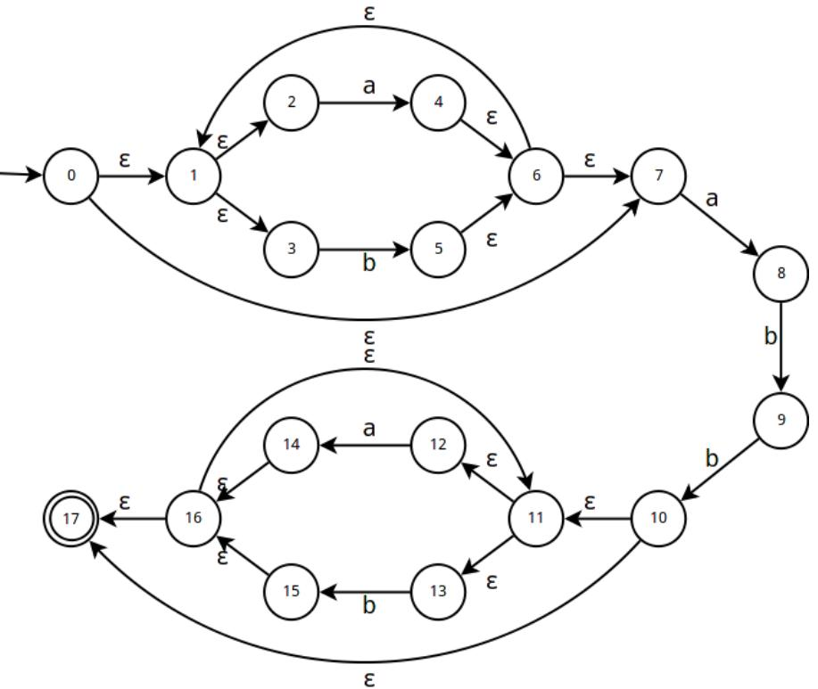

## Exercise: from RE to minimized FA

• Construct a DFA for a minion language with $\Sigma = \{ a , b \}$ that does not contain “abb”:

1. Build the regular expression for the minion’s language

2. Convert the regular expression into NFA first

3. Convert the NFA into DFA by subset construction.

4. Minimize the state of DFA

• Build the RE for this language b\*(a | ab)\*

  
https://www.sensacine.com/peliculas/pelicula-210493/fotos/detalle/?cmediafile=21209746

## Exercise

• Convert ${ \mathfrak { b } } ^ { * } ( { \mathfrak { a } }$ | ab)\* into NFA

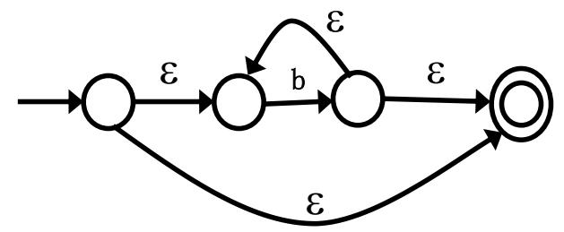

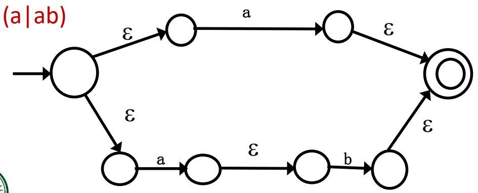

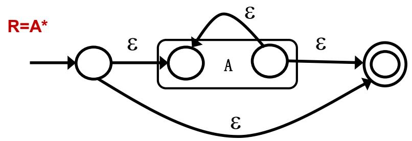

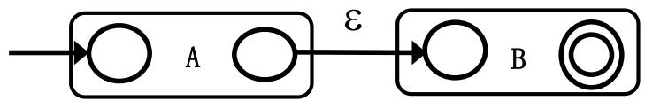

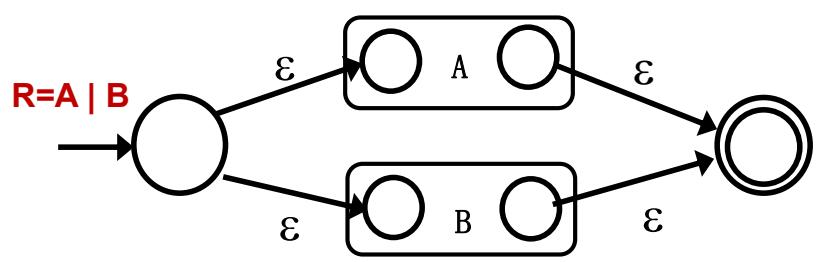

## Exercise

• Convert the NFA into DFA by subset construction

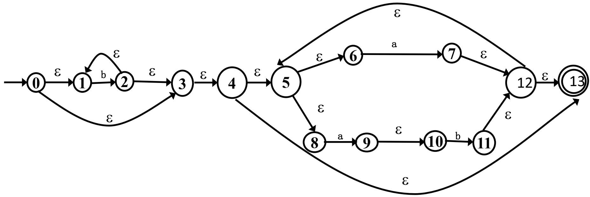

## Exercise

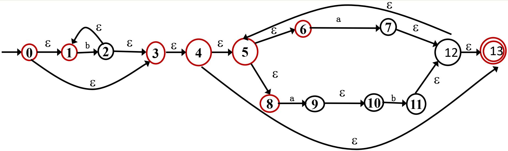

<table><tr><td rowspan=1 colspan=1></td><td rowspan=1 colspan=1>la</td><td rowspan=1 colspan=1>Ib</td><td rowspan=1 colspan=1>Accept</td></tr><tr><td rowspan=1 colspan=1>{0,1,3,4,5,6,8,13}0</td><td rowspan=1 colspan=1>{7,9,12,13,5,6,8,10} 1</td><td rowspan=1 colspan=1>{2,1,3,4,5,6,8,13} 2</td><td rowspan=1 colspan=1>Yes</td></tr><tr><td rowspan=1 colspan=1>{5,6,7,8,9,10,12,13} 1</td><td rowspan=1 colspan=1>{5,6,7,8,9,10,12,13} 1</td><td rowspan=1 colspan=1>{11,12,13,5,6,8} 3</td><td rowspan=1 colspan=1>Yes</td></tr><tr><td rowspan=1 colspan=1>{1,2,3,4,5,6,8,13} 2</td><td rowspan=1 colspan=1>{5,6,7,8,9,10,12,13} 1</td><td rowspan=1 colspan=1>{1,2,3,4,5,6,8,13} 2</td><td rowspan=1 colspan=1>Yes</td></tr><tr><td rowspan=1 colspan=1>{5,6,8,11,12,13} 3</td><td rowspan=1 colspan=1>{5,6,7,8,9,10,12,13} 1</td><td rowspan=1 colspan=1>0</td><td rowspan=1 colspan=1>Yes</td></tr></table>

## Exercise

## • Draw DFA according to the transition table

<table><tr><td rowspan=1 colspan=1></td><td rowspan=1 colspan=1> $\mathbb { I } _ { \perp }$ </td><td rowspan=1 colspan=1>Ib</td></tr><tr><td rowspan=1 colspan=1>{0,1,3,4,5,6,8,13} 0</td><td rowspan=1 colspan=1>{7,9,12,13,5,6,8,10}</td><td rowspan=1 colspan=1>{2,1,3,4,5,6,8,13} </td></tr><tr><td rowspan=1 colspan=1>{5,6,7,8,9,10,12,13}</td><td rowspan=1 colspan=1>{5,6,7,8,9,10,12,13} :1</td><td rowspan=1 colspan=1>{11,12,13,5,6,8} 3</td></tr><tr><td rowspan=1 colspan=1>{1,2,3,4,5,6,8,13} 2</td><td rowspan=1 colspan=1>{5,6,7,8,9,10,12,13} 1</td><td rowspan=1 colspan=1>{1,2,3,4,5,6,8,13} 2</td></tr><tr><td rowspan=1 colspan=1>{5,6,8,11,12,13} 3</td><td rowspan=1 colspan=1>{5,6,7,8,9,10,12,13} 1</td><td rowspan=1 colspan=1>0</td></tr></table>

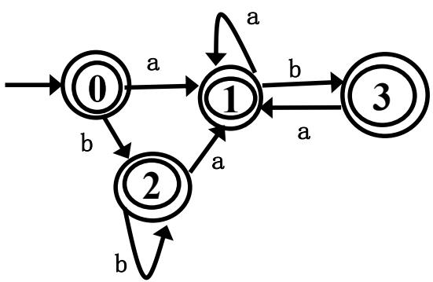

## Exercise

• Minimization DFA

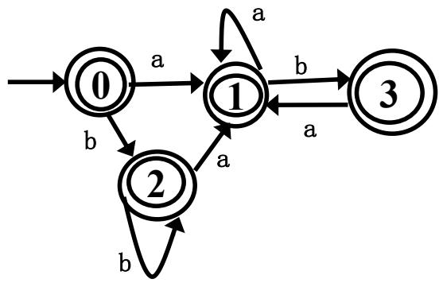

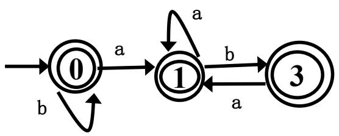

Initial: {0,1,2,3} {3} have no ‘b’ transition，split

• {0,1,2} {3} {1} on ‘b’ ->3，{0,2} on ‘b’ ->{2}，split

• {0,2} {1} {3} {0,2} on ‘a’ -> {1} {0,2} on ‘b’ -> {2} No way to distinguish {0,2} on any transition with ‘a’ or ‘b’

Final: {0,2} {1} {3}