## 编译原理 Complier Principles

## Lecture 5 Syntax Analysis: Bottom-Up

赵帅

计算机学院

中山大学

## Contents


## Contents

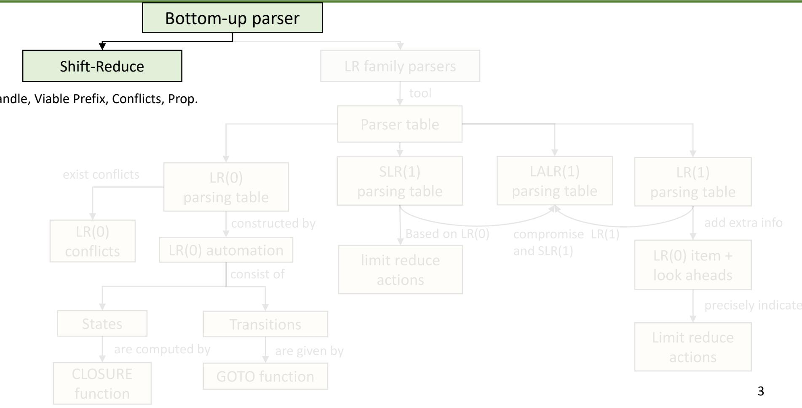

## Bottom-up parsing[自下而上分析]

## • Bottom-up parsing [自下而上分析]

◆Start from the input string, and gradually reduce[规约] it (the inverse process of the rightmost derivation[最右推导的逆过程]) until it is reduced to the start symbol of the grammar.

◆Construct a syntax tree from the leaves to the root.

◆More powerful than top down:

 Don’t need left factoring.

 Can handle left recursion.

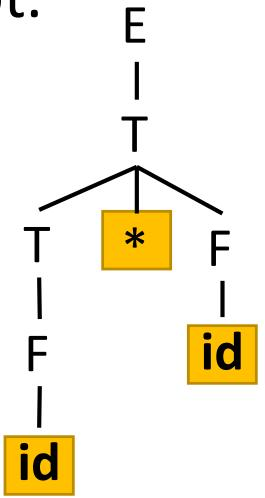

## Bottom-up parsing[自下而上分析]

• Bottom-up parsing [自下而上分析]

◆ Parser code structure nothing like grammar

 Very difficult to implement manually

 Automated tools exist to convert to code

⚫ G(E): E → E+T | T; T → T\*F | F; F → (E) | id, id \* id

◆The rightmost derivation:

 E ⇒ T ⇒ T \* F ⇒ T \* id ⇒ F \* id ⇒ id \* id

◆The leftmost reduction:

$$
\bullet \mathsf { i d } ^ { * } \mathsf { i d } \Rightarrow \mathsf { F } ^ { * } \mathsf { i d } \Rightarrow \mathsf { T } ^ { * } \mathsf { i d } \Rightarrow \mathsf { T } ^ { * } \mathsf { F } \Rightarrow \mathsf { T } \Rightarrow \mathsf { E }
$$

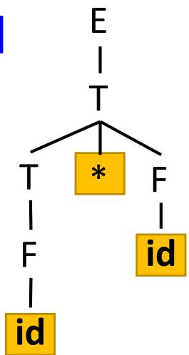

## Bottom-up: Shift-Reduce [移入-归约]

• Shift-reduce parsing is a form of bottom-up parsing in which a stack[栈] holds grammar symbols and an input buffer holds the input string.

• Reduction[规约]: At each reduction step, a specific substring matching the body of a production is replaced[替换] by the nonterminal at the head of that production.

• Shift[移入]: During a left-to-right scan of the input string, the parser shifts zero or more input symbols onto the stack, until it is ready to reduce a string β of grammar symbols on top of the stack.

## Bottom-up: Shift-Reduce [移入-归约]

• There are four actions that a shift-reduce parser can make:

◆Shift[移入]: Shift the next input symbol onto the top of the stack.

◆Reduce[规约]: The right end of the string to be reduced must be at the top of the stack. Locate the left end of the string within the stack and decide with what nonterminal to replace the string.

◆Accept[接受]: Announce successful completion of parsing.

◆Error[报错]: Discover a syntax error and call an error recovery routine.

## Bottom-up: Shift-Reduce [移入-归约]

## Example:

$$
\bullet \mathsf { G } ( \mathsf { S } ) \colon \mathsf { S } \to \mathsf { a A c B e } ;
$$

$$
\bullet \mathsf { A }  \mathsf { b } ;
$$

$$
\bullet \mathsf { A } \to \mathsf { A } \mathsf { b } ;
$$

$$
\bullet \mathsf { B }  \mathsf { d } .
$$

## Input String:

• abbcde\$

<table><tr><td rowspan=1 colspan=1>Stack</td><td rowspan=1 colspan=1>Input</td><td rowspan=1 colspan=1>Action</td></tr><tr><td rowspan=1 colspan=1>$</td><td rowspan=1 colspan=1>abbcde$</td><td rowspan=1 colspan=1>Shift</td></tr><tr><td rowspan=1 colspan=1> $\$ 2$ </td><td rowspan=1 colspan=1>bbcde$</td><td rowspan=1 colspan=1>Shift</td></tr><tr><td rowspan=1 colspan=1> $\$ 20$ </td><td rowspan=1 colspan=1>bcde$</td><td rowspan=1 colspan=1>Reduce A → b</td></tr><tr><td rowspan=1 colspan=1> $\$ 2A$ </td><td rowspan=1 colspan=1>bcde$</td><td rowspan=1 colspan=1>Shift</td></tr><tr><td rowspan=1 colspan=1>$aAb</td><td rowspan=1 colspan=1>cde$</td><td rowspan=1 colspan=1>Reduce A → Ab</td></tr><tr><td rowspan=1 colspan=1> $\$ 2A$ </td><td rowspan=1 colspan=1>cde$</td><td rowspan=1 colspan=1> Shift</td></tr><tr><td rowspan=1 colspan=1> $\$ 2A c$ </td><td rowspan=1 colspan=1>de$</td><td rowspan=1 colspan=1>Shift</td></tr><tr><td rowspan=1 colspan=1> $\$ 2A c d$ </td><td rowspan=1 colspan=1>e$</td><td rowspan=1 colspan=1>Reduce B → d</td></tr><tr><td rowspan=1 colspan=1> $\$ 2A C B$ </td><td rowspan=1 colspan=1>e$</td><td rowspan=1 colspan=1>Shift</td></tr><tr><td rowspan=1 colspan=1> $\$ 2A C B e$ </td><td rowspan=1 colspan=1>$</td><td rowspan=1 colspan=1>Reduce S → aAcBe</td></tr><tr><td rowspan=1 colspan=1>$S</td><td rowspan=1 colspan=1>$</td><td rowspan=1 colspan=1>ACCEPT</td></tr></table>

## Key Issue [一个关键问题]

• The key decisions during bottom-up parsing are about (1) when to shift or reduce and (2) what production to apply, as the parse proceeds.

when to shift or reduce?

what production to apply?

<table><tr><td rowspan=1 colspan=1>Stack</td><td rowspan=1 colspan=1>Input</td><td rowspan=1 colspan=1>Action</td></tr><tr><td rowspan=1 colspan=1>$</td><td rowspan=1 colspan=1>abbcde$</td><td rowspan=1 colspan=1>Shift</td></tr><tr><td rowspan=1 colspan=1>$a</td><td rowspan=1 colspan=1>bbcde$</td><td rowspan=1 colspan=1>Shift</td></tr><tr><td rowspan=1 colspan=1>$ab</td><td rowspan=1 colspan=1>bcde$</td><td rowspan=1 colspan=1>Reduce A → b</td></tr><tr><td rowspan=1 colspan=1>$aA</td><td rowspan=1 colspan=1>bcde$</td><td rowspan=1 colspan=1>Shift</td></tr><tr><td rowspan=1 colspan=1>$aAb</td><td rowspan=1 colspan=1>cde$</td><td rowspan=1 colspan=1>Reduce A → Ab</td></tr></table>

G(S): S → aAcBe;

Reduce A → b??

$$
\mathsf { A } \to \mathsf { b } ;
$$

$$
\mathsf { A } \to \mathsf { A b } ;
$$

$$
\mathsf { B } \to \mathsf { d } .
$$

## Handle [句柄]

• Right-sentential form [最右句型]: a sentential form that occurs in the

rightmost derivation[规范推导].

$$
\begin{array} { r l } & { \mathsf { G } ( \mathsf { E } ) \colon } \\ & { \qquad \mathsf { E } \Rightarrow \mathsf { T } \Rightarrow \mathsf { T } ^ { \ast } \mathsf { F } \Rightarrow \mathsf { T } ^ { \ast } \mathsf { i d } \Rightarrow \mathsf { F } ^ { \ast } \mathsf { i d } \Rightarrow \mathsf { i d } ^ { \ast } \mathsf { i d } } \end{array}
$$

• Phrase[短语]: If ${ \mathfrak { a } } _ { 1 } { \mathsf { A } } { \mathfrak { a } } _ { 2 }$ is a right sentential form of G(S), and $\mathsf { S } \stackrel { \ast } { \Rightarrow } \mathtt { a } _ { 1 } \mathsf { A } \mathtt { a } _ { 2 }$ ⇒+ $\mathsf { a } _ { 1 } \mathsf { \beta } \mathsf { \beta } \mathsf { a } _ { 2 } ,$ then β is a phrase of ${ \mathfrak { a } } _ { 1 } { \mathsf { A } } { \mathfrak { a } } _ { 2 }$ E1

◆ 一个句型的语法树中任意叶子结点所组成的符号串都是该句型的短语

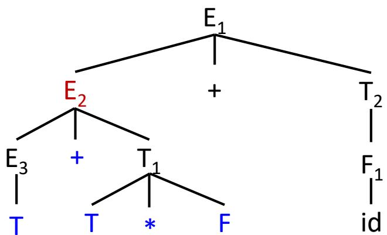

## Handle [句柄]

• Simple Phrase[直接短语]: If ${ \mathfrak { a } } _ { 1 } { \mathsf { A } } { \mathfrak { a } } _ { 2 }$ is a right sentential form of G(S), and $\mathsf { S } \stackrel { * } { \Rightarrow } \mathsf { a } _ { 1 } \mathsf { A } \mathsf { a } _ { 2 } = \mathsf { a } _ { 1 } \mathsf { \beta } \mathsf { a } _ { 2 } ,$ then β is a simple phrase of ${ \mathfrak { a } } _ { 1 } { \mathsf { A } } { \mathfrak { a } } _ { 2 }$

◆只有父子两代的子树形成的短语

• Handle[句柄]: The leftmost simple phrase of a sentential form.

◆语法树中最左那棵只有父子两代的子树形成的短语

一个句型中只有一个句柄

• We only want to reduce at handles How to find it?

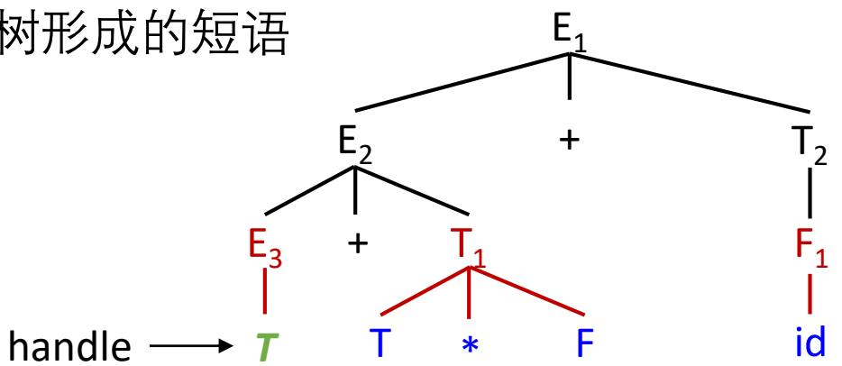

## Example

• G(E): E → T | E+T; T → F | T\*F; F → (E) | a | b | c

• For sentential form a \* b + c

• Phrase: a\*b+c, a\*b, a, b, c

• Simple Phrase: a, b, c

• Handle: a

短语：一个句型的语法树中任意树叶结点组成的短语

直接短语：只有父子两代的子树形成的短语

句柄：语法树中最左那棵只有父子两代的子树形成的短语

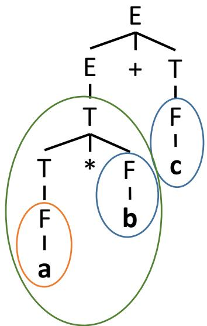

## One More Example

• Gramar G(E):

E → E+T|T

T → T\*F | F

F → (E) | id

• Sentential form: $T + T ^ { * } F + \mathsf { i d }$

• Phrase：

• $\mathsf E _ { 1 } \colon \mathsf T + \mathsf T ^ { * } \mathsf F + \mathsf { i d }$

• $E _ { 2 } : \mathsf { T } + \mathsf { T } ^ { * } \mathsf { F }$

Handle

• $\mathsf { E } _ { 3 } \colon \mathsf { T }$

• ${ \sf T } _ { 1 } \colon { \sf T } ^ { * } { \sf F }$

Simple Phrase

• $\mathsf { T } _ { 2 } , \mathsf { F } _ { 1 } \colon \mathsf { i d }$

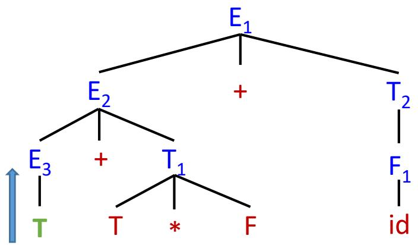

## One More Example

• Gramar G(E): $E  \mathsf { E } \mathrm { + } \mathsf { T } | \mathsf { T }$ T → T\*F | F $F \to ( \mathsf { E } ) \mid \mathsf { i d }$

• Sentential form: $T + T ^ { * } F + \mathrm { i d }$ Handle Simple Phrase

• Phrase： $\mathsf E _ { 1 } \colon \mathsf T + \mathsf T ^ { * } \mathsf F + \mathsf { i d }$ $E _ { 2 } : \mathsf { T } + \mathsf { T } ^ { * } \mathsf { F }$ E : T ${ \sf T } _ { 1 } \colon$ T\*F $\mathsf { T } _ { 2 } , \mathsf { F } _ { 1 } \colon \mathsf { i d }$

Shift/Reduce:

Stack:

$$
\mathsf { l n p u t : T } + \mathsf { T } ^ { \ast } \mathsf { F } + \mathsf { i d }
$$

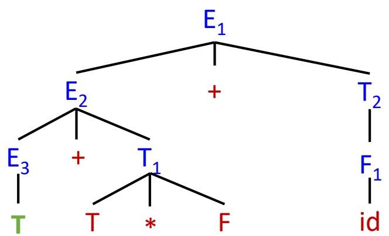

(Shift)

## One More Example

• Gramar G(E): $E  \mathsf { E } \mathrm { + } \mathsf { T } | \mathsf { T }$ T → T\*F | F $F \to ( \mathsf { E } ) \mid \mathsf { i d }$

• Sentential form: $T + T ^ { * } F + | \mathrm { d }$ Handle Simple Phrase

• Phrase： $\mathsf E _ { 1 } \colon \mathsf T + \mathsf T ^ { * } \mathsf F + \mathsf { i d }$ $E _ { 2 } : \mathsf { T } + \mathsf { T } ^ { * } \mathsf { F }$ E : T ${ \sf T } _ { 1 } \colon$ T\*F $\mathsf { T } _ { 2 } , \mathsf { F } _ { 1 } \colon \mathsf { i d }$

Shift/Reduce:

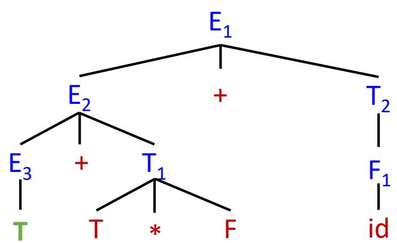

Stack:

Stack: T

Input: $\mathsf { T } + \mathsf { T } ^ { \ast } \mathsf { F } + \mathsf { i d }$

Input: $+ { \textsf { T } } ^ { * } \textsf { F } + \mathsf { i d }$

(Shift)

(Reduce $\mathsf E _ { 3 } { \mathsf - } > \mathsf T )$

## One More Example

• Gramar G(E): $E  \mathsf { E } \mathrm { + } \mathsf { T } | \mathsf { T }$ T → T\*F | F $F \to ( \mathsf { E } ) \mid \mathsf { i d }$

• Sentential form: $T + T ^ { * } F + | \mathrm { d }$ Handle Simple Phrase

• Phrase： $\mathsf E _ { 1 } \colon \mathsf T + \mathsf T ^ { * } \mathsf F + \mathsf { i d }$ $E _ { 2 } : \mathsf { T } + \mathsf { T } ^ { * } \mathsf { F }$ $\mathsf E _ { 3 } \colon \dot { \mathsf T }$ ${ \sf T } _ { 1 } \colon$ T\*F $\mathsf { T } _ { 2 } , \mathsf { F } _ { 1 } \colon$


Shift/Reduce:

Stack:

Stack: T

Stack: $\mathsf { E } _ { 3 }$

Input: $\mathsf { T } + \mathsf { T } ^ { \ast } \mathsf { F } + \mathsf { i d }$

(Shift)

Input: + T \* F + id

Input: + T \* F + id

(Reduce $\mathsf E _ { 3 } { \mathsf - } > \mathsf T )$

(Shift x4)

## One More Example

• Gramar G(E): $E  \mathsf { E } \mathrm { + } \mathsf { T } | \mathsf { T }$ T → T\*F | F $F \to ( \mathsf { E } ) \mid \mathsf { i d }$

• Sentential form: $T + T ^ { * } F + \mathrm { i d }$ Handle Simple Phrase

• Phrase： $\mathsf E _ { 1 } \colon \mathsf T + \mathsf T ^ { * } \mathsf F + \mathsf { i d }$ $E _ { 2 } : \mathsf { T } + \mathsf { T } ^ { * } \mathsf { F }$ $\mathsf E _ { 3 } \colon \dot { \mathsf T }$ ${ \sf T } _ { 1 } \colon$ T\*F $\mathsf { T } _ { 2 } , \mathsf { F } _ { 1 } \colon \mathsf { i d }$

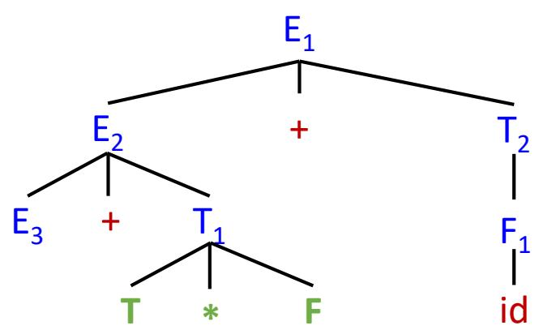

Shift/Reduce:

Stack:

Stack: T

Stack: $\mathsf { E } _ { 3 }$

Stack: $\mathsf { E } _ { 3 } + \mathsf { T } ^ { * } \mathsf { F }$

Input: $\mathsf { T } + \mathsf { T } ^ { \ast } \mathsf { F } + \mathsf { i d }$

Input: + T \* F + id

Input: + T \* F + id

Input: + id

(Shift)

(Reduce $\mathsf E _ { 3 } { \mathsf - } > \mathsf T )$

(Shift x4)

(Reduce $\mathsf { T } _ { 1 } \mathrm { - } \mathsf { > } \mathsf { T } ^ { \ast } \mathsf { F } )$

## One More Example

• Gramar G(E): $E  \mathsf { E } \mathrm { + } \mathsf { T } | \mathsf { T }$ T → T\*F | F $F \to ( \mathsf { E } ) \mid \mathsf { i d }$

• Sentential form: $T + T ^ { * } F + | \mathrm { d }$ Handle Simple Phrase

• Phrase： $\mathsf E _ { 1 } \colon \mathsf T + \mathsf T ^ { * } \mathsf F + \mathsf { i d }$ $E _ { 2 } : \mathsf { T } + \mathsf { T } ^ { * } \mathsf { F }$ $\mathsf E _ { 3 } \colon \dot { \mathsf T }$ ${ \sf T } _ { 1 } \colon$ T\*F $\mathsf { T } _ { 2 } , \mathsf { F } _ { 1 } \colon$

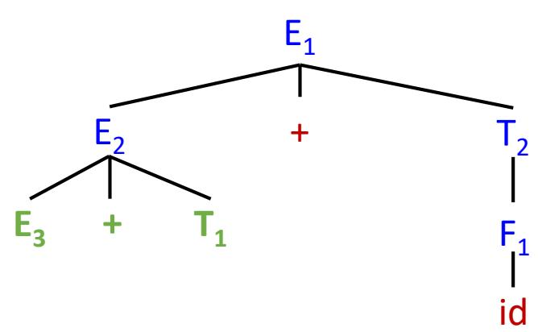

Shift/Reduce:

Stack:

Stack: T

Stack: $\mathsf { E } _ { 3 }$

Stack: $\mathsf { E } _ { 3 } + \mathsf { T } ^ { * } \mathsf { F }$

Stack: $\mathsf E _ { 3 } + \mathsf T _ { 1 }$

Input: $\mathsf { T } + \mathsf { T } ^ { \ast } \mathsf { F } + \mathsf { i d }$

Input: + T \* F + id

Input: + T \* F + id

Input: + id

Input: + id

(Shift)

(Reduce $E _ { 3 } \mathrm { - } > \top$

(Shift x4)

(Reduce $\mathsf { T } _ { 1 } \mathrm { - } \mathsf { > } \mathsf { T } ^ { \ast } \mathsf { F } )$

(Reduce $\mathsf E _ { 2 } ^ { \phantom { } } {  } \mathsf E _ { 3 } ^ { \phantom { } } { + } \mathsf T _ { 1 } ^ { \phantom { } } )$

## One More Example

• Gramar G(E): $E  \mathsf { E } \mathrm { + } \mathsf { T } | \mathsf { T }$ T → T\*F | F $F \to ( \mathsf { E } ) \mid \mathsf { i d }$

• Sentential form: $T + T ^ { * } F + \mathrm { i d }$ Handle Simple Phrase

• Phrase： 1$\mathsf E _ { 1 } \colon \mathsf T + \mathsf T ^ { * } \mathsf F + \mathsf { i d }$ $E _ { 2 } : \mathsf { T } + \mathsf { T } ^ { * } \mathsf { F }$ $\mathsf E _ { 3 } \colon \dot { \mathsf T }$ ${ \sf T } _ { 1 } \colon$ T\*F $\mathsf { T } _ { 2 } , \mathsf { F } _ { 1 } \colon \mathsf { i d }$

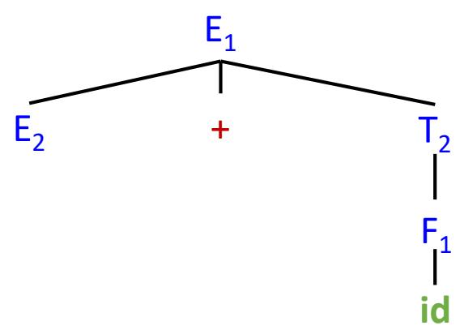

Shift/Reduce:

Stack:

Stack: T

Stack: $\mathsf { E } _ { 3 }$

Stack: $\mathsf { E } _ { 3 } + \mathsf { T } ^ { * } \mathsf { F }$

Stack: $\mathsf E _ { 3 } + \mathsf T _ { 1 }$

Stack: $\mathsf { E } _ { 2 }$

$$
\mathsf { T } + \mathsf { T } ^ { \ast } \mathsf { F } + \mathsf { i d }
$$

$$
E _ { 3 } \mathrm { - } > \top
$$

(Shift x4)

(Reduce $\mathsf { T } _ { 1 } \mathrm { - } \mathsf { > } \mathsf { T } ^ { \ast } \mathsf { F } )$

$$
\mathsf E _ { 2 } ^ { \phantom { } } {  } \mathsf E _ { 3 } ^ { \phantom { } } { + } \mathsf T _ { 1 } ^ { \phantom { } } )
$$

(Shift x2)

## One More Example

• Gramar G(E): $E  \mathsf { E } \mathrm { + } \mathsf { T } | \mathsf { T }$ T → T\*F | F $F \to ( \mathsf { E } ) \mid \mathsf { i d }$

• Sentential form: $T + T ^ { * } F + \mathrm { i d }$ Handle Simple Phrase

• Phrase： 1$\mathsf E _ { 1 } \colon \mathsf T + \mathsf T ^ { * } \mathsf F + \mathsf { i d }$ $E _ { 2 } : \mathsf { T } + \mathsf { T } ^ { * } \mathsf { F }$ $\mathsf E _ { 3 } \colon \dot { \mathsf T }$ ${ \sf T } _ { 1 } \colon$ T\*F $\mathsf { T } _ { 2 } , \mathsf { F } _ { 1 } \colon$


Shift/Reduce:

Stack:

Stack: T

Stack: $\mathsf { E } _ { 3 }$

Stack: $\mathsf { E } _ { 3 } + \mathsf { T } ^ { \ast } \mathsf { F }$

Stack: $\mathsf E _ { 3 } + \mathsf T _ { 1 }$

Stack: $\mathsf { E } _ { 2 }$

Stack: $\mathsf E _ { 2 } + \mathsf { i d }$

$$
\mathsf { T } + \mathsf { T } ^ { \ast } \mathsf { F } + \mathsf { i d }
$$

Input:

$$
\mathsf E _ { 3 } { \mathsf - } > \mathsf T )
$$

(Shift x4)

(Reduce $\mathsf { T } _ { 1 } \mathrm { - } \mathsf { > } \mathsf { T } ^ { \ast } \mathsf { F } )$

(Reduce $\mathsf E _ { 2 } ^ { \phantom { } } { \to } \mathsf E _ { 3 } ^ { \phantom { } } { + } \mathsf T _ { 1 } ^ { \phantom { } } )$

$$
\digamma _ { 1 } { \digamma } > \digamma \mathrm { d } )
$$

## One More Example

• Gramar G(E): $E  \mathsf { E } \mathrm { + } \mathsf { T } | \mathsf { T }$ T → T\*F | F $F \to ( \mathsf { E } ) \mid \mathsf { i d }$

• Sentential form: $T + T ^ { * } F + \mathrm { i d }$ Handle Simple Phrase

• Phrase： $\mathsf E _ { 1 } \colon \mathsf T + \mathsf T ^ { * } \mathsf F + \mathsf { i d }$ $E _ { 2 } : \mathsf { T } + \mathsf { T } ^ { * } \mathsf { F }$ $\mathsf E _ { 3 } \colon \dot { \mathsf T }$ ${ \sf T } _ { 1 } \colon$ T\*F $\mathsf { T } _ { 2 } , \mathsf { F } _ { 1 } \colon$

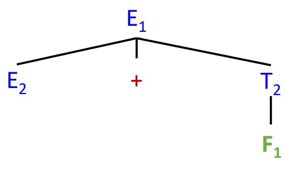

```powershell
Shift/Reduce:
Stack: Input: $\mathsf { T } + \mathsf { T } ^ { \ast } \mathsf { F } + \mathsf { i d }$ (Shift)
Stack: T Input: + T * F + id (Reduce $E _ { 3 } \mathrm { - } > \top$
Stack: $\mathsf { E } _ { 3 }$ Input: + T * F + id (Shift x4)
Stack: $\mathsf { E } _ { 3 } + \mathsf { T } ^ { \ast } \mathsf { F }$ Input: + id (Reduce $\mathsf { T } _ { 1 } \mathrm { - } \mathsf { > } \mathsf { T } ^ { \ast } \mathsf { F } )$
Stack: $\mathsf E _ { 3 } + \mathsf T _ { 1 }$ Input: + id (Reduce $\mathsf E _ { 2 } ^ { \phantom { } } {  } \mathsf E _ { 3 } ^ { \phantom { } } { + } \mathsf T _ { 1 } ^ { \phantom { } } )$
Stack: $\mathsf { E } _ { 2 }$ Input: + id (Shift x2)
Stack: $\mathsf E _ { 2 } + \mathsf { i d }$ Input: (Reduce $\digamma _ { 1 } { \digamma } > \digamma \mathrm { d } )$
Stack: $\mathsf { E } _ { 2 } + \mathsf { F } _ { 1 }$ Input: (Reduce $\mathsf T _ { 2 } \mathrm { - } \mathsf { > } \mathsf { F } _ { 1 } \mathsf { ) }$
```

## One More Example

• Gramar G(E): $E  \mathsf { E } \mathrm { + } \mathsf { T } | \mathsf { T }$ T → T\*F | F $F \to ( \mathsf { E } ) \mid \mathsf { i d }$

• Sentential form: $T + T ^ { * } F + | \mathrm { d }$ Handle Simple Phrase

• Phrase： $\mathsf E _ { 1 } \colon \mathsf T + \mathsf T ^ { * } \mathsf F + \mathsf { i d }$ $E _ { 2 } : \mathsf { T } + \mathsf { T } ^ { * } \mathsf { F }$ $\mathsf E _ { 3 } \colon \dot { \mathsf T }$ ${ \sf T } _ { 1 } \colon$ T\*F $\mathsf { T } _ { 2 } , \mathsf { F } _ { 1 } \colon \mathsf { i d }$

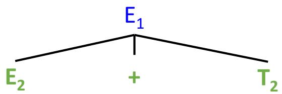

$$
\mathsf { E } _ { 3 }
$$

$$
\mathsf { E } _ { 3 } + \mathsf { T } ^ { * } \mathsf { F }
$$

$$
\mathsf E _ { 3 } + \mathsf T _ { 1 }
$$

$$
\mathsf { E } _ { 2 }
$$

$$
\mathsf E _ { 2 } + \mathsf { i d }
$$

$$
\mathsf E _ { 2 } + \mathsf E _ { 1 }
$$

$$
\mathsf E _ { 2 } + \mathsf T _ { 2 }
$$

$$
\mathsf { T } + \mathsf { T } ^ { \ast } \mathsf { F } + \mathsf { i d }
$$

$$
E _ { 3 } \mathrm { - } > \top
$$

$$
\mathsf { T } _ { 1 } \mathrm { - } \mathsf { > } \mathsf { T } ^ { \ast } \mathsf { F } )
$$

$$
\mathsf E _ { 2 } ^ { \phantom { } } {  } \mathsf E _ { 3 } ^ { \phantom { } } { + } \mathsf T _ { 1 } ^ { \phantom { } } )
$$

$$
\digamma _ { 1 } { \digamma } > \digamma \mathrm { d } )
$$

$$
\mathsf { T } _ { 2 } \mathrm { - } \mathsf { > } \mathsf { F } _ { 1 } )
$$

$$
\mathsf E _ { 1 } { \mathrm { - } } > \mathsf E _ { 2 } { \mathrm { + } } \mathsf T _ { 2 } )
$$

## One More Example

• Gramar G(E): $E  \mathsf { E } \mathrm { + } \mathsf { T } | \mathsf { T }$ T → T\*F | F $F \to ( \mathsf { E } ) \mid \mathsf { i d }$

• Sentential form: $T + T ^ { * } F + | \mathrm { d }$ Handle Simple Phrase

• Phrase： 1$\mathsf E _ { 1 } \colon \mathsf T + \mathsf T ^ { * } \mathsf F + \mathsf { i d }$ $E _ { 2 } : \mathsf { T } + \mathsf { T } ^ { * } \mathsf { F }$ $\mathsf E _ { 3 } \colon \dot { \bar { \mathsf { T } } }$ ${ \sf T } _ { 1 } \colon$ T\*F $\mathsf { T } _ { 2 } , \mathsf { F } _ { 1 } \colon$

Shift/Reduce:   
Stack: Input: T + T \* F + id (Shift)   
$\mathsf { E } _ { 1 }$ Stack: T Input: + T \* F + id (Reduce $\mathsf E _ { 3 } { \mathsf - } > \mathsf T )$   
Stack: $\mathsf { E } _ { 3 }$ Input: + T \* F + id (Shift x4)   
Stack: $\mathsf { E } _ { 3 } + \mathsf { T } ^ { \ast } \mathsf { F }$ Input: + id (Reduce $\mathsf { T } _ { 1 } \mathrm { - } \mathsf { > } \mathsf { T } ^ { \ast } \mathsf { F } )$   
Stack: $\mathsf E _ { 3 } + \mathsf T _ { 1 }$ Input: + id (Reduce $\mathsf E _ { 2 } ^ { \phantom { } } {  } \mathsf E _ { 3 } ^ { \phantom { } } { + } \mathsf T _ { 1 } ^ { \phantom { } } )$   
Stack: $\mathsf { E } _ { 2 }$ Input: + id (Shift x2)   
Stack: $\mathsf E _ { 2 } + \mathsf i \mathsf d$ Input: (Reduce $\digamma _ { 1 } { \digamma } > \digamma \mathrm { d } )$   
Stack: $\mathsf E _ { 2 } + \mathsf E _ { 1 }$ Input: (Reduce $\mathsf T _ { 2 } \mathrm { - } \mathsf { > } \mathsf { F } _ { 1 } \mathsf { ) }$   
Stack: $\mathsf { E } _ { 2 } + \mathsf { T } _ { 2 }$ Input: (Reduce $\mathsf E _ { 1 } { \mathrm { - } } > \mathsf E _ { 2 } { \mathrm { + } } \mathsf T _ { 2 } )$   
Stack: $\mathsf { E } _ { 1 }$ Input: (Accept)

## Example

• G(S): S → aAcBe; A → b; $\mathsf { A } \to \mathsf { A b }$ $\mathsf { B } \to \mathsf { d }$

<table><tr><td rowspan=1 colspan=1>Stack</td><td rowspan=1 colspan=1>Input</td><td rowspan=1 colspan=1>Action</td></tr><tr><td rowspan=1 colspan=1>$</td><td rowspan=1 colspan=1>abbcde$</td><td rowspan=1 colspan=1>Shift</td></tr><tr><td rowspan=1 colspan=1> $\$ 2$ </td><td rowspan=1 colspan=1>bbcde$</td><td rowspan=1 colspan=1>Shift</td></tr><tr><td rowspan=1 colspan=1>$ab</td><td rowspan=1 colspan=1>bcde$</td><td rowspan=1 colspan=1>Reduce A → b</td></tr><tr><td rowspan=1 colspan=1>$aA</td><td rowspan=1 colspan=1>bcde$</td><td rowspan=1 colspan=1>Shift</td></tr><tr><td rowspan=1 colspan=1>$aAb</td><td rowspan=1 colspan=1>cde$</td><td rowspan=1 colspan=1>Reduce A → Ab</td></tr></table>

Reduce A → Ab? OR Reduce A → b?

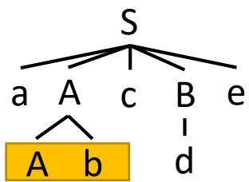

Ab is Handle, so we choose A → Ab to reduce.

## Handle Always Occurs at Stack Top

• Does handle appear outside the stack?

◆ It can, but handle will eventually be shifted in, placing it at top of stack.

• Why does handle not appear in the middle of the stack?

◆Parser eagerly reduces when handle is at top of stack.

• Results in an easily generalized shift-reduce strategy:

◆ If there is no handle at the top of the stack, shift

◆If there is a handle, reduce to the non-terminal

◆Easy to automate the synthesis of the parser using a table

## Viable Prefix [活前缀]

• A viable prefix[活前缀/可行前缀] is a prefix of a right-sentential form that does not pass the end of the rightmost handle of that sentential form.

◆Stack content is always a viable prefix, guaranteeing the shift / reduce is on the right track.

• Example 1: S ⇒ aEb ⇒ aaEb, the handle is aE, so the viable prefix is a,

aa, aaE, but not aaEb.

<table><tr><td rowspan=1 colspan=1>Stack</td><td rowspan=1 colspan=1>Input</td></tr><tr><td rowspan=1 colspan=1>$...</td><td rowspan=1 colspan=1>Handle...$</td></tr><tr><td rowspan=1 colspan=1>$..</td><td rowspan=1 colspan=1>andle...$</td></tr><tr><td rowspan=1 colspan=1>$...Ha</td><td rowspan=1 colspan=1>ndle...$</td></tr><tr><td rowspan=1 colspan=1>$...Han</td><td rowspan=1 colspan=1>dle...$</td></tr></table>

## Viable Prefix [活前缀]

Example 2: G(S): S → aAcBe; A → b; A → Ab; B → d.

• “aAcde” is a right sentential form, it is split between the stack and the input buffer, aA, aAc, aAcd are all viable prefix of aAcde.

<table><tr><td rowspan=1 colspan=1>Stack</td><td rowspan=1 colspan=1>Input</td><td rowspan=1 colspan=1>Action</td></tr><tr><td rowspan=1 colspan=1>$aA</td><td rowspan=1 colspan=1>cde$</td><td rowspan=1 colspan=1>Shift</td></tr><tr><td rowspan=1 colspan=1>$aAc</td><td rowspan=1 colspan=1>de$</td><td rowspan=1 colspan=1>Shift</td></tr><tr><td rowspan=1 colspan=1>$aAcd</td><td rowspan=1 colspan=1>e$</td><td rowspan=1 colspan=1>Reduce B → d</td></tr></table>

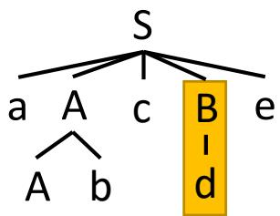

## Conflicts[冲突]

• Conflicts arise with ambiguous grammars.

• Consider G(E):

• E → E\*E | E+E | (E) | id,

• sentential form: id \* id + id

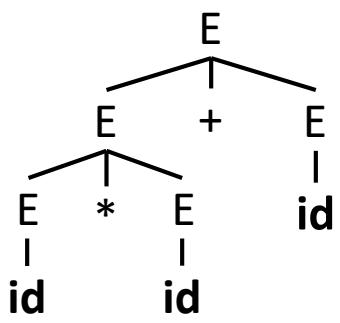

<table><tr><td rowspan=1 colspan=1>Step</td><td rowspan=1 colspan=1>Stack</td><td rowspan=1 colspan=1>Input</td><td rowspan=1 colspan=1>Action</td></tr><tr><td rowspan=1 colspan=1>0</td><td rowspan=1 colspan=1>$</td><td rowspan=1 colspan=1>id*id+id$</td><td rowspan=1 colspan=1>Shift</td></tr><tr><td rowspan=1 colspan=1>1</td><td rowspan=1 colspan=1>$id</td><td rowspan=1 colspan=1>*id+id$</td><td rowspan=1 colspan=1>Reduce E→ id</td></tr><tr><td rowspan=1 colspan=1>2</td><td rowspan=1 colspan=1>$E</td><td rowspan=1 colspan=1>*id+id$</td><td rowspan=1 colspan=1>Shift</td></tr><tr><td rowspan=1 colspan=1>3</td><td rowspan=1 colspan=1>$E*</td><td rowspan=1 colspan=1>id+id$</td><td rowspan=1 colspan=1>Shift</td></tr><tr><td rowspan=1 colspan=1>4</td><td rowspan=1 colspan=1>$E*id</td><td rowspan=1 colspan=1>+id$</td><td rowspan=1 colspan=1>Reduce E → id</td></tr><tr><td rowspan=1 colspan=1>5</td><td rowspan=1 colspan=1>$E*E</td><td rowspan=1 colspan=1>+id$</td><td rowspan=1 colspan=1>Reduce E → E*E</td></tr><tr><td rowspan=1 colspan=1>6</td><td rowspan=1 colspan=1>$E</td><td rowspan=1 colspan=1>+id$</td><td rowspan=1 colspan=1>Shift</td></tr><tr><td rowspan=1 colspan=1>7</td><td rowspan=1 colspan=1>$E+</td><td rowspan=1 colspan=1>id$</td><td rowspan=1 colspan=1>Shift</td></tr><tr><td rowspan=1 colspan=1>8</td><td rowspan=1 colspan=1>$E+id</td><td rowspan=1 colspan=1>$</td><td rowspan=1 colspan=1>Reduce E→ id</td></tr><tr><td rowspan=1 colspan=1>9</td><td rowspan=1 colspan=1>$E+E</td><td rowspan=1 colspan=1>$</td><td rowspan=1 colspan=1>Reduce E→ E+E</td></tr><tr><td rowspan=1 colspan=1>10</td><td rowspan=1 colspan=1>$E</td><td rowspan=1 colspan=1>$</td><td rowspan=1 colspan=1>ACCEPT</td></tr></table>

## Conflicts[冲突]

• Conflicts arise with ambiguous grammars.

• Consider G(E):

• E → E\*E | E+E | (E) | id,

• sentential form: id \* id + id

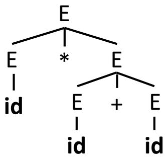

<table><tr><td rowspan=1 colspan=1>Step</td><td rowspan=1 colspan=1>Stack</td><td rowspan=1 colspan=1>Input</td><td rowspan=1 colspan=1>Action</td></tr><tr><td rowspan=1 colspan=1>0</td><td rowspan=1 colspan=1>$</td><td rowspan=1 colspan=1> $i d ^ { * } i d + i d \$ 1$ </td><td rowspan=1 colspan=1>Shift</td></tr><tr><td rowspan=1 colspan=1>1</td><td rowspan=1 colspan=1>$id</td><td rowspan=1 colspan=1> $\ast _ { i 0 } + i 0 \leq$ </td><td rowspan=1 colspan=1>Reduce E→ id</td></tr><tr><td rowspan=1 colspan=1>2</td><td rowspan=1 colspan=1>$E</td><td rowspan=1 colspan=1> $\ast _ { i 0 } + i 0 \leq$ </td><td rowspan=1 colspan=1>Shift</td></tr><tr><td rowspan=1 colspan=1>3</td><td rowspan=1 colspan=1>$E*</td><td rowspan=1 colspan=1>id+id$</td><td rowspan=1 colspan=1>Shift</td></tr><tr><td rowspan=1 colspan=1>4</td><td rowspan=1 colspan=1>$E*id</td><td rowspan=1 colspan=1>+id$</td><td rowspan=1 colspan=1>Reduce E → id</td></tr><tr><td rowspan=1 colspan=1>5</td><td rowspan=1 colspan=1>$E*E</td><td rowspan=1 colspan=1>+id$</td><td rowspan=1 colspan=1>Shift (Reduce E → E*E)</td></tr><tr><td rowspan=1 colspan=1>6</td><td rowspan=1 colspan=1> $\$ 5$ </td><td rowspan=1 colspan=1>$</td><td rowspan=1 colspan=1>Reduce E→ id</td></tr><tr><td rowspan=1 colspan=1>7</td><td rowspan=1 colspan=1> $\$ 5$ </td><td rowspan=1 colspan=1>$</td><td rowspan=1 colspan=1>Reduce E→ E+E</td></tr><tr><td rowspan=1 colspan=1>8</td><td rowspan=1 colspan=1>$E*E</td><td rowspan=1 colspan=1>$</td><td rowspan=1 colspan=1>Reduce E→ E*E</td></tr><tr><td rowspan=1 colspan=1>9</td><td rowspan=1 colspan=1>$E</td><td rowspan=1 colspan=1>$</td><td rowspan=1 colspan=1>ACCEPT</td></tr></table>

## Conflicts[冲突]

• Conflicts arise with ambiguous grammars.

• Grammar: $E \ \to \ \mathsf { \Gamma } _ { \mathsf { E } ^ { * } \mathsf { E } } \quad | \quad \mathsf { E } + \mathsf { E } \quad |$ (E) | id

• sentential form: ${ \mathrm { i d } } * { \mathrm { i d } } + { \mathrm { i d } }$

<table><tr><td>5</td><td>$E*E</td><td>+id$</td><td>Shift (Reduce E →E*E)</td></tr></table>

• In the steps marked blue, both shift or reduce by E → E \* E is okay since the precedence of + and \* is not specified in the grammar, same problem with associativity.

• As usual, we should remove conflicts due to ambiguity:

◆Rewrite grammar/parser to encode precedence and associativity.

 Operator Precedence Parsers (OPP), see Section 4.6 in Dragon Book, 1st Edition

◆ Get rid of remaining ambiguity (e.g., if-then-else)

## Properties of Bottom-up Parsing

## Handles always appear at the top of the stack

◆ Never in middle of stack

◆ Justifies use of stack in shift–reduce parsing

## • Results in an easily generalized shift-reduce strategy

◆ If there is no handle at the top of the stack, shift

◆ If there is a handle, reduce to the non-terminal

◆ Easy to automate the synthesis of the parser using a table

## • Types of conflicts

◆ If it is possible to either shift or reduce then there is a shift-reduce conflict.

◆ If there are two possible reductions, then there is a reduce-reduce conflict.

◆ Most often occur because of ambiguous grammars, In rare cases, because of non-ambiguous grammars not amenable to parser.

## Contents

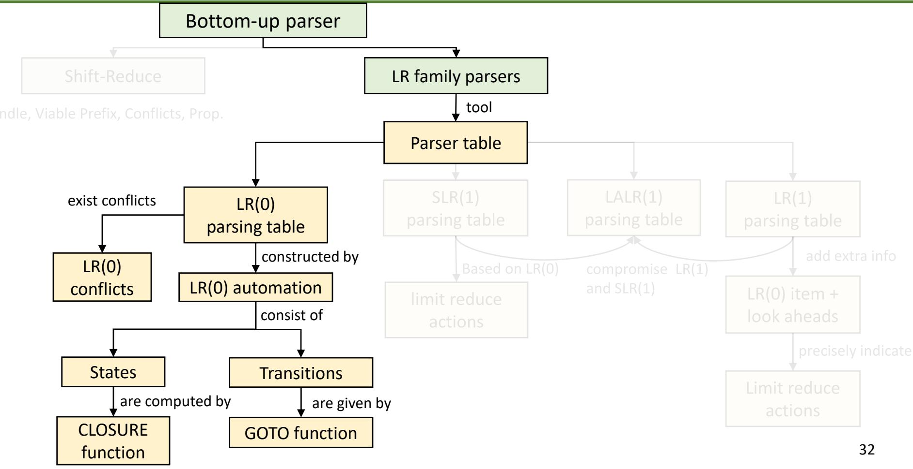

## Types of Bottom-Up Parsers

• Different types of bottom-up parsers:

◆ Simple precedence parsers

◆ Operator precedence parsers

◆ Recursive ascent parsers

LR family parsers

◆ others...

• Here, we will mainly focus on the LR family parsers, which are a type of bottom-up parser that analyzes deterministic context-free languages in linear time.

## LR(k) Parser

## • LR(k) : member of LR family of parsers

"L" stands for left-to-right scanning of the input.

"R" stands for constructing a rightmost derivation in reverse.

◆ "k" is the number of input symbols of the lookahead used to make number of parsing decision.

## • Comparison with LL(k) parser

◆ Efficient as LL(k): Linear in time and space to length of input (same as LL(k)).

◆ Convenient as LL(k): Can generate automatically from grammar – YACC, Bison.

More complex than LL(k): Harder to debug parser when grammar causes conflicting predictions.

More powerful than LL(k): Handles more grammars: no left recursion removal, left factoring needed.

## LR Parser

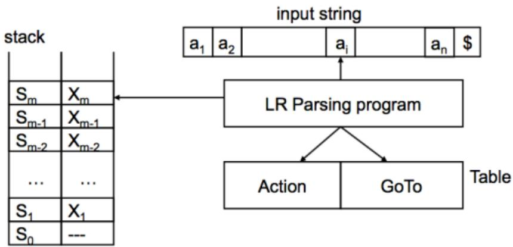

• The stack holds a sequence of states, $S _ { 0 } S _ { 1 } . . . S _ { \mathrm { m } } \left( S _ { \mathrm { m } } \right.$ is the top)

◆ States are to track where we are in a parse.

◆ Each grammar symbol $\mathsf { X } _ { \mathrm { i } }$ is associated with a state $S _ { j }$

• Contents of stack + input $( \mathsf { X } _ { 1 } \mathsf { X } _ { 2 } . . . \mathsf { X } _ { \mathsf { m } } \mathsf { a } _ { \mathsf { i } } . . . \mathsf { a } _ { \mathsf { n } } )$ is a right sentential form ◆ If the input string is a member of the language

• Uses $[ S _ { \mathrm { j } } , \mathsf { a } _ { \mathrm { j } } ]$ to index into parsing table to determine action

## Bottom-up (Revisit)

## • LR(0) Parser:

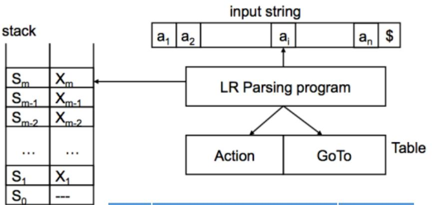

<table><tr><td rowspan=1 colspan=1> Stat</td><td rowspan=1 colspan=5>Action</td><td rowspan=1 colspan=2>Goto</td></tr><tr><td rowspan=1 colspan=1>e</td><td rowspan=1 colspan=1>*</td><td rowspan=1 colspan=1>+</td><td rowspan=1 colspan=1>0</td><td rowspan=1 colspan=1>1</td><td rowspan=1 colspan=1>$</td><td rowspan=1 colspan=1>E</td><td rowspan=1 colspan=1>B</td></tr><tr><td rowspan=1 colspan=1>0</td><td rowspan=1 colspan=1></td><td rowspan=1 colspan=1></td><td rowspan=1 colspan=1>s1</td><td rowspan=1 colspan=1>s2</td><td rowspan=1 colspan=1></td><td rowspan=1 colspan=1>3</td><td rowspan=1 colspan=1>4</td></tr><tr><td rowspan=1 colspan=1>1</td><td rowspan=1 colspan=1>r4</td><td rowspan=1 colspan=1>r4</td><td rowspan=1 colspan=1>r4</td><td rowspan=1 colspan=1>r4</td><td rowspan=1 colspan=1>r4</td><td rowspan=1 colspan=1></td><td rowspan=1 colspan=1></td></tr><tr><td rowspan=1 colspan=1>2</td><td rowspan=1 colspan=1>r5</td><td rowspan=1 colspan=1>r5</td><td rowspan=1 colspan=1>r5</td><td rowspan=1 colspan=1>r5</td><td rowspan=1 colspan=1>r5</td><td rowspan=1 colspan=1></td><td rowspan=1 colspan=1></td></tr><tr><td rowspan=1 colspan=1>3</td><td rowspan=1 colspan=1>s5</td><td rowspan=1 colspan=1>s6</td><td rowspan=1 colspan=1></td><td rowspan=1 colspan=1></td><td rowspan=1 colspan=1>acc</td><td rowspan=1 colspan=1></td><td rowspan=1 colspan=1></td></tr><tr><td rowspan=1 colspan=1>4</td><td rowspan=1 colspan=1>r3</td><td rowspan=1 colspan=1>r3</td><td rowspan=1 colspan=1>r3</td><td rowspan=1 colspan=1>r3</td><td rowspan=1 colspan=1>r3</td><td rowspan=1 colspan=1></td><td rowspan=1 colspan=1></td></tr><tr><td rowspan=1 colspan=1>5</td><td rowspan=1 colspan=1></td><td rowspan=1 colspan=1></td><td rowspan=1 colspan=1>s1</td><td rowspan=1 colspan=1>s2</td><td rowspan=1 colspan=1></td><td rowspan=1 colspan=1></td><td rowspan=1 colspan=1>7</td></tr><tr><td rowspan=1 colspan=1>6</td><td rowspan=1 colspan=1></td><td rowspan=1 colspan=1></td><td rowspan=1 colspan=1>s1</td><td rowspan=1 colspan=1>s2</td><td rowspan=1 colspan=1></td><td rowspan=1 colspan=1></td><td rowspan=1 colspan=1>8</td></tr><tr><td rowspan=1 colspan=1>7</td><td rowspan=1 colspan=1>r1</td><td rowspan=1 colspan=1>r1</td><td rowspan=1 colspan=1>r1</td><td rowspan=1 colspan=1>r1</td><td rowspan=1 colspan=1>r1</td><td rowspan=1 colspan=1></td><td rowspan=1 colspan=1></td></tr><tr><td rowspan=1 colspan=1>8</td><td rowspan=1 colspan=1>r2</td><td rowspan=1 colspan=1>r2</td><td rowspan=1 colspan=1>r2</td><td rowspan=1 colspan=1>r2</td><td rowspan=1 colspan=1>r2</td><td rowspan=1 colspan=1></td><td rowspan=1 colspan=1></td></tr></table>

## Parse Table

• The LR-parsing algorithm must decide when to shift and when to reduce (and in the latter case, by which production).

• It does so by consulting two tables: ACTION and GOTO.

• The basic algorithm is the same for all LR parsers, what changes are the tables ACTION and GOTO.

<table><tr><td rowspan="2">State</td><td colspan="4">Action</td><td colspan="2">Goto</td></tr><tr><td colspan="4">Terminals</td><td colspan="2">Non-Terminals</td></tr><tr><td></td><td></td><td></td><td></td><td></td><td></td><td></td></tr><tr><td>1</td><td></td><td></td><td></td><td></td><td></td><td></td></tr><tr><td></td><td></td><td></td><td></td><td></td><td></td><td></td></tr></table>

## Action table[动作表]

• The action table is indexed by a state of the parser and a terminal and contains three types of actions.

◆ Shift, Reduce, Accept, Error

Action[S, a] tells the parser what to do when the state on top of the stack is S and terminal a is the next input token.

$$
\begin{array} { l } { ( 1 ) \models \mathsf { E } \stackrel { \ast } { \to } \mathsf { E } ^ { \ast } \mathsf { B } } \\ { ( 2 ) \mathsf { E } \stackrel { \ast } { \to } \mathsf { E } + \mathsf { B } } \\ { ( 3 ) \mathsf { E } \stackrel { \ast } { \to } \mathsf { B } } \\ { ( 4 ) \mathsf { B } \stackrel { \ast } { \to } 0 } \\ { ( 5 ) \mathsf { B } \preceq 1 } \end{array}
$$

<table><tr><td rowspan=2 colspan=1>State（s）</td><td rowspan=1 colspan=5>Action</td></tr><tr><td rowspan=1 colspan=1>*</td><td rowspan=1 colspan=1>+</td><td rowspan=1 colspan=1>0</td><td rowspan=1 colspan=1>1</td><td rowspan=1 colspan=1>$</td></tr><tr><td rowspan=1 colspan=1>0</td><td rowspan=1 colspan=1></td><td rowspan=1 colspan=1></td><td rowspan=1 colspan=1>s1</td><td rowspan=1 colspan=1> s2</td><td rowspan=1 colspan=1></td></tr><tr><td rowspan=1 colspan=1>1</td><td rowspan=1 colspan=1>r4</td><td rowspan=1 colspan=1>r4</td><td rowspan=1 colspan=1>r4</td><td rowspan=1 colspan=1>r4</td><td rowspan=1 colspan=1>r4</td></tr><tr><td rowspan=1 colspan=1>2</td><td rowspan=1 colspan=1>r5</td><td rowspan=1 colspan=1>r5</td><td rowspan=1 colspan=1>r5</td><td rowspan=1 colspan=1>r5</td><td rowspan=1 colspan=1>r5</td></tr><tr><td rowspan=1 colspan=1>3</td><td rowspan=1 colspan=1>s5</td><td rowspan=1 colspan=1>s6</td><td rowspan=1 colspan=1></td><td rowspan=1 colspan=1></td><td rowspan=1 colspan=1>acc</td></tr><tr><td rowspan=1 colspan=1>4</td><td rowspan=1 colspan=1>r3</td><td rowspan=1 colspan=1>r3</td><td rowspan=1 colspan=1>r3</td><td rowspan=1 colspan=1>r3</td><td rowspan=1 colspan=1>r3</td></tr><tr><td rowspan=1 colspan=1>5</td><td rowspan=1 colspan=1></td><td rowspan=1 colspan=1></td><td rowspan=1 colspan=1>s1</td><td rowspan=1 colspan=1>s2</td><td rowspan=1 colspan=1></td></tr><tr><td rowspan=1 colspan=1>6</td><td rowspan=1 colspan=1></td><td rowspan=1 colspan=1></td><td rowspan=1 colspan=1>s1</td><td rowspan=1 colspan=1>s2</td><td rowspan=1 colspan=1></td></tr><tr><td rowspan=1 colspan=1>7</td><td rowspan=1 colspan=1>r1</td><td rowspan=1 colspan=1>r1</td><td rowspan=1 colspan=1>r1</td><td rowspan=1 colspan=1>r1</td><td rowspan=1 colspan=1>r1</td></tr><tr><td rowspan=1 colspan=1>8</td><td rowspan=1 colspan=1>r2</td><td rowspan=1 colspan=1>r2</td><td rowspan=1 colspan=1>r2</td><td rowspan=1 colspan=1> r2</td><td rowspan=1 colspan=1>r2</td></tr></table>

## Possible Actions[可能的动作]

## • ACTION $[ \mathsf { S } _ { \mathsf { m } } ,$ ai] has four possible actions:

Shift $( \mathsf { s } _ { \mathrm { x } } )$ : the handle is not completed loaded in the stack

1. Shift the next input symbol onto the top of the stack

2. Add State x to the stack

• Reduce $( r _ { y } )$ : the handle is at the top of the stack

1. Pop the handle and all its associated states.

2. Reduce the handle by the $y ^ { \mathrm { t h } }$ production (say $\pmb { \Delta }  \mathsf { a l }$

3. Push A onto the stack

4. Push state $\mathsf { \pmb { S _ { j } } }$ by GOTO table, $\mathsf { S } _ { \mathrm { j } } = \mathsf { G O T O } [ \mathsf { S } _ { \mathrm { i } } , \mathsf { A } ]$ and $\pmb { S _ { \mathrm { i } } } \mathrm { i } s$ the current state.

## Accept

◆ $\mathsf { A C T I O N } [ \mathsf { S } _ { \mathrm { i } } , \mathsf { a } _ { \mathrm { i } } ] = \mathsf { A C C } ,$ then parsing is complete and successfully

## • Error

$\mathsf { A C T } | \mathsf { O N } [ \mathsf { S } _ { \mathrm { i } } , \mathsf { a } _ { \mathrm { i } } ] = < \mathsf { e m p t y } >$ , then report error and stop

## Goto Table[跳转表]

• The goto table is indexed by a state of the parser and a nonterminal

◆ Define the next state of the parser if it has recognized a certain nonterminal.

◆ This table is important to find out the next state after every reduction.

GOTO[Si, A] indicates the new state to place on the top of the stack after a reduction is performed

• After a reduction action is performed:

• a non-terminal A is pushed onto the stack without an associated state.

• The current state at the top is Si

• Goto table tells which state should be pushed together with A by GOTO[Si, A].

<table><tr><td rowspan=2 colspan=1>State</td><td rowspan=1 colspan=2>Goto</td></tr><tr><td rowspan=1 colspan=1>E</td><td rowspan=1 colspan=1>B</td></tr><tr><td rowspan=1 colspan=1>0</td><td rowspan=1 colspan=1>3</td><td rowspan=1 colspan=1>4</td></tr><tr><td rowspan=1 colspan=1>1</td><td rowspan=1 colspan=1></td><td rowspan=1 colspan=1></td></tr><tr><td rowspan=1 colspan=1>2</td><td rowspan=1 colspan=1></td><td rowspan=1 colspan=1></td></tr><tr><td rowspan=1 colspan=1>3</td><td rowspan=1 colspan=1></td><td rowspan=1 colspan=1></td></tr><tr><td rowspan=1 colspan=1>4</td><td rowspan=1 colspan=1></td><td rowspan=1 colspan=1></td></tr><tr><td rowspan=1 colspan=1>5</td><td rowspan=1 colspan=1></td><td rowspan=1 colspan=1>7</td></tr><tr><td rowspan=1 colspan=1>6</td><td rowspan=1 colspan=1></td><td rowspan=1 colspan=1>8</td></tr><tr><td rowspan=1 colspan=1>7</td><td rowspan=1 colspan=1></td><td rowspan=1 colspan=1></td></tr><tr><td rowspan=1 colspan=1>8</td><td rowspan=1 colspan=1></td><td rowspan=1 colspan=1></td></tr></table>

## Parse Table

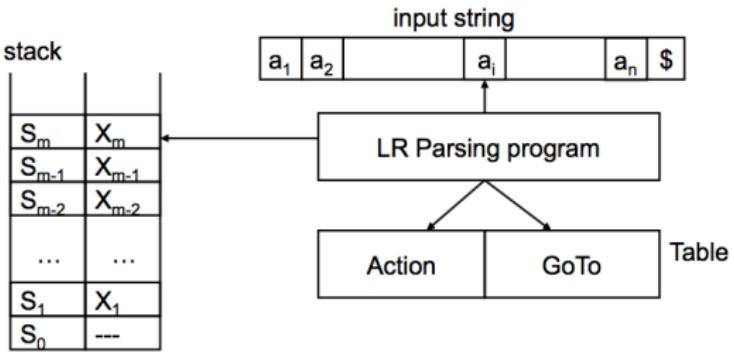

$$
\begin{array} { r } { | \begin{array} { l } { ( 1 ) \models \mathsf { E }  \mathsf { E } ^ { * } \textsf { B } } \\ { ( 2 ) \mathsf { E }  \mathsf { E } + \mathsf { B } } \\ { ( 3 ) \mathsf { E }  \mathsf { B } } \\ { ( 4 ) \mathsf { B }  0 } \\ { ( 5 ) \mathsf { B }  1 } \end{array}  } \end{array}
$$

<table><tr><td rowspan=2 colspan=1>State</td><td rowspan=1 colspan=5>Action</td><td rowspan=1 colspan=2>Goto</td></tr><tr><td rowspan=1 colspan=1>*</td><td rowspan=1 colspan=1>×</td><td rowspan=1 colspan=1>0</td><td rowspan=1 colspan=1>1</td><td rowspan=1 colspan=1>$</td><td rowspan=1 colspan=1>E</td><td rowspan=1 colspan=1>B</td></tr><tr><td rowspan=1 colspan=1>0</td><td rowspan=1 colspan=1></td><td rowspan=1 colspan=1></td><td rowspan=1 colspan=1> s1</td><td rowspan=1 colspan=1> s2</td><td rowspan=1 colspan=1></td><td rowspan=1 colspan=1>3</td><td rowspan=1 colspan=1>4</td></tr><tr><td rowspan=1 colspan=1>1</td><td rowspan=1 colspan=1>r4</td><td rowspan=1 colspan=1>r4</td><td rowspan=1 colspan=1>r4</td><td rowspan=1 colspan=1>r4</td><td rowspan=1 colspan=1>r4</td><td rowspan=1 colspan=1></td><td rowspan=1 colspan=1></td></tr><tr><td rowspan=1 colspan=1>2</td><td rowspan=1 colspan=1>r5</td><td rowspan=1 colspan=1>r5</td><td rowspan=1 colspan=1>r5</td><td rowspan=1 colspan=1>r5</td><td rowspan=1 colspan=1> r5</td><td rowspan=1 colspan=1></td><td rowspan=1 colspan=1></td></tr><tr><td rowspan=1 colspan=1>3</td><td rowspan=1 colspan=1>s5</td><td rowspan=1 colspan=1>s6</td><td rowspan=1 colspan=1></td><td rowspan=1 colspan=1></td><td rowspan=1 colspan=1>acc</td><td rowspan=1 colspan=1></td><td rowspan=1 colspan=1></td></tr><tr><td rowspan=1 colspan=1>4</td><td rowspan=1 colspan=1> r3</td><td rowspan=1 colspan=1>r3</td><td rowspan=1 colspan=1>r3</td><td rowspan=1 colspan=1>r3</td><td rowspan=1 colspan=1>r3</td><td rowspan=1 colspan=1></td><td rowspan=1 colspan=1></td></tr><tr><td rowspan=1 colspan=1>5</td><td rowspan=1 colspan=1></td><td rowspan=1 colspan=1></td><td rowspan=1 colspan=1>s1</td><td rowspan=1 colspan=1>s2</td><td rowspan=1 colspan=1></td><td rowspan=1 colspan=1></td><td rowspan=1 colspan=1>7</td></tr><tr><td rowspan=1 colspan=1>6</td><td rowspan=1 colspan=1></td><td rowspan=1 colspan=1></td><td rowspan=1 colspan=1>s1</td><td rowspan=1 colspan=1>s2</td><td rowspan=1 colspan=1></td><td rowspan=1 colspan=1></td><td rowspan=1 colspan=1>8</td></tr><tr><td rowspan=1 colspan=1>7</td><td rowspan=1 colspan=1>r1</td><td rowspan=1 colspan=1>r1</td><td rowspan=1 colspan=1>r1</td><td rowspan=1 colspan=1>r1</td><td rowspan=1 colspan=1>r1</td><td rowspan=1 colspan=1></td><td rowspan=1 colspan=1></td></tr><tr><td rowspan=1 colspan=1>8</td><td rowspan=1 colspan=1>r2</td><td rowspan=1 colspan=1>r2</td><td rowspan=1 colspan=1> r2</td><td rowspan=1 colspan=1> r2</td><td rowspan=1 colspan=1>r2</td><td rowspan=1 colspan=1></td><td rowspan=1 colspan=1></td></tr></table>

## Parser Actions

Initial

Stack:

<table><tr><td rowspan=1 colspan=1>S</td></tr><tr><td rowspan=1 colspan=1>$</td></tr></table>

Input:

$$
\mathsf { a } _ { 1 } \mathsf { a } _ { 2 } . . . \mathsf { a } _ { \mathsf { n } } \$ 3
$$

General

Stack:

<table><tr><td rowspan=1 colspan=1> $\mathsf { S } _ { 0 }$ </td><td rowspan=1 colspan=1> $\mathsf { S } _ { 1 }$ </td><td rowspan=1 colspan=1> $\mathsf { S } _ { 2 }$ </td><td rowspan=1 colspan=1></td><td rowspan=1 colspan=1> $\mathsf { S } _ { \mathsf { m } }$ </td></tr><tr><td rowspan=1 colspan=1>$</td><td rowspan=1 colspan=1> ${ \sf X } _ { 1 }$ </td><td rowspan=1 colspan=1> ${ \sf X } _ { 2 }$ </td><td rowspan=1 colspan=1>：</td><td rowspan=1 colspan=1> $\mathsf { X } _ { \mathsf { m } }$ </td></tr></table>

Input:

$$
\mathsf { a } _ { \mathsf { i } } \mathsf { a } _ { \mathsf { i } + 1 } . . . \mathsf { a } _ { \mathsf { n } } \$ \mathsf { S }
$$

• If ACTION[sm, ai] = sx, then do shift:

◆ Shift ai on stack, which is removed from the input

◆ Enters state $\mathsf { x , }$ i.e., pushes state x on stack

Shift

<table><tr><td rowspan=1 colspan=1>S</td><td rowspan=1 colspan=1> $\mathsf { S } _ { 1 }$ </td><td rowspan=1 colspan=1> $\mathsf { S } _ { 2 }$ </td><td rowspan=1 colspan=1>：</td><td rowspan=1 colspan=1> $\mathsf { S } _ { \mathsf { m } }$ </td><td rowspan=1 colspan=1> $\mathsf { S } _ { \mathsf { x } }$ </td></tr><tr><td rowspan=1 colspan=1>S</td><td rowspan=1 colspan=1> ${ \sf X } _ { 1 }$ </td><td rowspan=1 colspan=1> ${ \sf X } _ { 2 }$ </td><td rowspan=1 colspan=1>：</td><td rowspan=1 colspan=1> $\mathsf { X } _ { \mathsf { m } }$ </td><td rowspan=1 colspan=1> $\mathsf { a } _ { \mathrm { i } }$ </td></tr></table>

$$
\mathsf { a } _ { \mathsf { i } + 1 } . . . \mathsf { a } _ { \mathsf { n } } \$ \mathsf { S }
$$

## Parser Actions

• If ACTION $[ s _ { \mathrm { m } } , \mathsf { a } _ { \mathrm { i } } ] = \mathsf { r } _ { \mathrm { x } } ,$ then do reduce:

◆Pops k (states, symbols) from stack

◆Pushes A on stack

◆GOTO $[ \mathsf { S } _ { \mathsf { m - k } } , \mathsf { A } ] = \mathsf { S } _ { \mathrm { j } } ,$ then

General

<table><tr><td rowspan=1 colspan=1> $\mathsf { S } _ { 0 }$ </td><td rowspan=1 colspan=1> $\mathsf { S } _ { 1 }$ </td><td rowspan=1 colspan=1> $\mathsf { S } _ { 2 }$ </td><td rowspan=1 colspan=1></td><td rowspan=1 colspan=1> $\mathsf { S } _ { \mathsf { m } }$ </td></tr><tr><td rowspan=1 colspan=1>S</td><td rowspan=1 colspan=1> ${ \sf X } _ { 1 }$ </td><td rowspan=1 colspan=1> ${ \sf X } _ { 2 }$ </td><td rowspan=1 colspan=1>：</td><td rowspan=1 colspan=1> $\mathsf { X } _ { \mathsf { m } }$ </td></tr></table>

Pop

<table><tr><td rowspan=1 colspan=1> $\mathsf { S } _ { 0 }$ </td><td rowspan=1 colspan=1> $\mathsf { S } _ { 1 }$ </td><td rowspan=1 colspan=1> $\mathsf { S } _ { 2 }$ </td><td rowspan=1 colspan=1></td><td rowspan=1 colspan=1> $\mathsf { S } _ { \mathsf { m } - \mathsf { k } }$ </td></tr><tr><td rowspan=1 colspan=1>S</td><td rowspan=1 colspan=1> ${ \sf X } _ { 1 }$ </td><td rowspan=1 colspan=1> ${ \sf X } _ { 2 }$ </td><td rowspan=1 colspan=1>：</td><td rowspan=1 colspan=1> ${ \tt X } _ { \mathrm { m - k } }$ </td></tr></table>

Push & GOTO

<table><tr><td rowspan=1 colspan=1> $\mathsf { S } _ { 0 }$ </td><td rowspan=1 colspan=1> $\mathsf { S } _ { 1 }$ </td><td rowspan=1 colspan=1> $\mathsf { S } _ { 2 }$ </td><td rowspan=1 colspan=1></td><td rowspan=1 colspan=1> $\mathsf { S } _ { \mathsf { m } - \mathsf { k } }$ </td><td rowspan=1 colspan=1> $\mathsf { S } _ { \mathrm { j } }$ J</td></tr><tr><td rowspan=1 colspan=1>$</td><td rowspan=1 colspan=1> ${ \sf X } _ { 1 }$ </td><td rowspan=1 colspan=1> ${ \sf X } _ { 2 }$ </td><td rowspan=1 colspan=1>：</td><td rowspan=1 colspan=1> ${ \tt X } _ { \mathrm { m - k } }$ </td><td rowspan=1 colspan=1> $\mathsf { A }$ </td></tr></table>

${ \mathsf { x } } ^ { \mathrm { { t h } } }$ production: $\mathsf { A } \to \mathsf { X } _ { \mathsf { m } \cdot \mathsf { k } + 1 } . . . \mathsf { X } _ { \mathsf { m } }$

$$
\mathsf { a } _ { \mathsf { i } } \mathsf { a } _ { \mathsf { i } + 1 } . . . \mathsf { a } _ { \mathsf { n } } \$ \mathsf { S }
$$

$$
\mathsf { a } _ { \mathsf { i } } \mathsf { a } _ { \mathsf { i } + 1 } . . . \mathsf { a } _ { \mathsf { n } } \$ \mathsf { S }
$$

$$
\mathsf { a } _ { \mathsf { i } } \mathsf { a } _ { \mathsf { i } + 1 } . . . \mathsf { a } _ { \mathsf { n } } \$ \mathsf { S }
$$

## LR Parsing Program

• Input: string ω and parse table with ACTION/GOTO

• Output: reduction steps of $\omega ,$ or error

• Initial: $s _ { o }$ on the stack, $\omega \varsigma$ in the input buffer

while (1) {   
let s and a be the state and symbol on top of the stack;   
if (ACTION[s,a] = St) {   
push (t,a) onto the stack;   
} else if (ACTION[s,a] = rk) { /\* A -> β \*/   
pop |β| (states, symbols) off the stack;   
push (GOTO[s,A],A) onto the stack;   
} else if (ACTION[s,a] = acc)   
break;   
else   
call error-recovery routine;

## Example: Parse Table

• This example of LR parsing uses the following small grammar with goal symbol E:

$$
( 1 ) \textsf { E } \to \textsf { E } ^ { * } \textsf { B }
$$

$$
( 2 ) \textsf { E } \to \textsf { E } + \textsf { B }
$$

$$
( 3 ) \textsf { E } \to \textsf { B }
$$

$$
( 4 ) \ B \to 0
$$

$$
( 5 ) \ B \to 1
$$

• to parse the following input:

$$
\mathbf { 1 } + \mathbf { 1 }
$$

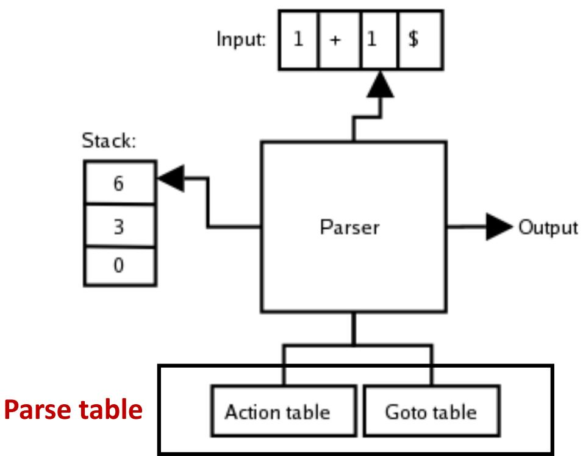  
source: https://en.wikipedia.org/wiki/LR_parser#Table_construction

## Example: Parse Table

• Table entry:

s : shifts the input symbol and moves to state i (i.e., push state on stack)

rj: reduce by production numbered j

acc : accept

empty : error

<table><tr><td rowspan=2 colspan=1>State</td><td rowspan=1 colspan=5>Action</td><td rowspan=1 colspan=2>Goto</td></tr><tr><td rowspan=1 colspan=1>*</td><td rowspan=1 colspan=1>+</td><td rowspan=1 colspan=1>0</td><td rowspan=1 colspan=1>1</td><td rowspan=1 colspan=1>$</td><td rowspan=1 colspan=1>E</td><td rowspan=1 colspan=1>B</td></tr><tr><td rowspan=1 colspan=1>0</td><td rowspan=1 colspan=1></td><td rowspan=1 colspan=1></td><td rowspan=1 colspan=1>s1</td><td rowspan=1 colspan=1>s2</td><td rowspan=1 colspan=1></td><td rowspan=1 colspan=1>3</td><td rowspan=1 colspan=1>4</td></tr><tr><td rowspan=1 colspan=1>1</td><td rowspan=1 colspan=1>r4</td><td rowspan=1 colspan=1>r4</td><td rowspan=1 colspan=1>r4</td><td rowspan=1 colspan=1>r4</td><td rowspan=1 colspan=1>r4</td><td rowspan=1 colspan=1></td><td rowspan=1 colspan=1></td></tr><tr><td rowspan=1 colspan=1>2</td><td rowspan=1 colspan=1>r5</td><td rowspan=1 colspan=1>r5</td><td rowspan=1 colspan=1>r5</td><td rowspan=1 colspan=1>r5</td><td rowspan=1 colspan=1>r5</td><td rowspan=1 colspan=1></td><td rowspan=1 colspan=1></td></tr><tr><td rowspan=1 colspan=1>3</td><td rowspan=1 colspan=1>s5</td><td rowspan=1 colspan=1>s6</td><td rowspan=1 colspan=1></td><td rowspan=1 colspan=1></td><td rowspan=1 colspan=1>acc</td><td rowspan=1 colspan=1></td><td rowspan=1 colspan=1></td></tr><tr><td rowspan=1 colspan=1>4</td><td rowspan=1 colspan=1> r3</td><td rowspan=1 colspan=1>r3</td><td rowspan=1 colspan=1>r3</td><td rowspan=1 colspan=1>r3</td><td rowspan=1 colspan=1>r3</td><td rowspan=1 colspan=1></td><td rowspan=1 colspan=1></td></tr><tr><td rowspan=1 colspan=1>5</td><td rowspan=1 colspan=1></td><td rowspan=1 colspan=1></td><td rowspan=1 colspan=1>s1</td><td rowspan=1 colspan=1>s2</td><td rowspan=1 colspan=1></td><td rowspan=1 colspan=1></td><td rowspan=1 colspan=1>7</td></tr><tr><td rowspan=1 colspan=1>6</td><td rowspan=1 colspan=1></td><td rowspan=1 colspan=1></td><td rowspan=1 colspan=1>s1</td><td rowspan=1 colspan=1>s2</td><td rowspan=1 colspan=1></td><td rowspan=1 colspan=1></td><td rowspan=1 colspan=1>8</td></tr><tr><td rowspan=1 colspan=1>7</td><td rowspan=1 colspan=1>r1</td><td rowspan=1 colspan=1>r1</td><td rowspan=1 colspan=1>r1</td><td rowspan=1 colspan=1>r1</td><td rowspan=1 colspan=1>r1</td><td rowspan=1 colspan=1></td><td rowspan=1 colspan=1></td></tr><tr><td rowspan=1 colspan=1>8</td><td rowspan=1 colspan=1>r2</td><td rowspan=1 colspan=1> r2</td><td rowspan=1 colspan=1> r2</td><td rowspan=1 colspan=1>r2</td><td rowspan=1 colspan=1>r2</td><td rowspan=1 colspan=1></td><td rowspan=1 colspan=1></td></tr></table>

## Example: Parsing steps

• (1) E → E \* B

(2) E → E + B

(3) E → B

(4) B → 0

(5) B → 1

<table><tr><td rowspan=1 colspan=2>Stack</td><td rowspan=1 colspan=1>input</td><td rowspan=1 colspan=1>ACTION</td><td rowspan=1 colspan=1>GOTO</td></tr><tr><td rowspan=1 colspan=1>0</td><td rowspan=1 colspan=1>$</td><td rowspan=1 colspan=1>1+1$</td><td rowspan=1 colspan=1>s2</td><td rowspan=1 colspan=1></td></tr></table>

<table><tr><td rowspan=2 colspan=1>State</td><td rowspan=1 colspan=5>Action</td><td rowspan=1 colspan=2>Goto</td></tr><tr><td rowspan=1 colspan=1>*</td><td rowspan=1 colspan=1>+</td><td rowspan=1 colspan=1>0</td><td rowspan=1 colspan=1>1</td><td rowspan=1 colspan=1>S</td><td rowspan=1 colspan=1>E</td><td rowspan=1 colspan=1>B</td></tr><tr><td rowspan=1 colspan=1>0</td><td rowspan=1 colspan=1></td><td rowspan=1 colspan=1></td><td rowspan=1 colspan=1>s1</td><td rowspan=1 colspan=1>s2</td><td rowspan=1 colspan=1></td><td rowspan=1 colspan=1>3</td><td rowspan=1 colspan=1>4</td></tr><tr><td rowspan=1 colspan=1>1</td><td rowspan=1 colspan=1>r4</td><td rowspan=1 colspan=1>r4</td><td rowspan=1 colspan=1>r4</td><td rowspan=1 colspan=1>r4</td><td rowspan=1 colspan=1>r4</td><td rowspan=1 colspan=1></td><td rowspan=1 colspan=1></td></tr><tr><td rowspan=1 colspan=1>2</td><td rowspan=1 colspan=1>r5</td><td rowspan=1 colspan=1>r5</td><td rowspan=1 colspan=1>r5</td><td rowspan=1 colspan=1>r5</td><td rowspan=1 colspan=1>r5</td><td rowspan=1 colspan=1></td><td rowspan=1 colspan=1></td></tr><tr><td rowspan=1 colspan=1>3</td><td rowspan=1 colspan=1>s5</td><td rowspan=1 colspan=1>s6</td><td rowspan=1 colspan=1></td><td rowspan=1 colspan=1></td><td rowspan=1 colspan=1>acc</td><td rowspan=1 colspan=1></td><td rowspan=1 colspan=1></td></tr><tr><td rowspan=1 colspan=1>4</td><td rowspan=1 colspan=1>r3</td><td rowspan=1 colspan=1>r3</td><td rowspan=1 colspan=1>r3</td><td rowspan=1 colspan=1>r3</td><td rowspan=1 colspan=1>r3</td><td rowspan=1 colspan=1></td><td rowspan=1 colspan=1></td></tr><tr><td rowspan=1 colspan=1>5</td><td rowspan=1 colspan=1></td><td rowspan=1 colspan=1></td><td rowspan=1 colspan=1>s1</td><td rowspan=1 colspan=1>s2</td><td rowspan=1 colspan=1></td><td rowspan=1 colspan=1></td><td rowspan=1 colspan=1>7</td></tr><tr><td rowspan=1 colspan=1>6</td><td rowspan=1 colspan=1></td><td rowspan=1 colspan=1></td><td rowspan=1 colspan=1>s1</td><td rowspan=1 colspan=1>s2</td><td rowspan=1 colspan=1></td><td rowspan=1 colspan=1></td><td rowspan=1 colspan=1>8</td></tr><tr><td rowspan=1 colspan=1>7</td><td rowspan=1 colspan=1>r1</td><td rowspan=1 colspan=1>r1</td><td rowspan=1 colspan=1>r1</td><td rowspan=1 colspan=1>r1</td><td rowspan=1 colspan=1>r1</td><td rowspan=1 colspan=1></td><td rowspan=1 colspan=1></td></tr><tr><td rowspan=1 colspan=1>8</td><td rowspan=1 colspan=1>r2</td><td rowspan=1 colspan=1>r2</td><td rowspan=1 colspan=1>r2</td><td rowspan=1 colspan=1>r2</td><td rowspan=1 colspan=1>r2</td><td rowspan=1 colspan=1></td><td rowspan=1 colspan=1></td></tr></table>

## Example: Parsing steps

• (1) E → E \* B

(2) E → E + B

(3) E → B

(4) B → 0

(5) B → 1

<table><tr><td rowspan=1 colspan=2>Stack</td><td rowspan=1 colspan=1>input</td><td rowspan=1 colspan=1>ACTION</td><td rowspan=1 colspan=1>GOTO</td></tr><tr><td rowspan=1 colspan=1>0</td><td rowspan=1 colspan=1>$</td><td rowspan=1 colspan=1>1+1$</td><td rowspan=1 colspan=1>s2</td><td rowspan=1 colspan=1></td></tr><tr><td rowspan=1 colspan=1>02</td><td rowspan=1 colspan=1>$1</td><td rowspan=1 colspan=1>+1$</td><td rowspan=1 colspan=1>r5</td><td rowspan=1 colspan=1>4</td></tr></table>

<table><tr><td rowspan=2 colspan=1>State</td><td rowspan=1 colspan=5>Action</td><td rowspan=1 colspan=2>Goto</td></tr><tr><td rowspan=1 colspan=1>*</td><td rowspan=1 colspan=1>+</td><td rowspan=1 colspan=1>0</td><td rowspan=1 colspan=1>1</td><td rowspan=1 colspan=1>S</td><td rowspan=1 colspan=1>E</td><td rowspan=1 colspan=1>B</td></tr><tr><td rowspan=1 colspan=1>0</td><td rowspan=1 colspan=1></td><td rowspan=1 colspan=1></td><td rowspan=1 colspan=1>s1</td><td rowspan=1 colspan=1>s2</td><td rowspan=1 colspan=1></td><td rowspan=1 colspan=1>3</td><td rowspan=1 colspan=1>4</td></tr><tr><td rowspan=1 colspan=1>1</td><td rowspan=1 colspan=1>r4</td><td rowspan=1 colspan=1>r4</td><td rowspan=1 colspan=1>r4</td><td rowspan=1 colspan=1>r4</td><td rowspan=1 colspan=1>r4</td><td rowspan=1 colspan=1></td><td rowspan=1 colspan=1></td></tr><tr><td rowspan=1 colspan=1>2</td><td rowspan=1 colspan=1>r5</td><td rowspan=1 colspan=1>r5</td><td rowspan=1 colspan=1>r5</td><td rowspan=1 colspan=1>r5</td><td rowspan=1 colspan=1>r5</td><td rowspan=1 colspan=1></td><td rowspan=1 colspan=1></td></tr><tr><td rowspan=1 colspan=1>3</td><td rowspan=1 colspan=1>s5</td><td rowspan=1 colspan=1>s6</td><td rowspan=1 colspan=1></td><td rowspan=1 colspan=1></td><td rowspan=1 colspan=1>acc</td><td rowspan=1 colspan=1></td><td rowspan=1 colspan=1></td></tr><tr><td rowspan=1 colspan=1>4</td><td rowspan=1 colspan=1>r3</td><td rowspan=1 colspan=1>r3</td><td rowspan=1 colspan=1>r3</td><td rowspan=1 colspan=1>r3</td><td rowspan=1 colspan=1>r3</td><td rowspan=1 colspan=1></td><td rowspan=1 colspan=1></td></tr><tr><td rowspan=1 colspan=1>5</td><td rowspan=1 colspan=1></td><td rowspan=1 colspan=1></td><td rowspan=1 colspan=1>s1</td><td rowspan=1 colspan=1>s2</td><td rowspan=1 colspan=1></td><td rowspan=1 colspan=1></td><td rowspan=1 colspan=1>7</td></tr><tr><td rowspan=1 colspan=1>6</td><td rowspan=1 colspan=1></td><td rowspan=1 colspan=1></td><td rowspan=1 colspan=1>s1</td><td rowspan=1 colspan=1>s2</td><td rowspan=1 colspan=1></td><td rowspan=1 colspan=1></td><td rowspan=1 colspan=1>8</td></tr><tr><td rowspan=1 colspan=1>7</td><td rowspan=1 colspan=1>r1</td><td rowspan=1 colspan=1>r1</td><td rowspan=1 colspan=1>r1</td><td rowspan=1 colspan=1>r1</td><td rowspan=1 colspan=1>r1</td><td rowspan=1 colspan=1></td><td rowspan=1 colspan=1></td></tr><tr><td rowspan=1 colspan=1>8</td><td rowspan=1 colspan=1>r2</td><td rowspan=1 colspan=1>r2</td><td rowspan=1 colspan=1>r2</td><td rowspan=1 colspan=1>r2</td><td rowspan=1 colspan=1>r2</td><td rowspan=1 colspan=1></td><td rowspan=1 colspan=1></td></tr></table>

## Example: Parsing steps

• (1) E → E \* B

(2) E → E + B

(3) E → B

(4) B → 0

(5) B → 1

<table><tr><td rowspan=1 colspan=2>Stack</td><td rowspan=1 colspan=1>input</td><td rowspan=1 colspan=1>ACTION</td><td rowspan=1 colspan=1>GOTO</td></tr><tr><td rowspan=1 colspan=1>0</td><td rowspan=1 colspan=1>$</td><td rowspan=1 colspan=1>1+1$</td><td rowspan=1 colspan=1>s2</td><td rowspan=1 colspan=1></td></tr><tr><td rowspan=1 colspan=1>02</td><td rowspan=1 colspan=1>$1</td><td rowspan=1 colspan=1>+1$</td><td rowspan=1 colspan=1>r5</td><td rowspan=1 colspan=1>4</td></tr><tr><td rowspan=1 colspan=1>0</td><td rowspan=1 colspan=1>$</td><td rowspan=1 colspan=1>+1$</td><td rowspan=1 colspan=1></td><td rowspan=1 colspan=1></td></tr></table>

<table><tr><td rowspan=2 colspan=1>State</td><td rowspan=1 colspan=5>Action</td><td rowspan=1 colspan=2>Goto</td></tr><tr><td rowspan=1 colspan=1>*</td><td rowspan=1 colspan=1>+</td><td rowspan=1 colspan=1>0</td><td rowspan=1 colspan=1>1</td><td rowspan=1 colspan=1>S</td><td rowspan=1 colspan=1>E</td><td rowspan=1 colspan=1>B</td></tr><tr><td rowspan=1 colspan=1>0</td><td rowspan=1 colspan=1></td><td rowspan=1 colspan=1></td><td rowspan=1 colspan=1>s1</td><td rowspan=1 colspan=1>s2</td><td rowspan=1 colspan=1></td><td rowspan=1 colspan=1>3</td><td rowspan=1 colspan=1>4</td></tr><tr><td rowspan=1 colspan=1>1</td><td rowspan=1 colspan=1>r4</td><td rowspan=1 colspan=1>r4</td><td rowspan=1 colspan=1>r4</td><td rowspan=1 colspan=1>r4</td><td rowspan=1 colspan=1>r4</td><td rowspan=1 colspan=1></td><td rowspan=1 colspan=1></td></tr><tr><td rowspan=1 colspan=1>2</td><td rowspan=1 colspan=1>r5</td><td rowspan=1 colspan=1>r5</td><td rowspan=1 colspan=1>r5</td><td rowspan=1 colspan=1>r5</td><td rowspan=1 colspan=1>r5</td><td rowspan=1 colspan=1></td><td rowspan=1 colspan=1></td></tr><tr><td rowspan=1 colspan=1>3</td><td rowspan=1 colspan=1>s5</td><td rowspan=1 colspan=1>s6</td><td rowspan=1 colspan=1></td><td rowspan=1 colspan=1></td><td rowspan=1 colspan=1>acc</td><td rowspan=1 colspan=1></td><td rowspan=1 colspan=1></td></tr><tr><td rowspan=1 colspan=1>4</td><td rowspan=1 colspan=1>r3</td><td rowspan=1 colspan=1>r3</td><td rowspan=1 colspan=1>r3</td><td rowspan=1 colspan=1>r3</td><td rowspan=1 colspan=1>r3</td><td rowspan=1 colspan=1></td><td rowspan=1 colspan=1></td></tr><tr><td rowspan=1 colspan=1>5</td><td rowspan=1 colspan=1></td><td rowspan=1 colspan=1></td><td rowspan=1 colspan=1>s1</td><td rowspan=1 colspan=1>s2</td><td rowspan=1 colspan=1></td><td rowspan=1 colspan=1></td><td rowspan=1 colspan=1>7</td></tr><tr><td rowspan=1 colspan=1>6</td><td rowspan=1 colspan=1></td><td rowspan=1 colspan=1></td><td rowspan=1 colspan=1>s1</td><td rowspan=1 colspan=1>s2</td><td rowspan=1 colspan=1></td><td rowspan=1 colspan=1></td><td rowspan=1 colspan=1>8</td></tr><tr><td rowspan=1 colspan=1>7</td><td rowspan=1 colspan=1>r1</td><td rowspan=1 colspan=1>r1</td><td rowspan=1 colspan=1>r1</td><td rowspan=1 colspan=1>r1</td><td rowspan=1 colspan=1>r1</td><td rowspan=1 colspan=1></td><td rowspan=1 colspan=1></td></tr><tr><td rowspan=1 colspan=1>8</td><td rowspan=1 colspan=1>r2</td><td rowspan=1 colspan=1>r2</td><td rowspan=1 colspan=1>r2</td><td rowspan=1 colspan=1>r2</td><td rowspan=1 colspan=1>r2</td><td rowspan=1 colspan=1></td><td rowspan=1 colspan=1></td></tr></table>

## Example: Parsing steps

• (1) E → E \* B

(2) E → E + B

(3) E → B

(4) B → 0

(5) B → 1

<table><tr><td rowspan=1 colspan=2>Stack</td><td rowspan=1 colspan=1>input</td><td rowspan=1 colspan=1>ACTION</td><td rowspan=1 colspan=1>GOTO</td></tr><tr><td rowspan=1 colspan=1>0</td><td rowspan=1 colspan=1>$</td><td rowspan=1 colspan=1>1+1$</td><td rowspan=1 colspan=1>s2</td><td rowspan=1 colspan=1></td></tr><tr><td rowspan=1 colspan=1>02</td><td rowspan=1 colspan=1>$1</td><td rowspan=1 colspan=1>+1$</td><td rowspan=1 colspan=1>r5</td><td rowspan=1 colspan=1>4</td></tr><tr><td rowspan=1 colspan=1>04</td><td rowspan=1 colspan=1>$B</td><td rowspan=1 colspan=1>+1$</td><td rowspan=1 colspan=1>r3</td><td rowspan=1 colspan=1>3</td></tr></table>

<table><tr><td rowspan=2 colspan=1>State</td><td rowspan=1 colspan=5>Action</td><td rowspan=1 colspan=2>Goto</td></tr><tr><td rowspan=1 colspan=1>*</td><td rowspan=1 colspan=1>+</td><td rowspan=1 colspan=1>0</td><td rowspan=1 colspan=1>1</td><td rowspan=1 colspan=1>S</td><td rowspan=1 colspan=1>E</td><td rowspan=1 colspan=1>B</td></tr><tr><td rowspan=1 colspan=1>0</td><td rowspan=1 colspan=1></td><td rowspan=1 colspan=1></td><td rowspan=1 colspan=1>s1</td><td rowspan=1 colspan=1>s2</td><td rowspan=1 colspan=1></td><td rowspan=1 colspan=1>3</td><td rowspan=1 colspan=1>4</td></tr><tr><td rowspan=1 colspan=1>1</td><td rowspan=1 colspan=1>r4</td><td rowspan=1 colspan=1>r4</td><td rowspan=1 colspan=1>r4</td><td rowspan=1 colspan=1>r4</td><td rowspan=1 colspan=1>r4</td><td rowspan=1 colspan=1></td><td rowspan=1 colspan=1></td></tr><tr><td rowspan=1 colspan=1>2</td><td rowspan=1 colspan=1>r5</td><td rowspan=1 colspan=1>r5</td><td rowspan=1 colspan=1>r5</td><td rowspan=1 colspan=1>r5</td><td rowspan=1 colspan=1>r5</td><td rowspan=1 colspan=1></td><td rowspan=1 colspan=1></td></tr><tr><td rowspan=1 colspan=1>3</td><td rowspan=1 colspan=1>s5</td><td rowspan=1 colspan=1>s6</td><td rowspan=1 colspan=1></td><td rowspan=1 colspan=1></td><td rowspan=1 colspan=1>acc</td><td rowspan=1 colspan=1></td><td rowspan=1 colspan=1></td></tr><tr><td rowspan=1 colspan=1>4</td><td rowspan=1 colspan=1>r3</td><td rowspan=1 colspan=1>r3</td><td rowspan=1 colspan=1>r3</td><td rowspan=1 colspan=1>r3</td><td rowspan=1 colspan=1>r3</td><td rowspan=1 colspan=1></td><td rowspan=1 colspan=1></td></tr><tr><td rowspan=1 colspan=1>5</td><td rowspan=1 colspan=1></td><td rowspan=1 colspan=1></td><td rowspan=1 colspan=1>s1</td><td rowspan=1 colspan=1>s2</td><td rowspan=1 colspan=1></td><td rowspan=1 colspan=1></td><td rowspan=1 colspan=1>7</td></tr><tr><td rowspan=1 colspan=1>6</td><td rowspan=1 colspan=1></td><td rowspan=1 colspan=1></td><td rowspan=1 colspan=1>s1</td><td rowspan=1 colspan=1>s2</td><td rowspan=1 colspan=1></td><td rowspan=1 colspan=1></td><td rowspan=1 colspan=1>8</td></tr><tr><td rowspan=1 colspan=1>7</td><td rowspan=1 colspan=1>r1</td><td rowspan=1 colspan=1>r1</td><td rowspan=1 colspan=1>r1</td><td rowspan=1 colspan=1>r1</td><td rowspan=1 colspan=1>r1</td><td rowspan=1 colspan=1></td><td rowspan=1 colspan=1></td></tr><tr><td rowspan=1 colspan=1>8</td><td rowspan=1 colspan=1>r2</td><td rowspan=1 colspan=1>r2</td><td rowspan=1 colspan=1>r2</td><td rowspan=1 colspan=1>r2</td><td rowspan=1 colspan=1>r2</td><td rowspan=1 colspan=1></td><td rowspan=1 colspan=1></td></tr></table>

## Example: Parsing steps

• (1) E → E \* B

(2) E → E + B

(3) E → B

(4) B → 0

(5) B → 1

<table><tr><td rowspan=1 colspan=2>Stack</td><td rowspan=1 colspan=1>input</td><td rowspan=1 colspan=1>ACTION</td><td rowspan=1 colspan=1>GOTO</td></tr><tr><td rowspan=1 colspan=1>0</td><td rowspan=1 colspan=1>$</td><td rowspan=1 colspan=1>1+1$</td><td rowspan=1 colspan=1>s2</td><td rowspan=1 colspan=1></td></tr><tr><td rowspan=1 colspan=1>02</td><td rowspan=1 colspan=1>$1</td><td rowspan=1 colspan=1>+1$</td><td rowspan=1 colspan=1>r5</td><td rowspan=1 colspan=1>4</td></tr><tr><td rowspan=1 colspan=1>04</td><td rowspan=1 colspan=1>$B</td><td rowspan=1 colspan=1>+1$</td><td rowspan=1 colspan=1>r3</td><td rowspan=1 colspan=1>3</td></tr><tr><td rowspan=1 colspan=1>0</td><td rowspan=1 colspan=1>$</td><td rowspan=1 colspan=1>+1$</td><td rowspan=1 colspan=1></td><td rowspan=1 colspan=1></td></tr></table>

<table><tr><td rowspan=2 colspan=1>State</td><td rowspan=1 colspan=5>Action</td><td rowspan=1 colspan=2>Goto</td></tr><tr><td rowspan=1 colspan=1>*</td><td rowspan=1 colspan=1>+</td><td rowspan=1 colspan=1>0</td><td rowspan=1 colspan=1>1</td><td rowspan=1 colspan=1>S</td><td rowspan=1 colspan=1>E</td><td rowspan=1 colspan=1>B</td></tr><tr><td rowspan=1 colspan=1>0</td><td rowspan=1 colspan=1></td><td rowspan=1 colspan=1></td><td rowspan=1 colspan=1>s1</td><td rowspan=1 colspan=1>s2</td><td rowspan=1 colspan=1></td><td rowspan=1 colspan=1>3</td><td rowspan=1 colspan=1>4</td></tr><tr><td rowspan=1 colspan=1>1</td><td rowspan=1 colspan=1>r4</td><td rowspan=1 colspan=1>r4</td><td rowspan=1 colspan=1>r4</td><td rowspan=1 colspan=1>r4</td><td rowspan=1 colspan=1>r4</td><td rowspan=1 colspan=1></td><td rowspan=1 colspan=1></td></tr><tr><td rowspan=1 colspan=1>2</td><td rowspan=1 colspan=1>r5</td><td rowspan=1 colspan=1>r5</td><td rowspan=1 colspan=1>r5</td><td rowspan=1 colspan=1>r5</td><td rowspan=1 colspan=1>r5</td><td rowspan=1 colspan=1></td><td rowspan=1 colspan=1></td></tr><tr><td rowspan=1 colspan=1>3</td><td rowspan=1 colspan=1>s5</td><td rowspan=1 colspan=1>s6</td><td rowspan=1 colspan=1></td><td rowspan=1 colspan=1></td><td rowspan=1 colspan=1>acc</td><td rowspan=1 colspan=1></td><td rowspan=1 colspan=1></td></tr><tr><td rowspan=1 colspan=1>4</td><td rowspan=1 colspan=1>r3</td><td rowspan=1 colspan=1>r3</td><td rowspan=1 colspan=1>r3</td><td rowspan=1 colspan=1>r3</td><td rowspan=1 colspan=1>r3</td><td rowspan=1 colspan=1></td><td rowspan=1 colspan=1></td></tr><tr><td rowspan=1 colspan=1>5</td><td rowspan=1 colspan=1></td><td rowspan=1 colspan=1></td><td rowspan=1 colspan=1>s1</td><td rowspan=1 colspan=1>s2</td><td rowspan=1 colspan=1></td><td rowspan=1 colspan=1></td><td rowspan=1 colspan=1>7</td></tr><tr><td rowspan=1 colspan=1>6</td><td rowspan=1 colspan=1></td><td rowspan=1 colspan=1></td><td rowspan=1 colspan=1>s1</td><td rowspan=1 colspan=1>s2</td><td rowspan=1 colspan=1></td><td rowspan=1 colspan=1></td><td rowspan=1 colspan=1>8</td></tr><tr><td rowspan=1 colspan=1>7</td><td rowspan=1 colspan=1>r1</td><td rowspan=1 colspan=1>r1</td><td rowspan=1 colspan=1>r1</td><td rowspan=1 colspan=1>r1</td><td rowspan=1 colspan=1>r1</td><td rowspan=1 colspan=1></td><td rowspan=1 colspan=1></td></tr><tr><td rowspan=1 colspan=1>8</td><td rowspan=1 colspan=1>r2</td><td rowspan=1 colspan=1>r2</td><td rowspan=1 colspan=1>r2</td><td rowspan=1 colspan=1>r2</td><td rowspan=1 colspan=1>r2</td><td rowspan=1 colspan=1></td><td rowspan=1 colspan=1></td></tr></table>

## Example: Parsing steps

• (1) E → E \* B

(2) E → E + B

(3) E → B

(4) B → 0

(5) B → 1

<table><tr><td rowspan=1 colspan=2>Stack</td><td rowspan=1 colspan=1>input</td><td rowspan=1 colspan=1>ACTION</td><td rowspan=1 colspan=1>GOTO</td></tr><tr><td rowspan=1 colspan=1>0</td><td rowspan=1 colspan=1>$</td><td rowspan=1 colspan=1>1+1$</td><td rowspan=1 colspan=1>s2</td><td rowspan=1 colspan=1></td></tr><tr><td rowspan=1 colspan=1>02</td><td rowspan=1 colspan=1>$1</td><td rowspan=1 colspan=1>+1$</td><td rowspan=1 colspan=1>r5</td><td rowspan=1 colspan=1>4</td></tr><tr><td rowspan=1 colspan=1>04</td><td rowspan=1 colspan=1>$B</td><td rowspan=1 colspan=1>+1$</td><td rowspan=1 colspan=1>r3</td><td rowspan=1 colspan=1>3</td></tr><tr><td rowspan=1 colspan=1>03</td><td rowspan=1 colspan=1>$E</td><td rowspan=1 colspan=1>+1$</td><td rowspan=1 colspan=1>s6</td><td rowspan=1 colspan=1></td></tr></table>

<table><tr><td rowspan=2 colspan=1>State</td><td rowspan=1 colspan=5>Action</td><td rowspan=1 colspan=2>Goto</td></tr><tr><td rowspan=1 colspan=1>*</td><td rowspan=1 colspan=1>+</td><td rowspan=1 colspan=1>0</td><td rowspan=1 colspan=1>1</td><td rowspan=1 colspan=1>S</td><td rowspan=1 colspan=1>E</td><td rowspan=1 colspan=1>B</td></tr><tr><td rowspan=1 colspan=1>0</td><td rowspan=1 colspan=1></td><td rowspan=1 colspan=1></td><td rowspan=1 colspan=1>s1</td><td rowspan=1 colspan=1>s2</td><td rowspan=1 colspan=1></td><td rowspan=1 colspan=1>3</td><td rowspan=1 colspan=1>4</td></tr><tr><td rowspan=1 colspan=1>1</td><td rowspan=1 colspan=1>r4</td><td rowspan=1 colspan=1>r4</td><td rowspan=1 colspan=1>r4</td><td rowspan=1 colspan=1>r4</td><td rowspan=1 colspan=1>r4</td><td rowspan=1 colspan=1></td><td rowspan=1 colspan=1></td></tr><tr><td rowspan=1 colspan=1>2</td><td rowspan=1 colspan=1>r5</td><td rowspan=1 colspan=1>r5</td><td rowspan=1 colspan=1>r5</td><td rowspan=1 colspan=1>r5</td><td rowspan=1 colspan=1>r5</td><td rowspan=1 colspan=1></td><td rowspan=1 colspan=1></td></tr><tr><td rowspan=1 colspan=1>3</td><td rowspan=1 colspan=1>s5</td><td rowspan=1 colspan=1>s6</td><td rowspan=1 colspan=1></td><td rowspan=1 colspan=1></td><td rowspan=1 colspan=1>acc</td><td rowspan=1 colspan=1></td><td rowspan=1 colspan=1></td></tr><tr><td rowspan=1 colspan=1>4</td><td rowspan=1 colspan=1>r3</td><td rowspan=1 colspan=1>r3</td><td rowspan=1 colspan=1>r3</td><td rowspan=1 colspan=1>r3</td><td rowspan=1 colspan=1>r3</td><td rowspan=1 colspan=1></td><td rowspan=1 colspan=1></td></tr><tr><td rowspan=1 colspan=1>5</td><td rowspan=1 colspan=1></td><td rowspan=1 colspan=1></td><td rowspan=1 colspan=1>s1</td><td rowspan=1 colspan=1>s2</td><td rowspan=1 colspan=1></td><td rowspan=1 colspan=1></td><td rowspan=1 colspan=1>7</td></tr><tr><td rowspan=1 colspan=1>6</td><td rowspan=1 colspan=1></td><td rowspan=1 colspan=1></td><td rowspan=1 colspan=1>s1</td><td rowspan=1 colspan=1>s2</td><td rowspan=1 colspan=1></td><td rowspan=1 colspan=1></td><td rowspan=1 colspan=1>8</td></tr><tr><td rowspan=1 colspan=1>7</td><td rowspan=1 colspan=1>r1</td><td rowspan=1 colspan=1>r1</td><td rowspan=1 colspan=1>r1</td><td rowspan=1 colspan=1>r1</td><td rowspan=1 colspan=1>r1</td><td rowspan=1 colspan=1></td><td rowspan=1 colspan=1></td></tr><tr><td rowspan=1 colspan=1>8</td><td rowspan=1 colspan=1>r2</td><td rowspan=1 colspan=1>r2</td><td rowspan=1 colspan=1>r2</td><td rowspan=1 colspan=1>r2</td><td rowspan=1 colspan=1>r2</td><td rowspan=1 colspan=1></td><td rowspan=1 colspan=1></td></tr></table>

## Example: Parsing steps

• (1) E → E \* B

(2) E → E + B

(3) E → B

(4) B → 0

(5) B → 1

<table><tr><td rowspan=1 colspan=2>Stack</td><td rowspan=1 colspan=1>input</td><td rowspan=1 colspan=1>ACTION</td><td rowspan=1 colspan=1>GOTO</td></tr><tr><td rowspan=1 colspan=1>0</td><td rowspan=1 colspan=1>$</td><td rowspan=1 colspan=1>1+1$</td><td rowspan=1 colspan=1>s2</td><td rowspan=1 colspan=1></td></tr><tr><td rowspan=1 colspan=1>02</td><td rowspan=1 colspan=1>$1</td><td rowspan=1 colspan=1> +1$</td><td rowspan=1 colspan=1>r5</td><td rowspan=1 colspan=1>4</td></tr><tr><td rowspan=1 colspan=1>04</td><td rowspan=1 colspan=1>$B</td><td rowspan=1 colspan=1>+1$</td><td rowspan=1 colspan=1>r3</td><td rowspan=1 colspan=1>3</td></tr><tr><td rowspan=1 colspan=1>03</td><td rowspan=1 colspan=1>$E</td><td rowspan=1 colspan=1>+1$</td><td rowspan=1 colspan=1>s6</td><td rowspan=1 colspan=1></td></tr><tr><td rowspan=1 colspan=1>036</td><td rowspan=1 colspan=1>$E+</td><td rowspan=1 colspan=1>1$</td><td rowspan=1 colspan=1>s2</td><td rowspan=1 colspan=1></td></tr></table>

<table><tr><td rowspan=2 colspan=1>State</td><td rowspan=1 colspan=5>Action</td><td rowspan=1 colspan=2>Goto</td></tr><tr><td rowspan=1 colspan=1>*</td><td rowspan=1 colspan=1>+</td><td rowspan=1 colspan=1>0</td><td rowspan=1 colspan=1>1</td><td rowspan=1 colspan=1>S</td><td rowspan=1 colspan=1>E</td><td rowspan=1 colspan=1>B</td></tr><tr><td rowspan=1 colspan=1>0</td><td rowspan=1 colspan=1></td><td rowspan=1 colspan=1></td><td rowspan=1 colspan=1>s1</td><td rowspan=1 colspan=1>s2</td><td rowspan=1 colspan=1></td><td rowspan=1 colspan=1>3</td><td rowspan=1 colspan=1>4</td></tr><tr><td rowspan=1 colspan=1>1</td><td rowspan=1 colspan=1>r4</td><td rowspan=1 colspan=1>r4</td><td rowspan=1 colspan=1>r4</td><td rowspan=1 colspan=1>r4</td><td rowspan=1 colspan=1>r4</td><td rowspan=1 colspan=1></td><td rowspan=1 colspan=1></td></tr><tr><td rowspan=1 colspan=1>2</td><td rowspan=1 colspan=1>r5</td><td rowspan=1 colspan=1>r5</td><td rowspan=1 colspan=1>r5</td><td rowspan=1 colspan=1>r5</td><td rowspan=1 colspan=1>r5</td><td rowspan=1 colspan=1></td><td rowspan=1 colspan=1></td></tr><tr><td rowspan=1 colspan=1>3</td><td rowspan=1 colspan=1>s5</td><td rowspan=1 colspan=1>s6</td><td rowspan=1 colspan=1></td><td rowspan=1 colspan=1></td><td rowspan=1 colspan=1>acc</td><td rowspan=1 colspan=1></td><td rowspan=1 colspan=1></td></tr><tr><td rowspan=1 colspan=1>4</td><td rowspan=1 colspan=1>r3</td><td rowspan=1 colspan=1>r3</td><td rowspan=1 colspan=1>r3</td><td rowspan=1 colspan=1>r3</td><td rowspan=1 colspan=1>r3</td><td rowspan=1 colspan=1></td><td rowspan=1 colspan=1></td></tr><tr><td rowspan=1 colspan=1>5</td><td rowspan=1 colspan=1></td><td rowspan=1 colspan=1></td><td rowspan=1 colspan=1>s1</td><td rowspan=1 colspan=1>s2</td><td rowspan=1 colspan=1></td><td rowspan=1 colspan=1></td><td rowspan=1 colspan=1>7</td></tr><tr><td rowspan=1 colspan=1>6</td><td rowspan=1 colspan=1></td><td rowspan=1 colspan=1></td><td rowspan=1 colspan=1>s1</td><td rowspan=1 colspan=1>s2</td><td rowspan=1 colspan=1></td><td rowspan=1 colspan=1></td><td rowspan=1 colspan=1>8</td></tr><tr><td rowspan=1 colspan=1>7</td><td rowspan=1 colspan=1>r1</td><td rowspan=1 colspan=1>r1</td><td rowspan=1 colspan=1>r1</td><td rowspan=1 colspan=1>r1</td><td rowspan=1 colspan=1>r1</td><td rowspan=1 colspan=1></td><td rowspan=1 colspan=1></td></tr><tr><td rowspan=1 colspan=1>8</td><td rowspan=1 colspan=1>r2</td><td rowspan=1 colspan=1>r2</td><td rowspan=1 colspan=1>r2</td><td rowspan=1 colspan=1>r2</td><td rowspan=1 colspan=1>r2</td><td rowspan=1 colspan=1></td><td rowspan=1 colspan=1></td></tr></table>

## Example: Parsing steps

• (1) E → E \* B

(2) E → E + B

(3) E → B

(4) B → 0

(5) B → 1

<table><tr><td rowspan=1 colspan=2>Stack</td><td rowspan=1 colspan=1>input</td><td rowspan=1 colspan=1>ACTION</td><td rowspan=1 colspan=1>GOTO</td></tr><tr><td rowspan=1 colspan=1>0</td><td rowspan=1 colspan=1>$</td><td rowspan=1 colspan=1> 1+1$</td><td rowspan=1 colspan=1>s2</td><td rowspan=1 colspan=1></td></tr><tr><td rowspan=1 colspan=1>02</td><td rowspan=1 colspan=1>$1</td><td rowspan=1 colspan=1>+1$</td><td rowspan=1 colspan=1>r5</td><td rowspan=1 colspan=1>4</td></tr><tr><td rowspan=1 colspan=1>04</td><td rowspan=1 colspan=1>$B</td><td rowspan=1 colspan=1>+1$</td><td rowspan=1 colspan=1>r3</td><td rowspan=1 colspan=1>3</td></tr><tr><td rowspan=1 colspan=1>03</td><td rowspan=1 colspan=1>$E</td><td rowspan=1 colspan=1>+1$</td><td rowspan=1 colspan=1>s6</td><td rowspan=1 colspan=1></td></tr><tr><td rowspan=1 colspan=1>036</td><td rowspan=1 colspan=1>$E+</td><td rowspan=1 colspan=1>1$</td><td rowspan=1 colspan=1>s2</td><td rowspan=1 colspan=1></td></tr><tr><td rowspan=1 colspan=1>0362</td><td rowspan=1 colspan=1> $E+1</td><td rowspan=1 colspan=1>$</td><td rowspan=1 colspan=1>r5</td><td rowspan=1 colspan=1>8</td></tr></table>

<table><tr><td rowspan=2 colspan=1>State</td><td rowspan=1 colspan=5>Action</td><td rowspan=1 colspan=2>Goto</td></tr><tr><td rowspan=1 colspan=1>*</td><td rowspan=1 colspan=1>+</td><td rowspan=1 colspan=1>0</td><td rowspan=1 colspan=1>1</td><td rowspan=1 colspan=1>$</td><td rowspan=1 colspan=1>E</td><td rowspan=1 colspan=1>B</td></tr><tr><td rowspan=1 colspan=1>0</td><td rowspan=1 colspan=1></td><td rowspan=1 colspan=1></td><td rowspan=1 colspan=1>s1</td><td rowspan=1 colspan=1>s2</td><td rowspan=1 colspan=1></td><td rowspan=1 colspan=1>3</td><td rowspan=1 colspan=1>4</td></tr><tr><td rowspan=1 colspan=1>1</td><td rowspan=1 colspan=1>r4</td><td rowspan=1 colspan=1>r4</td><td rowspan=1 colspan=1>r4</td><td rowspan=1 colspan=1>r4</td><td rowspan=1 colspan=1>r4</td><td rowspan=1 colspan=1></td><td rowspan=1 colspan=1></td></tr><tr><td rowspan=1 colspan=1>2</td><td rowspan=1 colspan=1>r5</td><td rowspan=1 colspan=1>r5</td><td rowspan=1 colspan=1>r5</td><td rowspan=1 colspan=1>r5</td><td rowspan=1 colspan=1>r5</td><td rowspan=1 colspan=1></td><td rowspan=1 colspan=1></td></tr><tr><td rowspan=1 colspan=1>3</td><td rowspan=1 colspan=1>s5</td><td rowspan=1 colspan=1>s6</td><td rowspan=1 colspan=1></td><td rowspan=1 colspan=1></td><td rowspan=1 colspan=1>acc</td><td rowspan=1 colspan=1></td><td rowspan=1 colspan=1></td></tr><tr><td rowspan=1 colspan=1>4</td><td rowspan=1 colspan=1>r3</td><td rowspan=1 colspan=1>r3</td><td rowspan=1 colspan=1>r3</td><td rowspan=1 colspan=1>r3</td><td rowspan=1 colspan=1>r3</td><td rowspan=1 colspan=1></td><td rowspan=1 colspan=1></td></tr><tr><td rowspan=1 colspan=1>5</td><td rowspan=1 colspan=1></td><td rowspan=1 colspan=1></td><td rowspan=1 colspan=1>s1</td><td rowspan=1 colspan=1>s2</td><td rowspan=1 colspan=1></td><td rowspan=1 colspan=1></td><td rowspan=1 colspan=1>7</td></tr><tr><td rowspan=1 colspan=1>6</td><td rowspan=1 colspan=1></td><td rowspan=1 colspan=1></td><td rowspan=1 colspan=1>s1</td><td rowspan=1 colspan=1>s2</td><td rowspan=1 colspan=1></td><td rowspan=1 colspan=1></td><td rowspan=1 colspan=1>8</td></tr><tr><td rowspan=1 colspan=1>7</td><td rowspan=1 colspan=1>r1</td><td rowspan=1 colspan=1>r1</td><td rowspan=1 colspan=1>r1</td><td rowspan=1 colspan=1>r1</td><td rowspan=1 colspan=1>r1</td><td rowspan=1 colspan=1></td><td rowspan=1 colspan=1></td></tr><tr><td rowspan=1 colspan=1>8</td><td rowspan=1 colspan=1>r2</td><td rowspan=1 colspan=1>r2</td><td rowspan=1 colspan=1>r2</td><td rowspan=1 colspan=1>r2</td><td rowspan=1 colspan=1>r2</td><td rowspan=1 colspan=1></td><td rowspan=1 colspan=1></td></tr></table>

## Example: Parsing steps

• (1) E → E \* B

(2) E → E + B

(3) E → B

(4) B → 0

(5) B → 1

<table><tr><td rowspan=1 colspan=2>Stack</td><td rowspan=1 colspan=1>input</td><td rowspan=1 colspan=1>ACTION</td><td rowspan=1 colspan=1>GOTO</td></tr><tr><td rowspan=1 colspan=1>0</td><td rowspan=1 colspan=1>$</td><td rowspan=1 colspan=1> 1+1$</td><td rowspan=1 colspan=1>s2</td><td rowspan=1 colspan=1></td></tr><tr><td rowspan=1 colspan=1>02</td><td rowspan=1 colspan=1>$1</td><td rowspan=1 colspan=1>+1$</td><td rowspan=1 colspan=1>r5</td><td rowspan=1 colspan=1>4</td></tr><tr><td rowspan=1 colspan=1>04</td><td rowspan=1 colspan=1>$B</td><td rowspan=1 colspan=1>+1$</td><td rowspan=1 colspan=1>r3</td><td rowspan=1 colspan=1>3</td></tr><tr><td rowspan=1 colspan=1>03</td><td rowspan=1 colspan=1>$E</td><td rowspan=1 colspan=1>+1$</td><td rowspan=1 colspan=1>s6</td><td rowspan=1 colspan=1></td></tr><tr><td rowspan=1 colspan=1>036</td><td rowspan=1 colspan=1>$E+</td><td rowspan=1 colspan=1>1$</td><td rowspan=1 colspan=1>s2</td><td rowspan=1 colspan=1></td></tr><tr><td rowspan=1 colspan=1>0362</td><td rowspan=1 colspan=1> $E+1</td><td rowspan=1 colspan=1>$</td><td rowspan=1 colspan=1>r5</td><td rowspan=1 colspan=1>8</td></tr><tr><td rowspan=1 colspan=1>036</td><td rowspan=1 colspan=1>$E+</td><td rowspan=1 colspan=1>S</td><td rowspan=1 colspan=1></td><td rowspan=1 colspan=1></td></tr></table>

<table><tr><td rowspan=2 colspan=1>State</td><td rowspan=1 colspan=5>Action</td><td rowspan=1 colspan=2>Goto</td></tr><tr><td rowspan=1 colspan=1>*</td><td rowspan=1 colspan=1>+</td><td rowspan=1 colspan=1>0</td><td rowspan=1 colspan=1>1</td><td rowspan=1 colspan=1>$</td><td rowspan=1 colspan=1>E</td><td rowspan=1 colspan=1>B</td></tr><tr><td rowspan=1 colspan=1>0</td><td rowspan=1 colspan=1></td><td rowspan=1 colspan=1></td><td rowspan=1 colspan=1>s1</td><td rowspan=1 colspan=1>s2</td><td rowspan=1 colspan=1></td><td rowspan=1 colspan=1>3</td><td rowspan=1 colspan=1>4</td></tr><tr><td rowspan=1 colspan=1>1</td><td rowspan=1 colspan=1>r4</td><td rowspan=1 colspan=1>r4</td><td rowspan=1 colspan=1>r4</td><td rowspan=1 colspan=1>r4</td><td rowspan=1 colspan=1>r4</td><td rowspan=1 colspan=1></td><td rowspan=1 colspan=1></td></tr><tr><td rowspan=1 colspan=1>2</td><td rowspan=1 colspan=1>r5</td><td rowspan=1 colspan=1>r5</td><td rowspan=1 colspan=1>r5</td><td rowspan=1 colspan=1>r5</td><td rowspan=1 colspan=1>r5</td><td rowspan=1 colspan=1></td><td rowspan=1 colspan=1></td></tr><tr><td rowspan=1 colspan=1>3</td><td rowspan=1 colspan=1>s5</td><td rowspan=1 colspan=1>s6</td><td rowspan=1 colspan=1></td><td rowspan=1 colspan=1></td><td rowspan=1 colspan=1>acc</td><td rowspan=1 colspan=1></td><td rowspan=1 colspan=1></td></tr><tr><td rowspan=1 colspan=1>4</td><td rowspan=1 colspan=1>r3</td><td rowspan=1 colspan=1>r3</td><td rowspan=1 colspan=1>r3</td><td rowspan=1 colspan=1>r3</td><td rowspan=1 colspan=1>r3</td><td rowspan=1 colspan=1></td><td rowspan=1 colspan=1></td></tr><tr><td rowspan=1 colspan=1>5</td><td rowspan=1 colspan=1></td><td rowspan=1 colspan=1></td><td rowspan=1 colspan=1>s1</td><td rowspan=1 colspan=1>s2</td><td rowspan=1 colspan=1></td><td rowspan=1 colspan=1></td><td rowspan=1 colspan=1>7</td></tr><tr><td rowspan=1 colspan=1>6</td><td rowspan=1 colspan=1></td><td rowspan=1 colspan=1></td><td rowspan=1 colspan=1>s1</td><td rowspan=1 colspan=1>s2</td><td rowspan=1 colspan=1></td><td rowspan=1 colspan=1></td><td rowspan=1 colspan=1>8</td></tr><tr><td rowspan=1 colspan=1>7</td><td rowspan=1 colspan=1>r1</td><td rowspan=1 colspan=1>r1</td><td rowspan=1 colspan=1>r1</td><td rowspan=1 colspan=1>r1</td><td rowspan=1 colspan=1>r1</td><td rowspan=1 colspan=1></td><td rowspan=1 colspan=1></td></tr><tr><td rowspan=1 colspan=1>8</td><td rowspan=1 colspan=1>r2</td><td rowspan=1 colspan=1>r2</td><td rowspan=1 colspan=1>r2</td><td rowspan=1 colspan=1>r2</td><td rowspan=1 colspan=1>r2</td><td rowspan=1 colspan=1></td><td rowspan=1 colspan=1></td></tr></table>

## Example: Parsing steps

• (1) E → E \* B

(2) E → E + B

(3) E → B

(4) B → 0

(5) B → 1

<table><tr><td rowspan=1 colspan=2>Stack</td><td rowspan=1 colspan=1>input</td><td rowspan=1 colspan=1>ACTION</td><td rowspan=1 colspan=1>GOTO</td></tr><tr><td rowspan=1 colspan=1>0</td><td rowspan=1 colspan=1>$</td><td rowspan=1 colspan=1> 1+1$</td><td rowspan=1 colspan=1>s2</td><td rowspan=1 colspan=1></td></tr><tr><td rowspan=1 colspan=1>02</td><td rowspan=1 colspan=1>$1</td><td rowspan=1 colspan=1> +1$</td><td rowspan=1 colspan=1>r5</td><td rowspan=1 colspan=1>4</td></tr><tr><td rowspan=1 colspan=1>04</td><td rowspan=1 colspan=1>$B</td><td rowspan=1 colspan=1>+1$</td><td rowspan=1 colspan=1>r3</td><td rowspan=1 colspan=1>3</td></tr><tr><td rowspan=1 colspan=1>03</td><td rowspan=1 colspan=1>$E</td><td rowspan=1 colspan=1>+1$</td><td rowspan=1 colspan=1>s6</td><td rowspan=1 colspan=1></td></tr><tr><td rowspan=1 colspan=1>036</td><td rowspan=1 colspan=1> $E+</td><td rowspan=1 colspan=1>1$</td><td rowspan=1 colspan=1>s2</td><td rowspan=1 colspan=1></td></tr><tr><td rowspan=1 colspan=1>0362</td><td rowspan=1 colspan=1> $E+1</td><td rowspan=1 colspan=1>$</td><td rowspan=1 colspan=1>r5</td><td rowspan=1 colspan=1>8</td></tr><tr><td rowspan=1 colspan=1>0368</td><td rowspan=1 colspan=1> $E+B</td><td rowspan=1 colspan=1>$</td><td rowspan=1 colspan=1>r2</td><td rowspan=1 colspan=1>3</td></tr></table>

<table><tr><td rowspan=2 colspan=1>State</td><td rowspan=1 colspan=5>Action</td><td rowspan=1 colspan=2>Goto</td></tr><tr><td rowspan=1 colspan=1>*</td><td rowspan=1 colspan=1>+</td><td rowspan=1 colspan=1>0</td><td rowspan=1 colspan=1>1</td><td rowspan=1 colspan=1>$</td><td rowspan=1 colspan=1>E</td><td rowspan=1 colspan=1>B</td></tr><tr><td rowspan=1 colspan=1>0</td><td rowspan=1 colspan=1></td><td rowspan=1 colspan=1></td><td rowspan=1 colspan=1>s1</td><td rowspan=1 colspan=1>s2</td><td rowspan=1 colspan=1></td><td rowspan=1 colspan=1>3</td><td rowspan=1 colspan=1>4</td></tr><tr><td rowspan=1 colspan=1>1</td><td rowspan=1 colspan=1>r4</td><td rowspan=1 colspan=1>r4</td><td rowspan=1 colspan=1>r4</td><td rowspan=1 colspan=1>r4</td><td rowspan=1 colspan=1>r4</td><td rowspan=1 colspan=1></td><td rowspan=1 colspan=1></td></tr><tr><td rowspan=1 colspan=1>2</td><td rowspan=1 colspan=1>r5</td><td rowspan=1 colspan=1>r5</td><td rowspan=1 colspan=1>r5</td><td rowspan=1 colspan=1>r5</td><td rowspan=1 colspan=1>r5</td><td rowspan=1 colspan=1></td><td rowspan=1 colspan=1></td></tr><tr><td rowspan=1 colspan=1>3</td><td rowspan=1 colspan=1>s5</td><td rowspan=1 colspan=1>s6</td><td rowspan=1 colspan=1></td><td rowspan=1 colspan=1></td><td rowspan=1 colspan=1>acc</td><td rowspan=1 colspan=1></td><td rowspan=1 colspan=1></td></tr><tr><td rowspan=1 colspan=1>4</td><td rowspan=1 colspan=1>r3</td><td rowspan=1 colspan=1>r3</td><td rowspan=1 colspan=1>r3</td><td rowspan=1 colspan=1>r3</td><td rowspan=1 colspan=1>r3</td><td rowspan=1 colspan=1></td><td rowspan=1 colspan=1></td></tr><tr><td rowspan=1 colspan=1>5</td><td rowspan=1 colspan=1></td><td rowspan=1 colspan=1></td><td rowspan=1 colspan=1>s1</td><td rowspan=1 colspan=1>s2</td><td rowspan=1 colspan=1></td><td rowspan=1 colspan=1></td><td rowspan=1 colspan=1>7</td></tr><tr><td rowspan=1 colspan=1>6</td><td rowspan=1 colspan=1></td><td rowspan=1 colspan=1></td><td rowspan=1 colspan=1>s1</td><td rowspan=1 colspan=1>s2</td><td rowspan=1 colspan=1></td><td rowspan=1 colspan=1></td><td rowspan=1 colspan=1>8</td></tr><tr><td rowspan=1 colspan=1>7</td><td rowspan=1 colspan=1>r1</td><td rowspan=1 colspan=1>r1</td><td rowspan=1 colspan=1>r1</td><td rowspan=1 colspan=1>r1</td><td rowspan=1 colspan=1>r1</td><td rowspan=1 colspan=1></td><td rowspan=1 colspan=1></td></tr><tr><td rowspan=1 colspan=1>8</td><td rowspan=1 colspan=1>r2</td><td rowspan=1 colspan=1>r2</td><td rowspan=1 colspan=1>r2</td><td rowspan=1 colspan=1>r2</td><td rowspan=1 colspan=1>r2</td><td rowspan=1 colspan=1></td><td rowspan=1 colspan=1></td></tr></table>

## Example: Parsing steps

• (1) E → E \* B

(2) E → E + B

(3) E → B

(4) B → 0

(5) B → 1

<table><tr><td rowspan=1 colspan=2>Stack</td><td rowspan=1 colspan=1>input</td><td rowspan=1 colspan=1>ACTION</td><td rowspan=1 colspan=1>GOTO</td></tr><tr><td rowspan=1 colspan=1>0</td><td rowspan=1 colspan=1>$</td><td rowspan=1 colspan=1> 1+1$</td><td rowspan=1 colspan=1>s2</td><td rowspan=1 colspan=1></td></tr><tr><td rowspan=1 colspan=1>02</td><td rowspan=1 colspan=1>$1</td><td rowspan=1 colspan=1>+1$</td><td rowspan=1 colspan=1>r5</td><td rowspan=1 colspan=1>4</td></tr><tr><td rowspan=1 colspan=1>04</td><td rowspan=1 colspan=1>$B</td><td rowspan=1 colspan=1>+1$</td><td rowspan=1 colspan=1>r3</td><td rowspan=1 colspan=1>3</td></tr><tr><td rowspan=1 colspan=1>03</td><td rowspan=1 colspan=1>$E</td><td rowspan=1 colspan=1> +1$</td><td rowspan=1 colspan=1>s6</td><td rowspan=1 colspan=1></td></tr><tr><td rowspan=1 colspan=1>036</td><td rowspan=1 colspan=1> $E+</td><td rowspan=1 colspan=1>1$</td><td rowspan=1 colspan=1>s2</td><td rowspan=1 colspan=1></td></tr><tr><td rowspan=1 colspan=1>0362</td><td rowspan=1 colspan=1> $E+1</td><td rowspan=1 colspan=1>$</td><td rowspan=1 colspan=1>r5</td><td rowspan=1 colspan=1>8</td></tr><tr><td rowspan=1 colspan=1>0368</td><td rowspan=1 colspan=1> $E+B</td><td rowspan=1 colspan=1>$</td><td rowspan=1 colspan=1>r2</td><td rowspan=1 colspan=1>3</td></tr><tr><td rowspan=1 colspan=1>0</td><td rowspan=1 colspan=1>$</td><td rowspan=1 colspan=1>$</td><td rowspan=1 colspan=1></td><td rowspan=1 colspan=1></td></tr></table>

<table><tr><td rowspan=2 colspan=1>State</td><td rowspan=1 colspan=5>Action</td><td rowspan=1 colspan=2>Goto</td></tr><tr><td rowspan=1 colspan=1>*</td><td rowspan=1 colspan=1>+</td><td rowspan=1 colspan=1>0</td><td rowspan=1 colspan=1>1</td><td rowspan=1 colspan=1>S</td><td rowspan=1 colspan=1>E</td><td rowspan=1 colspan=1>B</td></tr><tr><td rowspan=1 colspan=1>0</td><td rowspan=1 colspan=1></td><td rowspan=1 colspan=1></td><td rowspan=1 colspan=1>s1</td><td rowspan=1 colspan=1>s2</td><td rowspan=1 colspan=1></td><td rowspan=1 colspan=1>3</td><td rowspan=1 colspan=1>4</td></tr><tr><td rowspan=1 colspan=1>1</td><td rowspan=1 colspan=1>r4</td><td rowspan=1 colspan=1>r4</td><td rowspan=1 colspan=1>r4</td><td rowspan=1 colspan=1>r4</td><td rowspan=1 colspan=1>r4</td><td rowspan=1 colspan=1></td><td rowspan=1 colspan=1></td></tr><tr><td rowspan=1 colspan=1>2</td><td rowspan=1 colspan=1>r5</td><td rowspan=1 colspan=1>r5</td><td rowspan=1 colspan=1>r5</td><td rowspan=1 colspan=1>r5</td><td rowspan=1 colspan=1>r5</td><td rowspan=1 colspan=1></td><td rowspan=1 colspan=1></td></tr><tr><td rowspan=1 colspan=1>3</td><td rowspan=1 colspan=1>s5</td><td rowspan=1 colspan=1>s6</td><td rowspan=1 colspan=1></td><td rowspan=1 colspan=1></td><td rowspan=1 colspan=1>acc</td><td rowspan=1 colspan=1></td><td rowspan=1 colspan=1></td></tr><tr><td rowspan=1 colspan=1>4</td><td rowspan=1 colspan=1>r3</td><td rowspan=1 colspan=1>r3</td><td rowspan=1 colspan=1>r3</td><td rowspan=1 colspan=1>r3</td><td rowspan=1 colspan=1>r3</td><td rowspan=1 colspan=1></td><td rowspan=1 colspan=1></td></tr><tr><td rowspan=1 colspan=1>5</td><td rowspan=1 colspan=1></td><td rowspan=1 colspan=1></td><td rowspan=1 colspan=1>s1</td><td rowspan=1 colspan=1>s2</td><td rowspan=1 colspan=1></td><td rowspan=1 colspan=1></td><td rowspan=1 colspan=1>7</td></tr><tr><td rowspan=1 colspan=1>6</td><td rowspan=1 colspan=1></td><td rowspan=1 colspan=1></td><td rowspan=1 colspan=1>s1</td><td rowspan=1 colspan=1>s2</td><td rowspan=1 colspan=1></td><td rowspan=1 colspan=1></td><td rowspan=1 colspan=1>8</td></tr><tr><td rowspan=1 colspan=1>7</td><td rowspan=1 colspan=1>r1</td><td rowspan=1 colspan=1>r1</td><td rowspan=1 colspan=1>r1</td><td rowspan=1 colspan=1>r1</td><td rowspan=1 colspan=1>r1</td><td rowspan=1 colspan=1></td><td rowspan=1 colspan=1></td></tr><tr><td rowspan=1 colspan=1>8</td><td rowspan=1 colspan=1>r2</td><td rowspan=1 colspan=1>r2</td><td rowspan=1 colspan=1>r2</td><td rowspan=1 colspan=1>r2</td><td rowspan=1 colspan=1>r2</td><td rowspan=1 colspan=1></td><td rowspan=1 colspan=1></td></tr></table>

## Example: Parsing steps

• (1) E → E \* B

(2) E → E + B

(3) E → B

(4) B → 0

(5) B → 1

<table><tr><td rowspan=1 colspan=2>Stack</td><td rowspan=1 colspan=1>input</td><td rowspan=1 colspan=1>ACTION</td><td rowspan=1 colspan=1>GOTO</td></tr><tr><td rowspan=1 colspan=1>0</td><td rowspan=1 colspan=1>$</td><td rowspan=1 colspan=1> 1+1$</td><td rowspan=1 colspan=1>s2</td><td rowspan=1 colspan=1></td></tr><tr><td rowspan=1 colspan=1>02</td><td rowspan=1 colspan=1>$1</td><td rowspan=1 colspan=1> +1$</td><td rowspan=1 colspan=1>r5</td><td rowspan=1 colspan=1>4</td></tr><tr><td rowspan=1 colspan=1>04</td><td rowspan=1 colspan=1>$B</td><td rowspan=1 colspan=1>+1$</td><td rowspan=1 colspan=1>r3</td><td rowspan=1 colspan=1>3</td></tr><tr><td rowspan=1 colspan=1>03</td><td rowspan=1 colspan=1>$E</td><td rowspan=1 colspan=1> +1$</td><td rowspan=1 colspan=1>s6</td><td rowspan=1 colspan=1></td></tr><tr><td rowspan=1 colspan=1>036</td><td rowspan=1 colspan=1> $E+</td><td rowspan=1 colspan=1>1$</td><td rowspan=1 colspan=1>s2</td><td rowspan=1 colspan=1></td></tr><tr><td rowspan=1 colspan=1>0362</td><td rowspan=1 colspan=1> $E+1</td><td rowspan=1 colspan=1>$</td><td rowspan=1 colspan=1>r5</td><td rowspan=1 colspan=1>8</td></tr><tr><td rowspan=1 colspan=1>0368</td><td rowspan=1 colspan=1> $E+B</td><td rowspan=1 colspan=1>$</td><td rowspan=1 colspan=1>r2</td><td rowspan=1 colspan=1>3</td></tr><tr><td rowspan=1 colspan=1>03</td><td rowspan=1 colspan=1>$E</td><td rowspan=1 colspan=1>$</td><td rowspan=1 colspan=1>acc</td><td rowspan=1 colspan=1></td></tr></table>

How to build this table?

<table><tr><td rowspan=2 colspan=1>State</td><td rowspan=1 colspan=5>ACTION</td><td rowspan=1 colspan=2>GOTO</td></tr><tr><td rowspan=1 colspan=1>*</td><td rowspan=1 colspan=1>+</td><td rowspan=1 colspan=1>0</td><td rowspan=1 colspan=1>1</td><td rowspan=1 colspan=1>S</td><td rowspan=1 colspan=1>E</td><td rowspan=1 colspan=1>B</td></tr><tr><td rowspan=1 colspan=1>0</td><td rowspan=1 colspan=1></td><td rowspan=1 colspan=1></td><td rowspan=1 colspan=1>s1</td><td rowspan=1 colspan=1>s2</td><td rowspan=1 colspan=1></td><td rowspan=1 colspan=1>3</td><td rowspan=1 colspan=1>4</td></tr><tr><td rowspan=1 colspan=1>1</td><td rowspan=1 colspan=1>r4</td><td rowspan=1 colspan=1>r4</td><td rowspan=1 colspan=1>r4</td><td rowspan=1 colspan=1>r4</td><td rowspan=1 colspan=1>r4</td><td rowspan=1 colspan=1></td><td rowspan=1 colspan=1></td></tr><tr><td rowspan=1 colspan=1>2</td><td rowspan=1 colspan=1>r5</td><td rowspan=1 colspan=1>r5</td><td rowspan=1 colspan=1>r5</td><td rowspan=1 colspan=1>r5</td><td rowspan=1 colspan=1>r5</td><td rowspan=1 colspan=1></td><td rowspan=1 colspan=1></td></tr><tr><td rowspan=1 colspan=1>3</td><td rowspan=1 colspan=1>s5</td><td rowspan=1 colspan=1>s6</td><td rowspan=1 colspan=1></td><td rowspan=1 colspan=1></td><td rowspan=1 colspan=1>acc</td><td rowspan=1 colspan=1></td><td rowspan=1 colspan=1></td></tr><tr><td rowspan=1 colspan=1>4</td><td rowspan=1 colspan=1>r3</td><td rowspan=1 colspan=1>r3</td><td rowspan=1 colspan=1>r3</td><td rowspan=1 colspan=1>r3</td><td rowspan=1 colspan=1>r3</td><td rowspan=1 colspan=1></td><td rowspan=1 colspan=1></td></tr><tr><td rowspan=1 colspan=1>5</td><td rowspan=1 colspan=1></td><td rowspan=1 colspan=1></td><td rowspan=1 colspan=1>s1</td><td rowspan=1 colspan=1>s2</td><td rowspan=1 colspan=1></td><td rowspan=1 colspan=1></td><td rowspan=1 colspan=1>7</td></tr><tr><td rowspan=1 colspan=1>6</td><td rowspan=1 colspan=1></td><td rowspan=1 colspan=1></td><td rowspan=1 colspan=1>s1</td><td rowspan=1 colspan=1>s2</td><td rowspan=1 colspan=1></td><td rowspan=1 colspan=1></td><td rowspan=1 colspan=1>8</td></tr><tr><td rowspan=1 colspan=1>7</td><td rowspan=1 colspan=1>r1</td><td rowspan=1 colspan=1>r1</td><td rowspan=1 colspan=1>r1</td><td rowspan=1 colspan=1>r1</td><td rowspan=1 colspan=1>r1</td><td rowspan=1 colspan=1></td><td rowspan=1 colspan=1></td></tr><tr><td rowspan=1 colspan=1>8</td><td rowspan=1 colspan=1>r2</td><td rowspan=1 colspan=1>r2</td><td rowspan=1 colspan=1>r2</td><td rowspan=1 colspan=1>r2</td><td rowspan=1 colspan=1>r2</td><td rowspan=1 colspan=1></td><td rowspan=1 colspan=1></td></tr></table>

## Revisit

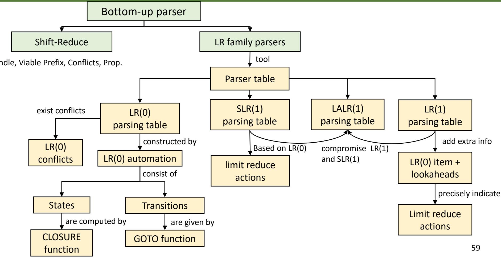

## Bottom-up (Revisit)

## • Shift-Reduce parser:

• From the input to the start symbol, rightmost derivation in reverse.

◆ Shift[移入], Reduce[规约], Accept[接受], Error[报错]

◆ When to shift/reduce and What production to apply

## Handle tells. But how to find it?

◆ Right-sentential form[最右句型], Phrase[短语],

◆ Simple Phrase[直接短语], Handle[句柄], Viable Prefix[活前缀]

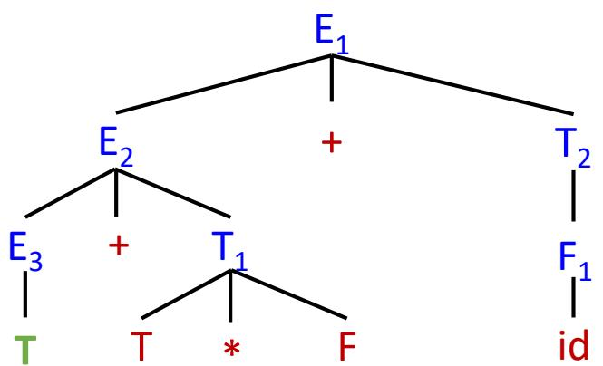

## ◆Conflictions

◆ Shift-reduce, reduce-reduce

◆ LR(0) cannot resolve conflictions unless we write the grammar.

## Bottom-up (Revisit)

## • LR(0) parser:

• The stack holds a sequence of states, $\mathsf { S } _ { 0 } \mathsf { S } _ { 1 } . . . \mathsf { S } _ { \mathsf { m } } \left( \mathsf { S } _ { \mathsf { m } } \right.$ is the top)

• stack + input $( \mathsf { X } _ { 1 } \mathsf { X } _ { 2 } . . . \mathsf { X } _ { \mathsf { m } } \mathsf { a } _ { \mathsf { i } } . . . \mathsf { a } _ { \mathsf { n } } )$ is a right sentential form

• Driven by an Action&Goto parser table

## • Uses $[ S _ { \mathrm { j } } , \mathsf { a } _ { \mathrm { j } } ]$ to index into parsing table to determine action:

• ACTION[Sm, ai]:

. Shift $( \mathsf { s } _ { \mathrm { x } } )$ : Shift the next input symbol with state x

• Reduce $( r _ { y } )$ : reduce the top |β| symbols by the $y ^ { \mathrm { t h } }$ production

• GOTO $[ \mathsf { S } _ { \mathsf { i } } , \mathsf { A } ] \mathrm { i }$

$$
\mathsf { A } \to \mathsf { \beta }
$$

• Indexed after each reduction

• shows the new state to push based on $\mathsf { S } _ { \mathrm { i } }$ (state on the top after the reduction) and A (new non-terminal being pushed)

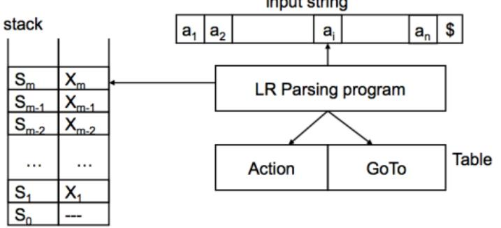

<table><tr><td rowspan=2 colspan=1>State</td><td rowspan=1 colspan=5>Action</td><td rowspan=1 colspan=2>Goto</td></tr><tr><td rowspan=1 colspan=1>*</td><td rowspan=1 colspan=1>+</td><td rowspan=1 colspan=1>0</td><td rowspan=1 colspan=1>1</td><td rowspan=1 colspan=1>$</td><td rowspan=1 colspan=1>E</td><td rowspan=1 colspan=1>B</td></tr><tr><td rowspan=1 colspan=1>0</td><td rowspan=1 colspan=1></td><td rowspan=1 colspan=1></td><td rowspan=1 colspan=1>s1</td><td rowspan=1 colspan=1>s2</td><td rowspan=1 colspan=1></td><td rowspan=1 colspan=1>3</td><td rowspan=1 colspan=1>4</td></tr><tr><td rowspan=1 colspan=1>1</td><td rowspan=1 colspan=1>r4</td><td rowspan=1 colspan=1>r4</td><td rowspan=1 colspan=1>r4</td><td rowspan=1 colspan=1>r4</td><td rowspan=1 colspan=1>r4</td><td rowspan=1 colspan=1></td><td rowspan=1 colspan=1></td></tr><tr><td rowspan=1 colspan=1>2</td><td rowspan=1 colspan=1>r5</td><td rowspan=1 colspan=1>r5</td><td rowspan=1 colspan=1>r5</td><td rowspan=1 colspan=1>r5</td><td rowspan=1 colspan=1>r5</td><td rowspan=1 colspan=1></td><td rowspan=1 colspan=1></td></tr><tr><td rowspan=1 colspan=1>3</td><td rowspan=1 colspan=1>s5</td><td rowspan=1 colspan=1>s6</td><td rowspan=1 colspan=1></td><td rowspan=1 colspan=1></td><td rowspan=1 colspan=1>acc</td><td rowspan=1 colspan=1></td><td rowspan=1 colspan=1></td></tr><tr><td rowspan=1 colspan=1>4</td><td rowspan=1 colspan=1>r3</td><td rowspan=1 colspan=1>r3</td><td rowspan=1 colspan=1>r3</td><td rowspan=1 colspan=1>r3</td><td rowspan=1 colspan=1>r3</td><td rowspan=1 colspan=1></td><td rowspan=1 colspan=1></td></tr><tr><td rowspan=1 colspan=1>5</td><td rowspan=1 colspan=1></td><td rowspan=1 colspan=1></td><td rowspan=1 colspan=1>s1</td><td rowspan=1 colspan=1>s2</td><td rowspan=1 colspan=1></td><td rowspan=1 colspan=1></td><td rowspan=1 colspan=1>7</td></tr><tr><td rowspan=1 colspan=1>6</td><td rowspan=1 colspan=1></td><td rowspan=1 colspan=1></td><td rowspan=1 colspan=1>s1</td><td rowspan=1 colspan=1>s2</td><td rowspan=1 colspan=1></td><td rowspan=1 colspan=1></td><td rowspan=1 colspan=1>8</td></tr><tr><td rowspan=1 colspan=1>7</td><td rowspan=1 colspan=1>r1</td><td rowspan=1 colspan=1>r1</td><td rowspan=1 colspan=1>r1</td><td rowspan=1 colspan=1>r1</td><td rowspan=1 colspan=1>r1</td><td rowspan=1 colspan=1></td><td rowspan=1 colspan=1></td></tr><tr><td rowspan=1 colspan=1>8</td><td rowspan=1 colspan=1>r2</td><td rowspan=1 colspan=1>r2</td><td rowspan=1 colspan=1>r2</td><td rowspan=1 colspan=1>r2</td><td rowspan=1 colspan=1>r2</td><td rowspan=1 colspan=1></td><td rowspan=1 colspan=1></td></tr></table>

## Construct Parse Table

• Construct parsing table:

• identify the possible states and arrange the transitions among them.

• Different Parsing tables

• LR(0) – Too weak (no lookahead)

• Simplest LR parsing, only considers stack to decide shift/reduce

• SLR(1) – Simple LR, 1 token lookahead

• lookahead from first/follow rules derived from LR(0)

• Keeps table as small as LR(0)

• LALR(1) – Most common, 1 token lookahead

<table><tr><td rowspan=1 colspan=1>Stat</td><td rowspan=1 colspan=5>Action</td><td rowspan=1 colspan=2>Goto</td></tr><tr><td rowspan=1 colspan=1>e</td><td rowspan=1 colspan=1>*</td><td rowspan=1 colspan=1>+</td><td rowspan=1 colspan=1>0</td><td rowspan=1 colspan=1>1</td><td rowspan=1 colspan=1>$</td><td rowspan=1 colspan=1>E</td><td rowspan=1 colspan=1>B</td></tr><tr><td rowspan=1 colspan=1>0</td><td rowspan=1 colspan=1></td><td rowspan=1 colspan=1></td><td rowspan=1 colspan=1>s1</td><td rowspan=1 colspan=1>s2</td><td rowspan=1 colspan=1></td><td rowspan=1 colspan=1>3</td><td rowspan=1 colspan=1>4</td></tr><tr><td rowspan=1 colspan=1>1</td><td rowspan=1 colspan=1>r4</td><td rowspan=1 colspan=1>r4</td><td rowspan=1 colspan=1>r4</td><td rowspan=1 colspan=1>r4</td><td rowspan=1 colspan=1>r4</td><td rowspan=1 colspan=1></td><td rowspan=1 colspan=1></td></tr><tr><td rowspan=1 colspan=1>2</td><td rowspan=1 colspan=1>r5</td><td rowspan=1 colspan=1>r5</td><td rowspan=1 colspan=1>r5</td><td rowspan=1 colspan=1>r5</td><td rowspan=1 colspan=1>r5</td><td rowspan=1 colspan=1></td><td rowspan=1 colspan=1></td></tr><tr><td rowspan=1 colspan=1>3</td><td rowspan=1 colspan=1>S5</td><td rowspan=1 colspan=1>s6</td><td rowspan=1 colspan=1></td><td rowspan=1 colspan=1></td><td rowspan=1 colspan=1>acC</td><td rowspan=1 colspan=1></td><td rowspan=1 colspan=1></td></tr><tr><td rowspan=1 colspan=1>4</td><td rowspan=1 colspan=1>r3</td><td rowspan=1 colspan=1>r3</td><td rowspan=1 colspan=1>r3</td><td rowspan=1 colspan=1>r3</td><td rowspan=1 colspan=1>r3</td><td rowspan=1 colspan=1></td><td rowspan=1 colspan=1></td></tr><tr><td rowspan=1 colspan=1>5</td><td rowspan=1 colspan=1></td><td rowspan=1 colspan=1></td><td rowspan=1 colspan=1>s1</td><td rowspan=1 colspan=1>s2</td><td rowspan=1 colspan=1></td><td rowspan=1 colspan=1></td><td rowspan=1 colspan=1>7</td></tr><tr><td rowspan=1 colspan=1>6</td><td rowspan=1 colspan=1></td><td rowspan=1 colspan=1></td><td rowspan=1 colspan=1>s1</td><td rowspan=1 colspan=1>s2</td><td rowspan=1 colspan=1></td><td rowspan=1 colspan=1></td><td rowspan=1 colspan=1>8</td></tr><tr><td rowspan=1 colspan=1>7</td><td rowspan=1 colspan=1>r1</td><td rowspan=1 colspan=1>r1</td><td rowspan=1 colspan=1>r1</td><td rowspan=1 colspan=1>r1</td><td rowspan=1 colspan=1>r1</td><td rowspan=1 colspan=1></td><td rowspan=1 colspan=1></td></tr><tr><td rowspan=1 colspan=1>8</td><td rowspan=1 colspan=1>r2</td><td rowspan=1 colspan=1>r2</td><td rowspan=1 colspan=1>r2</td><td rowspan=1 colspan=1>r2</td><td rowspan=1 colspan=1>r2</td><td rowspan=1 colspan=1></td><td rowspan=1 colspan=1></td></tr></table>

• fancier lookahead analysis using the same LR(0) automaton as SLR(1)

• LR(1) – 1 token lookahead, complex algorithms and big tables

• LR(k) – k tokens lookahead, even bigger tables

## State in LR Parsing[状态]

• How does a shift-reduce parser know when to shift and when to reduce? [Parser怎么知道何时移进, 何时规约]

◆Using the figure below as an example, with stack content \$T and next input symbol \*, how does the parser know that T is not a handle, and we need to shift instead of reducing T to E? [对于LR(0) parser, 其实就是要让编译器能找到handle]

• An LR parser makes shift-reduce decisions by maintaining states to keep track of where we are in a parse [状态追踪]

◆States represent sets of “items”

Grammar

$$
\cdot \sf { E } \to \sf T
$$

$$
\cdot \intercal  \intercal \mid \intercal \ast \intercal
$$

$$
\cdot \mathrm { ~ \textsf ~ { ~ F ~ } ~ } \mathrm { > i d }
$$

<table><tr><td>STACK</td><td>INPUT</td><td>ACTION</td></tr><tr><td>$</td><td>id1 * id2 $</td><td> shift</td></tr><tr><td> $\$ 123,456$ </td><td>* id2 $</td><td>reduce by F → id</td></tr><tr><td> $\$ 5$ </td><td> ${ \bf * i d _ { 2 } \ S }$ </td><td>reduce by T → F</td></tr><tr><td>$T</td><td> ${ \bf * i d _ { 2 } \ S }$ </td><td> shift</td></tr><tr><td>$T*</td><td> $\mathbf { i d } _ { 2 } \ S$ </td><td> shift</td></tr><tr><td> $\$ T *$ </td><td>$</td><td>reduce by F → id</td></tr><tr><td>$T*F</td><td>$</td><td>reduce by T → T * F</td></tr><tr><td>$T</td><td>$</td><td>reduce by E →T</td></tr><tr><td>$E</td><td>$</td><td>accept</td></tr></table>

## Item[项目]

• The parsing table is based on the notion of LR(0) items (simply called items here) which are grammar rules with a special dot added somewhere in the right-hand side.

• For example, the rule A → XYZ has the following four items:

$$
\bullet \mathbf { A }  \bullet \mathbf { X } \mathbf { Y } \mathbf { Z }
$$

$$
\bullet \mathsf { A }  \mathsf { X } \bullet \mathsf { Y } \mathsf { Z }
$$

$$
\bullet \mathtt { A } \to \mathsf { X Y } \bullet \mathsf { Z }
$$

$$
\bullet \mathsf { A } \Rightarrow \mathsf { X } \mathsf { Y } \mathsf { Z } \ ^ { \circ }
$$

• Rules of the form A → ε have only a single item A → •

## The meaning of Items

$$
\bullet \mathsf { A }  \bullet \mathsf { X } \mathsf { Y } \mathsf { Z }
$$

◆Indicates that we hope to see a string derivable from XYZ next on the input

$$
\bullet \mathsf { A }  \mathsf { X } \circ \mathsf { Y } Z
$$

◆Indicates that we have just seen on the input a string derivable from X and that we hope next to see a string derivable from YZ

$$
\bullet \mathtt { A } \Rightarrow \mathsf { X Y } \circ \mathsf { Z }
$$

$$
\bullet \mathsf { A }  \mathsf { X Y Z } \bullet
$$

◆Indicates that we have seen the body XYZ and that it may be time to reduce XYZ to A

## State[状态]

## • Example:

◆Suppose we are currently in this position: $A  X  Y Z$

◆We have just recognized X and expect the upcoming input to contain a sequence derivable from YZ (say, $\mathsf { Y } \to \mathsf { u } | \mathsf { w } )$

◆ Y is further derivable from either u or w:

$$
\boxed { \begin{array} { r l } { \boxed { \mathbf { \sigma } } } & { \mathbf { A } \Rightarrow \mathbf { \alpha } \times \mathbf { \sigma } \bullet \mathbf { \sigma } \forall \mathbf { \sigma } } \end{array} }
$$

$$
\Xi \ \textsf { Y } \to \bullet \ \mathsf { u }
$$

$$
\textbf { \^ { u } } \mathbf { \nabla } \mathbf { \nabla } \mathbf { \nabla } \mathbf { \nabla } \mathbf { \nabla } \mathbf { \nabla } \mathbf { \nabla } \mathbf { \nabla } \mathbf { \nabla } \mathbf { \nabla } \mathbf { \nabla } \mathbf { \nabla } \mathbf { \nabla } \mathbf { \nabla } \mathbf { \nabla } \mathbf { \nabla } \mathbf { \nabla } \mathbf { \nabla } \textbf { \^ { u } } \mathbf { \nabla } \mathbf { \nabla } \mathbf { \nabla } \mathbf { \nabla } \mathbf { \nabla }
$$

◆The above items can be placed into a set, called as configuration set [配置集] of the LR parser

## • Parsing tables have one state corresponding to each set

◆The states can be modeled as a finite automaton, where we move from one state to another via transitions marked with a symbol of the CFG

## Augmented Grammar[增广文法]

• We want to start with an item with a dot before the start symbol S (•S) and move to an item with a dot after S (S•)

◆Represents shifting and reducing an entire sentence of the grammar[完成了 整个句子的移进规约]

◆Thus, we need S to appear on the right side of a production

• Modify the grammar by adding the production ◆S’-> •S becomes the first item in the start state of the FA

Grammar

Augmented Grammar

$$
\begin{array} { r } { ( 0 ) \ \mathsf { E }  \mathsf { E } ^ { \ast } \textsf { B } ( 1 ) \ \mathsf { E }  \mathsf { E } + \mathsf { B } } \end{array}
$$

$$
( 2 ) \ \mathsf { E } \to \mathsf { B } \quad ( 3 ) \ \mathsf { B } \to 0 \quad ( 4 ) \ \mathsf { B } \to 1
$$

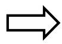

$$
( 0 ) \ 5  \ \mathsf { E } \quad ( 1 ) \ \mathsf { E }  \mathsf { E } \ ^ { * } \textsf { B } \quad ( 2 ) \ \mathsf { E }  \mathsf { E } + \mathsf { B }
$$

$$
( 3 ) \ \mathsf { E } \to \mathsf { B } \quad ( 4 ) \ \mathsf { B } \to 0 \quad ( 5 ) \ \mathsf { B } \to 1
$$

## Construct the LR(0) Automaton

• Each FA state corresponding to a set of items

• How to construct a state? -- closure operation

◆Closure: the action of adding equivalent items to a set

◆Example: $\mathsf { S } ^ { \prime } \to \mathsf { \cdot S } \mathsf { S } \to \mathsf { \cdot B B } \mathsf { B } \to \mathsf { \cdot a B } \mathsf { B } \to \mathsf { \cdot b }$

• How to construct transition form one state to another? -- goto operation

◆ A transition on symbol X from state i to state j


$$
( 0 ) S ^ { \prime }  { \mathsf { S } }
$$

$$
( 1 ) \mathsf { S } \to \mathsf { B B }
$$

$$
( 2 ) \ B \to \mathsf { a B }
$$

$$
( 3 ) \ B  { \ b }
$$

## Example

Grammar

$$
( 0 ) S ^ { \prime }  S
$$

$$
( 1 ) \mathsf { S } \to \mathsf { B B }
$$

$$
( 2 ) \ B \to \mathsf { a B }
$$

(3) B -> b

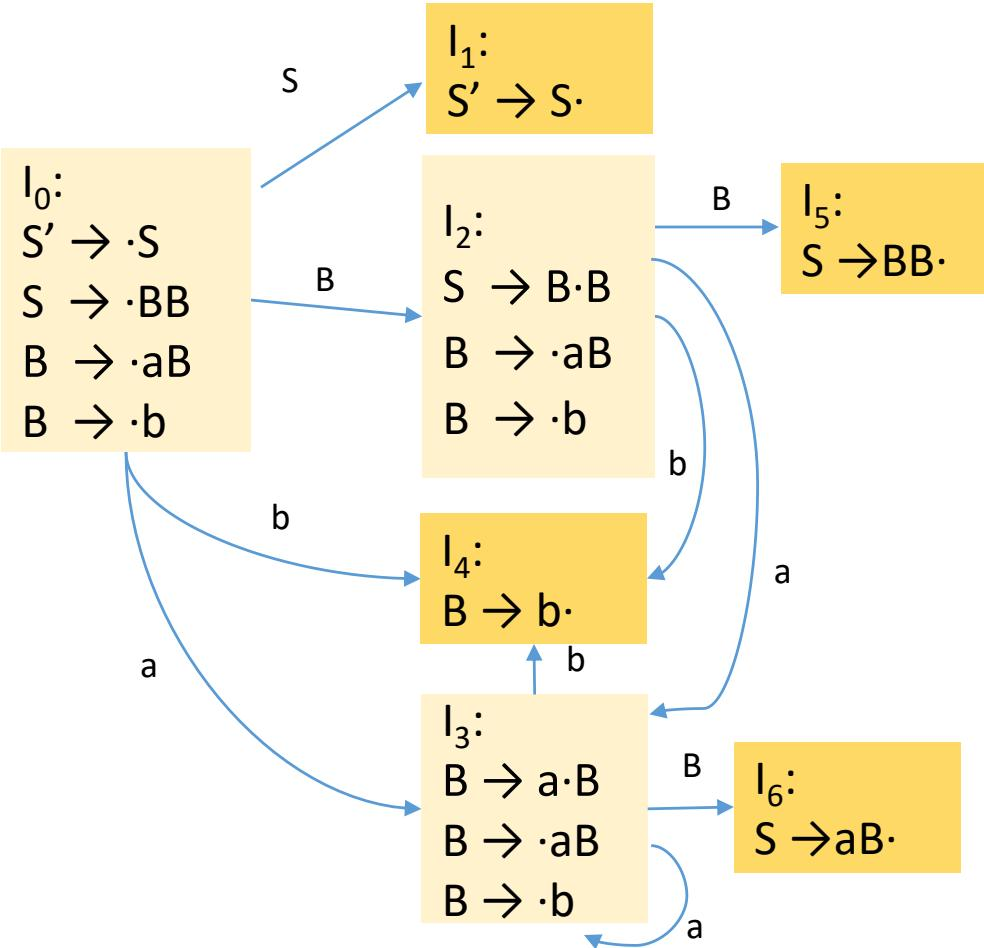

## Example (cont.)

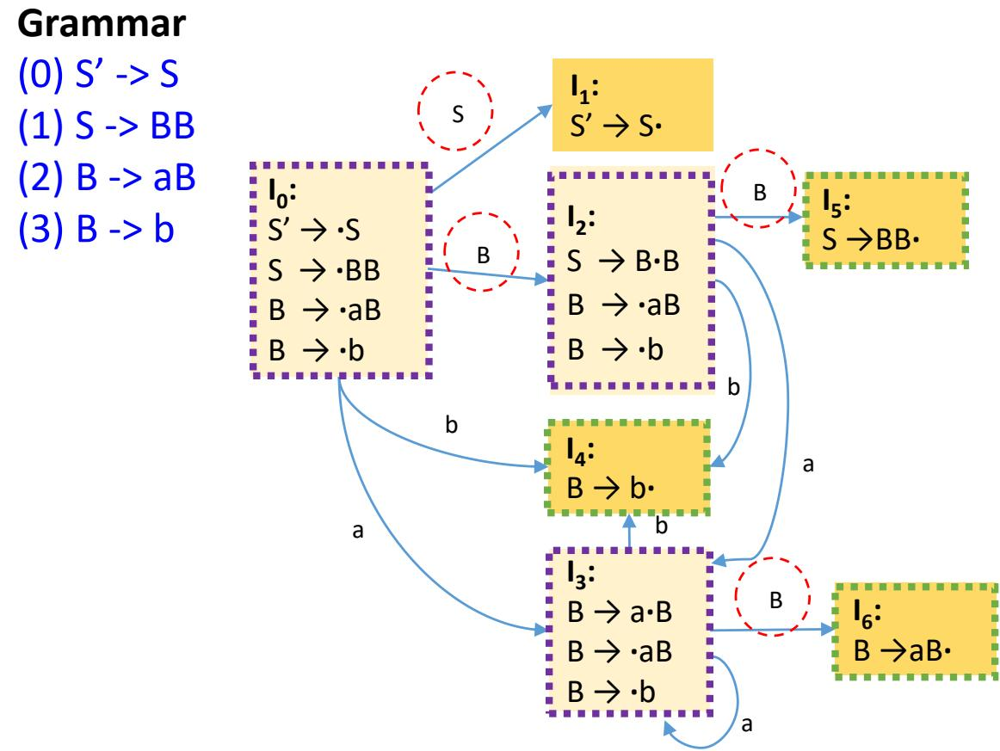

<table><tr><td rowspan=2 colspan=1>State</td><td rowspan=1 colspan=3>ACTION</td><td rowspan=1 colspan=4>GOTO</td></tr><tr><td rowspan=1 colspan=1>a</td><td rowspan=1 colspan=1>b</td><td rowspan=1 colspan=1>S</td><td rowspan=1 colspan=2>■ S</td><td rowspan=1 colspan=1>■B ■■</td><td rowspan=1 colspan=1></td></tr><tr><td rowspan=1 colspan=1>0</td><td rowspan=1 colspan=1>: s3.11</td><td rowspan=1 colspan=1>s4 :111</td><td rowspan=1 colspan=1></td><td rowspan=1 colspan=2>1■</td><td rowspan=1 colspan=1>■2 ■■■</td><td rowspan=1 colspan=1></td></tr><tr><td rowspan=1 colspan=1>1</td><td rowspan=1 colspan=1></td><td rowspan=1 colspan=1></td><td rowspan=1 colspan=1>acc</td><td rowspan=1 colspan=1></td><td rowspan=1 colspan=1></td><td rowspan=1 colspan=1>■■■■</td><td rowspan=1 colspan=1></td></tr><tr><td rowspan=1 colspan=1>2</td><td rowspan=1 colspan=1>: s31</td><td rowspan=1 colspan=1>s4</td><td rowspan=1 colspan=1></td><td rowspan=1 colspan=1></td><td rowspan=1 colspan=1></td><td rowspan=1 colspan=1>■5</td><td rowspan=1 colspan=1></td></tr><tr><td rowspan=1 colspan=1>3</td><td rowspan=1 colspan=1>■s3</td><td rowspan=1 colspan=1>S4:</td><td rowspan=1 colspan=1></td><td rowspan=1 colspan=1></td><td rowspan=1 colspan=1></td><td rowspan=1 colspan=1>6  ■■</td><td rowspan=1 colspan=1></td></tr><tr><td rowspan=1 colspan=1>4</td><td rowspan=1 colspan=1>r3</td><td rowspan=1 colspan=1>r3</td><td rowspan=1 colspan=1>r3：</td><td rowspan=1 colspan=2></td><td rowspan=1 colspan=2></td></tr><tr><td rowspan=1 colspan=1>5</td><td rowspan=1 colspan=1>r1</td><td rowspan=1 colspan=1>r1</td><td rowspan=1 colspan=1>r1</td><td rowspan=1 colspan=2></td><td rowspan=1 colspan=2></td></tr><tr><td rowspan=1 colspan=1>6</td><td rowspan=1 colspan=1>r2</td><td rowspan=1 colspan=1>r2</td><td rowspan=1 colspan=1>r2</td><td rowspan=1 colspan=2></td><td rowspan=1 colspan=2></td></tr></table>

“state j” refers to the state of the set of items Ij

## CLOSURE()[闭包]

• Closure of item sets: if I is a set of items for a grammar G, then CLOSURE(I) is the set of items constructed from I by the two rules:

1. Initially, add every item in I to CLOSURE(I)

2. For any item A → ⍺·Bβ in CLOSURE(I), if B → γ is a production, and B → ·γ is not already there , then add item B → ·γ to CLOSURE(I)

◆ Apply the above rules until no more new items can be added to CLOSURE(I)

  
Note: the location of the point ·

## GOTO()[跳转]

GOTO(I, X): returns state (set of items) that can be reached by advancing I by X

、 I is a set of items and X is a grammar symbol

◆ Return the closure of the set of all items $[ \mathsf { A } \to \alpha \mathsf { X } \cdot \beta ]$ when $[ \mathsf { A } \to \alpha \cdot \mathsf { X } \beta ]$ is in I

◆ Used to define the transitions in the LR(0) automaton

 The states of the automaton correspond to sets of items, and GOTO(I, X) specifies the transition from the state for I under input X

$$
\begin{array} { l } { \mathsf { G r a m m a r } \mathrm { : } } \\ { \mathsf { S ^ { \prime } } \to \mathsf { S } } \\ { \mathsf { S } \to \mathsf { B B } } \\ { \mathsf { B } \to \mathsf { a B } } \\ { \mathsf { B } \to \mathsf { b } } \end{array}
$$

$$
\begin{array} { r l } & { \mathsf { I } _ { 0 } \cdot } \\ & { \mathsf { S } ^ { \prime }  \cdot \mathsf { S } } \\ & { \mathsf { S }  \cdot \mathsf { B B } } \\ & { \mathsf { B }  \cdot \mathsf { a B } } \\ & { \mathsf { B }  \cdot \mathsf { b } } \end{array}
$$

$$
\begin{array} { l } { \displaystyle \vert _ { 2 } \colon } \\ { \displaystyle \mathsf { S } \to \mathsf { B } \cdot \mathsf { B } } \\ { \displaystyle \mathsf { B } \to \mathsf { \cdot a B } } \\ { \displaystyle \mathsf { B } \to \mathsf { . b } } \end{array}
$$

CLOSURE(S → B·B)

$$
G O T O ( I _ { O } , B )
$$

## Construct LR(0) States[构造LR(0)状态集]

• Create augmented grammar G’ for G: [增广文法]

◆ Given $G \colon S  \alpha \mid \beta$ , create G’: $S ^ { \prime } \to S , S \to \alpha \mid \beta$

◆ Creates a single rule S’ → S that when reduced, signals acceptance

• Create 1st state by performing a closure on initial item $s ^ { \prime } \to \cdot s$ [初始状态]

Closure({S’→ ·S}) = {S’→ ·S, S → ·α, S → ·β}

• Create additional states by performing a GOTO on each symbol [添加状态]

◆ Goto({S’→ ·S, S → ·α, S → ·β}, α) =Closure({S → α·}) = {S → α·}

• Repeatedly perform gotos until there are no more states to add [重复操作]

$$
\begin{array} { r } { \left[ \begin{array} { l } { \mathsf { G r a m m a r } } \\ { 5 \to \alpha } \\ { 5 \to \beta } \\ { 5 \to \beta } \end{array} \right] \quad \Longrightarrow { \left[ \begin{array} { l } { \mathsf { G r a m m a r } } \\ { 5 \to \alpha } \\ { 5 \to \alpha } \\ { 5 \to \beta } \\ { 5 \to \beta } \end{array} \right] } \Longrightarrow { \left[ \begin{array} { l } { \mathsf { C l o S U R E } ( 5 ^ { \prime } \to \gamma \cdot \ S ) } \\ { \xi ^ { \prime } \to \ S } \\ { 5 \to \alpha } \\ { 5 \to \beta } \\ { 5 \to \beta } \end{array} \right] } \quad \stackrel { \mathbb { G r a m m a r } } { = } \left[ \begin{array} { l } { \mathsf { C l o S U R E } ( 5 \to \alpha \cdot ) } \\ { 5 \to \alpha \cdot } \\ { 5 \to \alpha \cdot } \\ { 8 \to \alpha } \\ { 5 \to \alpha \cdot } \end{array} \right] } \end{array}
$$

## Construct DFA[构造DFA]

• Compute canonical LR(0) collection[规范LR(0)项集族, C], i.e., set of all states in DFA[DFA中的所有状态的集合]

◆ A collection of sets of LR(0) items that provides the basis for constructing a DFA that is used to make parsing decisions

◆ Each state of the automaton represents a set of items in the C, such an automaton is called an LR(0) automaton

• All new states are added through GOTO(I, X) [DFA中的所有边的集合]

◆ State transitions are done on symbol X

void itemSet (G’) {   
C = { CLOSURE({[S’ → ·S]}) };   
while (no new states are added to C)   
for (each state I in C)   
for (each grammar symbol X)   
if (GOTO(I, X) is not empty && is not in C)   
add GOTO (I, X) to C;

## LR(0) Automaton[自动机]

## • The LR(0) automaton: a shift action means the transition of the current state to a new state

◆ State: a set of items in C

 Start state S0: CLOSURE({[S’ → ·S]})

 State Sj refers to the state corresponding to the set of items Ij

◆ States are computed by the CLOSURE function

◆ Transitions are given by the GOTO function

• How does the automaton help with shift-reduce decisions?

◆ Suppose we are in a state j, and next input is a

Then, we choose shift when state j has a transition on a

◆ Otherwise, we choose to reduce

The items in state j tell us which production to use

 If there are not such item , the input a is illegal

## The example

[建立第一个项]

[通过跳转建立后续项]

$$
\begin{array} { l } { \mathsf { G r a m m a r } \mathrm { : } } \\ { \mathsf { S ^ { \prime } } \to \mathsf { S } } \\ { \mathsf { S } \to \mathsf { B B } } \\ { \mathsf { B } \to \mathsf { a B } } \\ { \mathsf { B } \to \mathsf { b } } \end{array}
$$

## Build Parse Table from DFA

## • ACTION $[ \mathsf { S } _ { \mathrm { i } } , \mathsf { a } ]$

◆ If $[ A \to \alpha \cdot a \beta ]$ is in Si and goto $( \mathsf { S } _ { \mathrm { i } } , \mathsf { a } ) = \mathsf { S } _ { \mathrm { j } } ,$ where $" \textmd { q } ^ { \prime \prime }$ is a terminal, then ACTION[Si, a] = Sj (shift j)

◆ If $[ A \to \alpha \cdot ]$ is in Si and $\mathsf { A } \to \mathsf { a } \mathrm { ~ i \mathsf { s } ~ j ^ { \mathrm { t h } } ~ }$ rule, then ACTION[Si, a] = rj (reduce j)

◆ If [S’ →S·] is in $\mathsf { S } _ { \mathsf { i } } ,$ then ACTION[Si , \$] = accept(acc)

◆ If no conflicts among ‘shift’ and ‘reduce’ (the first two ‘if’s above), then this parser is able to parse the given grammar

## • GOTO $[ \mathsf { S } _ { \mathrm { i } } , \mathsf { A } ]$

if goto $( S _ { i } , \mathsf { A } ) = S _ { i }$ then $\mathsf { G O T O } [ \mathsf { S } _ { \mathrm { i } } , \mathsf { A } ] = \mathrm { j }$

## The example

Grammar：

(0) S’ → S

(1) S → BB

(2) B → aB

(3) B → b

<table><tr><td rowspan=2 colspan=1>State</td><td rowspan=1 colspan=3>ACTION</td><td rowspan=1 colspan=2>GOTO</td></tr><tr><td rowspan=1 colspan=1>a</td><td rowspan=1 colspan=1>b</td><td rowspan=1 colspan=1>$</td><td rowspan=1 colspan=1>S</td><td rowspan=1 colspan=1>B</td></tr><tr><td rowspan=1 colspan=1>0</td><td rowspan=1 colspan=1>s3</td><td rowspan=1 colspan=1>s4</td><td rowspan=1 colspan=1></td><td rowspan=1 colspan=1>1</td><td rowspan=1 colspan=1>2</td></tr><tr><td rowspan=1 colspan=1>1</td><td rowspan=1 colspan=1></td><td rowspan=1 colspan=1></td><td rowspan=1 colspan=1>acc</td><td rowspan=1 colspan=1></td><td rowspan=1 colspan=1></td></tr><tr><td rowspan=1 colspan=1>2</td><td rowspan=1 colspan=1>s3</td><td rowspan=1 colspan=1>s4</td><td rowspan=1 colspan=1></td><td rowspan=1 colspan=1></td><td rowspan=1 colspan=1>5</td></tr><tr><td rowspan=1 colspan=1>3</td><td rowspan=1 colspan=1>s3</td><td rowspan=1 colspan=1>s4</td><td rowspan=1 colspan=1></td><td rowspan=1 colspan=1></td><td rowspan=1 colspan=1>6</td></tr><tr><td rowspan=1 colspan=1>4</td><td rowspan=1 colspan=1>r3</td><td rowspan=1 colspan=1>r3</td><td rowspan=1 colspan=1>r3</td><td rowspan=1 colspan=1></td><td rowspan=1 colspan=1></td></tr><tr><td rowspan=1 colspan=1>5</td><td rowspan=1 colspan=1>r1</td><td rowspan=1 colspan=1>r1</td><td rowspan=1 colspan=1>r1</td><td rowspan=1 colspan=1></td><td rowspan=1 colspan=1></td></tr><tr><td rowspan=1 colspan=1>6</td><td rowspan=1 colspan=1>r2</td><td rowspan=1 colspan=1>r2</td><td rowspan=1 colspan=1>r2</td><td rowspan=1 colspan=1></td><td rowspan=1 colspan=1></td></tr></table>


## LR(0) Parsing

## • Construct LR(0) automaton from the Grammar

## • Assumptions:

◆ Input buffer contains ⍺

Next input is t

◆ After input ⍺, the DFA is in state S

## • Reduce if

S contains item ${ \mathsf { X } } \to { \mathsf { a } } { \mathsf { . } }$

## • Shift if

◆ S contains item $\times  \alpha \cdot \mathrm { t } \omega$

Equivalent to saying S has a transition labeled t

## LR(0) Parsing(cont.)

• The parser must be able to determine what action to take in each state without looking at any further input symbols

◆ By only considering what the parsing stack contains so far

◆ This is the ‘0’ in the parser name

## • In an LR(0) table, each state must only shift or reduce

◆ Thus, an LR(0) state can only have exactly one reduce item and cannot have both shift and reduce items

◆ If the grammar contains the production A → ε, then the item A → ·ε will create a shift-reduce conflict if there is any other non-null production for A  ε-rules are fairly common in programming language grammars

## LR(0) Conflicts

• LR(0) has a reduce-reduce conflict if：

◆ Any state has two reduce items:

$X  \beta$ · and $\Upsilon  \omega$

• LR(0) has a shift-reduce conflict if:

◆ Any state has a reduce item and a shift item:

$$
{ \tt X }  { \tt \{ \beta \cdot } 
$$

$$
{ \begin{array} { r l r l r l } & { \to \emptyset \cdot \operatorname { a n d } \lor \to \emptyset \cdot \operatorname { t } } & & { \quad \mathbf { I _ { 0 } } \colon } \\ & { } & & { \quad \mathbf { E } ^ { \prime } \succeq \cdot \mathbf { E } } \\ & { [ { \mathrm { ~ c r a m m a r } } \colon \quad \quad } & & { \quad \mathbf { E }  \cdot \mathbf { T } } \\ & { \vdots \succeq \mathbf { E } } & & { \quad \mathbf { E }  \cdot \mathbf { t } \intercal } & & { \quad \mathbf { I _ { 1 } } \colon } \\ & { [ \begin{array} { l l } { \mathbf { E }  \mathbf { E } \mathbf { \cdot } \mathbf { I } \mid \mathbf { \tau } \mid \lor \mathbf { \tau } = \mathbf { E } } \\ { \mathbf { \tau }  \mathbf { \{ \bar { t } } } \mathbf { \cdot } \mathbf { \tau } \mid \mathbf { \tau } \mathbf { { \bar { i } } } \mid \mathbf { \bar { t } } \mathbf { \bar { E } } } \end{array} ] }  & & { \Longrightarrow \quad \mathbf { E }  \mathbf { \bar { \ t } } \mathbf { \bar { z } } } & & { \quad \mathbf { i }  \mathbf { \bar { \ t } } \mathbf { \bar { z } } } \\ & { \quad \mathbf { T }  \mathbf { \bar { \ t } } \mathbf { \bar { z } } } & & { \quad \mathbf { \bar { \ t } }  \mathbf { \bar { \ t } } \mathbf { \bar { z } } } \\ & { \quad \mathbf { V }  \mathbf { \bar { \ t } } \mathbf { \bar { z } } } & & { \quad \mathbf { V }  \mathbf { \bar { \ t } } \mathbf { \bar { z } } } \end{array} 
$$

## LR(0) Limitations[局限性]

• LR(0) conflicts are generally caused by reduce actions

◆Shift-Reduce conflict

$$
\ A \to \alpha { \cdot } \alpha \beta
$$

$$
\mathsf { A } \to \mathsf  \{ 3 \cdot
$$

◆ Reduce-Reduce conflict

$$
\mathsf { B } \to \mathsf { r } \cdot
$$

$$
\mathsf { B } \to \mathsf { r } \cdot
$$

◆If the item is complete $( \mathsf { A } \to \alpha \cdot ) .$ , the parser must choose to reduce[项目形式完整就归约]

 Is this always appropriate?

 The next upcoming token may tell us something different

◆What tokens may tell the reduction is not appropriate?  Perhaps Follow(A) could be useful here

## LR(0) Parsing

## • Construct LR(0) automaton from the Grammar

## • Assumptions:

◆ Input buffer contains ⍺

Next input is t

◆ After input ⍺, the DFA is in state S

## • Reduce if

S contains item ${ \mathsf { X } } \to { \mathsf { a } } .$

## • Shift if

◆ S contains item ${ \sf X }  { \sf \alpha } \cdot { \sf t } { \sf \omega }$

Equivalent to saying S has a transition labeled t

## LR(0) Parsing(cont.)

• The parser must be able to determine what action to take in each state without looking at any further input symbols

◆ By only considering what the parsing stack contains so far

◆ This is the ‘0’ in the parser name

## • In an LR(0) table, each state must only shift or reduce

◆ Thus, an LR(0) state can only have exactly one reduce item and cannot have both shift and reduce items

◆ If the grammar contains the production A → ε, then the item A → ·ε will create a shift-reduce conflict if there is any other non-null production for A  ε-rules are fairly common in programming language grammars

## Revisit

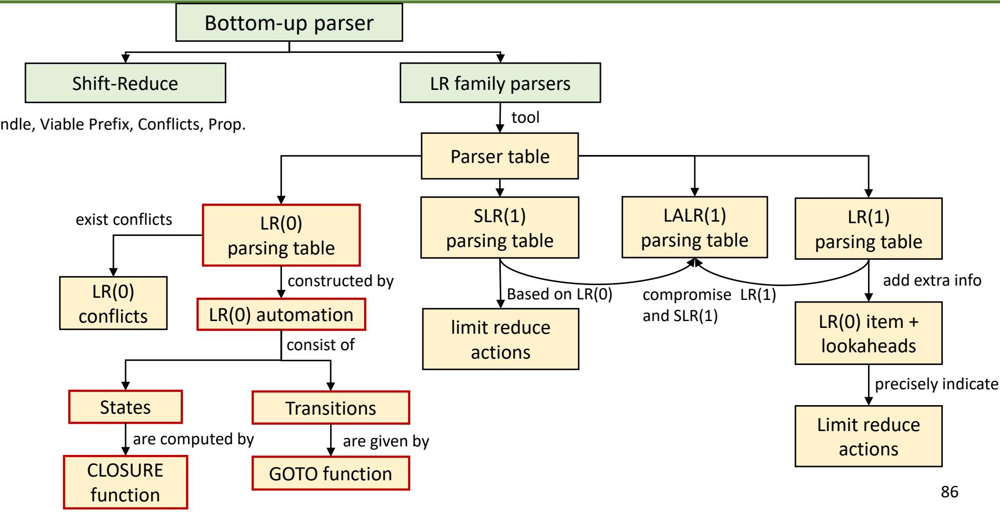

## Bottom-up (Revisit)

## • Construction of LR(0) table

• Tell the parser when to shift/reduce

• Answers which production to apply for a reduction

## • States and Items

• States: a set of items indicating where we are

Items: productions with a dot

◆ A → X • YZ (Looking forward to Y)

◆ A → XYZ • (all symbols ready, can go for the reduction)

<table><tr><td rowspan=2 colspan=1>State</td><td rowspan=1 colspan=5>Action</td><td rowspan=1 colspan=2>Goto</td></tr><tr><td rowspan=1 colspan=1>*</td><td rowspan=1 colspan=1>+</td><td rowspan=1 colspan=1>0</td><td rowspan=1 colspan=1>1</td><td rowspan=1 colspan=1>$</td><td rowspan=1 colspan=1>E</td><td rowspan=1 colspan=1>B</td></tr><tr><td rowspan=1 colspan=1>0</td><td rowspan=1 colspan=1></td><td rowspan=1 colspan=1></td><td rowspan=1 colspan=1>s1</td><td rowspan=1 colspan=1>s2</td><td rowspan=1 colspan=1></td><td rowspan=1 colspan=1>3</td><td rowspan=1 colspan=1>4</td></tr><tr><td rowspan=1 colspan=1>1</td><td rowspan=1 colspan=1>r4</td><td rowspan=1 colspan=1>r4</td><td rowspan=1 colspan=1>r4</td><td rowspan=1 colspan=1>r4</td><td rowspan=1 colspan=1>r4</td><td rowspan=1 colspan=1></td><td rowspan=1 colspan=1></td></tr><tr><td rowspan=1 colspan=1>2</td><td rowspan=1 colspan=1>r5</td><td rowspan=1 colspan=1>r5</td><td rowspan=1 colspan=1>r5</td><td rowspan=1 colspan=1>r5</td><td rowspan=1 colspan=1>r5</td><td rowspan=1 colspan=1></td><td rowspan=1 colspan=1></td></tr><tr><td rowspan=1 colspan=1>3</td><td rowspan=1 colspan=1>s5</td><td rowspan=1 colspan=1>s6</td><td rowspan=1 colspan=1></td><td rowspan=1 colspan=1></td><td rowspan=1 colspan=1>acc</td><td rowspan=1 colspan=1></td><td rowspan=1 colspan=1></td></tr><tr><td rowspan=1 colspan=1>4</td><td rowspan=1 colspan=1>r3</td><td rowspan=1 colspan=1>r3</td><td rowspan=1 colspan=1>r3</td><td rowspan=1 colspan=1>r3</td><td rowspan=1 colspan=1>r3</td><td rowspan=1 colspan=1></td><td rowspan=1 colspan=1></td></tr><tr><td rowspan=1 colspan=1>5</td><td rowspan=1 colspan=1></td><td rowspan=1 colspan=1></td><td rowspan=1 colspan=1>s1</td><td rowspan=1 colspan=1>s2</td><td rowspan=1 colspan=1></td><td rowspan=1 colspan=1></td><td rowspan=1 colspan=1>7</td></tr><tr><td rowspan=1 colspan=1>6</td><td rowspan=1 colspan=1></td><td rowspan=1 colspan=1></td><td rowspan=1 colspan=1>s1</td><td rowspan=1 colspan=1>s2</td><td rowspan=1 colspan=1></td><td rowspan=1 colspan=1></td><td rowspan=1 colspan=1>8</td></tr><tr><td rowspan=1 colspan=1>7</td><td rowspan=1 colspan=1>r1</td><td rowspan=1 colspan=1>r1</td><td rowspan=1 colspan=1>r1</td><td rowspan=1 colspan=1>r1</td><td rowspan=1 colspan=1>r1</td><td rowspan=1 colspan=1></td><td rowspan=1 colspan=1></td></tr><tr><td rowspan=1 colspan=1>8</td><td rowspan=1 colspan=1>r2</td><td rowspan=1 colspan=1>r2</td><td rowspan=1 colspan=1>r2</td><td rowspan=1 colspan=1>r2</td><td rowspan=1 colspan=1>r2</td><td rowspan=1 colspan=1></td><td rowspan=1 colspan=1></td></tr></table>

⚫ Parsing tables have one state corresponding to a set of items (a.k.a the configuration set)

⚫ The states and their transitions can be implemented by finite automata.

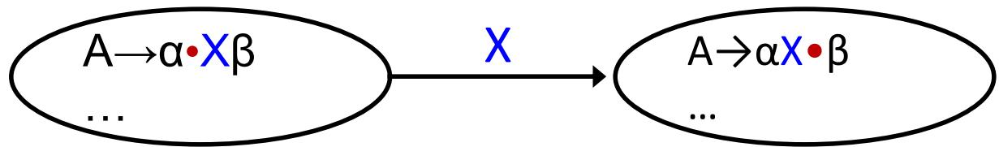

## Example (Revisit)

Grammar

(0) ${ \mathsf S } ^ { \prime } \to { \mathsf S }$

(1) $S  { \mathsf { B B } }$

(2) $\textsf { B } \to \mathsf { a B }$

(3) $\mathsf { B } \to \mathsf { b }$

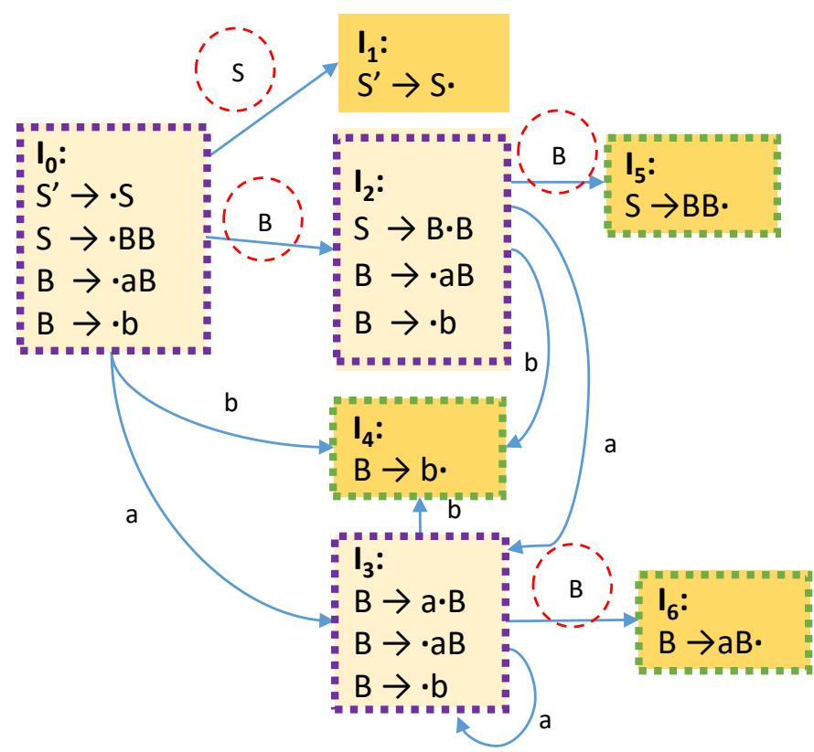

<table><tr><td rowspan=2 colspan=1>State</td><td rowspan=1 colspan=3>ACTION</td><td rowspan=1 colspan=4>GOTO</td></tr><tr><td rowspan=1 colspan=1>a</td><td rowspan=1 colspan=1>b</td><td rowspan=1 colspan=1>S</td><td rowspan=1 colspan=2>■ S</td><td rowspan=1 colspan=1>■B ■■</td><td rowspan=1 colspan=1></td></tr><tr><td rowspan=1 colspan=1>0</td><td rowspan=1 colspan=1>: s3.11</td><td rowspan=1 colspan=1>s4 :111</td><td rowspan=1 colspan=1></td><td rowspan=1 colspan=2>1■</td><td rowspan=1 colspan=1>■2 ■■■</td><td rowspan=1 colspan=1></td></tr><tr><td rowspan=1 colspan=1>1</td><td rowspan=1 colspan=1></td><td rowspan=1 colspan=1></td><td rowspan=1 colspan=1>acc</td><td rowspan=1 colspan=1></td><td rowspan=1 colspan=1></td><td rowspan=1 colspan=1>■■■■</td><td rowspan=1 colspan=1></td></tr><tr><td rowspan=1 colspan=1>2</td><td rowspan=1 colspan=1>: s31</td><td rowspan=1 colspan=1>s4</td><td rowspan=1 colspan=1></td><td rowspan=1 colspan=1></td><td rowspan=1 colspan=1></td><td rowspan=1 colspan=1>■5</td><td rowspan=1 colspan=1></td></tr><tr><td rowspan=1 colspan=1>3</td><td rowspan=1 colspan=1>■s3</td><td rowspan=1 colspan=1>S4:</td><td rowspan=1 colspan=1></td><td rowspan=1 colspan=1></td><td rowspan=1 colspan=1></td><td rowspan=1 colspan=1>6  ■■</td><td rowspan=1 colspan=1></td></tr><tr><td rowspan=1 colspan=1>4</td><td rowspan=1 colspan=1>r3</td><td rowspan=1 colspan=1>r3</td><td rowspan=1 colspan=1>r3：</td><td rowspan=1 colspan=2></td><td rowspan=1 colspan=2></td></tr><tr><td rowspan=1 colspan=1>5</td><td rowspan=1 colspan=1>r1</td><td rowspan=1 colspan=1>r1</td><td rowspan=1 colspan=1>r1</td><td rowspan=1 colspan=2></td><td rowspan=1 colspan=2></td></tr><tr><td rowspan=1 colspan=1>6</td><td rowspan=1 colspan=1>r2</td><td rowspan=1 colspan=1>r2</td><td rowspan=1 colspan=1>r2</td><td rowspan=1 colspan=2></td><td rowspan=1 colspan=2></td></tr></table>

“state j” refers to the state of the set of items Ij

## Bottom-up (Revisit)

⚫ We want to see S • from • S

⚫ The construction of LR(0) automaton

⚫ Augmented grammar G’ for G

⚫ Add $\mathbb { S } ^ { \prime } \to \mathbb { S }$

⚫ Building states and transitions: closure and goto

## ⚫ CLOSURE:

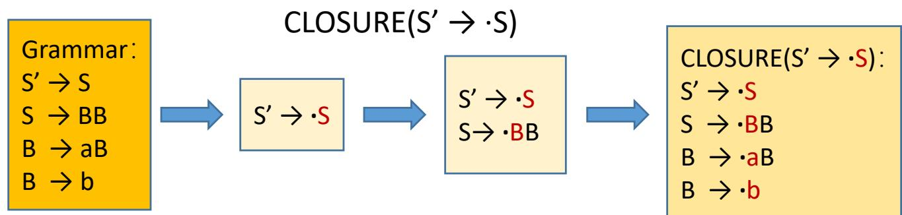  
Note: the location of the point ·

## Bottom-up (Revisit)

⚫ We want to see S • from • S

⚫ The construction of LR(0) automaton

⚫ Augmented grammar G’ for G

⚫ Add $\mathbb { S } ^ { \prime } \to \mathbb { S }$

⚫ Building states and transitions: closure and goto

## ⚫ GOTO:

$$
\begin{array} { l } { \mathsf { G r a m m a r } \cdot } \\ { \mathsf { S ^ { \prime } }  \mathsf { S } } \\ { \mathsf { S }  \mathsf { B B } } \\ { \mathsf { B }  \mathsf { a B } } \\ { \mathsf { B }  \mathsf { b } } \end{array}
$$

$$
G O T O ( I _ { O } , B )
$$

$$
\begin{array} { r l } & { \mathsf { I } _ { 0 } { : } } \\ & { \mathsf { S } ^ { \prime } \to \mathsf { S } } \\ & { \mathsf { S } \to \mathsf { \cdot B B } } \\ & { \mathsf { B } \to \mathsf { \cdot a B } } \\ & { \mathsf { B } \to \mathsf { \cdot b } } \end{array}
$$

$$
\begin{array} { l } { \displaystyle \vert _ { 2 } \colon } \\ { \displaystyle \mathsf { S } \to \mathsf { B } \cdot \mathsf { B } } \\ { \displaystyle \mathsf { B } \to \cdot \mathsf { a B } } \\ { \displaystyle \mathsf { B } \to \mathsf { . b } } \end{array}
$$

CLOSURE(S → B·B)

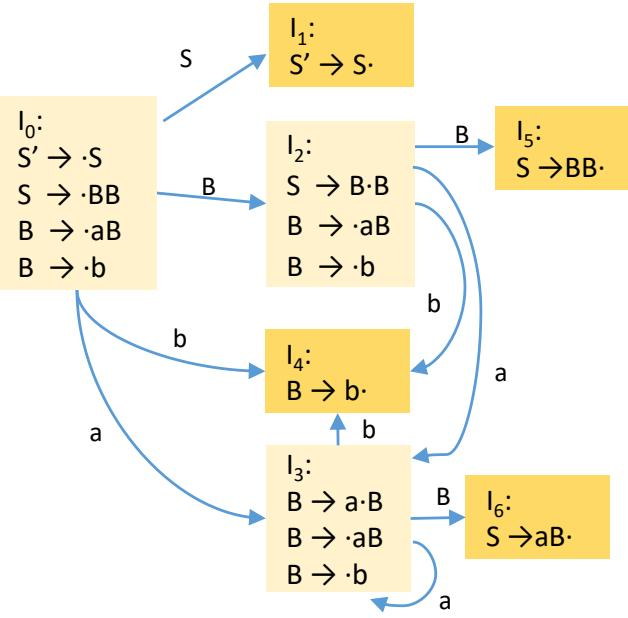

## Construct LR(0) States (Revisit)

• Create augmented grammar $\mathbf { G } ^ { \prime }$ for G: [增广文法]

◆ Given $G \colon S  \alpha \mid \beta$ , create G’: $S ^ { \prime }  S , S  \alpha \mid \beta$

◆ Creates a single rule ${ \mathsf S } ^ { \prime } \to { \mathsf S }$ that when reduced, signals acceptance

• Create ${ \bf 1 ^ { s t } }$ state by performing a closure on initial item $s ^ { \prime } \to \cdot s$ [初始状态]

Closure({S’→ ·S}) = {S’→ ·S, S → ·α, S → ·β}

• Create additional states by performing a GOTO on each symbol [添加状态]

◆ Goto({S’→ ·S, S → ·α, S → ·β}, α) =Closure({S → α·}) = {S → α·}

• Repeatedly perform gotos until there are no more states to add [重复操作]

$$
\begin{array} { r } { \left[ \begin{array} { l } { \mathsf { G r a m m a r } } \\ { 5 \to \alpha } \\ { 5 \to \beta } \\ { 5 \to \beta } \end{array} \right] \quad \Longrightarrow { \left[ \begin{array} { l } { \mathsf { G r a m m a r } ^ { \prime } } \\ { 5 \to \beta } \\ { 5 \to \alpha } \\ { 5 \to \beta } \end{array} \right] } \quad \Longrightarrow { \left[ \begin{array} { l } { \mathsf { C l o S U R E } ( 5 ^ { \prime } \to \ S ) } \\ { 5 ^ { \prime } \to \ S } \\ { 5 \to \alpha } \\ { 5 \to \beta } \end{array} \right] } \quad \stackrel { \cong } { \underbrace { \mathbb { B } } } \quad \underbrace { \left[ \begin{array} { l } { \mathsf { G r a m S U R E } ( 5 \to \alpha \cdot ) } \\ { 5 \to \alpha \cdot } \\ { 5 \to \alpha } \\ { 5 \to \beta } \end{array} \right] } _ { \textstyle \in \ : \emptyset } \quad \stackrel { \cong } { \underbrace { \mathbb { B } } } \quad \left[ \begin{array} { l } { \mathsf { C l o S U R E } ( 5 \to \alpha \cdot ) } \\ { 5 \to \alpha \cdot } \\ { 5 \to \alpha \cdot } \end{array} \right] } \end{array}
$$

## The example (Revisit)

[建立第一个项]

$$
\begin{array} { r l } & { \mathrm { S } _ { \mathrm { 0 } } \mathrm { = } \mathrm { C l o s u r e } ( \{ \mathrm { S } ^ { \prime } \mathrm { \to } \cdot \mathrm { S } \} ) } \\ & { \mathrm { = } \{ \mathrm { S } ^ { \prime } \mathrm { \to } \cdot \mathrm { S } , \mathrm { S } \mathrm { \to } \cdot \mathrm { B B } , \mathrm { B } \mathrm { \to } \cdot \mathrm { a B } , \mathrm { B } \mathrm { \to } \cdot \mathrm { b } \} ( \mathrm { l } _ { \mathrm { 0 } } ) } \end{array}
$$

[通过跳转建立后续项]

$$
\begin{array} { l } { \mathsf { G r a m m a r } \mathrm { : } } \\ { \mathsf { S ^ { \prime } } \to \mathsf { S } } \\ { \mathsf { S } \to \mathsf { B B } } \\ { \mathsf { B } \to \mathsf { a B } } \\ { \mathsf { B } \to \mathsf { b } } \end{array}
$$

## The example (Revisit)

Grammar：

(0) S’ → S

(1) S → BB

(2) B → aB

(3) B → b

<table><tr><td rowspan=2 colspan=1>State</td><td rowspan=1 colspan=3>ACTION</td><td rowspan=1 colspan=2>GOTO</td></tr><tr><td rowspan=1 colspan=1>a</td><td rowspan=1 colspan=1>b</td><td rowspan=1 colspan=1>$</td><td rowspan=1 colspan=1>S</td><td rowspan=1 colspan=1>B</td></tr><tr><td rowspan=1 colspan=1>0</td><td rowspan=1 colspan=1>s3</td><td rowspan=1 colspan=1>s4</td><td rowspan=1 colspan=1></td><td rowspan=1 colspan=1>1</td><td rowspan=1 colspan=1>2</td></tr><tr><td rowspan=1 colspan=1>1</td><td rowspan=1 colspan=1></td><td rowspan=1 colspan=1></td><td rowspan=1 colspan=1>acc</td><td rowspan=1 colspan=1></td><td rowspan=1 colspan=1></td></tr><tr><td rowspan=1 colspan=1>2</td><td rowspan=1 colspan=1>s3</td><td rowspan=1 colspan=1>s4</td><td rowspan=1 colspan=1></td><td rowspan=1 colspan=1></td><td rowspan=1 colspan=1>5</td></tr><tr><td rowspan=1 colspan=1>3</td><td rowspan=1 colspan=1>s3</td><td rowspan=1 colspan=1>s4</td><td rowspan=1 colspan=1></td><td rowspan=1 colspan=1></td><td rowspan=1 colspan=1>6</td></tr><tr><td rowspan=1 colspan=1>4</td><td rowspan=1 colspan=1>r3</td><td rowspan=1 colspan=1>r3</td><td rowspan=1 colspan=1>r3</td><td rowspan=1 colspan=1></td><td rowspan=1 colspan=1></td></tr><tr><td rowspan=1 colspan=1>5</td><td rowspan=1 colspan=1>r1</td><td rowspan=1 colspan=1>r1</td><td rowspan=1 colspan=1>r1</td><td rowspan=1 colspan=1></td><td rowspan=1 colspan=1></td></tr><tr><td rowspan=1 colspan=1>6</td><td rowspan=1 colspan=1>r2</td><td rowspan=1 colspan=1>r2</td><td rowspan=1 colspan=1>r2</td><td rowspan=1 colspan=1></td><td rowspan=1 colspan=1></td></tr></table>

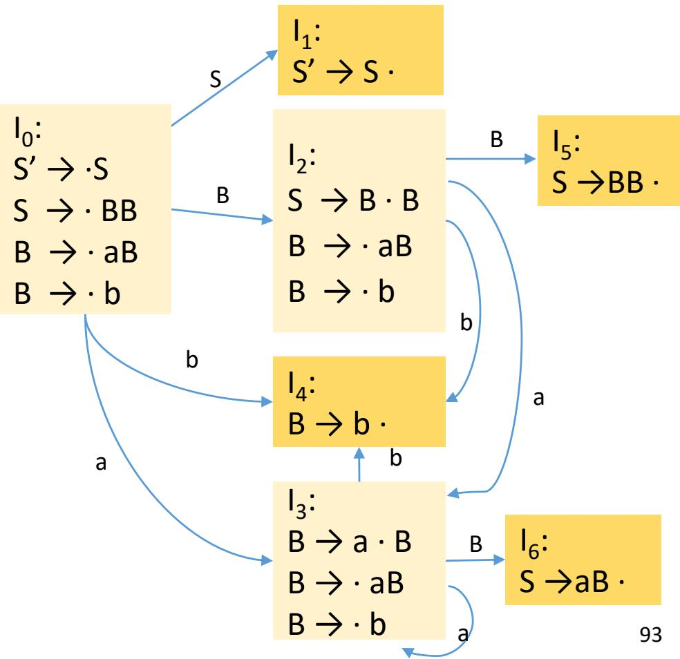

## LR(0) Conflicts

• LR(0) has a reduce-reduce conflict if：

◆ Any state has two reduce items:

$X  \beta$ · and $\Upsilon  \omega$

• LR(0) has a shift-reduce conflict if:

◆ Any state has a reduce item and a shift item:

$$
{ \big \mathsf { X } } \to { \mathsf { \beta } } \cdot
$$

$$
{ \begin{array} { r l r l r l } & { \to \emptyset \cdot \operatorname { a n d } \lor \to \emptyset \cdot \operatorname { t } } & & { \quad \mathbf { I _ { 0 } } \colon } \\ & { { \mathrm { ~ } } } & & { \quad \mathbf { E } ^ { \prime } \cdot \mathbf { \hat { \times } } } \\ & { [ { \mathrm { ~ o r a m m a r } } \colon \quad \quad \quad } & & { \quad \mathbf { t }  \cdot \mathbf { T } } \\ & { \vdots \ddots \in \quad } & & { \quad \mathbf { E }  \cdot \mathbf { t } + \mathbf { \tau } } \\ & { [ \begin{array} { l } { \qquad \mathbf { E }  \mathbf { E } \cdot [ \ \mid \mathbf { \Delta } ] \lor \mathbf { l } \lor = \mathbf { E } } \\ { \neg \ [ \mathbf { \Delta } ] \mid \mathbf { i } \mid [ \mathbf { t } ] } \end{array} ] } } & & { \implies \mathbf { \Huge } \lor \to \mathbf { t } } & & { \quad \mathbf { i }  \mathbf { \Huge } \mid \mathbf { \Delta } } \\ & { \quad \mathbf { \Huge } \to \mathbf { \Huge } \lor \mathbf { \Delta } } & & { \quad \mathbf { \Huge } \to \mathbf { \Huge } \lor \mathbf { \Delta } } \\ & { \qquad \mathbf { \Delta }  \mathbf { \Huge } \lor \mathbf { \Delta } } & & { \quad \mathbf { \Delta } \lor  \mathbf { i } \ \ \cdot \mathbf { \hat { \times } } } \\ & { \qquad \mathbf { \Delta }  \mathbf { \Huge } \lor \mathbf { \Delta } } & & { \quad \mathbf { \Huge } \to \mathbf { \Huge } \land } \end{array} 
$$

## LR(0) Limitations[局限性]

• LR(0) conflicts are generally caused by reduce actions

◆Shift-Reduce conflict

$$
\ A \to \alpha \cdot \alpha \beta
$$

$$
\mathsf { A } \to \mathsf { \beta } ^ { \mathsf { } }
$$

◆ Reduce-Reduce conflict

$$
\mathsf { B } \to \mathsf { r } \cdot
$$

$$
\mathsf { B } \to \mathsf { r } \cdot
$$

◆If the item is complete $( \mathsf { A } \to \alpha \cdot ) ,$ the parser must choose to reduce[项目形式完整就归约]

 Is this always appropriate?

 The next upcoming token may tell us something different

◆What tokens may tell the reduction is not appropriate?

 Perhaps Follow(A) could be useful here

 [如果我们知道Follow(A)没有next input a，我们就不能用A → β规约，不然肯定会报错，因为没有能推导出Aa的产生式]

## LR(0) Summary

## • LR(0) is the simplest LR parsing

◆ Table-driven shift-reduce parser

 Action table[s, a] + Goto table[s, X]

◆ Weakest, not used much in practice

◆ Parses without using any lookahead

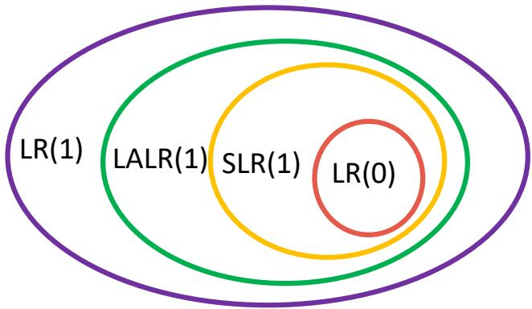

• Adding just one token of lookahead vastly increases the parsing power [考虑展望]

◆ SLR(1): simple LR(1), use FOLLOW [用FOLLOW判断规约]

◆ LR(1): use stack info + dedicated symbols [比FOLLOW更精细]

LALR(1): balance SLR(1) and LR(1)[折衷]

## Contents

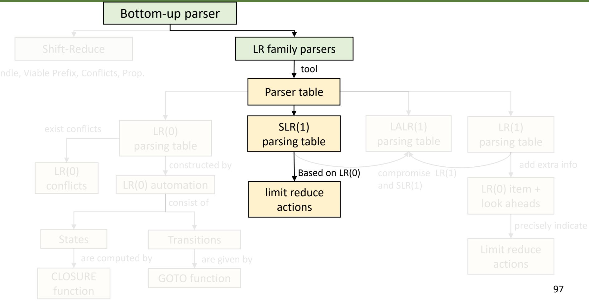

## LR(0) Example (revisit)

Grammar：

(0) S’ → S

(1) S → BB

(2) B → aB

(3) B → b

<table><tr><td rowspan=2 colspan=1>State</td><td rowspan=1 colspan=3>ACTION</td><td rowspan=1 colspan=2>GOTO</td></tr><tr><td rowspan=1 colspan=1>a</td><td rowspan=1 colspan=1>b</td><td rowspan=1 colspan=1>$</td><td rowspan=1 colspan=1>S</td><td rowspan=1 colspan=1>B</td></tr><tr><td rowspan=1 colspan=1>0</td><td rowspan=1 colspan=1>S3</td><td rowspan=1 colspan=1>s4</td><td rowspan=1 colspan=1></td><td rowspan=1 colspan=1>1</td><td rowspan=1 colspan=1>2</td></tr><tr><td rowspan=1 colspan=1>1</td><td rowspan=1 colspan=1></td><td rowspan=1 colspan=1></td><td rowspan=1 colspan=1>acc</td><td rowspan=1 colspan=1></td><td rowspan=1 colspan=1></td></tr><tr><td rowspan=1 colspan=1>2</td><td rowspan=1 colspan=1>s3</td><td rowspan=1 colspan=1>s4</td><td rowspan=1 colspan=1></td><td rowspan=1 colspan=1></td><td rowspan=1 colspan=1>5</td></tr><tr><td rowspan=1 colspan=1>3</td><td rowspan=1 colspan=1>s3</td><td rowspan=1 colspan=1>s4</td><td rowspan=1 colspan=1></td><td rowspan=1 colspan=1></td><td rowspan=1 colspan=1>6</td></tr><tr><td rowspan=1 colspan=1>4</td><td rowspan=1 colspan=1>r3</td><td rowspan=1 colspan=1>r3</td><td rowspan=1 colspan=1>r3</td><td rowspan=1 colspan=1></td><td rowspan=1 colspan=1></td></tr><tr><td rowspan=1 colspan=1>5</td><td rowspan=1 colspan=1>r1</td><td rowspan=1 colspan=1>r1</td><td rowspan=1 colspan=1>r1</td><td rowspan=1 colspan=1></td><td rowspan=1 colspan=1></td></tr><tr><td rowspan=1 colspan=1>6</td><td rowspan=1 colspan=1>r2</td><td rowspan=1 colspan=1>r2</td><td rowspan=1 colspan=1>r2</td><td rowspan=1 colspan=1></td><td rowspan=1 colspan=1></td></tr></table>


## SLR(1) Parsing

## • SLR (Simple LR)

◆ the same LR(0) configurating sets Use the same LR(0) configurating sets and have the same table structure and parser operation

◆ Allow both shift and reduce items in the same state as well as multiple reduce items.

◆ The SLR(1) parser will be able to determine which action to take as long as the follow sets are disjoint.

◆ The difference comes in assigning table actions

 Use one token of lookahead to help arbitrate among the conflicts

 Reduce only if the next input token is a member of the FOLLOW set of the nonterminal being reduced to [下一token在FOLLOW集才归约]

$$
\begin{array} { r } { \xrightarrow { \mathrm { \normalfont ~ S ~ } } [ \begin{array} { c } { \mathrm { I 1 : S "  S ^ { \bullet } } } \\ { \mathrm { \normalfont ~ P  S \cdot e ~ } } \end{array} ] - } \end{array}
$$

## Example

• Suppose id is the first token of the input

◆ $\mathsf { S } _ { 1 } \mathsf { : }$ the set has a shift-reduce conflict and a reduce-reduce conflict

◆ Follow $( { \top } ) = \{ { + } , { } \} , ] , { \$ } \} ,$ , Follow(V) = { = }

 If input t in Follow(T), it will reduce to T

 If input t in Follow(V), it will reduce to V

 Else the input [ will shi

$$
\begin{array} { r l } & { \mathsf { F O L L O W } ( \mathsf { A } ) = \{ \mathsf { a } \mid \mathsf { S } \overset { \ast } { \Rightarrow } \ldots \mathsf { A a } . . . , \mathsf { a } \in \mathsf { V } _ { \intercal } \} , } \\ & { \mathsf { i n c l u d i n g } \mathsf { S } [ \sharp \not \subseteq \not \equiv \not \equiv \underline { { \star } } \mathtt { j } \mathtt { K } \mathtt { i } \mathtt { T } \mathtt { i } \exists ] } \end{array}
$$

$$
\begin{array} { r l } & { \mathrm { I } _ { 0 } ^ { \times } } \\ &  \begin{array} { r } { [ \begin{array} { l l l l l l } & & & { \mathrm { I } _ { 0 } ^ { \times } } & & & \\ & & { \mathrm { { { \small ~ \alpha ' ~ } } \times \mathrm { { \small { \small ~ E } ~ } } } } & & & \\ & & { \mathrm { { { \small ~ \alpha ' ~ } } \times \mathrm { { \small { \small ~ \alpha } } } } } & & & \\ { \mathrm { { { \small ~ \alpha ' ~ } } \times \mathrm { { \small { \small ~ \alpha } } } } } & & & { \mathrm { { { \small ~ \beta ~ } } } } & & \\ { \mathrm { { { \small ~ \alpha ' ~ } } \times \mathrm { { \small { \small ~ \alpha } } } } } & & & { \mathrm { { { \small ~ \beta ~ } } } } & & \\ { \mathrm { { { \small ~ \alpha ' ~ } } \times \mathrm { { \small { \small ~ \alpha } } } } } & & & { \mathrm { { { \small ~ \beta ~ } } } } & & \\ { \mathrm { { { \small ~ \alpha ' ~ } } \times \mathrm { { \small { \small ~ \alpha } } } } } & & & { \mathrm { { { \small ~ \beta ~ } } } } & & \\ { \mathrm { { { \small ~ \alpha ' ~ } } \times \mathrm { { \small { \small ~ \alpha } } } } } & & & { \mathrm { { { \small ~ \alpha ' ~ } \times \mathrm { { \small ~ \alpha } } } } } \end{array} ] } &  \begin{array} { r } { \mathrm { { \small ~ \alpha ~ 5 \cdot ~ } } \mathrm { t } } \\ { \mathrm { { \small ~ \alpha ~ 5 \cdot } } } & { \mathrm { t } } & & { \mathrm { { \small ~ \alpha ~ 5  ~ } } } \\ { \mathrm { { \small ~ \alpha ~ 5  ~ } } } & { \mathrm { { \small ~ \alpha ~ 5  ~ } } } & & { \mathrm { { \small ~ \alpha ~ 5  ~ } } } \\ { \mathrm { { \small ~ \alpha ~ 7  ~ } } \cdot \mathrm { { \small ~ \alpha ~ 6 \alpha ~ } } } & & { \mathrm { { \small ~ \alpha ~ V  ~ i d } ~ } } \\  \end{array} \end{array} \end{array}
$$

## SLR(1) Grammars[SLR(1)文法]

• A grammar is SLR(1) if the following two conditions hold for each configurating set:

1. For any item $\mathsf { A } \to \mathsf { u } \cdot \mathsf { x } \mathsf { v }$ in the set, with terminal $\mathsf { \pmb { X } } ,$ there is no complete item B → w· in that set with x in Follow(B)

 In the tables, this translates no shift-reduce conflict on any state

2. For any two complete items A → u· and $\mathsf { B } \to \mathsf { v } ^ { . }$ in the set, the follow sets must be disjoint, i.e., Follow(A) ∩ Follow(B) is empty

 This translates to no reduce-reduce conflict on any state

 If more than one nonterminal could be reduced from this set, it must be possible to uniquely determine which using only one token of lookahead

## SLR(1) Advantages[SLR(1)优势]

## • SLR(1) v.s. LR(0)

◆ Adding just one token of lookahead and using the Follow set greatly expands the class of grammars that can be parsed without conflict

## • SLR(1) is a simple improvement over LR(0)

◆ LR(0) easily gets shift-reduce and reduce-reduce conflicts

 Always reduce on a completed item (might be too ambitious)

◆ SLR(1) uses the same configuration sets (i.e., states), same table structure and parser operation

◆ But SLR(1) reduces only if the next input token is in Follow set

 i.e., different table actions from LR(0)

## • SLR(1) is capable to determine which action to take as along as the Follow sets are disjoint

◆ So, one state can have both shift and reduce items with multiple reduce items

## SLR(1) Limitations[SLR(1)局限性]

• When we have a complete configuration (i.e., dot at the end) such as X –> u· ,we know that it is reducible

We allow such a reduction as long as the next symbol is in Follow(X).

• However, it may be that we should not reduce for every symbol in Follow(X), because the symbols below u on the stack preclude[排除] u being a handle for reduction in this case

• In other words, SLR(1) states only tell us about the sequence on top of the stack, not what is below it on the stack

## SLR(1) Limitation Example

• For input string : id = id

◆ Initially, at $\mathsf { S } _ { 0 } ,$ push id

◆ Move to ${ \mathsf S } _ { 5 } ,$ after shifting id to stack $( S _ { 5 }$ is also pushed to stack)

Reduce, and back to $\mathsf { S } _ { 0 } ,$ and further GOTO $\mathsf { S } _ { 2 }$

1. $\mathsf { S } _ { 5 }$ has a completed item, and next input = is in Follow(L)

2. $S _ { 5 }$ and id are popped from stack , and L is pushed onto stack

3. G $\mathsf { J T O } ( \mathsf { S } _ { 0 } , \mathsf { L } ) = \mathsf { S } _ { 2 }$

$$
\mathsf { I } _ { 0 } \colon
$$

$$
{ \mathsf S } ^ { \prime } \to \cdots
$$

$$
{ \mathsf I } _ { 4 } \mathrm { : }
$$

$$
{ \mathsf { L } } \  \ ^ { * } \cdot { \mathsf { R } }
$$

$$
\mathsf { S }  \cdot \mathsf { L } = \mathsf { R }
$$

$$
\lfloor \  \cdot \mathsf { i d }
$$

$$
\mathsf { S } \to \mathsf { \cdot R }
$$

$$
{ \mathsf { L } } \  \ { \mathsf { \Phi } } ^ { * } { \mathsf { R } }
$$

$$
{ \mathsf { L } } \  \ { \mathsf { \Phi } } ^ { * } { \mathsf { R } }
$$

$$
L \to \cdot | \mathsf { d }
$$

$$
\lfloor \  \cdot \mathsf { i d }
$$

$$
{ \xrightarrow { \mathrm { i d } } } { \mathsf { I } } _ { 5 } ^ { 1 } { \mathrm { : } } _ { } 
$$

$$
\begin{array} { l } { { \mid _ { 1 } \vdots } } \\ { { \mathsf { S } ^ { \prime }  \mathsf { S } \cdot } } \end{array}
$$

$$
\mathsf { I } _ { 2 } \colon
$$

$$
\mathsf { I } _ { 3 } \colon
$$

$$
\begin{array} { l } { { \mathsf S \to \mathsf L \cdot = \mathsf R } } \\ { { \mathsf R \to \mathsf L \cdot } } \end{array}
$$

$$
\mathsf { I } _ { 6 } \mathsf { : }
$$

$$
S  \mathsf { L } = \cdot \mathsf { R }
$$

$$
\mathsf { S } \to \mathsf { R } ^ { . }
$$

$$
R  \cdot L
$$

$$
{ \mathsf { L } } \  \ { \mathsf { \Phi } } \ { \mathsf { * } } { \mathsf { R } }
$$

$$
\lfloor \  \cdot \mathsf { i d }
$$

$$
\mathsf { I } _ { 7 } \colon
$$

$$
{ \mathsf { L } } \  \ ^ { * } { \mathsf { R } } \ ^ { . }
$$

$$
\mathsf { I } _ { 8 } \colon
$$

$$
{ \textsf { R } } \to { \mathsf { L } } \cdot
$$

$$
\mathsf { I } _ { 9 } \colon
$$

$$
\mathsf { S }  \mathsf { L } = \mathsf { R } \cdot
$$

(0) ${ \mathsf S } ^ { \prime } \to { \mathsf S }$

(1) S → L = R

(2) S $ { \sf R }$

(3) L $ ^ { * } { \sf R }$

(4) L $ \mathsf { i d }$

(5) $\textsf { R } \to \mathsf { L }$

## SLR(1) Limitation Example (Cont.)

• Choices upon seeing = coming up in the input:

◆ Action $[ 2 , = ] = { \mathsf { s } } 6$

 Move on to find the rest of assignment

◆ Action[2, =] = r5 :

 = ∈Follow(R)

 Leads to a wrong direction!

## • This is a shift-reduce conflict

Should only reduce when we have seen \* or =, i.e., when the next input is \$.

SLR parser fails to remember enough info

$$
\mathsf { I } _ { 0 } \colon
$$

$$
{ \mathsf S } ^ { \prime } \to \cdots
$$

$$
\mathsf { S }  \cdot \mathsf { L } = \mathsf { R }
$$

$$
\mathsf { S } \to \mathsf { \cdot R }
$$

$$
{ \mathsf { L } } \  \ { \mathsf { \Phi } } ^ { * } { \mathsf { R } }
$$

$$
\begin{array} { l } { { \lfloor  \cdot \mathsf { i d } } } \\ { { \mathsf { R }  \cdot \mathsf { L } } } \end{array}
$$

$$
{ \mathsf I } _ { 4 } \mathrm { : }
$$

$$
{ \mathsf { L } } \  \ { \mathsf { \Phi } } ^ { * } { \mathsf { R } }
$$

$$
{ \mathsf { L } } \  \ ^ { * } \cdot { \mathsf { R } }
$$

$$
\lfloor \  \cdot \mathsf { i d }
$$

$$
L \to \cdot | \mathsf { d }
$$

$$
{ \xrightarrow { \mathsf { i d } } } { \mathsf { I } } _ { 5 } ^ { \mathsf { : } } { \mathsf { \Omega } } _ { \mathsf { i d } } .
$$

$$
\mathsf { S } \to \mathsf { R } ^ { . }
$$

$$
{ \mathsf { S } } ^ { \prime } \to { \mathsf { S } } \cdot
$$

$$
\mathsf { I } _ { 3 } \colon
$$

$$
\mathsf { I } _ { 9 } \colon
$$

$$
\mathsf { S }  \mathsf { L } \cdot = \mathsf { R }
$$

$$
{ \textsf { R } } \to { \mathsf { L } } \cdot
$$

$$
\mathsf { I } _ { 6 } \mathsf { : }
$$

$$
\mathsf { S }  \mathsf { L } = \mathsf { R } \cdot
$$

$$
R  \cdot L
$$

$$
S  \mathsf { L } = \cdot \mathsf { R }
$$

$$
{ \mathsf { L } } \  \ { \mathsf { \Phi } } \ { \mathsf { * } } { \mathsf { R } }
$$

$$
\lfloor \  \cdot \mathsf { i d }
$$

$$
\mathsf { I } _ { 7 } \colon
$$

$$
{ \mathsf { L } } \  \ ^ { * } { \mathsf { R } } \ ^ { . }
$$

$$
{ \textsf { R } } \to { \mathsf { L } } \cdot
$$

(0) ${ \mathsf S } ^ { \prime } \to { \mathsf S }$

(1) S → L = R

(2) S $ { \sf R }$

(3) L $ ^ { * } { \sf R }$

(4) L $ \mathsf { i d }$

(5) $\textsf { R } \to \mathsf { L }$

## Contents

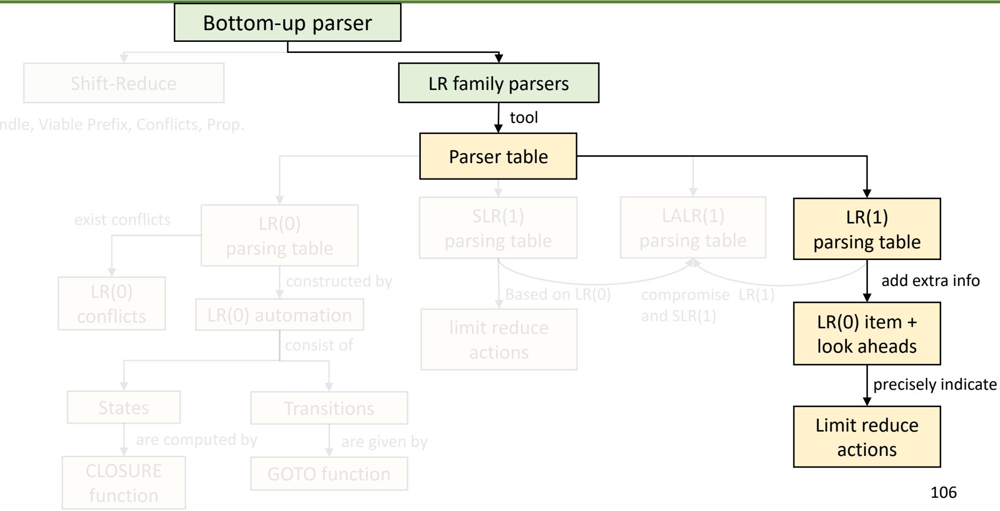

## Improving SLR(1)

• We don’t need to see additional symbols beyond the first token in the input, we have already seen the info that allows us to determine the correct choice [lookahead展望信息已足够]

## • Retain a little more of the left context that brought us here

◆ Divide an SLR(1) state into separate states to differentiate the possible means by which that sequence has appeared on the stack [额外使用栈内stack信息，FOLLOW是input buffer的信息]

• Just using the Follow set is not discriminating enough as the guide for when to reduce [FOLLOW集不够]

◆ For the example, the Follow set contains symbols that can follow R in any position within a valid sentence

But it does not precisely indicate which symbols follow R at this particular point in a derivation

## LR(1) Parsing

• LR parsing adds the required extra info into the state

◆ By redefining items to include a terminal symbol as an added component [让项目中包含终结符]

• General form of LR(1) items: $\mathsf { A } { \to } \mathsf { X } _ { 1 } { \ldots } \mathsf { X } _ { \mathrm { i } } \circ \mathsf { X } _ { \mathrm { i } + 1 } { \ldots } \mathsf { X } _ { \mathrm { j } } , \mathsf { c }$

◆ We have states $\mathsf { X } _ { 1 } . . . \mathsf { X } _ { \mathrm { i } }$ on the stack

◆ suppose $x _ { i + 1 } \ldots x _ { j }$ are on the stack, we can perform reduction when:  the next input symbol is a  a is called the lookahead of the configuration

• The lookahead only works with completed items[完成项]

◆ $\mathsf { A } { \mathrm { - } } { \boldsymbol { > } } \mathsf { X } _ { 1 } { \mathrm { . . . } } \mathsf { X } _ { \mathrm { j } } \bullet , \mathsf { a }$

only reduce when next symbol is a (a is either a terminal or \$)

◆ Multi lookahead symbols: $\mathsf { A } \to \mathsf { u } \bullet , \mathsf { a } / \mathsf { b } / \mathsf { c }$

## LR(1) Parsing(cont.)

## • When to reduce?

◆ LR(0): if the configuration set has a completed item (i.e., dot at the end)

◆ SLR(1): only if the next input token is in the Follow set

◆ LR(1): only if the next input token is exactly a (terminal or \$)

Trend: more and more precise

## • LR(1) items: LR(0) item + lookahead terminals

◆ In many cases, LR(1) differs only in their lookahead components

◆ The extra lookahead terminals allow to make parsing decisions beyond the SLR(1) capability, but with a big price [代价]

 More distinguished items and thus more sets

 Greatly increases Goto and Action table size

$$
\boxed { \begin{array} { c c } { { \mathsf { S ^ { \prime } } \to \cdots \mathsf { S } } } & { { \mathsf { S ^ { \prime } } \to \cdots \mathsf { S } , \mathsf { S } } } \\ { { \mathsf { L R } ( 0 ) } } & { { \mathsf { L R } ( 1 ) } } \end{array} }
$$

## LR(1) Construction

## • Configuration sets

◆Sets construction are essentially the same with SLR, but differing on Closure() and Goto()

 Because of the lookahead symbol

## • Closure()

◆Given each item $\left[ \mathsf { A } \to \mathsf { U } \cdot \mathsf { B } \mathsf { v } , \right.$ a] in I, for each production rule B -> w in G’, add [B -> ·w, b] to I:

 b ∈ First(va) && [B -> ·w, b] is not in I

 v can be nullable

◆Lookahead is the First(va), which are the symbols that can follow B

$$
\begin{array} { r l r l r l r l } & { ( 0 ) } & { S ^ { \prime } \to S } & & { \mathsf { I } _ { 0 } ; } & & { \mathsf { I } _ { 0 } ; } \\ & { ( 1 ) } & { S \to \mathsf { X X } } & & { S ^ { \prime } \to S , 5 } & & { \longrightarrow \qquad \begin{array} { l } { \mathsf { S } ^ { \prime } \to S , \mathsf { S } } \\ { \mathsf { S } \to \mathsf { X X } , \mathsf { F i r s t } ( \mathsf { x } \xi ) } \end{array} } & & { \Longrightarrow \qquad \begin{array} { l } { \mathsf { S } ^ { \prime } \to \mathsf { S } , \mathsf { S } } \\ { \mathsf { S } \to \mathsf { X X } , \mathsf { F i r s t } ( \mathsf { x } \xi ) } \end{array} } & & { \longrightarrow \qquad \begin{array} { l } { \mathsf { S } ^ { \prime } \to \mathsf { X X } , \mathsf { S } } \\ { \mathsf { X } \to \mathsf { X X } , \mathsf { S } } \end{array} } \\ & { ( 3 ) } & { \mathsf { X } \to \mathsf { b } } & & { \mathsf { X } \to \mathsf { b } , \mathsf { F i r s t } ( \mathsf { X } \xi ) } & & { \mathsf { X } \to \mathsf { b } , \mathsf { a } / \mathsf { b } } \end{array}
$$

## LR(1) Construction (cont.)

## • Goto(I, X)

◆For item $\big [ \mathsf { A } \to \mathsf { U } \cdot \mathsf { X } \big _ { \mathsf { V } } ,$ a] in I, Goto(I, $\mathsf { X } ) = \mathbb { C } | _ { 0 \mathsf { S U r e } } \left( [ \mathsf { A } \to \mathsf { u } \mathsf { X } \cdot \mathsf { v } , \mathsf { a } ] \right)$

◆Basically the same Goto function as defined for $\mathsf { L R } ( 0 )$

 But have to propagate the lookahead[传递] when computing the transitions

## • Overall steps

◆Start from the initial set Closure $( [ 5 ^ { \prime }  \cdot 5 , \$ 5 ] )$

◆Construct configuration sets following Goto(I, X)

◆Repeat until no new sets can be added

$$
\begin{array} { l l l l l } { \displaystyle \vert _ { 0 } : } & & { } & { \displaystyle \vert _ { 2 } : } & { } & { \displaystyle 1 _ { 2 } : } \\ { \displaystyle \textrm { S } \to \cdot \chi \chi , \ \xi } & { } & { \displaystyle \textrm { X } \to \times \cdot \chi , \ \xi } \\ { \displaystyle \textrm { X } \to \cdot \mathsf { a X } , \ \mathsf { a } / \mathsf { b } } & { } & { \displaystyle \textrm { X } \to \cdot \mathsf { a X } , \ \mathsf { F i r s t } ( \varepsilon \xi ) } & { } & { \displaystyle \textrm { X } \to \cdot \mathsf { a X } , \ \xi } \\ { \displaystyle \mathsf { X } \to \cdot \mathsf { b } , \ \mathsf { a } / \mathsf { b } } & { } & { } & { \displaystyle \mathsf { X } \to \cdot \mathsf { b } , \ \mathsf { F i r s t } ( \varepsilon \xi ) } & { } & { \displaystyle \textrm { X } \to \cdot \mathsf { b } , \ \xi } \end{array}
$$

## Revisit

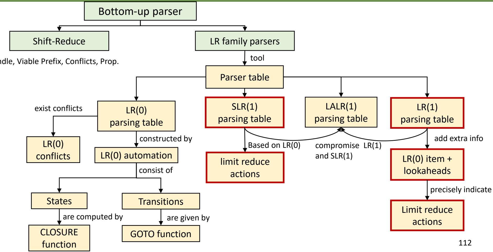

## LRs Revisit

## • LR(0) Limitations

◆Parses without using lookahead - weakest, not used much in practice

◆An completed item $( \mathsf { A } \to \alpha \cdot )$ is reduced immediately

◆Shift-Reduce conflict

$$
\mathsf { I } _ { 1 } \colon
$$

Reduce-Reduce conflict

$$
{ \mathsf { T } } \to { \mathsf { i d } } \cdot { \mathsf { \Omega } }
$$

$$
{ \sf T }  { \sf i d } \cdot [ { \sf E } ]
$$

$$
\mathsf { V } \to \mathsf { i d } \cdot \mathsf { \Lambda }
$$

<table><tr><td rowspan=2 colspan=1>State</td><td rowspan=1 colspan=3>ACTION</td><td rowspan=1 colspan=2>GOTO</td></tr><tr><td rowspan=1 colspan=1>a</td><td rowspan=1 colspan=1>b</td><td rowspan=1 colspan=1>$</td><td rowspan=1 colspan=1>S</td><td rowspan=1 colspan=1>B</td></tr><tr><td rowspan=1 colspan=1>0</td><td rowspan=1 colspan=1>s3</td><td rowspan=1 colspan=1>s4</td><td rowspan=1 colspan=1></td><td rowspan=1 colspan=1>1</td><td rowspan=1 colspan=1>2</td></tr><tr><td rowspan=1 colspan=1>1</td><td rowspan=1 colspan=1></td><td rowspan=1 colspan=1></td><td rowspan=1 colspan=1>acc</td><td rowspan=1 colspan=1></td><td rowspan=1 colspan=1></td></tr><tr><td rowspan=1 colspan=1>2</td><td rowspan=1 colspan=1>s3</td><td rowspan=1 colspan=1>s4</td><td rowspan=1 colspan=1></td><td rowspan=1 colspan=1></td><td rowspan=1 colspan=1>5</td></tr><tr><td rowspan=1 colspan=1>3</td><td rowspan=1 colspan=1>s3</td><td rowspan=1 colspan=1>s4</td><td rowspan=1 colspan=1></td><td rowspan=1 colspan=1></td><td rowspan=1 colspan=1>6</td></tr><tr><td rowspan=1 colspan=1>4</td><td rowspan=1 colspan=1>r3</td><td rowspan=1 colspan=1>r3</td><td rowspan=1 colspan=1>r3</td><td rowspan=1 colspan=1></td><td rowspan=1 colspan=1></td></tr><tr><td rowspan=1 colspan=1>5</td><td rowspan=1 colspan=1>r1</td><td rowspan=1 colspan=1>r1</td><td rowspan=1 colspan=1>r1</td><td rowspan=1 colspan=1></td><td rowspan=1 colspan=1></td></tr><tr><td rowspan=1 colspan=1>6</td><td rowspan=1 colspan=1>r2</td><td rowspan=1 colspan=1>r2</td><td rowspan=1 colspan=1>r2</td><td rowspan=1 colspan=1></td><td rowspan=1 colspan=1></td></tr></table>

◆Adding one lookahead symbol vastly increases the parsing power

◆ SLR(1): simple LR(1), use one lookhead and FOLLOW [用FOLLOW判断规约]

◆ LR(1): use stack info + dedicated symbols [比FOLLOW更精细]

◆ LALR(1): balance SLR(1) and LR(1)[折衷]

## LRs Revisit

• SLR(1): Simple LR(1) with one lookahead

◆ Same LR(0) configurating sets, table structure, and parser operation.

◆ Allow both shift and reduce items as well as multiple reduce items.

◆ Use one token of lookahead to help arbitrate among the conflicts\*

◆ Reduce only if the next input token is a member of the FOLLOW set of the

nonterminal being reduced to

◆ Follow(T) = { +, ), ], \$ } Follow(V) = { = }

 If input t in Follow(T), reduce to T

 If input t in Follow(V), reduce to V

$$
\mathsf { E } ^ { \prime } \to \mathsf { E }
$$

$$
\mathsf { E } \to \mathsf { E } { + } \mathsf { T } \mid \mathsf { T } \mid \mathsf { V } { = } \mathsf { E }
$$

$$
\mathsf { F O L L O W } ( \mathsf { A } ) = \{ \mathsf { a } \mid \mathsf { S } \Rightarrow . . . \mathsf { A a } . . . ,
$$

$$
\mathsf { I } _ { 0 } \colon
$$

$$
\mathsf { T } \to ( \mathsf { E } ) \mid \mathsf { i d } \mid \mathsf { i d } [ \mathsf { E } ]
$$

$$
\mathsf { E } ^ { \prime } \to \mathsf { \Omega } ^ { \bullet } \mathsf { E }
$$

$$
\mathsf { I } _ { 1 } \colon
$$

$$
\mathsf { E } \to \mathsf { \Omega } ^ { \mathrm { ~ \tiny ~ { ~ T ~ } ~ } }
$$

$$
\mathsf { E }  \cdot \mathsf { E } { + } \mathsf { T }
$$

$$
\mathsf E \to \cdot \mathsf V { = } \mathsf E
$$

$$
T  \mathrm { i d } \cdot
$$

$$
\mathsf { V } \to \mathsf { i d }
$$

$$
T \to \mathsf { i d } \cdot [ \mathsf { E } ]
$$

$$
{ \sf T }  \cdot ( { \sf E } )
$$

$$
\intercal  \cdot \mathrm { i d }
$$

 Else, the input [ will shift

$$
\mathsf { V } \to \mathsf { i d } \cdot \mathsf { \Lambda }
$$

$$
{ \mathsf { T } }  \cdot { \mathsf { i d } } [ { \mathsf { E } } ]
$$

$$
\vee  \cdot \mathsf { i d }
$$

## LRs Revisit

## • SLR(1) Grammar

1. For any item A → u·xv in the set, with terminal x, there is no complete item B → w· in that set with x in Follow(B)

 In the tables, this translates no shift-reduce conflict on any state

2. For any two complete items A → u· and B → v· in the set, the follow sets must be disjoint, i.e., Follow(A) ∩ Follow(B) is empty

 This translates to no reduce-reduce conflict on any state

 If more than one nonterminal could be reduced from this set, it must be possible to uniquely determine which using only one token of lookahead

## LRs Revisit

## • LR(1): Left-to-right scan and rightmost derivation with one lookahead

◆ Adding a bit more information to drive the parsing.

 Retain a little more of the left context in stack

◆ Proving more discriminating info for reduction

Follow set is still a bit ambiguous

 We only to reduce only when the exact symbol appears at the next input

## • How?

◆Extending the items – add one terminal at the end

$$
\sqcup \mathsf { A } \to \mathsf { X } _ { 1 } . . . \mathsf { X } _ { \mathrm { i } } \circ \mathsf { X } _ { \mathrm { i } + 1 } . . . \mathsf { X } _ { \mathrm { j } } , \mathsf { a }
$$

Extending the automata construction

 Closure and goto functions

## LRs Revisit

• Redefining items to include a terminal symbol as an added component [让项目中包含终结符]

• General form of LR(1) items: $A  X _ { 1 } , . . . , X _ { i } = X _ { i + 1 } , . . . X _ { j } , a$

◆ We have states $\mathsf { X } _ { 1 } . . . \mathsf { X } _ { \mathrm { i } }$ on the stack

◆ suppose $\mathsf { X } _ { \mathrm { i } + 1 } . . . \mathsf { X } _ { \mathrm { i } }$ are on the stack, we can perform reduction when:  the next input symbol is a

 a is called the lookahead of the configuration

• The lookahead only works with completed items[完成项]

◆ $A { \mathrm { - } } { \mathrm { > } } \mathsf { X } _ { 1 } { \mathrm { . . . } } \mathsf { X } _ { \mathrm { j } } { \mathrm { ~ \circ , ~ } } { \mathsf { a } }$

only reduce when next symbol is a (a is either a terminal or \$)

◆ Multi lookahead symbols: $\mathsf { A } \to \mathsf { u } \bullet , \mathsf { a } / \mathsf { b } / \mathsf { c }$

## LRs Revisit

## • Closure(I)

◆Given each item $\left[ \mathsf { A } \to \mathsf { U } \cdot \mathsf { B } \mathsf { v } , \right.$ a] in I, for each production rule B -> w in G’, add [B -> ·w, b] to I:

 b ∈ First(va) && [B -> ·w, b] is not in I

 v can be nullable

◆Lookahead is the First(va), which are the symbols that can follow B

## • Goto(I, X)

◆For item $\big [ \mathsf { A } \to \mathsf { U } \cdot \mathsf { X } \big _ { \mathsf { V } } ,$ a] in I, Goto(I, X) = Closure ([A -> uX·v, a])

◆Basically the same Goto function as defined for LR(0)

 But have to propagate the lookahead[传递] when computing the transitions

## LRs Revisit

## • Closure(I)

• For $\left[ { \mathsf { A } } \to { \mathsf { u } } { \cdot } \mathrm { B } { \mathsf { v } } , \right.$ a], if $\mathsf { b } \in \mathsf { F i r s t } ( \mathsf { v a } )$ , then $\left[ \ B \to \cdots w , \right]$ b]

• Why First(va)?

(3) X ->b

$$
\mathsf { S } ^ { \prime } \to \mathsf {  { \cdot } } S , \mathsf { S }
$$

$$
\mathsf { S } ^ { \prime } \to \mathsf { \cdot S } , \mathsf { S }
$$

$$
\mathsf { S } \to \cdot \mathsf { X } \mathsf { X } , \mathsf { F i r s t } ( \varepsilon \mathsf { S } )
$$

$$
\mathsf { X } \to \cdot \mathsf { a X } , \mathsf { F i r s t } ( \mathsf { X } \hat { \mathsf { S } } )
$$

$$
\mathsf { X } \to \cdot \mathsf { b } , \mathsf { F i r s t } ( \mathsf { X } \hat { \mathsf { S } } )
$$

$$
\mathsf { I } _ { 0 } \colon
$$

$$
\mathsf { S } ^ { \prime } \to \mathsf { \cdot S } , \mathsf { S }
$$

$$
S  \cdot \mathsf { X } \mathsf { X } , \mathsf { S }
$$

$$
\mathsf { X } \to \cdot \mathsf { a X } , \mathsf { a } / \mathsf { b }
$$

$$
\mathsf { X } \to \cdot \mathsf { b } , \mathsf { a } / \mathsf { b }
$$

## • Goto(I, X)

$$
\mathsf { I } _ { 0 } \colon
$$

$$
\mathsf { S } ^ { \prime } \to \mathsf { \cdot S } , \mathsf { S }
$$

$$
S  \bullet \times \times , \ s
$$

$$
\mathsf { X } \to \cdot \mathsf { a X } , \mathsf { a } / \mathsf { b }
$$

$$
\mathsf { X } \to \cdot \mathsf { b } , \mathsf { a } / \mathsf { b }
$$

$$
\mathsf { I } _ { 2 } :
$$

$$
S  { \sf X } { \cdot } { \sf X } , { \sf S }
$$

$$
\mathsf { X } \to \cdot \mathsf { a X } , \mathsf { F i r s t } ( \varepsilon \mathsf { S } )
$$

$$
\mathsf { X } \to \cdot \mathsf { b } , \mathsf { F i r s t } ( \varepsilon \mathsf { S } )
$$

$$
\mathsf { I } _ { 2 } :
$$

$$
\textsf { S } \to \mathsf { X } \cdot \mathsf { X } , \textsf { S }
$$

$$
x  \cdot a x , \$ 5
$$

$$
x  \cdot b , s
$$

## Example

$$
\begin{array} { r l } & { \qquad \mathcal { S } ^ { - 1 } \overset { \leq } { > } > > \leq \leq S } \\ { \overset { \leq } { > } > > \leq S , \qquad \quad } \\ { \overset { \leq } { > } > > \lambda \leq , \qquad \quad } \\ { \overset { \leq } { < } > > \lambda \leq , \qquad \quad } \\ { \overset { \leq } { < } > < \lambda \leq , \ \lambda \leq } \\ { \overset { \leq } { < } > \mathrm { s } \leq \lambda \leq \beta \leq } \\ { \qquad \quad } & { \qquad \quad } \\ & { \times > \mathrm { ( b ~ o ~ s i g h ~ \alpha ~ ) } } \\ &  \qquad \quad - \underset { \mathrm { L e \geq ~ b \leq \beta \leq \beta \leq \beta } } { \overset { \leq } { > } } \underset { \mathrm { L e \geq ~ b \leq \beta \leq \beta } } { \overset { \leq } { > } } \underset { \mathrm { L e \geq ~ b \leq \beta \leq \beta \leq \beta \leq \beta } } { \overset { \leq } { \operatorname { \beta } } } \underset  \mathrm  L e \geq ~ b \leq \beta \leq \beta \leq \alpha \leq \beta \leq \beta \leq \beta \leq \beta \leq \beta \leq \beta \leq \beta \leq \beta \leq \beta \leq \beta \leq \beta \leq \beta \leq \beta \leq \beta \leq \beta \leq \beta \leq \beta \leq \beta \leq \beta \leq \beta \leq \beta \leq \beta \leq \beta \leq \beta \leq \beta \leq \beta \leq \beta \leq \beta \leq \beta \leq \beta \leq \beta \leq \beta \leq \beta \leq \beta \leq \beta \leq \beta \leq \beta \leq \beta \leq \beta \leq \beta \leq \beta \leq \beta \leq \beta \leq \beta \leq \beta \leq \beta \leq \beta \leq \beta \leq \beta \leq \beta \leq \beta \leq \beta \leq \beta \leq \beta \leq \beta \leq \beta \leq \beta \leq \beta \leq \beta \leq \beta \leq \beta \leq \beta \leq \beta \leq \beta \leq \beta \leq \beta \leq \beta \leq \beta \leq \beta \leq \beta \leq \beta \leq \beta \leq \beta \leq \beta \leq \beta \leq \beta \leq \beta \leq \beta \leq \beta \leq \beta \leq \beta \leq \beta \leq \beta \leq \beta \leq \beta \leq \beta \leq \beta \leq \beta \leq \beta \leq \beta \leq \beta \leq \beta \leq \beta \leq \beta \leq \beta \leq \beta \leq \beta  \end{array}
$$

## LR(1) Parse Table[解析表]

## • Shift[移进]

◆ Same as LR(0) and SLR(1)

Don’t care the lookahead symbols

## • Reduce[归约]

◆ Don’t use Follow set (that’s SLR(1), too coarse-grain[粗粒度])

◆ Reduce only if input matches lookahead for item

## • ACTION and GOTO[表格]

◆ If [A -> ⍺·aβ, b] ∈ Si and goto(Si , a) = Sj, Action[i, a] = Sj

 Shift a and goto state j

 Same as SLR(1)

◆ If $[ \mathsf { A } \to \mathsf { \alpha } \cdot , \mathsf { a } ] \in \mathsf { S } _ { \mathrm { i } }$ and next input is a, Action[i, a] = rk

 Reduce using ${ \sf k } ^ { \sf t h }$ production $( \mathsf { A } \to \mathsf { \alpha } \mathsf { \alpha } )$ if input matches a

 For $S \mathsf { L R } ,$ reduced if the next input is in Follow(A)

## Example

(0) ${ \mathsf S } ^ { \prime } \to { \mathsf S }$

$$
( 1 ) { \mathsf { S } } \to { \mathsf { X } } { \mathsf { X } }
$$

(2) $X  \mathsf { a X }$

(3) $x  6$

$$
S ^ { \prime }  \cdot S , \$ 5
$$

$$
{ \mathsf S } \to \cdot \mathsf { X } \mathsf { X } , \mathsf { S }
$$

$$
\textsf { X } \to \cdot \mathsf { a X } , \mathsf { a } / \mathsf { b }
$$

$$
{ \sf X }  { \sf \cdot a } { \sf X } , { \sf a } / { \sf b }
$$

<table><tr><td rowspan=2 colspan=1>State</td><td rowspan=1 colspan=3>Action</td><td rowspan=1 colspan=2>Goto</td></tr><tr><td rowspan=1 colspan=1>a</td><td rowspan=1 colspan=1>b</td><td rowspan=1 colspan=1>$</td><td rowspan=1 colspan=1>S</td><td rowspan=1 colspan=1>X</td></tr><tr><td rowspan=1 colspan=1>0</td><td rowspan=1 colspan=1>s3</td><td rowspan=1 colspan=1>s4</td><td rowspan=1 colspan=1></td><td rowspan=1 colspan=1>1</td><td rowspan=1 colspan=1>2</td></tr><tr><td rowspan=1 colspan=1>1</td><td rowspan=1 colspan=1></td><td rowspan=1 colspan=1></td><td rowspan=1 colspan=1>acc</td><td rowspan=1 colspan=1></td><td rowspan=1 colspan=1></td></tr><tr><td rowspan=1 colspan=1>2</td><td rowspan=1 colspan=1>s6</td><td rowspan=1 colspan=1>s7</td><td rowspan=1 colspan=1></td><td rowspan=1 colspan=1></td><td rowspan=1 colspan=1>5</td></tr><tr><td rowspan=1 colspan=1>3</td><td rowspan=1 colspan=1>s3■</td><td rowspan=1 colspan=1>s4■</td><td rowspan=1 colspan=1></td><td rowspan=1 colspan=1></td><td rowspan=1 colspan=1>8</td></tr><tr><td rowspan=1 colspan=1>4</td><td rowspan=1 colspan=1>r3</td><td rowspan=1 colspan=1>r3</td><td rowspan=1 colspan=1></td><td rowspan=1 colspan=1></td><td rowspan=1 colspan=1></td></tr><tr><td rowspan=1 colspan=1>5</td><td rowspan=1 colspan=1></td><td rowspan=1 colspan=1></td><td rowspan=1 colspan=1>r1</td><td rowspan=1 colspan=1></td><td rowspan=1 colspan=1></td></tr><tr><td rowspan=1 colspan=1>6</td><td rowspan=1 colspan=1>s6</td><td rowspan=1 colspan=1>s7</td><td rowspan=1 colspan=1></td><td rowspan=1 colspan=1></td><td rowspan=1 colspan=1>9</td></tr><tr><td rowspan=1 colspan=1>7</td><td rowspan=1 colspan=1></td><td rowspan=1 colspan=1></td><td rowspan=1 colspan=1>r3</td><td rowspan=1 colspan=1></td><td rowspan=1 colspan=1></td></tr><tr><td rowspan=1 colspan=1>8</td><td rowspan=1 colspan=1>r2</td><td rowspan=1 colspan=1>r2</td><td rowspan=1 colspan=1></td><td rowspan=1 colspan=1></td><td rowspan=1 colspan=1></td></tr><tr><td rowspan=1 colspan=1>9</td><td rowspan=1 colspan=1></td><td rowspan=1 colspan=1></td><td rowspan=1 colspan=1>r2</td><td rowspan=1 colspan=1></td><td rowspan=1 colspan=1></td></tr></table>

## LR(1) Grammars

• Every SLR(1) grammar is LR(1), but the LR(1) parser may have more states than SLR(1) parser

LR(1) parser splits states based on differing lookaheads, thus it may avoid conflicts that would otherwise result in using the full Follow set

• A grammar is LR(1) if the following two conditions hold for each configurating set

◆ (1) For any item $[ \mathsf { A } \to \mathsf { u } \cdot \mathsf { x } \mathsf { v } ,$ a] in the set, with terminal x, there is no item in the set of form $[ \mathsf { B } \to \mathsf { v } \cdot , \mathsf { x } ]$

 In the table, this translates no shift-reduce conflict on any state

◆ (2) The lookaheads for all complete items within the set must be disjoint, e.g. set cannot have both $[ \mathsf { A } \to \mathsf { u } \cdot , \mathsf { a } ]$ and $[ \mathsf { B } \to \mathsf { v } \cdot , \mathsf { a } ]$

 This translates to no reduce-reduce conflict on any state

## Contents

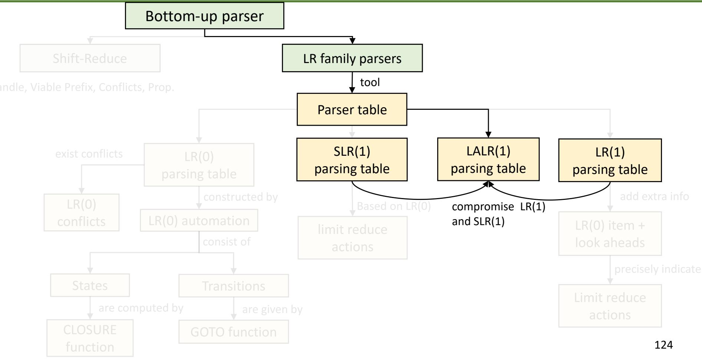

## LALR(1) Parser

## • What’s the drawbacks of LR(1)?

◆ With state splitting, the LR(1) parser can have many more states than SLR(1) or LR(0) parser

 One LR(0) item may split up to many LR(1) items

 As many as all possible lookaheads

 In theory can lead to an exponential increase in #states

## • LALR (lookahead LR) – compromise LR(1) and SLR(1)[折衷]

◆ Reduce the number of states in LR(1) parser by merging similar states

 Reduces the #states to the same as SLR(1), but still retains the power of LR(1) lookaheads

◆ Similar states: have same number of items, the core of each item is identical, and they differ only in their lookahead sets

## Example


## State Merging[状态合并]

• Merge states with the same core

◆ Core: LR(1) items minus the lookahead (i.e., LR(0) items)

All items are identical except lookahead

$$
\mathsf { I } _ { 3 } \colon
$$

$$
\mathsf { I } _ { 6 } \mathsf { : }
$$

$$
\textsf { X } \to \mathsf { a } \cdot \textsf { X } , \mathsf { a } / \mathsf { b }
$$

$$
x  \mathsf { a } \cdot \mathsf { X } , \mathsf { S }
$$

$$
\mathsf { I } _ { 3 6 } \mathsf { : \Omega }
$$

$$
\mathsf { X } \to . \mathsf { a x } , \mathsf { a } / \mathsf { b }
$$

$$
{ \tt X } \to . { \tt a X } , \$ \sum
$$

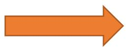

$$
\mathsf { X } \to \mathsf { a } { \cdot } \mathsf { X } , \mathsf { a } / \mathsf { b } / \mathsf { S }
$$

$$
{ \tt X }  { \tt \cdot b } , \$ 3
$$

$$
\mathsf { X } \to \cdot \mathsf { b } , \mathsf { a } / \mathsf { b }
$$

$$
\mathsf { X } \to . \mathsf { a } \mathsf { X } , \mathsf { a } / \mathsf { b } / \mathsf { S }
$$

$$
\mathsf { X } \Rightarrow \cdot \mathsf { b } , \mathsf { a } / \mathsf { b } / \mathsf { S }
$$

$$
{ \mathsf I } _ { 4 } \mathrm { : }
$$

$$
\times  \mathsf { b } \cdot , \mathsf { a } / \mathsf { b }
$$

$$
\mathsf { I } _ { 7 } \colon
$$

$$
x  { \mathsf { b } } \cdot , \$ 5
$$

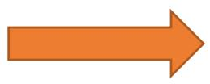

$$
\mathsf { I } _ { 4 7 } \mathsf { : }
$$

$$
\times  { \mathsf { b } } \cdot , \mathsf { a } / { \mathsf { b } } / { \mathsf { S } }
$$

$$
\mathsf { I } _ { 8 } \colon
$$

$$
\mathsf { X } \to \mathsf { a X } \cdot , \mathsf { a } / \mathsf { b }
$$

$$
\mathsf { I } _ { 9 } \colon
$$

$$
{ \tt X } \to { \tt a X } \cdot , \$ { \tt S }
$$

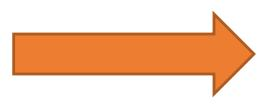

$$
\mathsf { I } _ { 8 9 } \mathrm { : }
$$

$$
\mathsf { X } \to \mathsf { a x } . , \mathsf { a } / \mathsf { b } / \mathsf { S }
$$

## State Merging (cont.)

<table><tr><td rowspan=2 colspan=1>State</td><td rowspan=1 colspan=1></td><td rowspan=1 colspan=2>Action</td><td rowspan=1 colspan=2>Goto</td></tr><tr><td rowspan=1 colspan=1>a</td><td rowspan=1 colspan=1>b</td><td rowspan=1 colspan=1>S</td><td rowspan=1 colspan=1>S</td><td rowspan=1 colspan=1>X</td></tr><tr><td rowspan=1 colspan=1>0</td><td rowspan=1 colspan=1>s3</td><td rowspan=1 colspan=1> s4</td><td rowspan=1 colspan=1></td><td rowspan=1 colspan=1>1</td><td rowspan=1 colspan=1>2</td></tr><tr><td rowspan=1 colspan=1>1</td><td rowspan=1 colspan=1></td><td rowspan=1 colspan=1></td><td rowspan=1 colspan=1>acc</td><td rowspan=1 colspan=1></td><td rowspan=1 colspan=1></td></tr><tr><td rowspan=1 colspan=1>2</td><td rowspan=1 colspan=1>s6</td><td rowspan=1 colspan=1> s7</td><td rowspan=1 colspan=1></td><td rowspan=1 colspan=1></td><td rowspan=1 colspan=1>5</td></tr><tr><td rowspan=1 colspan=1>3</td><td rowspan=1 colspan=1>s3</td><td rowspan=1 colspan=1>s4</td><td rowspan=1 colspan=1></td><td rowspan=1 colspan=1></td><td rowspan=1 colspan=1>8</td></tr><tr><td rowspan=1 colspan=1>4</td><td rowspan=1 colspan=1>r3</td><td rowspan=1 colspan=1>r3</td><td rowspan=1 colspan=1></td><td rowspan=1 colspan=1></td><td rowspan=1 colspan=1></td></tr><tr><td rowspan=1 colspan=1>5</td><td rowspan=1 colspan=1></td><td rowspan=1 colspan=1></td><td rowspan=1 colspan=1>r1</td><td rowspan=1 colspan=1></td><td rowspan=1 colspan=1></td></tr><tr><td rowspan=1 colspan=1>6</td><td rowspan=1 colspan=1>s6</td><td rowspan=1 colspan=1> s7</td><td rowspan=1 colspan=1></td><td rowspan=1 colspan=1></td><td rowspan=1 colspan=1>9</td></tr><tr><td rowspan=1 colspan=1>7</td><td rowspan=1 colspan=1></td><td rowspan=1 colspan=1></td><td rowspan=1 colspan=1>r3</td><td rowspan=1 colspan=1></td><td rowspan=1 colspan=1></td></tr><tr><td rowspan=1 colspan=1>8</td><td rowspan=1 colspan=1> r2</td><td rowspan=1 colspan=1>r2</td><td rowspan=1 colspan=1></td><td rowspan=1 colspan=1></td><td rowspan=1 colspan=1></td></tr><tr><td rowspan=1 colspan=1>9</td><td rowspan=1 colspan=1></td><td rowspan=1 colspan=1></td><td rowspan=1 colspan=1>r2</td><td rowspan=1 colspan=1></td><td rowspan=1 colspan=1></td></tr></table>

LR(1)  
Grammar (0) S’ -> S (1) S -> XX (2) X -> aX (3) X -> b

<table><tr><td rowspan=2 colspan=1>State</td><td rowspan=1 colspan=1></td><td rowspan=1 colspan=1>Action</td><td rowspan=1 colspan=1></td><td rowspan=1 colspan=2>Goto</td></tr><tr><td rowspan=1 colspan=1>a</td><td rowspan=1 colspan=1>b</td><td rowspan=1 colspan=1>S</td><td rowspan=1 colspan=1>S</td><td rowspan=1 colspan=1>X</td></tr><tr><td rowspan=1 colspan=1>0</td><td rowspan=1 colspan=1> s36</td><td rowspan=1 colspan=1> s47</td><td rowspan=1 colspan=1></td><td rowspan=1 colspan=1>1</td><td rowspan=1 colspan=1>2</td></tr><tr><td rowspan=1 colspan=1>1</td><td rowspan=1 colspan=1></td><td rowspan=1 colspan=1></td><td rowspan=1 colspan=1>acc</td><td rowspan=1 colspan=1></td><td rowspan=1 colspan=1></td></tr><tr><td rowspan=1 colspan=1>2</td><td rowspan=1 colspan=1> s36</td><td rowspan=1 colspan=1>s47</td><td rowspan=1 colspan=1></td><td rowspan=1 colspan=1></td><td rowspan=1 colspan=1>5</td></tr><tr><td rowspan=1 colspan=1>36</td><td rowspan=1 colspan=1>s36</td><td rowspan=1 colspan=1>s47</td><td rowspan=1 colspan=1></td><td rowspan=1 colspan=1></td><td rowspan=1 colspan=1>89</td></tr><tr><td rowspan=1 colspan=1>47</td><td rowspan=1 colspan=1>r3</td><td rowspan=1 colspan=1>r3</td><td rowspan=1 colspan=1>r3</td><td rowspan=1 colspan=1></td><td rowspan=1 colspan=1></td></tr><tr><td rowspan=1 colspan=1>5</td><td rowspan=1 colspan=1></td><td rowspan=1 colspan=1></td><td rowspan=1 colspan=1>r1</td><td rowspan=1 colspan=1></td><td rowspan=1 colspan=1></td></tr><tr><td rowspan=1 colspan=1>89</td><td rowspan=1 colspan=1>r2</td><td rowspan=1 colspan=1>r2</td><td rowspan=1 colspan=1>r2</td><td rowspan=1 colspan=1></td><td rowspan=1 colspan=1></td></tr><tr><td rowspan=1 colspan=2></td><td rowspan=1 colspan=4>LALR(1)</td></tr></table>

States 3 and 6: State 36  
States 4 and 7: State 47  
States 8 and 9: State 89

## Merge Effects[合并效果]

## 1. Merging of states can introduce conflicts[引入归约-归约冲突]

◆ Can introduce reduce-reduce (r-r) conflicts

 LR was introduced to split the Follow set on reduce action

 Merging reverts the splitting

◆ Cannot introduce shift-reduce (s-r) conflicts

 i.e., a s-r conflict cannot exist in a merged set unless the conflict was already present in one of the original LR(1) sets

## 2. Detection of errors may be delayed[推迟错误识别]

On error, LALR parsers will not perform shifts beyond an LR parser, but may perform more reductions before finding error

## Merge Conflict: Shift-Reduce

• Shift-reduce conflicts are not introduced by merging

• Suppose:

$\mathsf { S } _ { \mathrm { i j } }$ contains: $[ \mathsf { A } \to \mathsf { \alpha } , \mathsf { a } ]$ reduce on input a

[B -> β·a??, b] shift on input

Formed by merging $\mathsf { S } _ { \mathrm { i } }$ and $\mathsf { S } _ { \mathrm { j } }$ [注：Sij并不一定只有这两个items]

• Then:

◆ Cores must be the same for $\mathsf { S } _ { \mathrm { i } }$ and $\mathsf { S } _ { \mathrm { j } } ,$ and thus one of them must contain $[ \mathsf { A } \to \mathsf { \alpha } , \mathsf { a } ]$

◆ and it must have an item $[ B \to \beta \cdot \circ \gamma , \mathsf { c } ]$ for some random c

 This state has the same shift/reduce conflict on a, i.e., the grammar was not LR(1)

◆ Shift-reduce conflicts were already present in either $\mathsf { S } _ { \mathrm { j } }$ and $\mathsf { S } _ { \mathrm { j } }$ (or both) and not newly introduced by merging

## Merge Conflict: Reduce-Reduce

• Reduce-reduce conflicts can be introduced by merging

• In this case, we say the grammar is not LALR(1)

S' –> S   
S –> aBc | bCc | aCd | bBd   
B –> e   
C –> e   
I: S' ->·S, \$   
S->·aBc, \$   
S -> bCc, \$   
S -> aCd, \$   
S -> ·bBd, \$   
I:S'->S·,\$   
I:S->a Bc,\$   
S->a·Cd,\$   
B->·e,c   
C->·e,d

Reduce to B or C when next token is c or d

$$
\begin{array} { r l } { { \mathrm { I } } _ { 1 2 } { : } } & { { } \mathsf { S } \to { \mathsf { b } } { \mathsf { C } } { \mathsf { c } } { \bullet } , \mathsf { S } } \end{array}
$$

$$
\mathrm { I } _ { 1 3 } \colon \ \mathsf { S }  \mathsf { b B d } ^ { \bullet } , \mathfrak { S }
$$

## Merge Effects[合并效果]

## 1. Merging of states can introduce conflicts[引入归约-归约冲突]

◆ Can introduce reduce-reduce (r-r) conflicts

LR was introduced to split the Follow set on reduce action

 Merging reverts the splitting

◆ Cannot introduce shift-reduce (s-r) conflicts

r conflict cannot exist in a merged set unless the conflict was already present in one of the original LR(1) sets

## 2. Detection of errors may be delayed[推迟错误识别]

◆ On error, LALR parsers will not perform shifts beyond an LR parser, but may perform more reductions before finding error

## Example: Error Delay

<table><tr><td rowspan=2 colspan=1>State</td><td rowspan=1 colspan=3>Action</td><td rowspan=1 colspan=2>Goto</td></tr><tr><td rowspan=1 colspan=1>a</td><td rowspan=1 colspan=1>b</td><td rowspan=1 colspan=1>$</td><td rowspan=1 colspan=1>S</td><td rowspan=1 colspan=1>X</td></tr><tr><td rowspan=1 colspan=1>0</td><td rowspan=1 colspan=1>s3</td><td rowspan=1 colspan=1>s4</td><td rowspan=1 colspan=1></td><td rowspan=1 colspan=1>1</td><td rowspan=1 colspan=1>2</td></tr><tr><td rowspan=1 colspan=1>1</td><td rowspan=1 colspan=1></td><td rowspan=1 colspan=1></td><td rowspan=1 colspan=1>acc</td><td rowspan=1 colspan=1></td><td rowspan=1 colspan=1></td></tr><tr><td rowspan=1 colspan=1>2</td><td rowspan=1 colspan=1>s6</td><td rowspan=1 colspan=1>s7</td><td rowspan=1 colspan=1></td><td rowspan=1 colspan=1></td><td rowspan=1 colspan=1>5</td></tr><tr><td rowspan=1 colspan=1>3</td><td rowspan=1 colspan=1>s3</td><td rowspan=1 colspan=1>s4</td><td rowspan=1 colspan=1></td><td rowspan=1 colspan=1></td><td rowspan=1 colspan=1>8</td></tr><tr><td rowspan=1 colspan=1>4</td><td rowspan=1 colspan=1>r3</td><td rowspan=1 colspan=1>r3</td><td rowspan=1 colspan=1></td><td rowspan=1 colspan=1></td><td rowspan=1 colspan=1></td></tr><tr><td rowspan=1 colspan=1>5</td><td rowspan=1 colspan=1></td><td rowspan=1 colspan=1></td><td rowspan=1 colspan=1>r1</td><td rowspan=1 colspan=1></td><td rowspan=1 colspan=1></td></tr><tr><td rowspan=1 colspan=1>6</td><td rowspan=1 colspan=1>s6</td><td rowspan=1 colspan=1>S7</td><td rowspan=1 colspan=1></td><td rowspan=1 colspan=1></td><td rowspan=1 colspan=1>9</td></tr><tr><td rowspan=1 colspan=1>7</td><td rowspan=1 colspan=1></td><td rowspan=1 colspan=1></td><td rowspan=1 colspan=1>r3</td><td rowspan=1 colspan=1></td><td rowspan=1 colspan=1></td></tr><tr><td rowspan=1 colspan=1>8</td><td rowspan=1 colspan=1>r2</td><td rowspan=1 colspan=1>r2</td><td rowspan=1 colspan=1></td><td rowspan=1 colspan=1></td><td rowspan=1 colspan=1></td></tr><tr><td rowspan=1 colspan=1>9</td><td rowspan=1 colspan=1></td><td rowspan=1 colspan=1></td><td rowspan=1 colspan=1>r2</td><td rowspan=1 colspan=1></td><td rowspan=1 colspan=1></td></tr></table>

$$
{ \mathsf S } ^ { \prime } \to { \mathsf S }
$$

$$
S \to \mathbb { X } \mathbb { X }
$$

$$
X  \mathsf { a X }
$$

$$
x  6
$$

$$
\mathsf { S } _ { 0 } \mathsf { S } _ { 3 }
$$

$$
\mathsf { S } _ { 0 } \mathsf { S } _ { 3 } \mathsf { S } _ { 3 }
$$

## Example: Error Delay(cont.)

Grammar

(0) S’ -> S (1) S -> XX (2) X -> aX (3) X -> b

Input aab\$

<table><tr><td rowspan=2 colspan=1>State</td><td rowspan=1 colspan=3>Action</td><td rowspan=1 colspan=2>Goto</td></tr><tr><td rowspan=1 colspan=1>a</td><td rowspan=1 colspan=1>b</td><td rowspan=1 colspan=1>$</td><td rowspan=1 colspan=1>S</td><td rowspan=1 colspan=1>X</td></tr><tr><td rowspan=1 colspan=1>0</td><td rowspan=1 colspan=1>s36</td><td rowspan=1 colspan=1>s47</td><td rowspan=1 colspan=1></td><td rowspan=1 colspan=1>1</td><td rowspan=1 colspan=1>2</td></tr><tr><td rowspan=1 colspan=1>1</td><td rowspan=1 colspan=1></td><td rowspan=1 colspan=1></td><td rowspan=1 colspan=1>acc</td><td rowspan=1 colspan=1></td><td rowspan=1 colspan=1></td></tr><tr><td rowspan=1 colspan=1>2</td><td rowspan=1 colspan=1>s36</td><td rowspan=1 colspan=1>S47</td><td rowspan=1 colspan=1></td><td rowspan=1 colspan=1></td><td rowspan=1 colspan=1>5</td></tr><tr><td rowspan=1 colspan=1>36</td><td rowspan=1 colspan=1>s36</td><td rowspan=1 colspan=1>s47</td><td rowspan=1 colspan=1></td><td rowspan=1 colspan=1></td><td rowspan=1 colspan=1>89</td></tr><tr><td rowspan=1 colspan=1>47</td><td rowspan=1 colspan=1>r3</td><td rowspan=1 colspan=1>r3</td><td rowspan=1 colspan=1>r3</td><td rowspan=1 colspan=1></td><td rowspan=1 colspan=1></td></tr><tr><td rowspan=1 colspan=1>5</td><td rowspan=1 colspan=1></td><td rowspan=1 colspan=1></td><td rowspan=1 colspan=1>r1</td><td rowspan=1 colspan=1></td><td rowspan=1 colspan=1></td></tr><tr><td rowspan=1 colspan=1>89</td><td rowspan=1 colspan=1>r2</td><td rowspan=1 colspan=1>r2</td><td rowspan=1 colspan=1>r2</td><td rowspan=1 colspan=1></td><td rowspan=1 colspan=1></td></tr></table>

<table><tr><td>State Symbol</td><td>S $ aab$</td></tr><tr><td>State Symbol</td><td> $\mathsf { S } _ { 0 } \mathsf { S } _ { 3 6 }$  $a ab$.</td></tr><tr><td>State Symbol</td><td> $\mathsf { S } _ { 0 } \mathsf { S } _ { 3 6 } \mathsf { S } _ { 3 6 }$  $ b$ a a</td></tr><tr><td>State Symbol</td><td> $\mathsf { S } _ { 0 } \mathsf { S } _ { 3 6 } \mathsf { S } _ { 3 6 } \mathsf { S } _ { 4 7 }$  $ b $ a a</td></tr><tr><td>State Symbol</td><td> $\mathsf { S } _ { 0 } \mathsf { S } _ { 3 6 } \mathsf { S } _ { 3 6 } \mathsf { S } _ { 8 9 }$  $ X $ a a</td></tr><tr><td>State Symbol</td><td> $\mathsf { S } _ { 0 } \mathsf { S } _ { 3 6 } \mathsf { S } _ { 8 9 }$  $ ax $</td></tr><tr><td>State Symbol</td><td> $\mathsf { S } _ { 0 } \mathsf { S } _ { 2 }$  $x S 134</td></tr></table>

## LALR Table Construction[解析表构建]

• LALR(1) parsing table is built from the configuration sets in the same way as LR(1)[同样方法构建的项目集]

◆The lookaheads determine where to place reduce actions

◆If there are no mergable states, the LALR(1) table will be identical to the LR(1) table and we gain nothing[退化为LR(1)]

◆Usually, there will be states that can be merged and the LALR table will thus have fewer rows than LR(1)

• LALR(1) table have the same #states (rows) with SLR(1) and LR(0), but have fewer reduce actions[同等数目的状态,但更少的归约动作]

◆Some reductions are not valid if we are more precise about the lookahead

◆Some conflicts in SLR(1) and LR(0) are avoided by LALR(1)

◆For C language: SLR/LALR - 100s states, LR - 1000s states

## LALR Table Construction (Cont.)

## • Brute force[暴力方法]

◆Construct LR(1) states, then merge states with same core

◆If no conflicts, you have a LALR parser

◆Inefficient: building LR(1) items are expensive in time and space

 We need a better solution

## • Efficient way[高效方式]

◆Avoid initial construction of LR(1) states

◆Merge states on-the-fly (step-by-step merging)

States are created as in LR(1)

 On state creation, immediately merge if there is an opportunity

## LALR(1) Grammars

• For a grammar, if the LALR(1) parse table has no conflicts, then we say the grammar is LALR(1)

◆No formal definition of a set of rules

• LALR(1) is a subset of LR(1) and a superset of SLR(1)

◆A SLR(1) grammar is definitely LALR(1)

◆A LR(1) grammar may or may not be LALR(1)

 Depends on whether merging introduces conflicts

◆A non-SLR(1) grammar may be LALR(1)

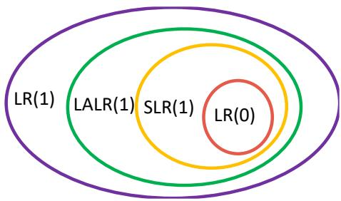

 Depends on whether the more precise lookaheads resolve the SLR(1) conflicts

◆Most used variant of the LR family

## LALR Summary

• LALR(1) provides a good balancing between LR(1) and SLR(1)

◆ Range of grammars supported: LR > LALR > SLR

◆ Number of states in the table: LR > LALR = SLR

• If a grammar G is LR but is not SLR

◆ cannot simply rely on the Follow set to resolve conflicts

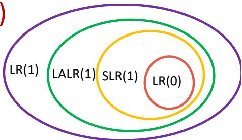

 Need more precise decision on reduction -- lookahead

◆ LR grammars have a large parsing table with many states, we can merge some of the states, i.e., LALR

 No Confliction after merge --> G is LALR

➢ The confliction in SLR is resolved.

➢ LALR have the same number of sates with SLR, but less reduction actions

 If no states can be merged, then LALR=LR for G

• If a grammar G is SLR, G is also LR and LALR. Therefore, we don’t need to split the states using specific lookaheads, that is, LALR=SLR

## LL vs. LR Parsing (LL < LR)

## • LL(k) parser, each expansion A -> ⍺ is decided based on

◆Current non-terminal at the top of the stack[依赖LHS]

 Which LHS to produce

◆k terminals of lookahead at beginning of RHS[展望RHS]

 Must guess which RHS by peeking at first few terminals of RHS

## • LR(k) parser, each production A -> ⍺· is decided based on

◆RHS at the top of the stack[依赖RHS]

 Can postpone choice of RHS until entire RHS is seen

 Common left factor is OK – waits until entire RHS is seen anyway

 Left recursion is OK – does not impede forming RHS for reduction

◆k terminals of lookahead beyond RHS[超越RHS]

 Can decide on RHS after looking at entire RHS plus lookahead

## Hierarchy of Grammars[文法层级]

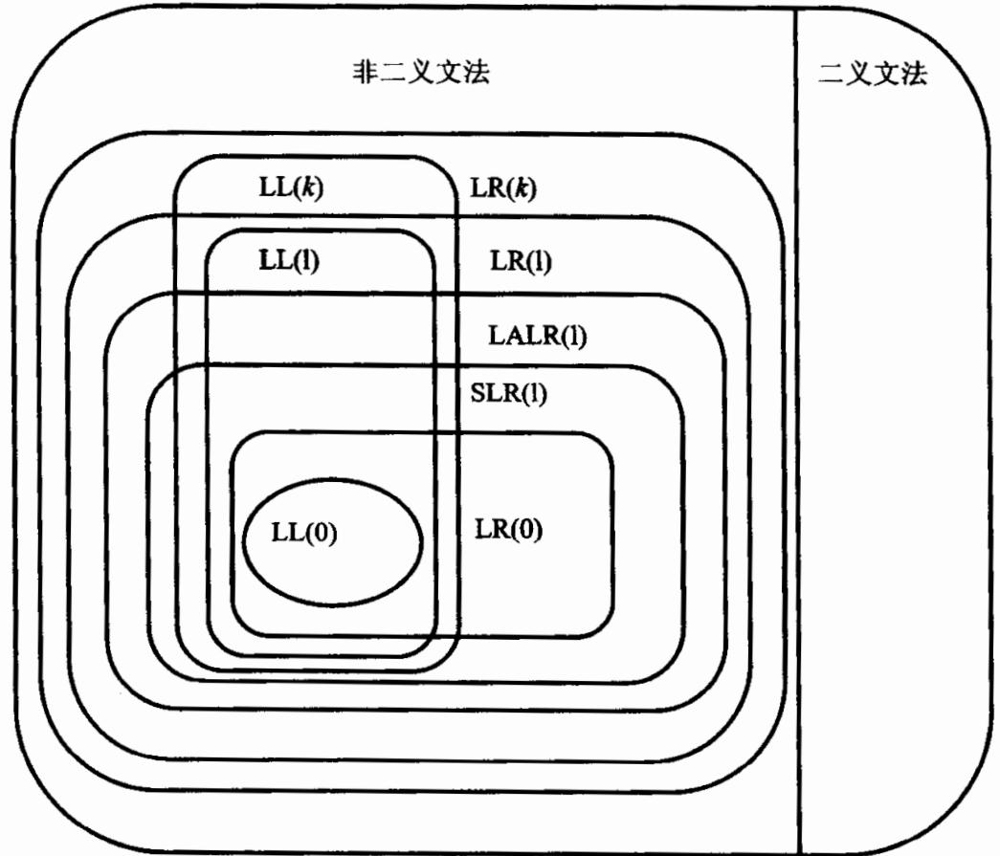

## 编译原理 Complier Principles

Lecture 3 Syntax Analysis: Revisit

赵帅

计算机学院

中山大学

## Compilation Phases[编译阶段]

## Mind Map[思维导图]

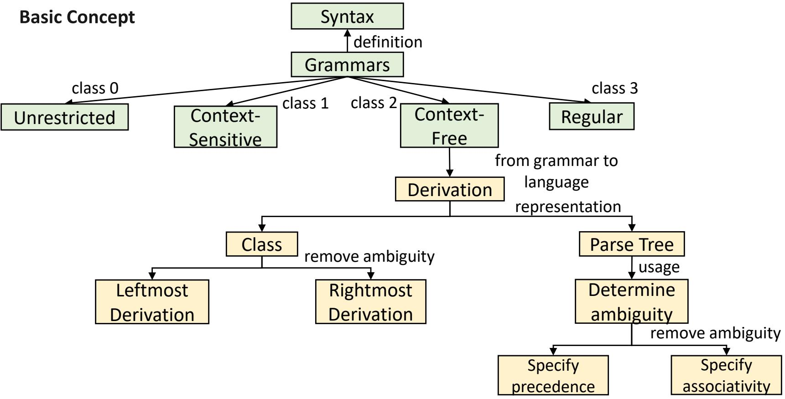

## Syntax analysis

• Syntax analysis – the second phase of compilation

◆ Input: a sequence of token provided by the Lexical Analysis

◆ Output: a parse tree or abstract syntax tree (AST)

• Syntax specification

• RE/FA is not powerful enough (e.g., anbn, where n>0)

• So Grammar is needed, especially for context-free grammar (CFG)

## • Grammar G: $G = \left( \mathsf { V } _ { \top } , \mathsf { V } _ { \top } , \mathsf { S } , \delta \right)$

◆ ${ \mathsf { V } } _ { \top } \colon$ terminal symbols[终结符] = tokens from Lexical Analysis, leaves of the parse tree

◆ $\mathsf { V } _ { \mathsf { N } } .$ non-terminal symbols[非终结符], internal nodes of the parse tree

? S: start symbol[开始符号]

◆ δ: set of productions[产生式]: LHS -> RHS

## Sentential form, Sentence, Language[句型&句子&语言]

• Example:

$\mathsf { G } [ \mathsf { A } ] \colon \mathsf { A } \to \mathsf { c } \mid \mathsf { A } \mathsf { b }$

• Derivation: from grammar to language[文法到语言]

$$
\boxed { \ A \Rightarrow \boxed { \mathsf { c } } }
$$

sentence

$$
\bullet \boldsymbol { \vert } \mathsf { A } \Rightarrow \mathsf { A } \mathsf { b } \Rightarrow \mathsf { c } \mathsf { b }
$$

$$
\bullet \bullet \bullet \bullet \bullet \bullet \bullet \bullet \bullet \bullet \bullet \bullet \bullet
$$

$$
\bullet \bullet \mathsf { I A } \Rightarrow \mathsf { A b } \Rightarrow \mathsf { A b b } \Rightarrow \mathsf { A b b b } \Rightarrow \mathsf { c b b b }
$$

$$
\bullet | \mathbb { A } \Rightarrow \mathbb { A } \mathbb { b } \Rightarrow \mathbb { A } \mathbb { b } \mathbb { b } \Rightarrow \mathbb { A } \mathbb { b } \mathbb { b } \mathbb { b } \Rightarrow \mathbb { c } \mathbb { b } \mathbb { b } \mathbb { b } \Rightarrow \mathbb { c } \mathbb { b } \mathbb { b } \mathbb { b } \mathbb { b }
$$

Sentential form

## Overall Concepts

## • Derivation

◆ The application of the productions (from LHS to RHS)

 starts from the start symbol S to the input string

## • Reduce

◆ The reserve of derivation (from RHS to LHS)

 starts from the input string to the start symbol S

## • Parse tree

◆ Graphical representation of Derivation/Reduce without the order of productions

## • Ambiguous grammar

◆ A sentence has more than one parse (leftmost or rightmost) trees

◆ Ambiguity can be resolved by defining precedence and associativity for the grammar

## Chomsky Grammar System[乔姆斯基文法体系]

• Chomsky established the formal language system in 1956. He divided grammar into four types: 0, 1, 2, 3.

• Like context-free grammar, they are composed of 4 components G=(VT , VN , S, δ), but with different restrictions on productions.

  
Noam Chomsky

◆ Type 0 — unrestricted grammar [0型文法,无限制文法]

◆ Type 1 — context sensitive grammar(CSG) [1型文法,上下文有关文法]

◆ Type 2 — context free grammar (CFG) [2型文法,上下文无关文法]

◆ Type 3 — regular grammar [3型文法,正则文法]

## Chomsky Grammar System[乔姆斯基文法体系]

<table><tr><td rowspan=1 colspan=1>Class</td><td rowspan=1 colspan=1>Grammar</td><td rowspan=1 colspan=1>Restriction</td><td rowspan=1 colspan=1>Recognizer</td></tr><tr><td rowspan=1 colspan=1>3</td><td rowspan=1 colspan=1>Regular</td><td rowspan=1 colspan=1>A →aB or A-→a,where $\mathsf { A } , \mathsf { B } \in \mathsf { N } \wedge \mathsf { a } \in \Sigma \cup \{ \mathsf { \varepsilon } \}$  $\mathsf { A } \to \varepsilon$ permitted if A is the start symbol and does not appear onthe right of any production.</td><td rowspan=1 colspan=1>Finite-StateAutomaton(FSA)</td></tr><tr><td rowspan=1 colspan=1>2</td><td rowspan=1 colspan=1>Context-Free</td><td rowspan=1 colspan=1> $\mathsf { A } \to \alpha ,$ where $\mathsf { A } \in \mathsf { N } \wedge \alpha \in ( \Sigma \cup \mathsf { N } ) ^ { * }$ </td><td rowspan=1 colspan=1>Push-DownAutomaton(PDA)</td></tr><tr><td rowspan=1 colspan=1>1</td><td rowspan=1 colspan=1>Context-Sensitive</td><td rowspan=1 colspan=1> $\alpha  \beta$ ，where $\alpha , \beta \in ( \Sigma \cup \mathsf { N } ) ^ { * } \land \alpha \neq \varepsilon \land | \alpha | \leq | \beta |$ β can&#x27;t be ε, unless α is the start symbol and does not appear onthe right of any production.</td><td rowspan=1 colspan=1>Linear-BoundedAutomaton(LBA)</td></tr><tr><td rowspan=1 colspan=1>0</td><td rowspan=1 colspan=1>Unrestricted</td><td rowspan=1 colspan=1> $\alpha  \beta ,$ where $\alpha , \beta \in ( \Sigma \cup \mathbb { N } ) ^ { * } \wedge \alpha \neq \mathfrak { E } .$ </td><td rowspan=1 colspan=1>Turing Machine(TM)</td></tr></table>

Source: Prof Wenjun Li @ SYSU

## Parse Tree VS Abstract Syntax Tree

• An abstract syntax tree (AST) is abbreviated representation[缩写表示] of a parse tree

• drops details without compromising meaning [在不影响意义的情况下删除推导细节].

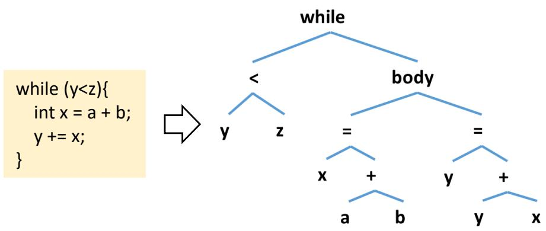  
Abstract Syntax Tree(AST)

## Parsers

## • Syntax analysis takes a sentence as the input, and outputs the parse tree or AST of the sentence

◆Top-down: from the root to the leaves, in each step:

 Which non-terminal to replace?

 Which production?

Bottom-up: from leaves to the root

 Shift or reduce?

 If reduce, then which production?

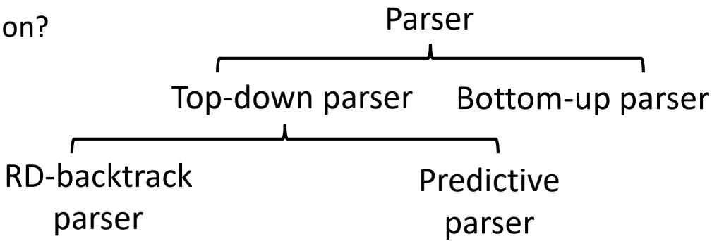

## Top-down

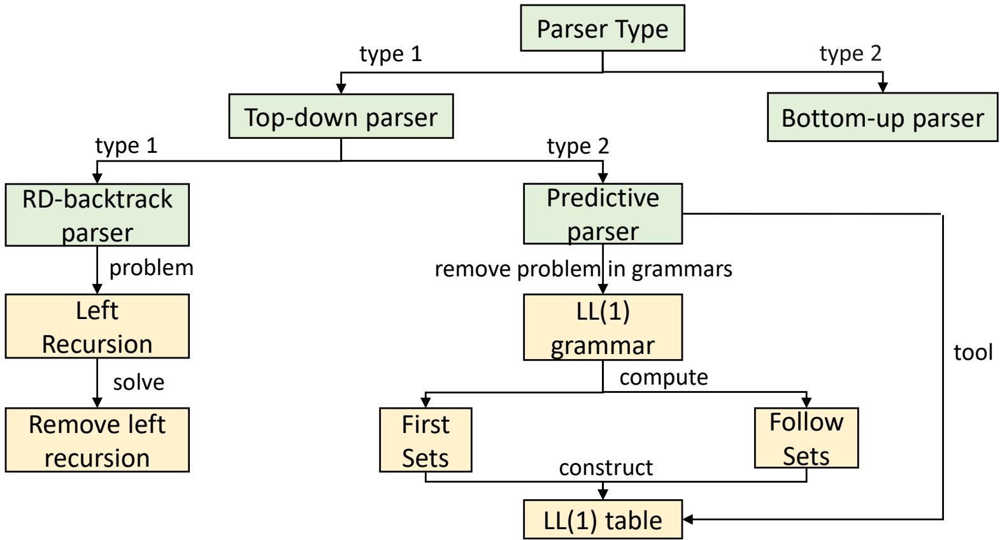

## Top-down Parsers

## • Top-down Parsing

Recursive-descent parsing [RDP, 递归下降语法分析]

• (immediate and indirect) left recursion -> remove left recursion

• Backtracking -> brutal force, not preferred due to complications and high overheads

. Predicative parsing – LL(k) [预测分析]

• Predict the right production based on the input symbol (i.e., lookahead), no backtracking!

• Preliminaries: (1) remove left recursion, (2) left factoring

• To enable prediction: FIRST and FOLLOW

$\mathsf { F I R S T } ( \alpha ) = \{ \textsf { a } | \alpha \Rightarrow \mathsf { a . . . , a } \in \mathsf { V } _ { \tau } \} ,$ ε can be included

• FOLLOW $( \mathbb { A } ) = \{ \textbf { a } | \textbf { S } \Rightarrow . . . , \mathbb { a } . . . , \mathbb { a } \in \mathbb { V } _ { \intercal } \} ,$ \$ can be included

• Prediction based on the input symbol a when expanding A:

• For A with $A \to \alpha \mid \beta$ , where FIRST(α) and FIRST(β) are disjoint, i.e., chose the one with a inside its FIRST set.

• If all FIRST sets do not contain a, but $\mathfrak { s } \in \mathsf { F l R S T } ( \mathfrak { a } )$ while $\mathsf { a } \in \mathsf { F O L L O W } ( \mathsf { A } )$ , chose FIRST(α)

## Remove Left Recursion[消除左递归]

• Immediate left recursion can be eliminated by the following technique, which works for any number of $\mathsf { A } \cdot$ productions.

◆First, group the productions as

$\mathsf { A } \to \mathsf { A } \alpha _ { 1 } \mid \mathsf { A } \alpha _ { 2 } \mid . . . \mid \mathsf { A } \alpha _ { \mathsf { m } } \mid \beta _ { 1 } \mid \beta _ { 2 } \dotsc \mid \beta _ { \mathsf { n } }$ where no $\beta _ { \mathrm { i } }$ begins with an A.

Then, replace the A-productions by

$$
{ \mathbb A } \to { \mathbb B } _ { 1 } { \mathbb A } ^ { \prime } \mid { \mathbb B } _ { 2 } { \mathbb A } ^ { \prime } \mid \dots \mid { \mathbb B } _ { n } { \mathbb A } ^ { \prime } { \mathbb A } { \mathbb N } { \mathbb D } \quad { \mathbb A } ^ { \prime } \to { \mathbb alpha } _ { 1 } { \mathbb A } ^ { \prime } \mid { \mathbb alpha } _ { 2 } { \mathbb A } ^ { \prime } \mid \dots \mid { \mathbb \alpha } _ { m } { \mathbb A } ^ { \prime } \mid \varepsilon
$$

• Exercise-Remove Immediate left recursion.

$$
\mathsf { G } _ { 1 } [ \mathsf { E } ] \colon \mathsf { E }  \mathsf { E } + \mathsf { T } | \bigm \rVert _ { \vphantom { \mathsf { G } _ { 1 } ^ { \mathsf { B } } } } ^ { \mathsf { B } } ;
$$

$$
\bullet \mathsf { G } _ { 2 } [ \mathsf { E } ] \colon \mathsf { E } \to \mathsf { T E } ^ { \prime } ; \mathsf { E } ^ { \prime } \to + \mathsf { T E } ^ { \prime } \enspace | \enspace \pmb { \varepsilon } ;
$$

$$
T  T ^ { * } F \ | | \overline { { \mathsf { F } } } | ; ^ { \mathsf { \beta } }
$$

F → (E) | i.

$$
\mathsf { T } \to \mathsf { F T ^ { \prime } } ; \mathsf { T ^ { \prime } } \to { ^ { * } \mathsf { F T ^ { \prime } } } \mid \mathfrak { E } ;
$$

$$
{ \mathsf { F } }  ( { \mathsf { E } } ) \mid { \mathsf { i } } .
$$

## Compute FIRST

• To compute FIRST(X) for all grammar symbol X, apply the following rules until no more terminals or ε can be added to any FIRST set:

◆Rule1: If ${ \sf X } \in { \sf V } _ { \sf T }$ , then $\mathsf { F l R S T } ( \mathsf { X } ) = \{ \mathsf { X } \}$ . [X是终结符]

◆Rule2: If ${ \tt X } \in { \tt V } _ { \tt N }$ and $\textsf { X } \to$ ε exists, then add ε to FIRST(X). [非终结符,空式]

◆Rule3: If ${ \tt X } \in { \tt V } _ { \tt N }$ and ${ \sf X }  { \sf Y } _ { 1 } { \sf Y } _ { 2 } { \sf Y } _ { 3 } . . . { \sf Y } _ { { \sf k } } ,$ then [非终结符,非空式]

 If for some ${ \mathsf { Y } } _ { \mathrm { i } }$ and a terminal a: ① ε ∈ all $\mathsf { o f } \mathsf { F l R S T } ( \mathsf { Y } _ { 1 } ) , . . . ,$ F $| { \mathsf { R S T } } ( { \mathsf { Y } } _ { \mathsf { i - 1 } } ) , { \mathsf { i . e . } }$ $\Upsilon _ { 1 } . . . \Upsilon _ { \mathrm { i } - 1 } \stackrel { * } { \Rightarrow } \varepsilon ; \bigtriangleup$ a ∈ FIRST(Y ) \ {ε}. Then, a ∈ FIRST(X).

 E.g.,

 Everything in FIRST(Y1) \ {ε} is surely in FIRST(X).

 If ${ \sf Y } _ { 1 }$ doesn’t derive ε, then we add nothing more.

 But if $\Upsilon _ { 1 } \stackrel { * } { \Rightarrow } \varepsilon ,$ then we add FIRST $( Y _ { 2 } )$ \ {ε} , and so on…

 Add ε to FIRST $( \mathsf { X } ) ,$ if ε is in FIRST(Yi) for all $\mathsf { i } = 1 , 2 , \ldots \mathsf { k } .$

## Compute FIRST

• Next, we can compute FIRST for any string $\alpha = \sf X _ { 1 } X _ { 2 } . . . X _ { n }$ [符号串]

◆Add all non-ε symbols of FIRST $( { \sf X } _ { 1 } )$ to FlRST(⍺).

◆Add non-ε symbols of FIRST $( X _ { \mathrm { i } } )$ , 2≤i≤n, to FIRST(α), if FIRST $( \mathsf { X } _ { 1 } ) _ { \ r { 1 } }$ , ..., FIRST $( X _ { \mathfrak { j } - 1 } )$ all contain ε. [前i-1个都包含空串]

◆Add ε to FIRST(⍺), if FIRST $( \mathsf { X } _ { 1 } )$ , ..., FIRST $( X _ { n } )$ all contain ε.

[First(α)集合的计算本质上就是看α能推导出什么， First(α)包括所有α能推导出的句子的首个字符 (必须是终结符或空串)]

[给定 $\mathsf { a } \to \mathsf { X } _ { 1 } \mathsf { X } _ { 2 } . . . \mathsf { X } _ { \mathsf { n } }$ ，First(α)的计算基于单个First(Xi) 的计算（方法见上页）

## Compute FIRST

• Example: G[E]: E → TE’ ; E’ → +TE’ | ε ; T → FT’ ; T’ → \*FT’ | ε ; F →

(E) | id , compute the FIRST set of each non-terminal.

◆ FIRST(E):{ (, id }

◆ FIRST(T):{ (, id }

◆ FIRST(E’):{ +, ε }

◆ FIRST(T’):{ \*, ε }

◆ FIRST(F):{ (, id }

(3) If FIRST(X ), ..., FIRST(X ) all contain ε, add ε to FIRST(⍺)

It is necessary to determine whether the FIRST set has changed after each rule application.

E → TE’ FIRST(T) add to FIRST(E), FIRST(T) doesn’t contain ε

E’ → +TE’ FIRST(+) add to FIRST(E’), FIRST(+) doesn’t contain ε

E’ → ε ε add to FIRST(E’)

T → FT’ FIRST(F) add to FIRST(T), FIRST(F) doesn’t contain ε

T’ → \*FT’ FIRST(\*) add to FIRST(T’), FIRST(\*) doesn’t contain ε

T’ → ε ε add to FIRST(T’)

F → (E) FIRST(‘(’) add to FIRST(F), FIRST(‘(’) doesn’t contain ε

F → id FIRST(id) add to FIRST(F)

## Compute FOLLOW

• To compute FOLLOW(A) for all non-terminals A, apply the following rules until nothing can be added to any FOLLOW set.

◆Rule1: Place \$ in FOLLOW(S), where S is the start symbol.

◆Rule2: If there is a production A → αBβ, then everything in FIRST(β) except ε is in FOLLOW(B).

◆Rule3: If there is a production A → αB, or a production A → αBβ, where FIRST(β) contains ε, then everything in FOLLOW(A) is in FOLLOW(B).

[FOLLOW(A)计算的本质是在看这个A后 (不包含A本身的推导结果) 的符号 (必须是终结符或结束符号)]

[给定A → αBβ, FOLLOW(B)计算基于FIRST(β)的计算

## Compute FOLLOW

• G[E]: E → TE’ ; E’ → +TE’ | ε ; T → FT’ ; T’ → \*FT’ | ε ; F → (E) | id

◆ FIRST(E):{ (, id };FIRST(T):{ (, id };FIRST(E’):{ +, ε };FIRST(T’):{ \*, ε };FIRST(F):{ (, id }.

◆ FOLLOW(E):{ \$, ) }

◆ FOLLOW(T):{ +, \$, ) }

◆ FOLLOW(E’):{ \$ , ) }

◆ FOLLOW(T’):{ +, \$, ) }

◆ FOLLOW(F):{ \*, +, \$, ) }

A → αBβ

(1) If A is the start symbol, \$ ∈ FOLLOW(A)

(2) Everything in FIRST(β) except ε is in FOLLOW(B).

(3) If β does not exist or FIRST(β) contains ε, then everything in FOLLOW(A) is in FOLLOW(B).

◆ Place \$ in FOLLOW(E), since E is the start symbol.

◆ E → TE’

 FIRST(E’) except ε is in FOLLOW(T).

 Everything in FOLLOW(E) is in FOLLOW(E’).

 Since FIRST(E’) contains ε, then everything in FOLLOW(E) is in FOLLOW(T).

◆ E’ → +TE’ | ε

 FIRST(E’) except ε is in FOLLOW(T).

 Everything in FOLLOW(E’) is in FOLLOW(E’).

 Since FIRST(E’) contains ε, then everything in FOLLOW(E’) is in FOLLOW(T).

## Non-recursive LL(1) Parser [非递归]

• Input buffer[输入串]: contains the string to be parsed, followed by the “end marker” \$.

• Stack[推导的中间结果]: holds a sequence of grammar symbols and the symbol \$ to mark the bottom of the stack. It may contain:

◆Terminals that have yet to matched against the input symbol.

◆Non-terminals that have yet to be expanded.

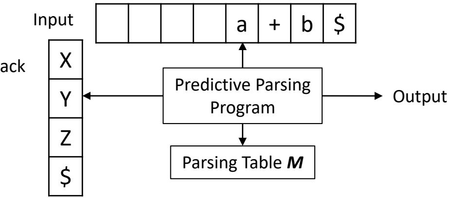

Parsing Table M[A,a] [语法分析表]: an entry containing production “A→…” or error.

Predictive Parsing Program[语法分析程 序]: Execute the action according to <stack top, current input symbol> 159

## LL(1) Parse Table [预测分析表]

<table><tr><td rowspan=8 colspan=1>G[E]:E→TEE&#x27;→+TE&#x27;丨εT→FT&#x27;T&#x27;→ *FT&#x27;丨εF→(E)|id</td><td></td><td></td><td></td><td></td><td></td><td></td><td></td><td></td></tr><tr><td rowspan=2 colspan=1></td><td rowspan=2 colspan=1>id</td><td rowspan=2 colspan=1>+</td><td rowspan=2 colspan=1>*</td><td rowspan=2 colspan=1>（</td><td rowspan=2 colspan=1>）</td><td rowspan=2 colspan=1>$</td><td></td></tr><tr><td rowspan=6 colspan=1>?Input symbol,lists all possibleterminals and $</td></tr><tr><td rowspan=1 colspan=1>E</td><td rowspan=1 colspan=1>E→TE&#x27;</td><td rowspan=1 colspan=1></td><td rowspan=1 colspan=1></td><td rowspan=1 colspan=1>E→TE&#x27;</td><td rowspan=1 colspan=1></td><td rowspan=1 colspan=1></td></tr><tr><td rowspan=1 colspan=1>E</td><td rowspan=1 colspan=1></td><td rowspan=1 colspan=1>E&#x27;→+TE&#x27;</td><td rowspan=1 colspan=1></td><td rowspan=1 colspan=1></td><td rowspan=1 colspan=1>E→m</td><td rowspan=1 colspan=1>E→m</td></tr><tr><td rowspan=1 colspan=1>T</td><td rowspan=1 colspan=1>T→FT&#x27;</td><td rowspan=1 colspan=1></td><td rowspan=1 colspan=1></td><td rowspan=1 colspan=1>T→FT&#x27;</td><td rowspan=1 colspan=1></td><td rowspan=1 colspan=1></td></tr><tr><td rowspan=1 colspan=1>T</td><td rowspan=1 colspan=1></td><td rowspan=1 colspan=1>T→m</td><td rowspan=1 colspan=1>T&#x27;→ *FT&#x27;</td><td rowspan=1 colspan=1></td><td rowspan=1 colspan=1>T→m</td><td rowspan=1 colspan=1>T&#x27;→ε</td></tr><tr><td rowspan=1 colspan=1>F</td><td rowspan=1 colspan=1>F→id</td><td rowspan=1 colspan=1></td><td rowspan=1 colspan=1></td><td rowspan=1 colspan=1>F→(E)</td><td rowspan=1 colspan=1></td><td rowspan=1 colspan=1></td></tr></table>

“predicts” the correct action based on one lookahead

Reject on reaching error state

Accept on end of input & empty stack

FIRST(E):{ (, id } FOLLOW(E):{ \$, )}

FIRST(T):{ (, id } FOLLOW(T):{ +, \$, )}

FIRST(E’):{ +, ε } FOLLOW(E’):{ \$ , )}

FIRST(T’):{ \*, ε } FOLLOW(T’):{ +, \$, )}

FIRST(F):{ (, id }. FOLLOW(F):{ \*, +, \$, )}

## LL(1) Parsing Algorithm [非递归算法]

## • Algorithm Step-by-Step based on <X, a>:

◆X: symbol at the top of the stack

◆a: current input token

◆ If ${ \sf X } \in { \sf V } _ { \top } ,$ [栈顶符号为终结符] and

 X == a == \$, declare SUCCESS, stop parsing.

 X == a != \$, pop X from stack and move the current input symbol forward one.

 X != a, declare ERROR, input is rejected, stop parsing.

◆ If ${ \mathsf { X } } \in { \mathsf { V } } _ { \mathsf { N } } ,$ [栈顶符号为非终结符] and

 M[X, a] has a production about X, pop X and push right side of production to stack.

$\mathsf { M } [ \mathsf { X } , \mathsf { a } ] = = \mathsf { e m p t y } ,$ declare ERROR, input is rejected, stop parsing.

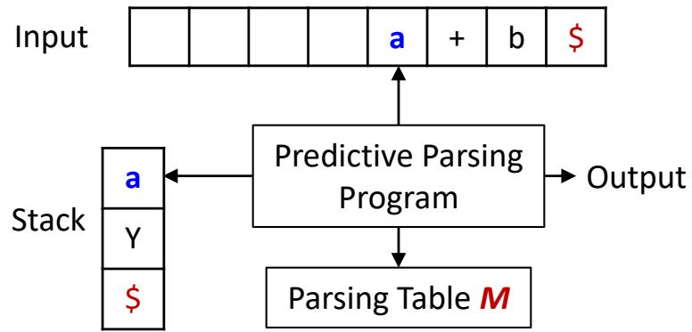

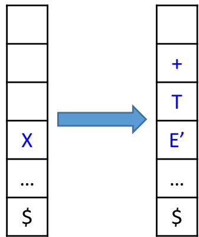

If M[X,a] = X → +TE’ Push to stack in Reverse Order [逆序入栈]

If M[X,a] = X → ε Only pop and push nothing

## Bottom-Up

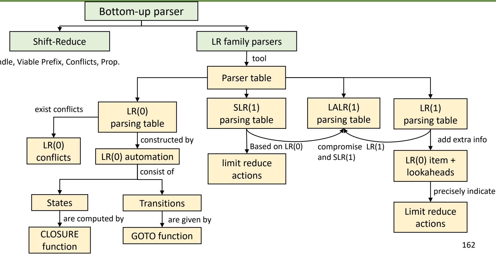

## Bottom-up: Shift-Reduce [移入-归约]

• Shift-reduce parsing is a form of bottom-up parsing in which a stack[栈] holds grammar symbols and an input buffer holds the input string.

• Reduction[规约]: At each reduction step, a specific substring matching the body of a production is replaced[替换] by the nonterminal at the head of that production.

• Shift[移入]: During a left-to-right scan of the input string, the parser shifts zero or more input symbols onto the stack, until it is ready to reduce a string β of grammar symbols on top of the stack.

## Phrase and Handle

• G(E): E → T | E+T; T → F | T\*F; F → (E) | a | b | c

• For sentential form a \* b + c

• Phrase: a\*b+c, a\*b, a, b, c

• Simple Phrase: a, b, c

• Handle: a

短语：一个句型的语法树中任意树叶结点组成的短语

直接短语：只有父子两代的子树形成的短语

句柄：语法树中最左那棵只有父子两代的子树形成的短语


## Viable Prefix [活前缀]

• A viable prefix[活前缀/可行前缀] is a prefix of a right-sentential form that does not pass the end of the rightmost handle of that sentential form.

◆Stack content is always a viable prefix, guaranteeing the shift / reduce is on the right track.

• Example 1: S ⇒ aEb ⇒ aaEb, the handle is aE, so the viable prefix is a,

aa, aaE, but not aaEb.

<table><tr><td rowspan=1 colspan=1>Stack</td><td rowspan=1 colspan=1>Input</td></tr><tr><td rowspan=1 colspan=1>$...</td><td rowspan=1 colspan=1>Handle...$</td></tr><tr><td rowspan=1 colspan=1>$..</td><td rowspan=1 colspan=1>andle...$</td></tr><tr><td rowspan=1 colspan=1>$...Ha</td><td rowspan=1 colspan=1>ndle...$</td></tr><tr><td rowspan=1 colspan=1>$...Han</td><td rowspan=1 colspan=1>dle...$</td></tr></table>

## LR(k) Parser

## • LR(k) : member of LR family of parsers

"L" stands for left-to-right scanning of the input.

"R" stands for constructing a rightmost derivation in reverse.

◆ "k" is the number of input symbols of the lookahead used to make number of parsing decision.

## • Comparison with LL(k) parser

◆ Efficient as LL(k): Linear in time and space to length of input (same as LL(k)).

◆ Convenient as LL(k): Can generate automatically from grammar – YACC, Bison.

More complex than LL(k): Harder to debug parser when grammar causes conflicting predictions.

More powerful than LL(k): Handles more grammars: no left recursion removal, left factoring needed.

## LR Parser

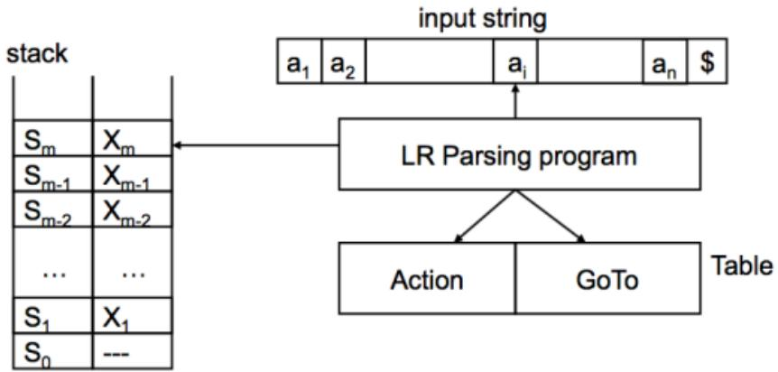

• The stack holds a sequence of states, $S _ { 0 } S _ { 1 } . . . S _ { m }$

<table><tr><td rowspan=2 colspan=1>State</td><td rowspan=1 colspan=5>Action</td><td rowspan=1 colspan=2>Goto</td></tr><tr><td rowspan=1 colspan=1>*</td><td rowspan=1 colspan=1>+</td><td rowspan=1 colspan=1>0</td><td rowspan=1 colspan=1>1</td><td rowspan=1 colspan=1>$</td><td rowspan=1 colspan=1>E</td><td rowspan=1 colspan=1>B</td></tr><tr><td rowspan=1 colspan=1>0</td><td rowspan=1 colspan=1></td><td rowspan=1 colspan=1></td><td rowspan=1 colspan=1>s1</td><td rowspan=1 colspan=1>s2</td><td rowspan=1 colspan=1></td><td rowspan=1 colspan=1>3</td><td rowspan=1 colspan=1>4</td></tr><tr><td rowspan=1 colspan=1>1</td><td rowspan=1 colspan=1>r4</td><td rowspan=1 colspan=1>r4</td><td rowspan=1 colspan=1>r4</td><td rowspan=1 colspan=1>r4</td><td rowspan=1 colspan=1>r4</td><td rowspan=1 colspan=1></td><td rowspan=1 colspan=1></td></tr><tr><td rowspan=1 colspan=1>2</td><td rowspan=1 colspan=1>r5</td><td rowspan=1 colspan=1>r5</td><td rowspan=1 colspan=1>r5</td><td rowspan=1 colspan=1>r5</td><td rowspan=1 colspan=1>r5</td><td rowspan=1 colspan=1></td><td rowspan=1 colspan=1></td></tr><tr><td rowspan=1 colspan=1>3</td><td rowspan=1 colspan=1>s5</td><td rowspan=1 colspan=1>s6</td><td rowspan=1 colspan=1></td><td rowspan=1 colspan=1></td><td rowspan=1 colspan=1>acc</td><td rowspan=1 colspan=1></td><td rowspan=1 colspan=1></td></tr><tr><td rowspan=1 colspan=1>4</td><td rowspan=1 colspan=1>r3</td><td rowspan=1 colspan=1>r3</td><td rowspan=1 colspan=1>r3</td><td rowspan=1 colspan=1>r3</td><td rowspan=1 colspan=1>r3</td><td rowspan=1 colspan=1></td><td rowspan=1 colspan=1></td></tr><tr><td rowspan=1 colspan=1>5</td><td rowspan=1 colspan=1></td><td rowspan=1 colspan=1></td><td rowspan=1 colspan=1>s1</td><td rowspan=1 colspan=1>s2</td><td rowspan=1 colspan=1></td><td rowspan=1 colspan=1></td><td rowspan=1 colspan=1>7</td></tr><tr><td rowspan=1 colspan=1>6</td><td rowspan=1 colspan=1></td><td rowspan=1 colspan=1></td><td rowspan=1 colspan=1>s1</td><td rowspan=1 colspan=1>s2</td><td rowspan=1 colspan=1></td><td rowspan=1 colspan=1></td><td rowspan=1 colspan=1>8</td></tr><tr><td rowspan=1 colspan=1>7</td><td rowspan=1 colspan=1>r1</td><td rowspan=1 colspan=1>r1</td><td rowspan=1 colspan=1>r1</td><td rowspan=1 colspan=1>r1</td><td rowspan=1 colspan=1>r1</td><td rowspan=1 colspan=1></td><td rowspan=1 colspan=1></td></tr><tr><td rowspan=1 colspan=1>8</td><td rowspan=1 colspan=1>r2</td><td rowspan=1 colspan=1>r2</td><td rowspan=1 colspan=1>r2</td><td rowspan=1 colspan=1>r2</td><td rowspan=1 colspan=1>r2</td><td rowspan=1 colspan=1></td><td rowspan=1 colspan=1></td></tr></table>

◆ States are to track where we are in a parse.

◆ Each grammar symbol $x _ { j }$ is associated with a state $\mathsf { \pmb { S } } _ { \mathrm { i } }$

• Contents of stack + input $( \mathsf { X } _ { 1 } \mathsf { X } _ { 2 } . . . \mathsf { X } _ { \mathsf { m } } \mathsf { a } _ { \mathsf { i } } . . . \mathsf { a } _ { \mathsf { n } } )$ is a right sentential form ◆ If the input string is a member of the language

• Uses $[ \mathsf { S } _ { \mathrm { i } } , \mathsf { a } _ { \mathrm { i } } ]$ to index into parsing table to determine action

## Possible Actions[可能的动作]

## • ACTION $[ \mathsf { S } _ { \mathsf { m } } ,$ ai] has four possible actions:

Shift $( \mathsf { s } _ { \mathsf { x } } )$ : the handle is not completed loaded in the stack

1. Shift the next input symbol onto the top of the stack

2. Add State x to the stack

• Reduce $( r _ { y } )$ : the handle is at the top of the stack

1. Pop the handle and all its associated states.

2. Reduce the handle by the $y ^ { \mathrm { t h } }$ production (say $\pmb { \Delta }  \mathsf { a l }$

3. Push A onto the stack

4. Push state $\mathsf { \pmb { S _ { j } } }$ by GOTO table, $\mathsf { S } _ { \mathrm { j } } = \mathsf { G O T O } [ \mathsf { S } _ { \mathrm { i } } , \mathsf { A } ]$ and $\pmb { S _ { \mathrm { i } } } \mathrm { i } s$ the current state.

## Accept

◆ $\mathsf { A C T I O N } [ \mathsf { S } _ { \mathrm { i } } , \mathsf { a } _ { \mathrm { i } } ] = \mathsf { A C C } ,$ then parsing is complete and successfully

## • Error

$\mathsf { A C T } | \mathsf { O N } [ \mathsf { S } _ { \mathrm { i } } , \mathsf { a } _ { \mathrm { i } } ] = < \mathsf { e m p t y } >$ , then report error and stop

## Construct Parse Table

• Construct parsing table:

• identify the possible states and arrange the transitions among them.

• Different Parsing tables

• LR(0) – Too weak (no lookahead)

• Simplest LR parsing, only considers stack to decide shift/reduce

• SLR(1) – Simple LR, 1 token lookahead

• lookahead from first/follow rules derived from LR(0)

• Keeps table as small as LR(0)

• LALR(1) – Most common, 1 token lookahead

<table><tr><td rowspan=1 colspan=1>Stat</td><td rowspan=1 colspan=5>Action</td><td rowspan=1 colspan=2>Goto</td></tr><tr><td rowspan=1 colspan=1>e</td><td rowspan=1 colspan=1>*</td><td rowspan=1 colspan=1>+</td><td rowspan=1 colspan=1>0</td><td rowspan=1 colspan=1>1</td><td rowspan=1 colspan=1>$</td><td rowspan=1 colspan=1>E</td><td rowspan=1 colspan=1>B</td></tr><tr><td rowspan=1 colspan=1>0</td><td rowspan=1 colspan=1></td><td rowspan=1 colspan=1></td><td rowspan=1 colspan=1>s1</td><td rowspan=1 colspan=1>s2</td><td rowspan=1 colspan=1></td><td rowspan=1 colspan=1>3</td><td rowspan=1 colspan=1>4</td></tr><tr><td rowspan=1 colspan=1>1</td><td rowspan=1 colspan=1>r4</td><td rowspan=1 colspan=1>r4</td><td rowspan=1 colspan=1>r4</td><td rowspan=1 colspan=1>r4</td><td rowspan=1 colspan=1>r4</td><td rowspan=1 colspan=1></td><td rowspan=1 colspan=1></td></tr><tr><td rowspan=1 colspan=1>2</td><td rowspan=1 colspan=1>r5</td><td rowspan=1 colspan=1>r5</td><td rowspan=1 colspan=1>r5</td><td rowspan=1 colspan=1>r5</td><td rowspan=1 colspan=1>r5</td><td rowspan=1 colspan=1></td><td rowspan=1 colspan=1></td></tr><tr><td rowspan=1 colspan=1>3</td><td rowspan=1 colspan=1>S5</td><td rowspan=1 colspan=1>s6</td><td rowspan=1 colspan=1></td><td rowspan=1 colspan=1></td><td rowspan=1 colspan=1>acC</td><td rowspan=1 colspan=1></td><td rowspan=1 colspan=1></td></tr><tr><td rowspan=1 colspan=1>4</td><td rowspan=1 colspan=1>r3</td><td rowspan=1 colspan=1>r3</td><td rowspan=1 colspan=1>r3</td><td rowspan=1 colspan=1>r3</td><td rowspan=1 colspan=1>r3</td><td rowspan=1 colspan=1></td><td rowspan=1 colspan=1></td></tr><tr><td rowspan=1 colspan=1>5</td><td rowspan=1 colspan=1></td><td rowspan=1 colspan=1></td><td rowspan=1 colspan=1>s1</td><td rowspan=1 colspan=1>s2</td><td rowspan=1 colspan=1></td><td rowspan=1 colspan=1></td><td rowspan=1 colspan=1>7</td></tr><tr><td rowspan=1 colspan=1>6</td><td rowspan=1 colspan=1></td><td rowspan=1 colspan=1></td><td rowspan=1 colspan=1>s1</td><td rowspan=1 colspan=1>s2</td><td rowspan=1 colspan=1></td><td rowspan=1 colspan=1></td><td rowspan=1 colspan=1>8</td></tr><tr><td rowspan=1 colspan=1>7</td><td rowspan=1 colspan=1>r1</td><td rowspan=1 colspan=1>r1</td><td rowspan=1 colspan=1>r1</td><td rowspan=1 colspan=1>r1</td><td rowspan=1 colspan=1>r1</td><td rowspan=1 colspan=1></td><td rowspan=1 colspan=1></td></tr><tr><td rowspan=1 colspan=1>8</td><td rowspan=1 colspan=1>r2</td><td rowspan=1 colspan=1>r2</td><td rowspan=1 colspan=1>r2</td><td rowspan=1 colspan=1>r2</td><td rowspan=1 colspan=1>r2</td><td rowspan=1 colspan=1></td><td rowspan=1 colspan=1></td></tr></table>

• fancier lookahead analysis using the same LR(0) automaton as SLR(1)

• LR(1) – 1 token lookahead, complex algorithms and big tables

• LR(k) – k tokens lookahead, even bigger tables

## Item[项目]

• The parsing table is based on the notion of LR(0) items (simply called items here) which are grammar rules with a special dot added somewhere in the right-hand side.

• For example, the rule A → XYZ has the following four items:

$$
\bullet \mathbf { A }  \bullet \mathbf { X } \pmb { Y } \pmb { Z }
$$

$$
\bullet \mathsf { A }  \mathsf { X } \bullet \mathsf { Y } \mathsf { Z }
$$

$$
\bullet \mathtt { A } \to \mathsf { X Y } \bullet \mathsf { Z }
$$

$$
\bullet \mathsf { A } \Rightarrow \mathsf { X } \mathsf { Y } \mathsf { Z } \ ^ { \circ }
$$

• Rules of the form A → ε have only a single item A → •

## Construct the LR(0) Automaton

• Each FA state corresponding to a set of items

• How to construct a state? -- closure operation

◆Closure: the action of adding equivalent items to a set

◆Example: $\mathsf { S } ^ { \prime } \to \mathsf { \cdot S } \mathsf { S } \to \mathsf { \cdot B B } \mathsf { B } \to \mathsf { \cdot a B } \mathsf { B } \to \mathsf { \cdot b }$

• How to construct transition form one state to another? -- goto operation

◆ A transition on symbol X from state i to state j

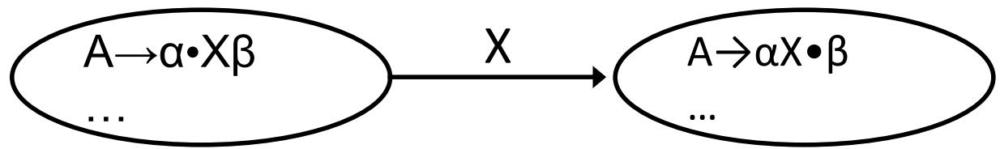

$$
( 0 ) \ S ^ { \prime } \to \ S
$$

$$
( 1 ) \mathsf { S } \to \mathsf { B B }
$$

$$
( 2 ) \ B \to \mathsf { a B }
$$

$$
( 3 ) \ B  { \ b }
$$

## CLOSURE()[闭包]

• Closure of item sets: if I is a set of items for a grammar G, then CLOSURE(I) is the set of items constructed from I by the two rules:

1. Initially, add every item in I to CLOSURE(I)

2. For any item A → ⍺·Bβ in CLOSURE(I), if B → γ is a production, and B → ·γ is not already there , then add item B → ·γ to CLOSURE(I)

◆ Apply the above rules until no more new items can be added to CLOSURE(I)

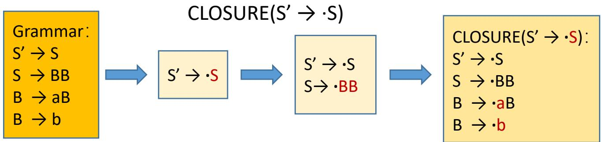  
Note: the location of the point ·

## GOTO()[跳转]

GOTO(I, X): returns state (set of items) that can be reached by advancing I by X

、 I is a set of items and X is a grammar symbol

◆ Return the closure of the set of all items $[ \mathsf { A } \to \alpha \mathsf { X } \cdot \beta ]$ when $[ \mathsf { A } \to \alpha \cdot \mathsf { X } \beta ]$ is in I

◆ Used to define the transitions in the LR(0) automaton

 The states of the automaton correspond to sets of items, and GOTO(I, X) specifies the transition from the state for I under input X

$$
\begin{array} { l } { \mathsf { G r a m m a r } \mathrm { : } } \\ { \mathsf { S ^ { \prime } } \to \mathsf { S } } \\ { \mathsf { S } \to \mathsf { B B } } \\ { \mathsf { B } \to \mathsf { a B } } \\ { \mathsf { B } \to \mathsf { b } } \end{array}
$$

$$
\begin{array} { r l } & { \mathsf { I } _ { 0 } \cdot } \\ & { \mathsf { S } ^ { \prime }  \cdot \mathsf { S } } \\ & { \mathsf { S }  \cdot \mathsf { B B } } \\ & { \mathsf { B }  \cdot \mathsf { a B } } \\ & { \mathsf { B }  \cdot \mathsf { b } } \end{array}
$$

$$
\begin{array} { l } { \displaystyle \vert _ { 2 } \colon } \\ { \displaystyle \mathsf { S } \to \mathsf { B } \cdot \mathsf { B } } \\ { \displaystyle \mathsf { B } \to \mathsf { \cdot a B } } \\ { \displaystyle \mathsf { B } \to \mathsf { . b } } \end{array}
$$

CLOSURE(S → B·B)

$$
G O T O ( I _ { O } , B )
$$

## The example

[建立第一个项]

[通过跳转建立后续项]

$$
\begin{array} { l } { \mathsf { G r a m m a r } \mathrm { : } } \\ { \mathsf { S ^ { \prime } } \to \mathsf { S } } \\ { \mathsf { S } \to \mathsf { B B } } \\ { \mathsf { B } \to \mathsf { a B } } \\ { \mathsf { B } \to \mathsf { b } } \end{array}
$$

## Example (cont.)

Grammar

(0) ${ \mathsf S } ^ { \prime } \to { \mathsf S }$

(1) $S  { \mathsf { B B } }$

(2) $\textsf { B } \to \mathsf { a B }$

(3) $a > b$

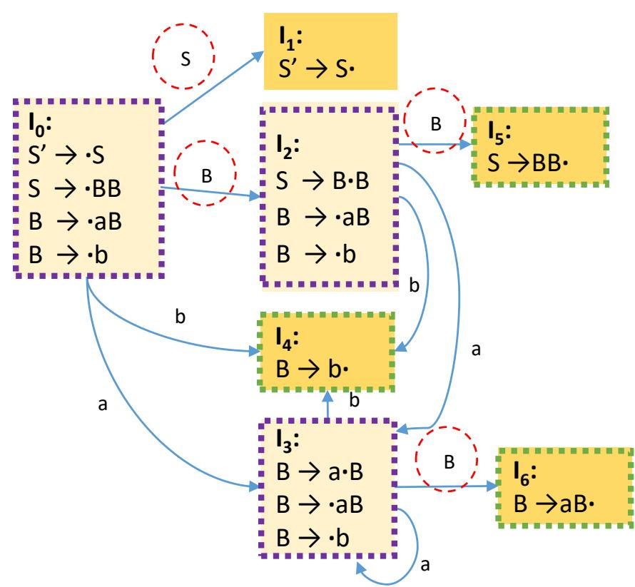

<table><tr><td rowspan=2 colspan=1>State</td><td rowspan=1 colspan=3>ACTION</td><td rowspan=1 colspan=4>GOTO</td></tr><tr><td rowspan=1 colspan=1>a</td><td rowspan=1 colspan=1>b</td><td rowspan=1 colspan=1>S</td><td rowspan=1 colspan=2>■ S</td><td rowspan=1 colspan=1>■B ■■</td><td rowspan=1 colspan=1></td></tr><tr><td rowspan=1 colspan=1>0</td><td rowspan=1 colspan=1>: s3.11</td><td rowspan=1 colspan=1>s4 :111</td><td rowspan=1 colspan=1></td><td rowspan=1 colspan=2>1■</td><td rowspan=1 colspan=1>■2 ■■■</td><td rowspan=1 colspan=1></td></tr><tr><td rowspan=1 colspan=1>1</td><td rowspan=1 colspan=1></td><td rowspan=1 colspan=1></td><td rowspan=1 colspan=1>acc</td><td rowspan=1 colspan=1></td><td rowspan=1 colspan=1></td><td rowspan=1 colspan=1>■■■■</td><td rowspan=1 colspan=1></td></tr><tr><td rowspan=1 colspan=1>2</td><td rowspan=1 colspan=1>: s31</td><td rowspan=1 colspan=1>s4</td><td rowspan=1 colspan=1></td><td rowspan=1 colspan=1></td><td rowspan=1 colspan=1></td><td rowspan=1 colspan=1>■5</td><td rowspan=1 colspan=1></td></tr><tr><td rowspan=1 colspan=1>3</td><td rowspan=1 colspan=1>■s3</td><td rowspan=1 colspan=1>S4:</td><td rowspan=1 colspan=1></td><td rowspan=1 colspan=1></td><td rowspan=1 colspan=1></td><td rowspan=1 colspan=1>6  ■■</td><td rowspan=1 colspan=1></td></tr><tr><td rowspan=1 colspan=1>4</td><td rowspan=1 colspan=1>r3</td><td rowspan=1 colspan=1>r3</td><td rowspan=1 colspan=1>r3：</td><td rowspan=1 colspan=2></td><td rowspan=1 colspan=2></td></tr><tr><td rowspan=1 colspan=1>5</td><td rowspan=1 colspan=1>r1</td><td rowspan=1 colspan=1>r1</td><td rowspan=1 colspan=1>r1</td><td rowspan=1 colspan=2></td><td rowspan=1 colspan=2></td></tr><tr><td rowspan=1 colspan=1>6</td><td rowspan=1 colspan=1>r2</td><td rowspan=1 colspan=1>r2</td><td rowspan=1 colspan=1>r2</td><td rowspan=1 colspan=2></td><td rowspan=1 colspan=2></td></tr></table>

“state j” refers to the state of the set of items Ij

## Construct LR(0) States[构造LR(0)状态集]

• Create augmented grammar G’ for G: [增广文法]

◆ Given $G \colon S  \alpha \mid \beta$ , create G’: $S ^ { \prime } \to S , S \to \alpha \mid \beta$

◆ Creates a single rule S’ → S that when reduced, signals acceptance

• Create 1st state by performing a closure on initial item $S ^ { \prime } \to \cdot S$ [初始状态]

Closure({S’→ ·S}) = {S’→ ·S, S → ·α, S → ·β}

• Create additional states by performing a GOTO on each symbol [添加状态]

◆ Goto({S’→ ·S, S → ·α, S → ·β}, α) =Closure({S → α·}) = {S → α·}

• Repeatedly perform gotos until there are no more states to add [重复操作]

$$
\begin{array} { r } { \left[ \begin{array} { l } { \mathsf { G r a m m a r } } \\ { 5 \to \alpha } \\ { 5 \to \beta } \\ { 5 \to \beta } \end{array} \right] \quad \Longrightarrow { \left[ \begin{array} { l } { \mathsf { G r a m m a r } ^ { \prime } } \\ { 5 \to \beta } \\ { 5 \to \alpha } \\ { 5 \to \beta } \end{array} \right] } \quad \Longrightarrow { \left[ \begin{array} { l } { \mathsf { C l o S U R E } ( 5 ^ { \prime } \to \ S ) } \\ { 5 ^ { \prime } \to \ S } \\ { 5 \to \alpha } \\ { 5 \to \beta } \end{array} \right] } \quad \stackrel { \cong } { \underbrace { \mathbb { B } } } \quad \underbrace { \left[ \begin{array} { l } { \mathsf { G r a m S U R E } ( 5 \to \alpha \cdot ) } \\ { 5 \to \alpha \cdot } \\ { 5 \to \alpha } \\ { 5 \to \beta } \end{array} \right] } _ { \textstyle \in \ : \emptyset } \quad \stackrel { \cong } { \underbrace { \mathbb { B } } } \quad \left[ \begin{array} { l } { \mathsf { C l o S U R E } ( 5 \to \alpha \cdot ) } \\ { 5 \to \alpha \cdot } \\ { 5 \to \alpha \cdot } \end{array} \right] } \end{array}
$$

## LR(0) Conflicts

• LR(0) has a reduce-reduce conflict if：

◆ Any state has two reduce items:

$X  \beta$ · and $\Upsilon  \omega$

• LR(0) has a shift-reduce conflict if:

◆ Any state has a reduce item and a shift item:

$$
{ \big \mathsf { X } } \to { \mathsf { \beta } } \cdot
$$

$$
{ \begin{array} { r l r l r l } & { \to \emptyset \cdot \operatorname { a n d } \lor \to \emptyset \cdot \operatorname { t } } & & { \quad \mathbf { I _ { 0 } } \colon } \\ & { } & & { \quad \mathbf { E } ^ { \prime } \cdot \mathbf { \hat { \times } } \mathbf { \hat { \times } } } \\ & { [ \begin{array} { l } { { \mathrm { c r a m m a r } } \cdot \mathbf { \hat { \times } } } \\ { \mathbf { E } ^ { \prime } \cdot \mathbf { \hat { \times } } } \\ { \mathbf { E } \cdot \mathbf { \hat { \times } } } \end{array} ] } & & { \quad \mathbf { E } \to \mathbf { \hat { \times } } \mathbf { \hat { \times } } } & & { \quad \mathbf { I _ { 1 } } \colon } \\ & { \to [ \begin{array} { l l } { 1 } & { \Gamma \mid \mathbf { \Omega } \lor \mathbf { z } } \\ { \Gamma  \mathbf { \hat { \times } } } \end{array} ] } & & { \quad \mathbf { E } \to \mathbf { \hat { \times } } \mathbf { \hat { \times } } } & & { \quad \mathbf { \hat { \times } } \mathbf { \hat { \times } } } \\ & { \to \mathbf { \hat { \times } } \mathbf { \hat { \times } } } & & { \quad \mathbf { \Omega } \lor \to \mathbf { \hat { \times } } } & & { \quad \mathbf { V } \to \mathbf { i } \ \cdot \mathbf { \hat { \times } } } \\ & { } & & { \quad \mathbf { \Omega } \lor \to \mathbf { \hat { \times } } \mathbf { \hat { \times } } } & & { \quad \mathbf { \Omega } \lor \mathbf { \hat { \times } } \mathbf { \hat { \times } } } \\ & { } & & { \quad \mathbf { V } \to \mathbf { \hat { \times } } \mathbf { \hat { \times } } } & & { \quad \mathbf { V } \to \mathbf { \hat { \times } } \mathbf { \hat { \times } } } \end{array} }
$$

## SLR(1): Simple LR(1)

## • SLR(1): Simple LR(1) with one lookahead

◆ Same LR(0) configurating sets, table structure, and parser operation.

◆ Allow both shift and reduce items as well as multiple reduce items.

◆ Use one token of lookahead to help arbitrate among the conflicts\*

◆ Reduce only if the next input token is a member of the FOLLOW set of the

nonterminal being reduced to

◆ Follow(T) = { +, ), ], \$ } Follow(V) = { = }

$$
\mathsf { F O L L O W } ( \mathsf { A } ) = \{ \mathsf { a } \mid \mathsf { S } \Rightarrow . . . \mathsf { A a } . . . ,
$$

$$
\mathsf { I } _ { 0 } \colon
$$

 If input t in Follow(T), reduce to T

$$
\mathsf { E } ^ { \prime } \to \mathsf { \Omega } ^ { \bullet } \mathsf { E }
$$

$$
\mathsf { E } ^ { \prime } \to \mathsf { E }
$$

 If input t in Follow(V), reduce to V

$$
\mathsf { E } \to \mathsf { E } { + } \mathsf { T } \mid \mathsf { T } \mid \mathsf { V } { = } \mathsf { E }
$$

$$
\mathsf { I } _ { 1 } \colon
$$

$$
\mathsf { E } \to \mathsf { \cdot } \mathsf { T }
$$

$$
\mathsf { T } \to ( \mathsf { E } ) \mid \mathsf { i d } \mid \mathsf { i d } [ \mathsf { E } ]
$$

$$
\mathsf { E }  \cdot \mathsf { E } { + } \mathsf { T }
$$

$$
\mathsf E \to \cdot \mathsf V { = } \mathsf E
$$

$$
T  \mathrm { i d } \cdot
$$

$$
{ \sf T }  { \sf i d } \cdot [ { \sf E } ]
$$

$$
{ \sf T }  \cdot ( { \sf E } )
$$

$$
\mathsf { V } \to \mathsf { i d }
$$

$$
\intercal  \cdot \mathrm { i d }
$$

$$
\mathsf { V } \to \mathrm { i d } \mathsf { \Omega } ^ { \bullet }
$$

 Else, the input [ will shift

$$
{ \mathsf { T } }  \cdot { \mathsf { i d } } [ { \mathsf { E } } ]
$$

$$
\vee  \cdot \mathsf { i d }
$$

## SLR(1) Grammars[SLR(1)文法]

• A grammar is SLR(1) if the following two conditions hold for each configurating set:

1. For any item $\mathsf { A } \to \mathsf { u } \cdot \mathsf { x } \mathsf { v }$ in the set, with terminal $\mathsf { \pmb { X } } ,$ there is no complete item B → w· in that set with x in Follow(B)

 In the tables, this translates no shift-reduce conflict on any state

2. For any two complete items A → u· and $\mathsf { B } \to \mathsf { v } ^ { . }$ in the set, the follow sets must be disjoint, i.e., Follow(A) ∩ Follow(B) is empty

 This translates to no reduce-reduce conflict on any state

 If more than one nonterminal could be reduced from this set, it must be possible to uniquely determine which using only one token of lookahead

## LR(1) Parsing

• LR parsing adds the required extra info into the state

◆ By redefining items to include a terminal symbol as an added component [让项目中包含终结符]

• General form of LR(1) items: $\mathsf { A } { \to } \mathsf { X } _ { 1 } { \ldots } \mathsf { X } _ { \mathrm { i } } \circ \mathsf { X } _ { \mathrm { i } + 1 } { \ldots } \mathsf { X } _ { \mathrm { j } } , \mathsf { c }$

◆ We have states $\mathsf { X } _ { 1 } . . . \mathsf { X } _ { \mathrm { i } }$ on the stack

◆ suppose $x _ { i + 1 } \ldots x _ { j }$ are on the stack, we can perform reduction when:  the next input symbol is a  a is called the lookahead of the configuration

• The lookahead only works with completed items[完成项]

◆ $A { \mathrm { - } } { \mathrm { > } } \mathsf { X } _ { 1 } { \mathrm { . . . } } \mathsf { X } _ { \mathrm { j } } { \mathrm { ~ \circ , ~ } } { \mathsf { a } }$

only reduce when next symbol is a (a is either a terminal or \$)

◆ Multi lookahead symbols: $\mathsf { A } \to \mathsf { U } ^ { \circ } , \mathsf { a } / \mathsf { b } / \mathsf { c }$

## LR(1) Parsing(cont.)

## • When to reduce?

◆ LR(0): if the configuration set has a completed item (i.e., dot at the end)

◆ SLR(1): only if the next input token is in the Follow set

◆ LR(1): only if the next input token is exactly a (terminal or \$)

Trend: more and more precise

## • LR(1) items: LR(0) item + lookahead terminals

◆ In many cases, LR(1) differs only in their lookahead components

◆ The extra lookahead terminals allow to make parsing decisions beyond the SLR(1) capability, but with a big price [代价]

 More distinguished items and thus more sets

 Greatly increases Goto and Action table size

$$
\boxed { \begin{array} { c c } { { \mathsf { S ^ { \prime } } \to \cdots \mathsf { S } } } & { { \mathsf { S ^ { \prime } } \to \cdots \mathsf { S } , \mathsf { S } } } \\ { { \mathsf { L R } ( 0 ) } } & { { \mathsf { L R } ( 1 ) } } \end{array} }
$$

## LR(1) Construction

## • Configuration sets

◆Sets construction are essentially the same with SLR, but differing on Closure() and Goto()

 Because of the lookahead symbol

## • Closure()

◆Given each item $\left[ \mathsf { A } \to \mathsf { u } \cdot \mathsf { B v } , \right.$ a] in I, for each production rule B -> w in G’, add [B -> ·w, b] to I:

 b ∈ First(va) && [B -> ·w, b] is not in I

 v can be nullable

◆Lookahead is the First(va), which are the symbols that can follow B

$$
\begin{array} { r l r l r l r l } & { ( 0 ) } & { S ^ { \prime } \to S } & & { \mathsf { I } _ { 0 } ; } & & { \mathsf { I } _ { 0 } ; } \\ & { ( 1 ) } & { S \to \mathsf { X X } } & & { S ^ { \prime } \to S , 5 } & & { \longrightarrow \qquad \begin{array} { l } { \mathsf { S } ^ { \prime } \to S , \mathsf { S } } \\ { \mathsf { S } \to \mathsf { X X } , \mathsf { F i r s t } ( \mathsf { x } \xi ) } \end{array} } & & { \Longrightarrow \qquad \begin{array} { l } { \mathsf { S } ^ { \prime } \to \mathsf { S } , \mathsf { S } } \\ { \mathsf { S } \to \mathsf { X X } , \mathsf { F i r s t } ( \mathsf { x } \xi ) } \end{array} } & & { \longrightarrow \qquad \begin{array} { l } { \mathsf { S } ^ { \prime } \to \mathsf { X X } , \mathsf { S } } \\ { \mathsf { X } \to \mathsf { X X } , \mathsf { S } } \end{array} } \\ & { ( 3 ) } & { \mathsf { X } \to \mathsf { b } } & & { \mathsf { X } \to \mathsf { b } , \mathsf { F i r s t } ( \mathsf { X } \xi ) } & & { \mathsf { X } \to \mathsf { b } , \mathsf { a } / \mathsf { b } } \end{array}
$$

## LR(1) Construction (cont.)

## • Goto(I, X)

◆For item $[ \mathsf { A } \to \mathsf { U } \cdot \mathsf { X } \mathsf { v } ,$ a] in I, Goto(I, $\mathsf { X } ) = \mathbb { C } | _ { 0 \mathsf { S U r e } } \left( [ \mathsf { A } \to \mathsf { u } \mathsf { X } \cdot \mathsf { v } , \mathsf { a } ] \right)$

◆Basically the same Goto function as defined for $\mathsf { L R } ( 0 )$

 But have to propagate the lookahead[传递] when computing the transitions

## • Overall steps

◆Start from the initial set Closure $( [ 5 ^ { \prime }  \cdot 5 , \$ 5 ] )$

◆Construct configuration sets following Goto(I, X)

◆Repeat until no new sets can be added

$$
\begin{array} { l l l l l } { \displaystyle \vert _ { 0 } : } & & { } & { \displaystyle \vert _ { 2 } : } & { } & { \displaystyle 1 _ { 2 } : } \\ { \displaystyle \textrm { S } \to \cdot \chi \chi , \ \xi } & { } & { \displaystyle \textrm { X } \to \times \cdot \chi , \ \xi } \\ { \displaystyle \textrm { X } \to \cdot \mathsf { a X } , \ \mathsf { a } / \mathsf { b } } & { } & { \displaystyle \textrm { X } \to \cdot \mathsf { a X } , \ \mathsf { F i r s t } ( \varepsilon \xi ) } & { } & { \displaystyle \textrm { X } \to \cdot \mathsf { a X } , \ \xi } \\ { \displaystyle \mathsf { X } \to \cdot \mathsf { b } , \ \mathsf { a } / \mathsf { b } } & { } & { } & { \displaystyle \mathsf { X } \to \cdot \mathsf { b } , \ \mathsf { F i r s t } ( \varepsilon \xi ) } & { } & { \displaystyle \textrm { X } \to \cdot \mathsf { b } , \ \xi } \end{array}
$$

## LR(1) Parse Table[解析表]

## • Shift[移进]

◆ Same as LR(0) and SLR(1)

Don’t care the lookahead symbols

## • Reduce[归约]

◆ Don’t use Follow set (that’s SLR(1), too coarse-grain[粗粒度])

◆ Reduce only if input matches lookahead for item

## • ACTION and GOTO[表格]

◆ If [A -> ⍺·aβ, b] ∈ Si and goto(Si , a) = Sj, Action[i, a] = Sj

 Shift a and goto state j

 Same as SLR(1)

◆ If $[ \mathsf { A } \to \mathsf { \alpha } \cdot , \mathsf { a } ] \in \mathsf { S } _ { \mathrm { i } }$ and next input is a, Action[i, a] = rk

 Reduce using ${ \sf k } ^ { \sf t h }$ production $( \mathsf { A } \to \mathsf { \alpha } \mathsf { \alpha } )$ if input matches a

 For $S \mathsf { L R } ,$ reduced if the next input is in Follow(A)

## Example

(0) ${ \mathsf S } ^ { \prime } \to { \mathsf S }$

$$
( 1 ) { \mathsf { S } } \to { \mathsf { X } } { \mathsf { X } }
$$

(2) $X  \mathsf { a X }$

(3) $x  6$

$$
S ^ { \prime }  \cdot S , \$ 5
$$

$$
{ \mathsf S } \to \cdot \mathsf { X } \mathsf { X } , \mathsf { S }
$$

$$
\textsf { X } \to \cdot \mathsf { a X } , \mathsf { a } / \mathsf { b }
$$

$$
{ \sf X }  { \sf \cdot a } { \sf X } , { \sf a } / { \sf b }
$$

<table><tr><td rowspan=2 colspan=1>State</td><td rowspan=1 colspan=3>Action</td><td rowspan=1 colspan=2>Goto</td></tr><tr><td rowspan=1 colspan=1>a</td><td rowspan=1 colspan=1>b</td><td rowspan=1 colspan=1>$</td><td rowspan=1 colspan=1>S</td><td rowspan=1 colspan=1>X</td></tr><tr><td rowspan=1 colspan=1>0</td><td rowspan=1 colspan=1>s3</td><td rowspan=1 colspan=1>s4</td><td rowspan=1 colspan=1></td><td rowspan=1 colspan=1>1</td><td rowspan=1 colspan=1>2</td></tr><tr><td rowspan=1 colspan=1>1</td><td rowspan=1 colspan=1></td><td rowspan=1 colspan=1></td><td rowspan=1 colspan=1>acc</td><td rowspan=1 colspan=1></td><td rowspan=1 colspan=1></td></tr><tr><td rowspan=1 colspan=1>2</td><td rowspan=1 colspan=1>s6</td><td rowspan=1 colspan=1>s7</td><td rowspan=1 colspan=1></td><td rowspan=1 colspan=1></td><td rowspan=1 colspan=1>5</td></tr><tr><td rowspan=1 colspan=1>3</td><td rowspan=1 colspan=1>s3</td><td rowspan=1 colspan=1>s41       □</td><td rowspan=1 colspan=1></td><td rowspan=1 colspan=1></td><td rowspan=1 colspan=1>8</td></tr><tr><td rowspan=1 colspan=1>4</td><td rowspan=1 colspan=1>r3</td><td rowspan=1 colspan=1>r3</td><td rowspan=1 colspan=1></td><td rowspan=1 colspan=1></td><td rowspan=1 colspan=1></td></tr><tr><td rowspan=1 colspan=1>5</td><td rowspan=1 colspan=1></td><td rowspan=1 colspan=1></td><td rowspan=1 colspan=1>r1</td><td rowspan=1 colspan=1>1</td><td rowspan=1 colspan=1></td></tr><tr><td rowspan=1 colspan=1>6</td><td rowspan=1 colspan=1>s6</td><td rowspan=1 colspan=1>s7</td><td rowspan=1 colspan=1></td><td rowspan=1 colspan=1></td><td rowspan=1 colspan=1>9</td></tr><tr><td rowspan=1 colspan=1>7</td><td rowspan=1 colspan=1></td><td rowspan=1 colspan=1></td><td rowspan=1 colspan=1>r3</td><td rowspan=1 colspan=1></td><td rowspan=1 colspan=1></td></tr><tr><td rowspan=1 colspan=1>8</td><td rowspan=1 colspan=1>r2</td><td rowspan=1 colspan=1>r2</td><td rowspan=1 colspan=1></td><td rowspan=1 colspan=1></td><td rowspan=1 colspan=1></td></tr><tr><td rowspan=1 colspan=1>9</td><td rowspan=1 colspan=1></td><td rowspan=1 colspan=1></td><td rowspan=1 colspan=1>r2</td><td rowspan=1 colspan=1></td><td rowspan=1 colspan=1></td></tr></table>

## LALR(1) Parser

## • What’s the drawbacks of LR(1)?

◆ With state splitting, the LR(1) parser can have many more states than SLR(1) or LR(0) parser

 One LR(0) item may split up to many LR(1) items

 As many as all possible lookaheads

 In theory can lead to an exponential increase in #states

## • LALR (lookahead LR) – compromise LR(1) and SLR(1)[折衷]

◆ Reduce the number of states in LR(1) parser by merging similar states

 Reduces the #states to the same as SLR(1), but still retains the power of LR(1) lookaheads

◆ Similar states: have same number of items, the core of each item is identical, and they differ only in their lookahead sets

## Example

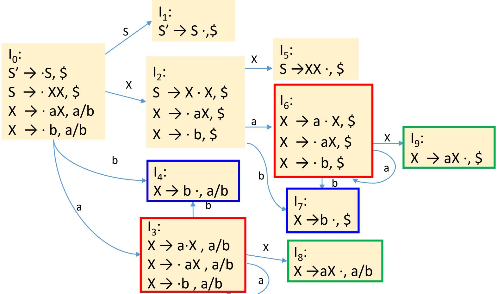

## State Merging[状态合并]

• Merge states with the same core

◆ Core: LR(1) items minus the lookahead (i.e., LR(0) items)

All items are identical except lookahead

$$
\mathsf { I } _ { 3 } \colon
$$

$$
\mathsf { I } _ { 6 } \mathsf { : }
$$

$$
\textsf { X } \to \mathsf { a } \cdot \textsf { X } , \mathsf { a } / \mathsf { b }
$$

$$
x  \mathsf { a } \cdot \mathsf { X } , \mathsf { S }
$$

$$
\mathsf { I } _ { 3 6 } \mathsf { : \Omega }
$$

$$
\mathsf { X } \to . \mathsf { a x } , \mathsf { a } / \mathsf { b }
$$

$$
{ \tt X } \to . { \tt a X } , \$ \sum
$$


$$
\mathsf { X } \to \mathsf { a } { \cdot } \mathsf { X } , \mathsf { a } / \mathsf { b } / \mathsf { S }
$$

$$
{ \tt X }  { \tt \cdot b } , \$ 3
$$

$$
\mathsf { X } \to \cdot \mathsf { b } , \mathsf { a } / \mathsf { b }
$$

$$
\mathsf { X } \to . \mathsf { a } \mathsf { X } , \mathsf { a } / \mathsf { b } / \mathsf { S }
$$

$$
\mathsf { X } \Rightarrow \cdot \mathsf { b } , \mathsf { a } / \mathsf { b } / \mathsf { S }
$$

$$
{ \mathsf I } _ { 4 } \mathrm { : }
$$

$$
\times  \mathrm { b } \cdot , \mathrm { a } / \mathrm { b }
$$

$$
\mathsf { I } _ { 7 } \colon
$$

$$
x  { \mathsf { b } } \cdot , \$ 5
$$


$$
\mathsf { I } _ { 4 7 } \mathsf { : }
$$

$$
\times  { \mathsf { b } } \cdot , { \mathsf { a } } / { \mathsf { b } } / { \mathsf { S } }
$$

$$
\mathsf { I } _ { 8 } \colon
$$

$$
\mathsf { X } \to \mathsf { a X } \cdot , \mathsf { a } / \mathsf { b }
$$

$$
\mathsf { I } _ { 9 } \colon
$$

$$
{ \tt X } \to { \tt a X } \cdot , \$ { \tt S }
$$


$$
\mathsf { I } _ { 8 9 } \mathrm { : }
$$

$$
\mathsf { X } \to \mathsf { a x } \cdot , \mathsf { a } / \mathsf { b } / \mathsf { S }
$$

## State Merging (cont.)

<table><tr><td rowspan=2 colspan=1>State</td><td rowspan=1 colspan=1></td><td rowspan=1 colspan=2>Action</td><td rowspan=1 colspan=2>Goto</td></tr><tr><td rowspan=1 colspan=1>a</td><td rowspan=1 colspan=1>b</td><td rowspan=1 colspan=1>S</td><td rowspan=1 colspan=1>S</td><td rowspan=1 colspan=1>X</td></tr><tr><td rowspan=1 colspan=1>0</td><td rowspan=1 colspan=1>s3</td><td rowspan=1 colspan=1> s4</td><td rowspan=1 colspan=1></td><td rowspan=1 colspan=1>1</td><td rowspan=1 colspan=1>2</td></tr><tr><td rowspan=1 colspan=1>1</td><td rowspan=1 colspan=1></td><td rowspan=1 colspan=1></td><td rowspan=1 colspan=1>acc</td><td rowspan=1 colspan=1></td><td rowspan=1 colspan=1></td></tr><tr><td rowspan=1 colspan=1>2</td><td rowspan=1 colspan=1>s6</td><td rowspan=1 colspan=1> s7</td><td rowspan=1 colspan=1></td><td rowspan=1 colspan=1></td><td rowspan=1 colspan=1>5</td></tr><tr><td rowspan=1 colspan=1>3</td><td rowspan=1 colspan=1>s3</td><td rowspan=1 colspan=1>s4</td><td rowspan=1 colspan=1></td><td rowspan=1 colspan=1></td><td rowspan=1 colspan=1>8</td></tr><tr><td rowspan=1 colspan=1>4</td><td rowspan=1 colspan=1>r3</td><td rowspan=1 colspan=1>r3</td><td rowspan=1 colspan=1></td><td rowspan=1 colspan=1></td><td rowspan=1 colspan=1></td></tr><tr><td rowspan=1 colspan=1>5</td><td rowspan=1 colspan=1></td><td rowspan=1 colspan=1></td><td rowspan=1 colspan=1>r1</td><td rowspan=1 colspan=1></td><td rowspan=1 colspan=1></td></tr><tr><td rowspan=1 colspan=1>6</td><td rowspan=1 colspan=1>s6</td><td rowspan=1 colspan=1> s7</td><td rowspan=1 colspan=1></td><td rowspan=1 colspan=1></td><td rowspan=1 colspan=1>9</td></tr><tr><td rowspan=1 colspan=1>7</td><td rowspan=1 colspan=1></td><td rowspan=1 colspan=1></td><td rowspan=1 colspan=1>r3</td><td rowspan=1 colspan=1></td><td rowspan=1 colspan=1></td></tr><tr><td rowspan=1 colspan=1>8</td><td rowspan=1 colspan=1> r2</td><td rowspan=1 colspan=1>r2</td><td rowspan=1 colspan=1></td><td rowspan=1 colspan=1></td><td rowspan=1 colspan=1></td></tr><tr><td rowspan=1 colspan=1>9</td><td rowspan=1 colspan=1></td><td rowspan=1 colspan=1></td><td rowspan=1 colspan=1>r2</td><td rowspan=1 colspan=1></td><td rowspan=1 colspan=1></td></tr></table>

LR(1)  
Grammar (0) S’ -> S (1) S -> XX (2) X -> aX (3) X -> b

<table><tr><td rowspan=2 colspan=1>State</td><td rowspan=1 colspan=1></td><td rowspan=1 colspan=1>Action</td><td rowspan=1 colspan=1></td><td rowspan=1 colspan=2>Goto</td></tr><tr><td rowspan=1 colspan=1>a</td><td rowspan=1 colspan=1>b</td><td rowspan=1 colspan=1>S</td><td rowspan=1 colspan=1>S</td><td rowspan=1 colspan=1>X</td></tr><tr><td rowspan=1 colspan=1>0</td><td rowspan=1 colspan=1> s36</td><td rowspan=1 colspan=1> s47</td><td rowspan=1 colspan=1></td><td rowspan=1 colspan=1>1</td><td rowspan=1 colspan=1>2</td></tr><tr><td rowspan=1 colspan=1>1</td><td rowspan=1 colspan=1></td><td rowspan=1 colspan=1></td><td rowspan=1 colspan=1>acc</td><td rowspan=1 colspan=1></td><td rowspan=1 colspan=1></td></tr><tr><td rowspan=1 colspan=1>2</td><td rowspan=1 colspan=1> s36</td><td rowspan=1 colspan=1>s47</td><td rowspan=1 colspan=1></td><td rowspan=1 colspan=1></td><td rowspan=1 colspan=1>5</td></tr><tr><td rowspan=1 colspan=1>36</td><td rowspan=1 colspan=1>s36</td><td rowspan=1 colspan=1>s47</td><td rowspan=1 colspan=1></td><td rowspan=1 colspan=1></td><td rowspan=1 colspan=1>89</td></tr><tr><td rowspan=1 colspan=1>47</td><td rowspan=1 colspan=1>r3</td><td rowspan=1 colspan=1>r3</td><td rowspan=1 colspan=1>r3</td><td rowspan=1 colspan=1></td><td rowspan=1 colspan=1></td></tr><tr><td rowspan=1 colspan=1>5</td><td rowspan=1 colspan=1></td><td rowspan=1 colspan=1></td><td rowspan=1 colspan=1>r1</td><td rowspan=1 colspan=1></td><td rowspan=1 colspan=1></td></tr><tr><td rowspan=1 colspan=1>89</td><td rowspan=1 colspan=1>r2</td><td rowspan=1 colspan=1>r2</td><td rowspan=1 colspan=1>r2</td><td rowspan=1 colspan=1></td><td rowspan=1 colspan=1></td></tr><tr><td rowspan=1 colspan=2></td><td rowspan=1 colspan=4>LALR(1)</td></tr></table>

States 3 and 6: State 36  
States 4 and 7: State 47  
States 8 and 9: State 89

## Merge Effects[合并效果]

## 1. Merging of states can introduce conflicts[引入归约-归约冲突]

◆ Can introduce reduce-reduce (r-r) conflicts

 LR was introduced to split the Follow set on reduce action

 Merging reverts the splitting

◆ Cannot introduce shift-reduce (s-r) conflicts

 i.e., a s-r conflict cannot exist in a merged set unless the conflict was already present in one of the original LR(1) sets

## 2. Detection of errors may be delayed[推迟错误识别]

On error, LALR parsers will not perform shifts beyond an LR parser, but may perform more reductions before finding error

## Exercise 2

• 正则表达式可以表达语言 $L = \{ x n y z n , 1 \leq n \leq 1 0 \}$ 吗?可以，任何有穷集都是正规集，都可以用正规表达式来描述

• 正则表达式可以表达语言 $L = \{ x ^ { n } y z ^ { n } , \mathrm { n } > 0 \}$ 吗?

• 不行， 该语言是无穷的，不能用正规式表达

• 确定有限自动机(DFA)中不存在ε弧，所以DFA无法识别空串ε吗?• 错，DFA可以识别空串，但当且仅当开始状态与终止状态

• 给定正则式 (a| b)\*，使用汤普森构造法（ Thompson‘s Construction ）构造的有限自动机拥有几个状态?

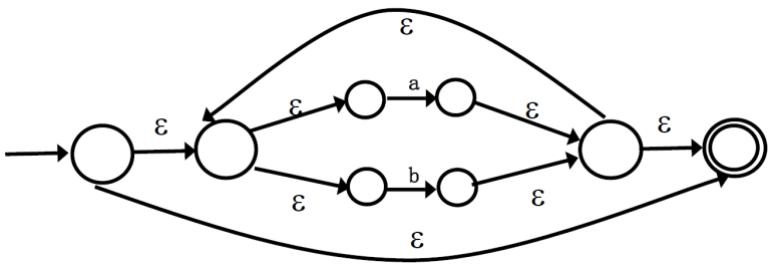

## Exercise 2

• 对于一个无二义性文法G，它的一个句子的最左与最右推导产生的分析树一定是一样的吗?

• 对的，是这样的。语法树会隐去推导顺序

• 怎么样判断一个文法是否为LL(1)型文法?

• 对文法中的每个产生式 A → α | β:

FIRST(α) ∩ FIRST(β) = ∅.

• If β ⇒ ε, then FIRST(α) ∩ FOLLOW(A) = ∅.

• LL(1)语法分析表行数与列数分别由哪些因素确定?

• 行数是该文法的非终结符个数，列数为终结符个数+1（ 结束符号\$ ）

• 设句型aaAb 的最右推导为 S⇒aBb⇒ aaAb ，句柄为aA ，该句型的活前缀是?• a, aa, aaA

## Exercise 2

• 找出以下文法中的句型的所有短语，直接短语，句柄

• 文法: G(E): E → T | E+T; T → F | T\*F; F → (E) | a | b | c

• 句型: a \* b + c

• 第一步：画出语法树

• 第二步：找出语法树的叶子节点• a, \*, b, +, c

• 第三步：由叶子节点找出短语

• a, a\*b, b, c, a\*b+c (why not \*b, b+c, \*, +?)

• 第四步：从短语中找出直接短语• a, b, c

. 第五步：从直接短语中找出句柄


## Exercise 2

• 给定一下文法G(S), 请构建该文法的LL(1)分析表

$\mathsf { S } \to \mathsf { A }$

$\mathsf { A } \to \mathsf { \varepsilon } _ { \mathsf { E } }$

$\mathsf { A } \to \mathsf { b b A }$

## • FIRST & Follow:

$\mathsf { S } \to \mathsf { A } ; \mathsf { F l R S T } ( \alpha ) = \{ \mathsf { b } , \mathsf { \varepsilon } \}$

• A → : FIRST(α) = {}

$\mathsf { A } \to \mathsf { b b A } \colon \mathsf { F I R S T } ( \mathsf { a } ) = \{ \mathsf { b } \}$

$\mathsf { F O L L O W } ( \mathsf { S } ) = \{ \mathsf { S } \}$

$\mathsf { F O L L O W } ( \mathsf { A } ) = \{ \mathsf { S } \}$

## • Parse Table:


<table><tr><td rowspan=1 colspan=3>b                       $</td><td rowspan=4 colspan=1></td></tr><tr><td rowspan=1 colspan=1>s</td><td rowspan=1 colspan=1></td><td rowspan=1 colspan=1></td></tr><tr><td rowspan=1 colspan=3>A</td></tr><tr><td rowspan=1 colspan=3></td></tr><tr><td rowspan=1 colspan=3>b                        $</td><td rowspan=1 colspan=1></td></tr><tr><td rowspan=1 colspan=1>s</td><td rowspan=1 colspan=1> $\mathsf { S } \to \mathsf { A }$ </td><td rowspan=1 colspan=1></td><td rowspan=1 colspan=1>use FIRST</td></tr><tr><td rowspan=1 colspan=3>A      $\mathsf { A } \to \mathsf { b b A }$ </td><td rowspan=2 colspan=1></td></tr><tr><td rowspan=1 colspan=3></td></tr><tr><td rowspan=1 colspan=3>b                        $</td><td rowspan=1 colspan=1></td></tr><tr><td rowspan=1 colspan=1>S</td><td rowspan=1 colspan=1> $\mathsf { S } \to \mathsf { A }$ </td><td rowspan=1 colspan=1> $\mathsf { S } \to \mathsf { A }$ </td><td rowspan=1 colspan=1>use FOLLOW</td></tr><tr><td rowspan=1 colspan=3>A       $\mathsf { A } \to \mathsf { b b A }$              $\mathsf { A } \to \mathsf { \varepsilon } _ { \mathsf { E } }$ </td><td rowspan=1 colspan=1>194</td></tr></table>

## Exercise 2

• 给定一下文法G(S) , 请构建识别活前缀的DFA与LR(1)分析表

$\mathsf { S } \to \mathsf { A }$

$\mathsf { A } \to \mathsf { A } + \mathsf { A } \mathsf { \Omega } | \mathsf { B } + \mathsf { + }$

• B → y

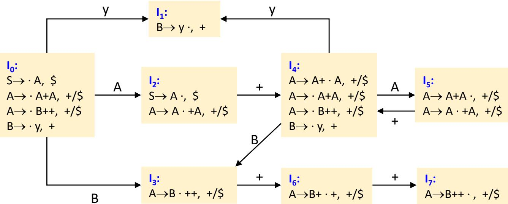

## Exercise 2

• 给定一下文法G(S) , 请构建识别活前缀的DFA与LR(1)分析表

• (1) S → A

• (2) A → A + A

• (3) A → B + +

• (4) B → y

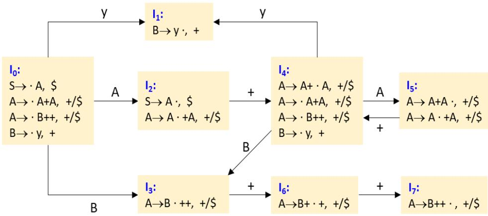

<table><tr><td rowspan=1 colspan=1>S</td><td rowspan=1 colspan=3>ACTOION</td><td rowspan=1 colspan=2>GOTO</td></tr><tr><td rowspan=1 colspan=1></td><td rowspan=1 colspan=1>y</td><td rowspan=1 colspan=1>+</td><td rowspan=1 colspan=1>$</td><td rowspan=1 colspan=1>A</td><td rowspan=1 colspan=1>B</td></tr><tr><td rowspan=1 colspan=1>０</td><td rowspan=1 colspan=1>s1</td><td rowspan=1 colspan=1></td><td rowspan=1 colspan=1></td><td rowspan=1 colspan=1>2</td><td rowspan=1 colspan=1>3</td></tr><tr><td rowspan=1 colspan=1>1</td><td rowspan=1 colspan=1></td><td rowspan=1 colspan=1>r4</td><td rowspan=1 colspan=1></td><td rowspan=1 colspan=1></td><td rowspan=1 colspan=1></td></tr><tr><td rowspan=1 colspan=1>2</td><td rowspan=1 colspan=1></td><td rowspan=1 colspan=1>s4</td><td rowspan=1 colspan=1>acc</td><td rowspan=1 colspan=1></td><td rowspan=1 colspan=1></td></tr><tr><td rowspan=1 colspan=1>3</td><td rowspan=1 colspan=1></td><td rowspan=1 colspan=1>s6</td><td rowspan=1 colspan=1></td><td rowspan=1 colspan=1></td><td rowspan=1 colspan=1></td></tr><tr><td rowspan=1 colspan=1>4</td><td rowspan=1 colspan=1>s1</td><td rowspan=1 colspan=1></td><td rowspan=1 colspan=1></td><td rowspan=1 colspan=1>5</td><td rowspan=1 colspan=1>3</td></tr><tr><td rowspan=1 colspan=1>5</td><td rowspan=1 colspan=1></td><td rowspan=1 colspan=1>r2/s4</td><td rowspan=1 colspan=1>r2</td><td rowspan=1 colspan=1></td><td rowspan=1 colspan=1></td></tr><tr><td rowspan=1 colspan=1>6</td><td rowspan=1 colspan=1></td><td rowspan=1 colspan=1>s7</td><td rowspan=1 colspan=1></td><td rowspan=1 colspan=1></td><td rowspan=1 colspan=1></td></tr><tr><td rowspan=1 colspan=1>7</td><td rowspan=1 colspan=1></td><td rowspan=1 colspan=1>r3</td><td rowspan=1 colspan=1>r3</td><td rowspan=1 colspan=1></td><td rowspan=1 colspan=1></td></tr></table>

## Exercise 2

• 该文法是LR(1)型文法吗? 若不是，应如何解决? (有多种选择)


<table><tr><td rowspan=1 colspan=1>S</td><td rowspan=1 colspan=3>ACTOION</td><td rowspan=1 colspan=2>GOTO</td></tr><tr><td rowspan=1 colspan=1></td><td rowspan=1 colspan=1>y</td><td rowspan=1 colspan=1>+</td><td rowspan=1 colspan=1>$</td><td rowspan=1 colspan=1>A</td><td rowspan=1 colspan=1>B</td></tr><tr><td rowspan=1 colspan=1>０</td><td rowspan=1 colspan=1>s1</td><td rowspan=1 colspan=1></td><td rowspan=1 colspan=1></td><td rowspan=1 colspan=1>2</td><td rowspan=1 colspan=1>3</td></tr><tr><td rowspan=1 colspan=1>1</td><td rowspan=1 colspan=1></td><td rowspan=1 colspan=1>r4</td><td rowspan=1 colspan=1></td><td rowspan=1 colspan=1></td><td rowspan=1 colspan=1></td></tr><tr><td rowspan=1 colspan=1>2</td><td rowspan=1 colspan=1></td><td rowspan=1 colspan=1>s4</td><td rowspan=1 colspan=1>acc</td><td rowspan=1 colspan=1></td><td rowspan=1 colspan=1></td></tr><tr><td rowspan=1 colspan=1>3</td><td rowspan=1 colspan=1></td><td rowspan=1 colspan=1>s6</td><td rowspan=1 colspan=1></td><td rowspan=1 colspan=1></td><td rowspan=1 colspan=1></td></tr><tr><td rowspan=1 colspan=1>4</td><td rowspan=1 colspan=1>s1</td><td rowspan=1 colspan=1></td><td rowspan=1 colspan=1></td><td rowspan=1 colspan=1>5</td><td rowspan=1 colspan=1>3</td></tr><tr><td rowspan=1 colspan=1>5</td><td rowspan=1 colspan=1></td><td rowspan=1 colspan=1>s4</td><td rowspan=1 colspan=1>r2</td><td rowspan=1 colspan=1></td><td rowspan=1 colspan=1></td></tr><tr><td rowspan=1 colspan=1>6</td><td rowspan=1 colspan=1></td><td rowspan=1 colspan=1>s7</td><td rowspan=1 colspan=1></td><td rowspan=1 colspan=1></td><td rowspan=1 colspan=1></td></tr><tr><td rowspan=1 colspan=1>7</td><td rowspan=1 colspan=1></td><td rowspan=1 colspan=1>r3</td><td rowspan=1 colspan=1>r3</td><td rowspan=1 colspan=1></td><td rowspan=1 colspan=1></td></tr></table>

## Exercise 2

• 对于句子y++, 请给出其分析流程，并说明y++是否为该文法的一个句子?

(1) ${ \mathsf S } \to { \mathsf A } ;$ (2) $\mathsf { A } \to \mathsf { A } + \mathsf { A } ;$ (3) $\mathsf { A } \to \mathsf { B } + + ;$ (4) $\mathsf { B } \to \mathsf { y } ;$

<table><tr><td colspan="2">Stack</td><td>Input</td><td>ACTION</td><td>GOTO</td></tr><tr><td>0</td><td>$</td><td>Y++$</td><td></td><td></td></tr></table>


<table><tr><td rowspan=1 colspan=1>S</td><td rowspan=1 colspan=3>ACTOION</td><td rowspan=1 colspan=2>GOTO</td></tr><tr><td rowspan=1 colspan=1></td><td rowspan=1 colspan=1>y</td><td rowspan=1 colspan=1>+</td><td rowspan=1 colspan=1>S</td><td rowspan=1 colspan=1>A</td><td rowspan=1 colspan=1>B</td></tr><tr><td rowspan=1 colspan=1>0</td><td rowspan=1 colspan=1>s1</td><td rowspan=1 colspan=1></td><td rowspan=1 colspan=1></td><td rowspan=1 colspan=1>2</td><td rowspan=1 colspan=1>3</td></tr><tr><td rowspan=1 colspan=1>1</td><td rowspan=1 colspan=1></td><td rowspan=1 colspan=1>r4</td><td rowspan=1 colspan=1></td><td rowspan=1 colspan=1></td><td rowspan=1 colspan=1></td></tr><tr><td rowspan=1 colspan=1>2</td><td rowspan=1 colspan=1></td><td rowspan=1 colspan=1>s4</td><td rowspan=1 colspan=1>acc</td><td rowspan=1 colspan=1></td><td rowspan=1 colspan=1></td></tr><tr><td rowspan=1 colspan=1>3</td><td rowspan=1 colspan=1></td><td rowspan=1 colspan=1>s6</td><td rowspan=1 colspan=1></td><td rowspan=1 colspan=1></td><td rowspan=1 colspan=1></td></tr><tr><td rowspan=1 colspan=1>4</td><td rowspan=1 colspan=1>s1</td><td rowspan=1 colspan=1></td><td rowspan=1 colspan=1></td><td rowspan=1 colspan=1>5</td><td rowspan=1 colspan=1>3</td></tr><tr><td rowspan=1 colspan=1>5</td><td rowspan=1 colspan=1></td><td rowspan=1 colspan=1>s4</td><td rowspan=1 colspan=1>r2</td><td rowspan=1 colspan=1></td><td rowspan=1 colspan=1></td></tr><tr><td rowspan=1 colspan=1>6</td><td rowspan=1 colspan=1></td><td rowspan=1 colspan=1>s7</td><td rowspan=1 colspan=1></td><td rowspan=1 colspan=1></td><td rowspan=1 colspan=1></td></tr><tr><td rowspan=1 colspan=1>7</td><td rowspan=1 colspan=1></td><td rowspan=1 colspan=1>r3</td><td rowspan=1 colspan=1>r3</td><td rowspan=1 colspan=1></td><td rowspan=1 colspan=1></td></tr></table>

## Exercise 2

• 对于句子y++, 请给出其分析流程，并说明y++是否为该文法的一个句子?

(1) ${ \mathsf S } \to { \mathsf A } ;$ (2) $\mathsf { A } \to \mathsf { A } + \mathsf { A } ;$ (3) $\mathsf { A } \to \mathsf { B } + + ;$ (4) B → y;

<table><tr><td colspan="2">Stack</td><td>Input</td><td>ACTION</td><td>GOTO</td></tr><tr><td>0</td><td>$</td><td>Y++$</td><td>s1</td><td></td></tr></table>


<table><tr><td rowspan=1 colspan=1>S</td><td rowspan=1 colspan=3>ACTOION</td><td rowspan=1 colspan=2>GOTO</td></tr><tr><td rowspan=1 colspan=1></td><td rowspan=1 colspan=1>y</td><td rowspan=1 colspan=1>+</td><td rowspan=1 colspan=1>S</td><td rowspan=1 colspan=1>A</td><td rowspan=1 colspan=1>B</td></tr><tr><td rowspan=1 colspan=1>0</td><td rowspan=1 colspan=1>s1</td><td rowspan=1 colspan=1></td><td rowspan=1 colspan=1></td><td rowspan=1 colspan=1>2</td><td rowspan=1 colspan=1>3</td></tr><tr><td rowspan=1 colspan=1>1</td><td rowspan=1 colspan=1></td><td rowspan=1 colspan=1>r4</td><td rowspan=1 colspan=1></td><td rowspan=1 colspan=1></td><td rowspan=1 colspan=1></td></tr><tr><td rowspan=1 colspan=1>2</td><td rowspan=1 colspan=1></td><td rowspan=1 colspan=1>s4</td><td rowspan=1 colspan=1>acc</td><td rowspan=1 colspan=1></td><td rowspan=1 colspan=1></td></tr><tr><td rowspan=1 colspan=1>3</td><td rowspan=1 colspan=1></td><td rowspan=1 colspan=1>s6</td><td rowspan=1 colspan=1></td><td rowspan=1 colspan=1></td><td rowspan=1 colspan=1></td></tr><tr><td rowspan=1 colspan=1>4</td><td rowspan=1 colspan=1>s1</td><td rowspan=1 colspan=1></td><td rowspan=1 colspan=1></td><td rowspan=1 colspan=1>5</td><td rowspan=1 colspan=1>3</td></tr><tr><td rowspan=1 colspan=1>5</td><td rowspan=1 colspan=1></td><td rowspan=1 colspan=1>s4</td><td rowspan=1 colspan=1>r2</td><td rowspan=1 colspan=1></td><td rowspan=1 colspan=1></td></tr><tr><td rowspan=1 colspan=1>6</td><td rowspan=1 colspan=1></td><td rowspan=1 colspan=1>s7</td><td rowspan=1 colspan=1></td><td rowspan=1 colspan=1></td><td rowspan=1 colspan=1></td></tr><tr><td rowspan=1 colspan=1>7</td><td rowspan=1 colspan=1></td><td rowspan=1 colspan=1>r3</td><td rowspan=1 colspan=1>r3</td><td rowspan=1 colspan=1></td><td rowspan=1 colspan=1></td></tr></table>

## Exercise 2

• 对于句子y++, 请给出其分析流程，并说明y++是否为该文法的一个句子?

(1) S → A; (2) $\mathsf { A } \to \mathsf { A } + \mathsf { A } ;$ (3) $\mathsf { A } \to \mathsf { B } + + ;$ (4) B → y;

<table><tr><td colspan="2">Stack</td><td>Input</td><td>ACTION</td><td>GOTO</td></tr><tr><td>0</td><td>$</td><td>Y++$</td><td>s1</td><td></td></tr><tr><td>01</td><td>$y</td><td>++$</td><td></td><td></td></tr></table>


<table><tr><td rowspan=1 colspan=1>S</td><td rowspan=1 colspan=3>ACTOION</td><td rowspan=1 colspan=2>GOTO</td></tr><tr><td rowspan=1 colspan=1></td><td rowspan=1 colspan=1>y</td><td rowspan=1 colspan=1>+</td><td rowspan=1 colspan=1>$</td><td rowspan=1 colspan=1>A</td><td rowspan=1 colspan=1>B</td></tr><tr><td rowspan=1 colspan=1>0</td><td rowspan=1 colspan=1>s1</td><td rowspan=1 colspan=1></td><td rowspan=1 colspan=1></td><td rowspan=1 colspan=1>2</td><td rowspan=1 colspan=1>3</td></tr><tr><td rowspan=1 colspan=1>1</td><td rowspan=1 colspan=1></td><td rowspan=1 colspan=1>r4</td><td rowspan=1 colspan=1></td><td rowspan=1 colspan=1></td><td rowspan=1 colspan=1></td></tr><tr><td rowspan=1 colspan=1>2</td><td rowspan=1 colspan=1></td><td rowspan=1 colspan=1>s4</td><td rowspan=1 colspan=1>acc</td><td rowspan=1 colspan=1></td><td rowspan=1 colspan=1></td></tr><tr><td rowspan=1 colspan=1>3</td><td rowspan=1 colspan=1></td><td rowspan=1 colspan=1>s6</td><td rowspan=1 colspan=1></td><td rowspan=1 colspan=1></td><td rowspan=1 colspan=1></td></tr><tr><td rowspan=1 colspan=1>4</td><td rowspan=1 colspan=1>s1</td><td rowspan=1 colspan=1></td><td rowspan=1 colspan=1></td><td rowspan=1 colspan=1>5</td><td rowspan=1 colspan=1>3</td></tr><tr><td rowspan=1 colspan=1>5</td><td rowspan=1 colspan=1></td><td rowspan=1 colspan=1>s4</td><td rowspan=1 colspan=1>r2</td><td rowspan=1 colspan=1></td><td rowspan=1 colspan=1></td></tr><tr><td rowspan=1 colspan=1>6</td><td rowspan=1 colspan=1></td><td rowspan=1 colspan=1>s7</td><td rowspan=1 colspan=1></td><td rowspan=1 colspan=1></td><td rowspan=1 colspan=1></td></tr><tr><td rowspan=1 colspan=1>7</td><td rowspan=1 colspan=1></td><td rowspan=1 colspan=1>r3</td><td rowspan=1 colspan=1>r3</td><td rowspan=1 colspan=1></td><td rowspan=1 colspan=1></td></tr></table>

## Exercise 2

• 对于句子y++, 请给出其分析流程，并说明y++是否为该文法的一个句子?

(1) S → A; (2) $\mathsf { A } \to \mathsf { A } + \mathsf { A } ;$ (3) $\mathsf { A } \to \mathsf { B } + + ;$ (4) B → y;

<table><tr><td> Stack</td><td>Input</td><td>ACTION</td><td>GOTO</td></tr><tr><td>0 $</td><td>Y++$</td><td>s1</td><td></td></tr><tr><td>01 $y</td><td>++$</td><td>r4(B → γ)</td><td></td></tr></table>


<table><tr><td rowspan=1 colspan=1>S</td><td rowspan=1 colspan=3>ACTOION</td><td rowspan=1 colspan=2>GOTO</td></tr><tr><td rowspan=1 colspan=1></td><td rowspan=1 colspan=1>y</td><td rowspan=1 colspan=1>+</td><td rowspan=1 colspan=1>$</td><td rowspan=1 colspan=1>A</td><td rowspan=1 colspan=1>B</td></tr><tr><td rowspan=1 colspan=1>0</td><td rowspan=1 colspan=1>s1</td><td rowspan=1 colspan=1></td><td rowspan=1 colspan=1></td><td rowspan=1 colspan=1>2</td><td rowspan=1 colspan=1>3</td></tr><tr><td rowspan=1 colspan=1>1</td><td rowspan=1 colspan=1></td><td rowspan=1 colspan=1>r4</td><td rowspan=1 colspan=1></td><td rowspan=1 colspan=1></td><td rowspan=1 colspan=1></td></tr><tr><td rowspan=1 colspan=1>2</td><td rowspan=1 colspan=1></td><td rowspan=1 colspan=1>s4</td><td rowspan=1 colspan=1>acc</td><td rowspan=1 colspan=1></td><td rowspan=1 colspan=1></td></tr><tr><td rowspan=1 colspan=1>3</td><td rowspan=1 colspan=1></td><td rowspan=1 colspan=1>s6</td><td rowspan=1 colspan=1></td><td rowspan=1 colspan=1></td><td rowspan=1 colspan=1></td></tr><tr><td rowspan=1 colspan=1>4</td><td rowspan=1 colspan=1>s1</td><td rowspan=1 colspan=1></td><td rowspan=1 colspan=1></td><td rowspan=1 colspan=1>5</td><td rowspan=1 colspan=1>3</td></tr><tr><td rowspan=1 colspan=1>5</td><td rowspan=1 colspan=1></td><td rowspan=1 colspan=1>s4</td><td rowspan=1 colspan=1>r2</td><td rowspan=1 colspan=1></td><td rowspan=1 colspan=1></td></tr><tr><td rowspan=1 colspan=1>6</td><td rowspan=1 colspan=1></td><td rowspan=1 colspan=1>s7</td><td rowspan=1 colspan=1></td><td rowspan=1 colspan=1></td><td rowspan=1 colspan=1></td></tr><tr><td rowspan=1 colspan=1>7</td><td rowspan=1 colspan=1></td><td rowspan=1 colspan=1>r3</td><td rowspan=1 colspan=1>r3</td><td rowspan=1 colspan=1></td><td rowspan=1 colspan=1></td></tr></table>

## Exercise 2

• 对于句子y++, 请给出其分析流程，并说明y++是否为该文法的一个句子?

(1) S → A; (2) A → A + A; (3) A → B + +; (4) B → y;

<table><tr><td colspan="2"> Stack</td><td>Input</td><td>ACTION</td><td>GOTO</td></tr><tr><td>0</td><td>$</td><td>Y++$</td><td>s1</td><td></td></tr><tr><td>01</td><td>$y</td><td>++$</td><td>r4(B → ν)</td><td></td></tr><tr><td>0</td><td>$B</td><td>+$</td><td></td><td>3</td></tr></table>


<table><tr><td rowspan=1 colspan=1>S</td><td rowspan=1 colspan=3>ACTOION</td><td rowspan=1 colspan=2>GOTO</td></tr><tr><td rowspan=1 colspan=1></td><td rowspan=1 colspan=1>y</td><td rowspan=1 colspan=1>+</td><td rowspan=1 colspan=1>$</td><td rowspan=1 colspan=1>A</td><td rowspan=1 colspan=1>B</td></tr><tr><td rowspan=1 colspan=1>0</td><td rowspan=1 colspan=1>s1</td><td rowspan=1 colspan=1></td><td rowspan=1 colspan=1></td><td rowspan=1 colspan=1>2</td><td rowspan=1 colspan=1>3</td></tr><tr><td rowspan=1 colspan=1>1</td><td rowspan=1 colspan=1></td><td rowspan=1 colspan=1>r4</td><td rowspan=1 colspan=1></td><td rowspan=1 colspan=1></td><td rowspan=1 colspan=1></td></tr><tr><td rowspan=1 colspan=1>2</td><td rowspan=1 colspan=1></td><td rowspan=1 colspan=1>s4</td><td rowspan=1 colspan=1>acc</td><td rowspan=1 colspan=1></td><td rowspan=1 colspan=1></td></tr><tr><td rowspan=1 colspan=1>3</td><td rowspan=1 colspan=1></td><td rowspan=1 colspan=1>s6</td><td rowspan=1 colspan=1></td><td rowspan=1 colspan=1></td><td rowspan=1 colspan=1></td></tr><tr><td rowspan=1 colspan=1>4</td><td rowspan=1 colspan=1>s1</td><td rowspan=1 colspan=1></td><td rowspan=1 colspan=1></td><td rowspan=1 colspan=1>5</td><td rowspan=1 colspan=1>3</td></tr><tr><td rowspan=1 colspan=1>5</td><td rowspan=1 colspan=1></td><td rowspan=1 colspan=1>s4</td><td rowspan=1 colspan=1>r2</td><td rowspan=1 colspan=1></td><td rowspan=1 colspan=1></td></tr><tr><td rowspan=1 colspan=1>6</td><td rowspan=1 colspan=1></td><td rowspan=1 colspan=1>s7</td><td rowspan=1 colspan=1></td><td rowspan=1 colspan=1></td><td rowspan=1 colspan=1></td></tr><tr><td rowspan=1 colspan=1>7</td><td rowspan=1 colspan=1></td><td rowspan=1 colspan=1>r3</td><td rowspan=1 colspan=1>r3</td><td rowspan=1 colspan=1></td><td rowspan=1 colspan=1></td></tr></table>

## Exercise 2

• 对于句子y++, 请给出其分析流程，并说明y++是否为该文法的一个句子?

(1) S → A; (2) A → A + A; (3) A → B + +; (4) B → y;

<table><tr><td colspan="2">Stack</td><td>Input</td><td>ACTION</td><td>GOTO</td></tr><tr><td>0</td><td>$</td><td>Y++$</td><td>s1</td><td></td></tr><tr><td>01</td><td>$y</td><td>++$</td><td>r4(B→ y)</td><td></td></tr><tr><td>0</td><td>$B</td><td>++$</td><td></td><td>3</td></tr><tr><td>03</td><td>$B</td><td>++$</td><td>s6</td><td></td></tr></table>


<table><tr><td rowspan=1 colspan=1>S</td><td rowspan=1 colspan=3>ACTOION</td><td rowspan=1 colspan=2>GOTO</td></tr><tr><td rowspan=1 colspan=1></td><td rowspan=1 colspan=1>y</td><td rowspan=1 colspan=1>+</td><td rowspan=1 colspan=1>S</td><td rowspan=1 colspan=1>A</td><td rowspan=1 colspan=1>B</td></tr><tr><td rowspan=1 colspan=1>0</td><td rowspan=1 colspan=1>s1</td><td rowspan=1 colspan=1></td><td rowspan=1 colspan=1></td><td rowspan=1 colspan=1>2</td><td rowspan=1 colspan=1>3</td></tr><tr><td rowspan=1 colspan=1>1</td><td rowspan=1 colspan=1></td><td rowspan=1 colspan=1>r4</td><td rowspan=1 colspan=1></td><td rowspan=1 colspan=1></td><td rowspan=1 colspan=1></td></tr><tr><td rowspan=1 colspan=1>2</td><td rowspan=1 colspan=1></td><td rowspan=1 colspan=1>s4</td><td rowspan=1 colspan=1>acc</td><td rowspan=1 colspan=1></td><td rowspan=1 colspan=1></td></tr><tr><td rowspan=1 colspan=1>3</td><td rowspan=1 colspan=1></td><td rowspan=1 colspan=1>s6</td><td rowspan=1 colspan=1></td><td rowspan=1 colspan=1></td><td rowspan=1 colspan=1></td></tr><tr><td rowspan=1 colspan=1>4</td><td rowspan=1 colspan=1>s1</td><td rowspan=1 colspan=1></td><td rowspan=1 colspan=1></td><td rowspan=1 colspan=1>5</td><td rowspan=1 colspan=1>3</td></tr><tr><td rowspan=1 colspan=1>5</td><td rowspan=1 colspan=1></td><td rowspan=1 colspan=1>s4</td><td rowspan=1 colspan=1>r2</td><td rowspan=1 colspan=1></td><td rowspan=1 colspan=1></td></tr><tr><td rowspan=1 colspan=1>6</td><td rowspan=1 colspan=1></td><td rowspan=1 colspan=1>s7</td><td rowspan=1 colspan=1></td><td rowspan=1 colspan=1></td><td rowspan=1 colspan=1></td></tr><tr><td rowspan=1 colspan=1>7</td><td rowspan=1 colspan=1></td><td rowspan=1 colspan=1>r3</td><td rowspan=1 colspan=1>r3</td><td rowspan=1 colspan=1></td><td rowspan=1 colspan=1></td></tr></table>

## Exercise 2

• 对于句子y++, 请给出其分析流程，并说明y++是否为该文法的一个句子?

(1) S → A; (2) A → A + A; (3) A → B + +; (4) B → y;

<table><tr><td colspan="2"> Stack</td><td>Input</td><td>ACTION</td><td>GOTO</td></tr><tr><td>0</td><td></td><td>$Y++$</td><td>s1</td><td></td></tr><tr><td>$y 01</td><td></td><td></td><td>±+$r4(B→ γ)</td><td></td></tr><tr><td>$B 0</td><td></td><td>++$</td><td></td><td>3</td></tr><tr><td>03</td><td>$B</td><td>++$</td><td>s6</td><td></td></tr><tr><td>036</td><td>$B+</td><td>+$</td><td>s7</td><td></td></tr></table>


<table><tr><td rowspan=1 colspan=1>S</td><td rowspan=1 colspan=3>ACTOION</td><td rowspan=1 colspan=2>GOTO</td></tr><tr><td rowspan=1 colspan=1></td><td rowspan=1 colspan=1>y</td><td rowspan=1 colspan=1>+</td><td rowspan=1 colspan=1>S</td><td rowspan=1 colspan=1>A</td><td rowspan=1 colspan=1>B</td></tr><tr><td rowspan=1 colspan=1>0</td><td rowspan=1 colspan=1>s1</td><td rowspan=1 colspan=1></td><td rowspan=1 colspan=1></td><td rowspan=1 colspan=1>2</td><td rowspan=1 colspan=1>3</td></tr><tr><td rowspan=1 colspan=1>1</td><td rowspan=1 colspan=1></td><td rowspan=1 colspan=1>r4</td><td rowspan=1 colspan=1></td><td rowspan=1 colspan=1></td><td rowspan=1 colspan=1></td></tr><tr><td rowspan=1 colspan=1>2</td><td rowspan=1 colspan=1></td><td rowspan=1 colspan=1>s4</td><td rowspan=1 colspan=1>acc</td><td rowspan=1 colspan=1></td><td rowspan=1 colspan=1></td></tr><tr><td rowspan=1 colspan=1>3</td><td rowspan=1 colspan=1></td><td rowspan=1 colspan=1>s6</td><td rowspan=1 colspan=1></td><td rowspan=1 colspan=1></td><td rowspan=1 colspan=1></td></tr><tr><td rowspan=1 colspan=1>4</td><td rowspan=1 colspan=1>s1</td><td rowspan=1 colspan=1></td><td rowspan=1 colspan=1></td><td rowspan=1 colspan=1>5</td><td rowspan=1 colspan=1>3</td></tr><tr><td rowspan=1 colspan=1>5</td><td rowspan=1 colspan=1></td><td rowspan=1 colspan=1>s4</td><td rowspan=1 colspan=1>r2</td><td rowspan=1 colspan=1></td><td rowspan=1 colspan=1></td></tr><tr><td rowspan=1 colspan=1>6</td><td rowspan=1 colspan=1></td><td rowspan=1 colspan=1>s7</td><td rowspan=1 colspan=1></td><td rowspan=1 colspan=1></td><td rowspan=1 colspan=1></td></tr><tr><td rowspan=1 colspan=1>7</td><td rowspan=1 colspan=1></td><td rowspan=1 colspan=1>r3</td><td rowspan=1 colspan=1>r3</td><td rowspan=1 colspan=1></td><td rowspan=1 colspan=1></td></tr></table>

## Exercise 2

• 对于句子y++, 请给出其分析流程，并说明y++是否为该文法的一个句子?

(1) S → A; (2) A → A + A; (3) A → B + +; (4) B → y;

<table><tr><td>Stack</td><td>Input</td><td>ACTION</td><td>GOTO</td></tr><tr><td>0 $</td><td>Y++$</td><td>s1</td><td></td></tr><tr><td>01 $y</td><td>++$</td><td>r4(B → ν)</td><td></td></tr><tr><td>0 $B</td><td>++$</td><td></td><td>3</td></tr><tr><td>03 $B</td><td>++$</td><td>s6</td><td></td></tr><tr><td>036 $B+</td><td>+$</td><td>s7</td><td></td></tr><tr><td>0367 $B++</td><td>$</td><td>r3(A→ B++)</td><td></td></tr></table>


<table><tr><td rowspan=1 colspan=1>S</td><td rowspan=1 colspan=3>ACTOION</td><td rowspan=1 colspan=2>GOTO</td></tr><tr><td rowspan=1 colspan=1></td><td rowspan=1 colspan=1>y</td><td rowspan=1 colspan=1>+</td><td rowspan=1 colspan=1>S</td><td rowspan=1 colspan=1>A</td><td rowspan=1 colspan=1>B</td></tr><tr><td rowspan=1 colspan=1>0</td><td rowspan=1 colspan=1>s1</td><td rowspan=1 colspan=1></td><td rowspan=1 colspan=1></td><td rowspan=1 colspan=1>2</td><td rowspan=1 colspan=1>3</td></tr><tr><td rowspan=1 colspan=1>1</td><td rowspan=1 colspan=1></td><td rowspan=1 colspan=1>r4</td><td rowspan=1 colspan=1></td><td rowspan=1 colspan=1></td><td rowspan=1 colspan=1></td></tr><tr><td rowspan=1 colspan=1>2</td><td rowspan=1 colspan=1></td><td rowspan=1 colspan=1>s4</td><td rowspan=1 colspan=1>acc</td><td rowspan=1 colspan=1></td><td rowspan=1 colspan=1></td></tr><tr><td rowspan=1 colspan=1>3</td><td rowspan=1 colspan=1></td><td rowspan=1 colspan=1>s6</td><td rowspan=1 colspan=1></td><td rowspan=1 colspan=1></td><td rowspan=1 colspan=1></td></tr><tr><td rowspan=1 colspan=1>4</td><td rowspan=1 colspan=1>s1</td><td rowspan=1 colspan=1></td><td rowspan=1 colspan=1></td><td rowspan=1 colspan=1>5</td><td rowspan=1 colspan=1>3</td></tr><tr><td rowspan=1 colspan=1>5</td><td rowspan=1 colspan=1></td><td rowspan=1 colspan=1>s4</td><td rowspan=1 colspan=1>r2</td><td rowspan=1 colspan=1></td><td rowspan=1 colspan=1></td></tr><tr><td rowspan=1 colspan=1>6</td><td rowspan=1 colspan=1></td><td rowspan=1 colspan=1>s7</td><td rowspan=1 colspan=1></td><td rowspan=1 colspan=1></td><td rowspan=1 colspan=1></td></tr><tr><td rowspan=1 colspan=1>7</td><td rowspan=1 colspan=1></td><td rowspan=1 colspan=1>r3</td><td rowspan=1 colspan=1>r3</td><td rowspan=1 colspan=1></td><td rowspan=1 colspan=1></td></tr></table>

## Exercise 2

• 对于句子y++, 请给出其分析流程，并说明y++是否为该文法的一个句子?

(1) S → A; (2) A → A + A; (3) A → B + +; (4) B → y;

<table><tr><td colspan="2"> Stack</td><td>Input</td><td>ACTION</td><td>GOTO</td></tr><tr><td>0</td><td>$</td><td>Y++$</td><td>s1</td><td></td></tr><tr><td>01</td><td> $y</td><td>++$</td><td>r4(B→ ν)</td><td></td></tr><tr><td>0</td><td>$B</td><td>+$</td><td></td><td>3</td></tr><tr><td>03</td><td>$B</td><td>++$</td><td>s6</td><td></td></tr><tr><td>036</td><td>$B+</td><td>+$</td><td>s7</td><td></td></tr><tr><td>0367</td><td> $B++</td><td>$</td><td>r3(A→ B++)</td><td></td></tr><tr><td>0</td><td>$A</td><td>$</td><td></td><td>2</td></tr></table>


<table><tr><td rowspan=1 colspan=1>S</td><td rowspan=1 colspan=3>ACTOION</td><td rowspan=1 colspan=2>GOTO</td></tr><tr><td rowspan=1 colspan=1></td><td rowspan=1 colspan=1>y</td><td rowspan=1 colspan=1>+</td><td rowspan=1 colspan=1>S</td><td rowspan=1 colspan=1>A</td><td rowspan=1 colspan=1>B</td></tr><tr><td rowspan=1 colspan=1>0</td><td rowspan=1 colspan=1>s1</td><td rowspan=1 colspan=1></td><td rowspan=1 colspan=1></td><td rowspan=1 colspan=1>2</td><td rowspan=1 colspan=1>3</td></tr><tr><td rowspan=1 colspan=1>1</td><td rowspan=1 colspan=1></td><td rowspan=1 colspan=1>r4</td><td rowspan=1 colspan=1></td><td rowspan=1 colspan=1></td><td rowspan=1 colspan=1></td></tr><tr><td rowspan=1 colspan=1>2</td><td rowspan=1 colspan=1></td><td rowspan=1 colspan=1>s4</td><td rowspan=1 colspan=1>acc</td><td rowspan=1 colspan=1></td><td rowspan=1 colspan=1></td></tr><tr><td rowspan=1 colspan=1>3</td><td rowspan=1 colspan=1></td><td rowspan=1 colspan=1>s6</td><td rowspan=1 colspan=1></td><td rowspan=1 colspan=1></td><td rowspan=1 colspan=1></td></tr><tr><td rowspan=1 colspan=1>4</td><td rowspan=1 colspan=1>s1</td><td rowspan=1 colspan=1></td><td rowspan=1 colspan=1></td><td rowspan=1 colspan=1>5</td><td rowspan=1 colspan=1>3</td></tr><tr><td rowspan=1 colspan=1>5</td><td rowspan=1 colspan=1></td><td rowspan=1 colspan=1>s4</td><td rowspan=1 colspan=1>r2</td><td rowspan=1 colspan=1></td><td rowspan=1 colspan=1></td></tr><tr><td rowspan=1 colspan=1>6</td><td rowspan=1 colspan=1></td><td rowspan=1 colspan=1>s7</td><td rowspan=1 colspan=1></td><td rowspan=1 colspan=1></td><td rowspan=1 colspan=1></td></tr><tr><td rowspan=1 colspan=1>7</td><td rowspan=1 colspan=1></td><td rowspan=1 colspan=1>r3</td><td rowspan=1 colspan=1>r3</td><td rowspan=1 colspan=1></td><td rowspan=1 colspan=1></td></tr></table>

## Exercise 2

• 对于句子y++, 请给出其分析流程，并说明y++是否为该文法的一个句子?

(1) S → A; (2) A → A + A; (3) A → B + +; (4) B → y;

<table><tr><td colspan="2">Stack</td><td>Input</td><td>ACTION</td><td>GOTO</td></tr><tr><td>0</td><td>$</td><td>Y++$</td><td>s1</td><td></td></tr><tr><td>01</td><td>$y</td><td>+$</td><td>r4(B→ y)</td><td></td></tr><tr><td>0</td><td>SB </td><td>++$</td><td></td><td>3</td></tr><tr><td>03</td><td>$B</td><td>++$</td><td>s6</td><td></td></tr><tr><td>036</td><td>$B+</td><td>+$</td><td>s7</td><td></td></tr><tr><td>0367</td><td> $B++</td><td>S-</td><td>r3(A → B+ +)</td><td></td></tr><tr><td>0</td><td>$A</td><td>$</td><td></td><td>2</td></tr><tr><td>02</td><td>$A</td><td>$</td><td>acc</td><td></td></tr></table>


<table><tr><td rowspan=1 colspan=1>S</td><td rowspan=1 colspan=3>ACTOION</td><td rowspan=1 colspan=2>GOTO</td></tr><tr><td rowspan=1 colspan=1></td><td rowspan=1 colspan=1>y</td><td rowspan=1 colspan=1>+</td><td rowspan=1 colspan=1>s</td><td rowspan=1 colspan=1>A</td><td rowspan=1 colspan=1>B</td></tr><tr><td rowspan=1 colspan=1>0</td><td rowspan=1 colspan=1>s1</td><td rowspan=1 colspan=1></td><td rowspan=1 colspan=1></td><td rowspan=1 colspan=1>2</td><td rowspan=1 colspan=1>3</td></tr><tr><td rowspan=1 colspan=1>1</td><td rowspan=1 colspan=1></td><td rowspan=1 colspan=1>r4</td><td rowspan=1 colspan=1></td><td rowspan=1 colspan=1></td><td rowspan=1 colspan=1></td></tr><tr><td rowspan=1 colspan=1>2</td><td rowspan=1 colspan=1></td><td rowspan=1 colspan=1>s4</td><td rowspan=1 colspan=1>acc</td><td rowspan=1 colspan=1></td><td rowspan=1 colspan=1></td></tr><tr><td rowspan=1 colspan=1>3</td><td rowspan=1 colspan=1></td><td rowspan=1 colspan=1>s6</td><td rowspan=1 colspan=1></td><td rowspan=1 colspan=1></td><td rowspan=1 colspan=1></td></tr><tr><td rowspan=1 colspan=1>4</td><td rowspan=1 colspan=1>s1</td><td rowspan=1 colspan=1></td><td rowspan=1 colspan=1></td><td rowspan=1 colspan=1>5</td><td rowspan=1 colspan=1>3</td></tr><tr><td rowspan=1 colspan=1>5</td><td rowspan=1 colspan=1></td><td rowspan=1 colspan=1>s4</td><td rowspan=1 colspan=1>r2</td><td rowspan=1 colspan=1></td><td rowspan=1 colspan=1></td></tr><tr><td rowspan=1 colspan=1>6</td><td rowspan=1 colspan=1></td><td rowspan=1 colspan=1>s7</td><td rowspan=1 colspan=1></td><td rowspan=1 colspan=1></td><td rowspan=1 colspan=1></td></tr><tr><td rowspan=1 colspan=1>7</td><td rowspan=1 colspan=1></td><td rowspan=1 colspan=1>r3</td><td rowspan=1 colspan=1>r3</td><td rowspan=1 colspan=1></td><td rowspan=1 colspan=1></td></tr></table>