## 编译原理 Complier Principles

赵帅

计算机学院

中山大学

## Compilation Phases[编译阶段]

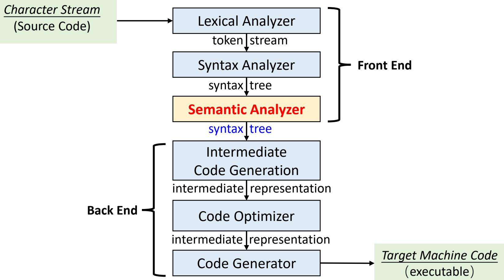

## Content

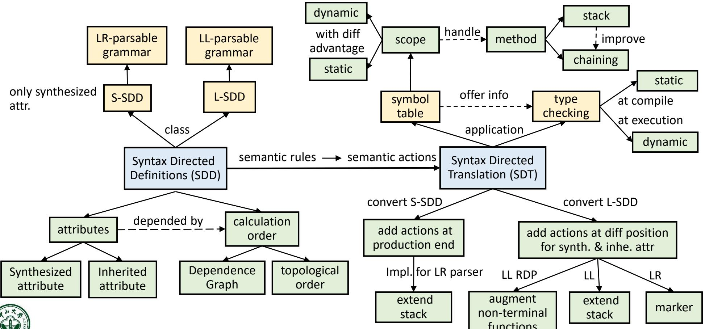

## Compilation Phases[编译阶段]

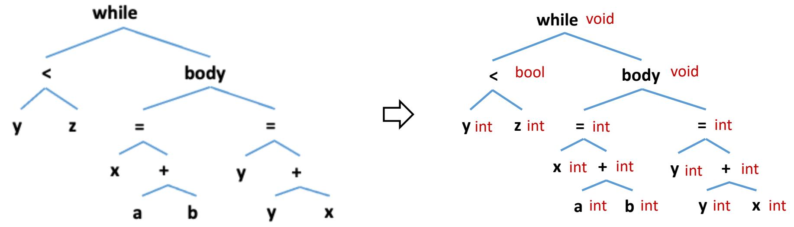  
Abstract Syntax Tree(AST)

Annotated AST/Decorated AST [带标注的抽象语法树]

## Why Semantic Analysis? [语义分析]

• Because programs use symbols (a.k.a. identifiers)

◆ Identifiers require context to figure out the meaning

• Consider the English sentence: “He ate it”

◆ This sentence is syntactically correct

◆ But it makes sense only in the context of a previous sentence: “Sam bought a pizza.” (what if “Sam bought a car.”?)

## • Semantic analysis

◆ Associates identifiers with objects they refer to[关联]

 ”He” --> “Sam”

1 “pizza” "

◆ Checks whether identifiers are used correctly[检查]

 “He” and “it” refer to some object: def-use check

 “it” is a type of object that can be eaten: type check

## Why Semantic Analysis?

• Semantic of a language is more difficult to describe than syntax [语义比语法更难描述]

◆ Syntax: describes the proper form of the programs [仅形式]

◆ Semantics: defines the meaning of programs (i.e., what each program does when it executes) [到意义]

• Context cannot be analyzed using a CFG parser[CFG不能分析上下文信息]

◆ Associating IDs with objects require expressing the pattern:

{wcw | w ∊ (a|b)\*}

 The first w represents the definition of an ID

 The c represents arbitrary intervening code

 The second w represents the use of the ID

## Semantic Analysis

## • Deeper check into the source program[对程序进一步分析]

Last stage of the front end[前端最后阶段]

◆ Compiler’s last chance to reject incorrect programs[最后拒绝机会]

◆ Verify properties that aren’t caught in earlier phases

 Variables declaration before use [先声明后使用]

 Type consistency when using IDs [变量类型一致]

 Correct expressions types [表达式类型]

## • Gather useful info about program for later phases[收集后续信息]

◆ Determine what variables are meant by each identifier

◆ Build an internal representation of inheritance hierarchies

◆ Count how many variables are in scope at each point

## Semantic Analysis: Implementation

## • Attribute grammars[属性文法]

◆ One-pass compilation

 Semantic analysis is done along with parsing

◆ Augment rules to do checking during parsing

◆ The approach suggested in the Compilers book

## • AST walk[语法树遍历]

Two-pass compilation

 First pass digests the syntax and builds a parse tree

 The second pass traverses the tree to verify that the program respects all semantic rules

◆ Strict phase separation of Syntax Analysis and Semantic Analysis

## Content

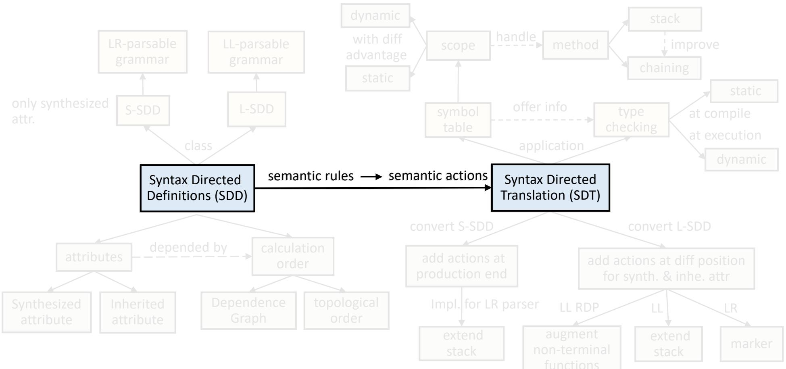

## Syntax Directed Translation

## • Syntax Directed Translation[语法制导翻译]

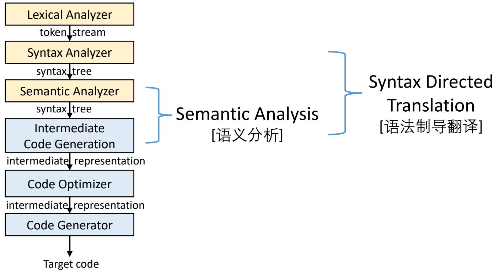

## Syntax Directed Translation[语法制导翻译]

## • Translate based on the program’s grammar structure[语法结构]

◆ Syntactic structure: structure of a program given by grammar[文法]

◆ The parsing process and parse trees are used to direct semantic analysis and the translation of the program, i.e., CFG-driven translation[CFG驱动的翻译]

• How? Augment the grammar used in parser[对语法的进一步加强]:

◆ Attach semantic attributes[语义属性] to each grammar symbol

 The attributes describe the symbol properties [符号特征]

 An attribute has a name and an associated value: a string, a number, a type, a memory location, an assigned register…

◆ For each grammar production, give semantic rules or actions[语义规则或动作]

 The actions describe how to compute the attribute values associated with each symbol in a production

## Attributes[语义属性]

## • Attributes can represent anything depending on the task[属性可 以表示任意含义]

◆ If computing expression: a number (value of expression)

◆ If building AST: a pointer (pointer to AST for expression)

◆ If generating code: a string (assembly code for expression)

◆ If type checking: a type (type for expression)

## • Attributes are associated directly with the grammar symbols

• Format: X.a (X is a symbol, a is one of its attributes)

## SDD & SDT

Associating semantic rules with grammar rules (productions) involves two concepts:

• Syntax Directed Definitions (SDD) [语法制导定义]

• Syntax Directed Translation scheme (SDT) [语法制导翻译方案]

## Syntax Directed Definitions (SDD)

## • Syntax Directed Definitions (SDD) [语法制导定义]

◆ A syntax-directed definition (SDD) is a context-free grammar(CFG) together with attributes and rules

◆ Add Attributes + semantic rules[语义规则] in CFG

◆ A generalization of CFG

 Attributes for grammar symbols [文法符号和语义属性关联]

 Semantic rules for productions [产生式和语义规则关联]

<table><tr><td rowspan=1 colspan=1>Productions</td><td rowspan=1 colspan=1>Attributes</td><td rowspan=1 colspan=1>Semantic rules</td></tr><tr><td rowspan=1 colspan=1>E -&gt; E1 + E2E -&gt;id</td><td rowspan=1 colspan=1>E.val; E1.val; E2.val E.val; id.lexval</td><td rowspan=1 colspan=1>E.val = E1.val + E2.valE.val = id.lexval</td></tr></table>

## Syntax Directed Translation (SDT)

• Syntax Directed Translation scheme (SDT) [语法制导翻译方案]

◆ SDT is a CFG with program fragments embedded in the right part of the production, and these program fragments are called semantic actions.

◆ Attributes + semantic actions[语义动作]

◆ Example actions for computing the value of an expression

E -> E1 + E2 {E.val = E1.val + E2.val} E -> id {E.val = id.lexval}

The position of a semantic action in a production determines the execution point of the action

## SDD v.s. SDT

• SDD[语法制导定义]: 是CFG的推广，翻译的高层次规则说明

◆ A CFG grammar together with attributes and semantic rules

◆ A subset of them are also called attribute grammars[属性文法]

◆ Semantic rules imply no order to attribute evaluation

• SDT[语法制导翻译方案]: SDD的补充，具体翻译实施方案

◆ An executable specification of the SDD

 Program fragments are attached to different points in production rules

◆ The execution order is important

<table><tr><td>Grammar</td><td></td><td>SDD</td><td>SDT</td></tr><tr><td>D -&gt;TL</td><td></td><td> L.inh = T.type</td><td> D -&gt;T {L.inh = T.type} L</td></tr><tr><td>T -&gt; int</td><td></td><td> T.type = int</td><td>T-&gt; int {T.type = int}</td></tr><tr><td>T -&gt; float</td><td></td><td>T.type = float</td><td>T-&gt; float {T.type = float}</td></tr><tr><td>L -&gt; L1, id</td><td></td><td>L1.inh = L.inh</td><td> L -&gt; {L1.inh = L.inh} L1, id</td></tr></table>

## SDD v.s. SDT

• Syntax: $\mathsf { A } \to \mathsf { \alpha }$ {acti $\mathsf { o n } _ { 1 } \}$ β {action2} γ …

• Actions are executed “at that point” in the RHS

◆ acti $\mathrm { o n } _ { 1 }$ executes after ⍺ has been produced but before β

◆ $\operatorname { a c t i o n } _ { 2 }$ executes after $\alpha ,$ action1, β but before γ

• Semantic rule v.s. Action[语义规则 vs. 语义动作]

◆ Semantic rules are not associated with locations in RHS  SDD doesn’t impose any order other than dependences

◆ Location of action in RHS specifies when it should occur  SDT specifies the execution order and time of each action

$$
A  \{ \dots \} \times \{ \dots \} \ Y \{ \dots \}
$$

## Content

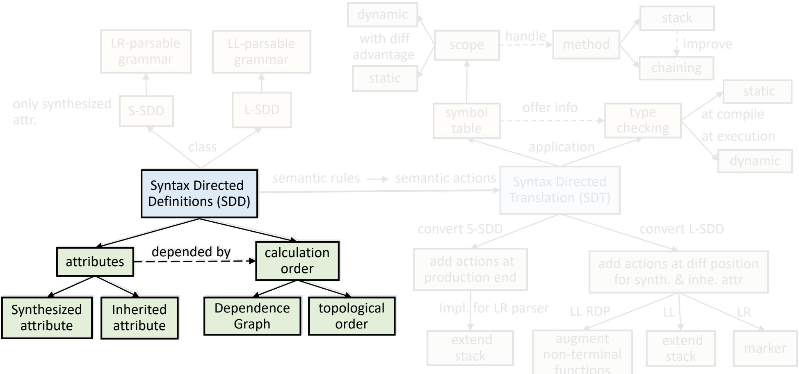

## Syntax Directed Definitions (SDD)

## • SDD是CFG的增广

◆ Grammar symbols together with semantic attributes

◆ Productions associated with a set of semantic rules to compute the value of an expression

## • SDD has two types of attributes [文法符号的两种属性]

◆ Synthesized attribute [综合属性]

◆ Inherited attribute [继承属性]

## Syntax Directed Definitions (SDD)

## Synthesized attribute[综合属性]

◆ Defined by a semantic rule associated with the production at N

 The production must have A as its head (i.e., A -> …)

◆ A synthesized attribute of node N is defined only by attributes of N’s children and N itself[子节点或自身]

## • Inherited attribute[继承属性]

◆ Defined by a semantic rule associated with the production at the parent of N  The production must have A as a symbol in its body (i.e., … -> …A…)

◆ An inherited attributed of node N is defined only by attribute values at N’s parent, N itself, and N’s siblings[父节点、自身或兄弟节点]

## Synthesized Attribute[综合属性]

• Synthesized attribute for non-terminal A of parse-tree node N[非终结符 的综合属性]

◆ Only defined by N’s children and N itself

 Passed up the tree

 P.syn_attr = f(P.attrs, $\mathrm { C } _ { 1 }$ .attrs, $\mathsf { C } _ { 2 }$ .attrs, ${ \mathsf { C } } _ { 3 }$ .attrs)

◆ Example

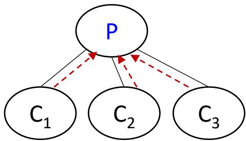

<table><tr><td>Productions</td><td>Semantic rules</td></tr><tr><td>E -&gt; E1+ T</td><td>E.val = E1.val + T.val</td></tr></table>

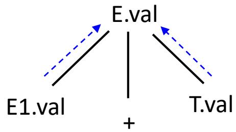

• Terminals CAN have synthesized attributes[终结符可以具有综合属性]


◆ Lexical values supplied by the lexical analysis

◆ Thus, no semantic rules in SDD for terminals

## Inherited Attribute[继承属性]

• Inherited attribute for non-terminal A of parse-tree node N[非终结符继 承属性]

◆ Only defined by N’s parent, N’s siblings and N itself

 Passed down a parse tree

 C2.inh_attr = f(P.attrs, C1.attrs, C2.attrs, C3.attrs)

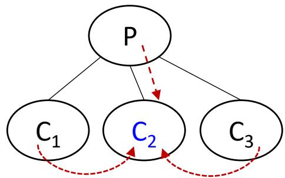

◆ Example

<table><tr><td>Productions</td><td>Semantic rules</td></tr><tr><td>D-&gt;TL</td><td>L.inh = T.type</td></tr></table>

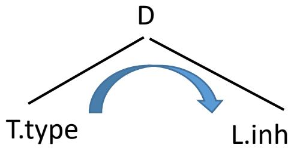

• Terminals CANNOT have inherited attributes[终结符无继承属性]

◆ Only synthesized attributes from lexical analysis

## SDD[语法制导定义]

## • Attribute dependencies in a production rule[产生式中的属性依赖]

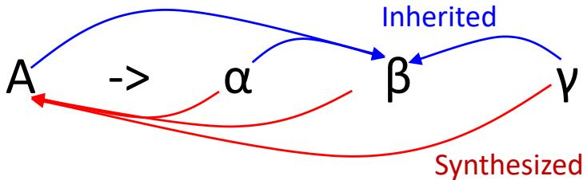

• SDD has rule of the form for each grammar production ◆ b = f(A.attrs, ⍺.attrs, β.attrs, γ.attrs)

• b is either an attribute in LHS (an attribute of A)

◆ In which case b is a synthesized attribute

◆ Why? From A’s perspective ⍺, β, γ are children

• Or, b is an attribute in RHS (e.g., of β)

◆ In which case b is an inherited attribute


◆ Why? From β’s perspective A, ⍺, γ are parent or siblings

## Example: Synthesized attribute

Attribute grammar for simple integer arithmetic expression

<table><tr><td>Grammar rule</td><td>Semantic Rules</td></tr><tr><td> $\mathsf { E } \to \mathsf { E } _ { 1 } + \mathsf { T }$ </td><td> $\mathsf { E . v a l } = \mathsf { E } _ { \scriptscriptstyle 1 } . \mathsf { v a l } + \mathsf { T . v a l }$ </td></tr><tr><td> $\mathsf { E } \to \mathsf { T }$ </td><td> $\mathsf { E } . \mathsf { v a l } = \mathsf { T } . \mathsf { v a l }$ </td></tr><tr><td> $\mathsf { T } \to \mathsf { T } _ { 1 } ^ { * } \mathsf { F }$ </td><td> $\mathsf { T . v a l } = \mathsf { T } _ { \boldsymbol { \imath } } . \mathsf { v a l } ^ { * }$  F.val</td></tr><tr><td> $T  F$ </td><td> $\mathsf { T } . \mathsf { v a l } = \mathsf { F } . \mathsf { v a l }$ </td></tr><tr><td> $\mathsf { F } \to ( \mathsf { E } )$ </td><td> $\mathsf { F } . \mathsf { v a l } = \mathsf { E } . \mathsf { v a l }$ </td></tr><tr><td> $\mathsf { F } \to \mathsf { d i g h t }$ </td><td> $\mathsf { F } . \mathsf { v a l } = \mathsf { d i g h t } . \mathsf { v a l }$ </td></tr></table>

The val attribute is synthesized

## Example: Inherited Attribute

## Attribute grammar for variable

<table><tr><td>Grammar rule</td><td>Semantic Rules</td></tr><tr><td>decl -&gt; type varlist type -&gt; int type -&gt; float varlist1 -&gt; id, varlist2 varlist -&gt; id</td><td>varlist.dtype = type.dtype type.dtype = integer type.dtype = real id.dtype = varlist1.dtype varlist2.dtype = varlist1.dtype id.dtype = varlist.dtype</td></tr></table>

## The dtype attribute is inherited

## The Concepts

## • Side effect[副作用]

◆ 一般属性值计算（基于属性值或常量进行的）之外的功能

◆ 例如：code generation, print results, modify symbol table …

## • Attribute grammar[属性文法]

◆一个没有副作用的SDD

◆The rules define the value of an attribute purely in terms of the value of other attributes and constants[属性文法的规则仅仅通过其他属性值和常量来定义一个属性值]

## • Annotated parse-tree[标注分析树]

每个节点都带有属性值的分析树

 A parse tree showing the value(s) of its attribute(s)

◆a.k.a., attribute parse tree[属性分析树]

## Compilation Phases[编译阶段]

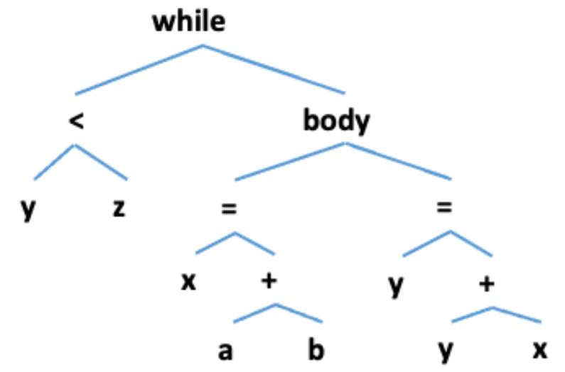  
Abstract Syntax Tree(AST)

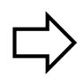

## A very simple illustrative case!

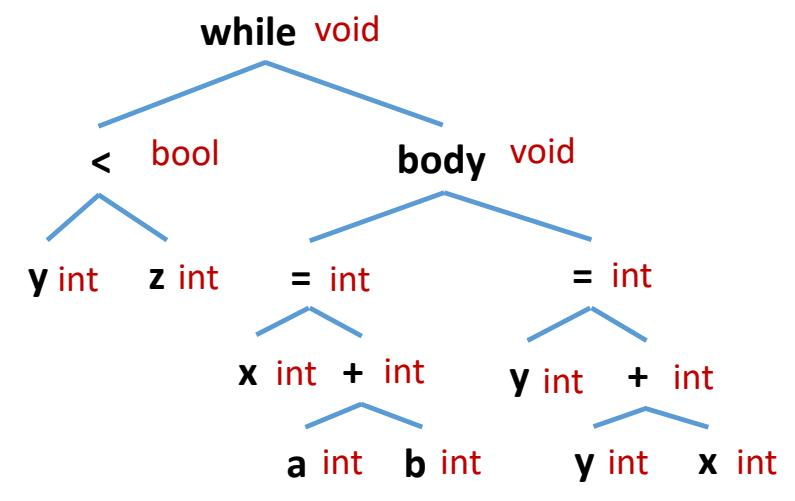  
Annotated AST/Decorated AST [带标注的抽象语法树]

## Semantic Analysis Revisit

## • SDD (Syntax-directed definition)

• CFG + attributes for each symbol + semantic rules for each production

• SDT (Syntax-directed definition)

• CFG + attributes for each symbol + {semantic actions} in each production

## • Synthesized attribute

• Terminals CAN have synthesized attributes

## • Inherited Attribute

• Terminals CANNOT have inherited attributes

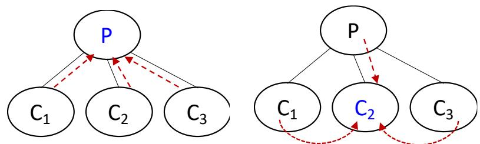

## Grammar

$$
{ \mathsf { S D D } } \left( { \mathsf { r u l e s } } \right)
$$

$$
\mathsf { D } \to \mathsf { T } \mathsf { L }
$$

$$
\mathsf { L . i n h = T . t y p e }
$$

$$
{ \mathsf { T } } \to { \mathsf { i n t } }
$$

$$
\mathsf { T } \to \mathsf { f l o a t }
$$

$$
\bar { \mathsf { T } } . \mathsf { t y p e } = \mathsf { i n t }
$$

$$
\mathsf { T . t y p e } = \mathsf { f l o a t }
$$

SDT (actions)


$$
\mathsf { L 1 . i n h = L . i n h }
$$

$$
\mathsf { D } \mathsf { - > T } \left\{ \mathsf { L } . \mathsf { i n h } = \mathsf { T } . \mathsf { t y p e } \right\} \mathsf { L }
$$

$$
\mathsf { L } \to \mathsf { L } _ { 1 } , \mathsf { i d }
$$

$$
\mathsf { T } \to \mathsf { i n t } \left\{ \mathsf { T } . \mathsf { t y p e } = \mathsf { i n t } \right\}
$$

$$
\mathsf { T } \to \mathsf { f l o a t } \left\{ \mathsf { T } . \mathsf { t y } \mathsf { \ / p e } = \mathsf { f l o a t } \right\}
$$

$$
L  \{ L 1 . \mathrm { i n h } = L . \mathrm { i n h } \} L _ { 1 } , \mathrm { i d }
$$

## Dependence Graph[依赖图]

## • Dependence relationship[依赖关系]

◆ Before evaluating an attribute at a node of a parse tree, we must evaluate all attributes it depends on Inherited

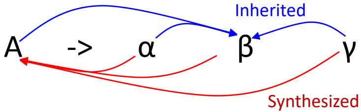

## • Dependency graph[依赖图]

◆ While the annotated parse tree shows the values of attributes, a dependency graph helps determine how those values can be computed[决定属性值计算]

◆ Depicts the flow of information among the attribute instances in a particular parse tree[描绘了分析树的属性信息流]

 Edges are dependence relationships between attributes

 For each parse-tree node X, there’s a graph node for each attr of X

 If X.a depends on Y.b, then there’s one directed edge from X.a to Y.b

## Example: Dependency Graph

## SDD：

<table><tr><td>Productions</td><td>Semantic rules</td></tr><tr><td>D -&gt;TL</td><td>L.inh = T.type</td></tr><tr><td>T-&gt; int</td><td>T.Type = = int</td></tr><tr><td>T-&gt; float</td><td>T.Type : = float</td></tr><tr><td>L-&gt;L id</td><td>L1.inh = L.inh</td></tr><tr><td></td><td>addtype(id. .entry,L.inh)</td></tr><tr><td>L-&gt; id</td><td>addtype(id.entry,L.inh)</td></tr></table>

Input: float a, b, c

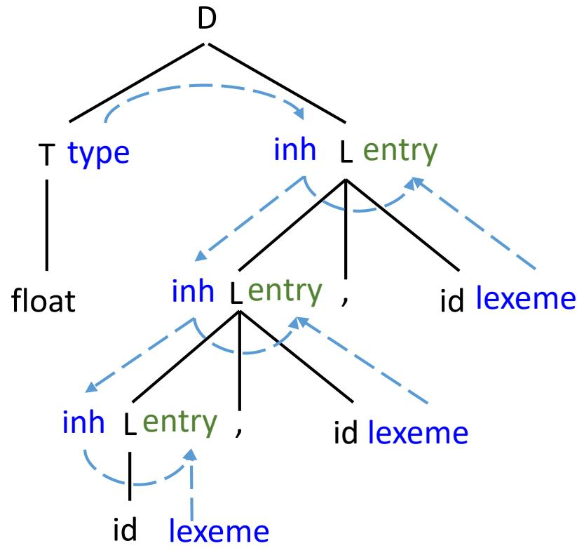  
‘entry’ is dummy attribute for the addtype()

## Evaluation Order[属性值计算顺序]

## • Ordering the evaluation of attributes[计算顺序]

◆ Dependency graph characterizes possible orders in which we can evaluate the attributes at the various nodes of a parse-tree[依赖图描述了属性计算顺序]

• If the graph has an edge from node M to node N, then the attribute associated with M must be evaluated before N[用图的边来确定计算顺序]

◆ Thus, the only allowable orders of evaluation are those sequences of nodes $\mathsf { N } _ { 1 } ,$ $\Nu _ { 2 } , . . . , \Nu _ { \mathrm { k } }$ such that if there is an edge from Ni to Nj and i < j

◆ This order embeds a directed graph into a linear order, called a topological sort[拓扑排序] of the graph

 If there’s any cycle in the graph, then there are no topological sorts, i.e., no way to evaluate the SDD on this parse tree

 If there are no cycles, then there is always at least one topological sort

## Example: Evaluation Order

## SDD：

<table><tr><td>Productions</td><td>Semantic rules</td></tr><tr><td>D -&gt;TL</td><td>L.inh = : T.type</td></tr><tr><td>T iV int</td><td>T.type= int</td></tr><tr><td>T-&gt; float</td><td>T.type= float</td></tr><tr><td>L-&gt;L, id</td><td>L1.inh=L.inh</td></tr><tr><td></td><td>addtype(id. d.entry,L.inh)</td></tr><tr><td>L-&gt; id</td><td>addtype(id.entry,L.inh)</td></tr></table>

Input: float a,b,c

Topological sort: 1, 2, 3, 4, 5, 6, 7, 8, 9, 10

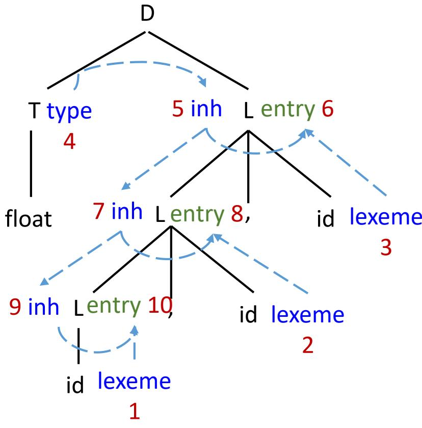

## Evaluation Order (cont.)

• Before evaluating an attribute at a node of a parse tree, we must evaluate all attributes it depends on [依赖关系]

◆ Synthesized: evaluate children first, then the node itself

◆ Inherited: evaluate parent and dependent siblings first, then the node itself

◆ For SDD’s with both inherited and synthesized attributes, there’s no guarantee that there is even one evaluation order

• Difficult to check circularities in a dependency graph

◆ But, there are subclasses of SDD’s that guarantee an evaluation order

 Such classes do not permit graphs with cycles

Production


$$
A - > B
$$

Semantic Rules

$$
\mathsf { A } . \mathsf { S } \mathrm { = } \mathsf { B } . \mathsf { i } ;
$$

$$
( \sum \limits _ { 8 . i } ^ { A . s } )
$$

$$
\mathsf { B } . \mathsf { i } = \mathsf { A } . \mathsf { s } + 1 ;
$$

## Content

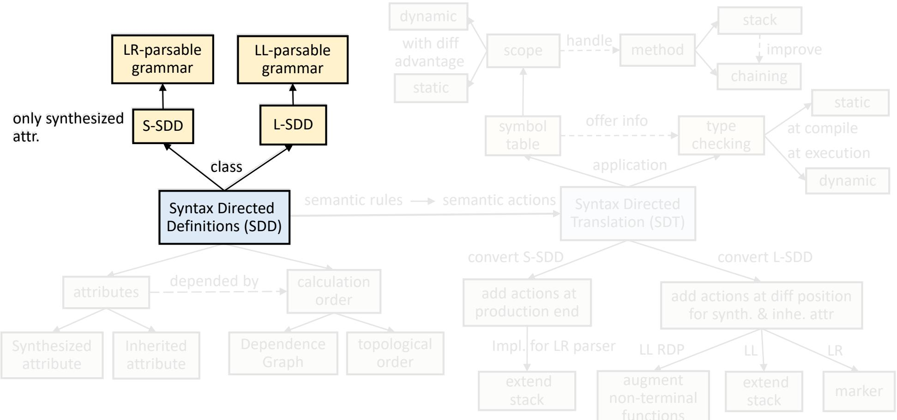

## S-Attributed Definitions[S-属性定义]

## • An SDD is S-attributed if every attribute is synthesized[只具有综合属性]

## • If an SDD is S-attributed (S-SDD)

◆ Can evaluate its attributes in any bottomup order of the nodes of the parse-tree[自底 向上的顺序计算属性值]

◆ Can be implemented during bottom-up parsing[与自底向上的语法分析同时进行]

<table><tr><td>Productions</td><td>Semantic rules</td></tr><tr><td>(1)L-&gt; E</td><td>print(E.val)</td></tr><tr><td> $2 ) E \mathrm {  E _ { 1 } + T }$ </td><td>E.val = E_.val+T.val</td></tr><tr><td>(3)E-&gt; T</td><td>E.val =T.val</td></tr><tr><td> $4 ) \mathsf { T } \to \mathsf { T } _ { 1 } ^ { \ast } \mathsf { F }$ </td><td>T.val= T1.valxF.val</td></tr><tr><td>(5)T-&gt; F</td><td>T.val=F.val</td></tr><tr><td>(6)F-&gt; (E)</td><td>F.val=E.val</td></tr><tr><td>(7)F-&gt; digit</td><td>F.val=digit.lexval</td></tr></table>

## L-Attributed Definitions[L-属性定义]

## • An SDD is L-attributed (L-SDD) if

◆ Between the attributes associated with a production body, dependency graph edges can only go from left to right [依赖图的边只能从左到右]

◆ Each attribute can be either synthesized, or inherited with the rules that suppose $\mathsf { A } \to \mathsf { X } _ { 1 } \mathsf { X } _ { 2 } . . . \mathsf { X } _ { \mathsf { i } - 1 } \mathsf { X } _ { \mathsf { i } } ,$ the inherited attribute $\mathbb { X } _ { i } . { \mathsf { a } }$ only depends on:

1. Inherited attributes associated with A [A的继承属性, Why?]

2. Either syn or inh attributes of $\mathsf X _ { _ 1 } , \mathsf X _ { _ 2 } , . . . , \mathsf X _ { _ { i - 1 } }$ located to the left of ${ \sf X } _ { i } \left[ { \sf X } _ { i } \right.$ 的之前符 号的综合/继承属性]

3. Either syn or inh attributes of ${ \sf X } _ { j }$ itself, but no cycles formed by the attributes of this $\mathsf { X } _ { i } \left[ \mathsf { X } _ { i } \right.$ 的综合/继承属性 (不能出现环形依赖)]

◆ L-SDD是对S-SDD的拓展, Can be implemented during top-down/bottom-up parsing [L属性的语义分析可在LL/LR分析中完成]

## L-Attributed Definitions (cont.)

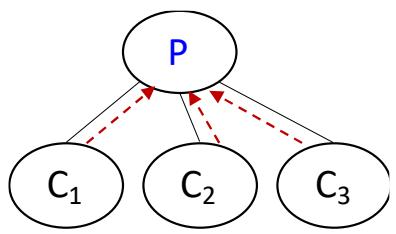  
综合属性

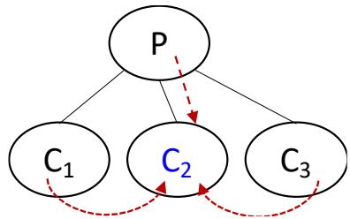  
继承属性

S-SDD or L-SDD?

<table><tr><td>Productions</td><td>Semantic rules</td></tr><tr><td> $\mathsf { A } \to \mathsf { B C }$ </td><td> $\mathtt { A . S } = \mathtt { B . b }$   ${ \mathsf { B } } . { \mathsf { i } } = { \mathsf { f } } ( { \mathsf { C } } . { \mathsf { c } } , { \mathsf { A } } . { \mathsf { S } } )$ </td></tr></table>

Not S-SDD: B.i is inh [S属性文法中不会出现 继承属性]

Not L-SDD: A.s is syn arrt, C is right to B[L属性文法中, 继承属性 (B.I)不会依赖综合属性(A.s)][L属性文法中, RHS不会出现从右到左的依赖关系]

## Content

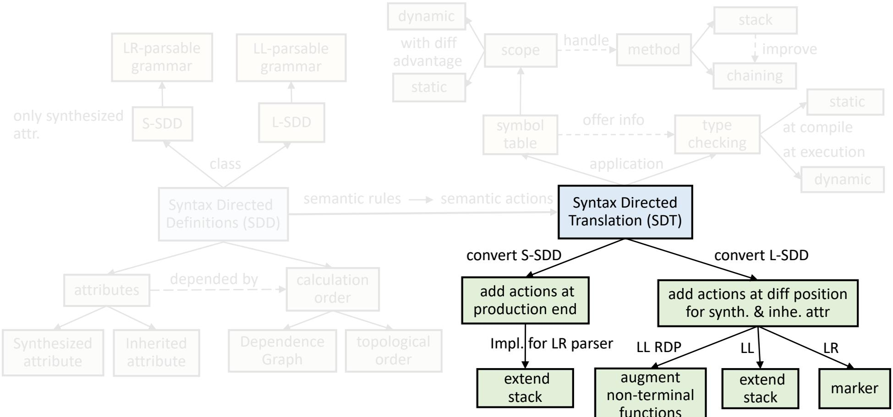

## Implementation[实现]

## • SDT (executable SDD) can be implemented in two ways

## ◆Using a parse tree or AST[基于预先构建的分析树]

 First build a parse tree, and then apply rules or actions at each node while traversing the tree

 All SDDs (without cycles) and SDTs can be implemented since the tree can be traversed freely, implements any ordering

◆ During parsing, without building a parse tree[语法分析过程中]

 Apply rules or actions at each production while parsing

 Only a subset of SDDs and SDTs can be implemented

 Evaluation ordering restricted to parser derivation order

## Implementation[实现]

• Two important classes of SDD’s[两个关键子类]

◆ SDD is S-attributed, the underlying grammar is LR-parsable

◆ SDD is L-attributed, the underlying grammar is LL-parsable

• For both classes, semantic rules in an SDD can be converted into an SDT with actions that are executed at the right time[允许SDD到SDT的转换]

◆ During parsing, an action in a production body is executed as soon as all the grammar symbols to the left of the action have been matched

## Implement S-SDD

## • Convert S-attributed SDD to SDT[SDD到SDT的转换]

◆ Place each action at the end of the production[将每个语义动作都放在产生式的最后]

◆ SDTs with all actions at the right ends of the production bodies are called Postfix SDT [后缀/尾部SDT]

S-SDD
<table><tr><td>Productions</td><td>Semantic rules</td></tr><tr><td> $( 1 ) L \mathrm { - } > E$ </td><td> $p r i n t ( E . v a I )$ </td></tr><tr><td> $( 2 ) E \mathrm { \right. } E _ { 1 } \mathrm { \left. } T$ </td><td> $E . v a l { = } E _ { \mathit { 1 } } . v a l { + } T . v a l$ </td></tr><tr><td> $( 3 ) E \mathrm { - } > T$ </td><td> $E . v a l { = } T . v a l$ </td></tr><tr><td> $( 4 ) T {  } T _ { 1 } { ^ { * } F }$ </td><td> ${ \cal T } . v a l { = } T _ { \it 1 } . v a l x F . v a l$ </td></tr><tr><td>(5  $\vert T _ { \ l } > F$ </td><td> $T . v a I { = } F . v a I$ </td></tr><tr><td> $( \epsilon ) F {  } ( E )$ </td><td> $F . v a l { = } \boldsymbol { E } . v a l$ </td></tr><tr><td> $( 7 ) F {  } d i g i t$ </td><td> $F . v a I { = } d i g i t . I e x v a I$ </td></tr></table>

SDT
<table><tr><td>CFG with actions</td></tr><tr><td> $( 1 ) L \ – > E \{ p r i n t ( E . v a I ) \}$   $) E \ – > E _ { 1 } + T \left\{ E . v a l = E _ { 1 } . v a l + T . v a I \right\}$   $) E \mathrm { - } > T \left\{ E . v a l \mathrm { = } T . v a l \right\}$ </td></tr><tr><td>２345  $) T \mathrm { - } > T _ { _ 1 } { ^ * F } \left\{ T . v a I \mathrm { = } T _ { _ 1 } . v a I x F . v a I \right\}$ </td></tr><tr><td> $) T \mathrm { - } > F \left\{ T . v a I \mathrm { = } F . v a I \right\}$   ${ } ^ { \prime } 6 ) F  – > ( E ) \ \{ F . v a I = E . v a I \}$ </td></tr></table>

## Implement S-SDD (cont.)

• If the underlying grammar of S-SDD is LR parsable

◆ Then the SDT can be implemented during LR parsing

• Implement the converted SDT by reduction[借助归约实现]

◆ Executing the action along with the reduction of LHS <- RHS

SDT  
CFG with actions   
(1)L-> E {print(E.val)}   
(2)E-> E1+ T {E.val = E1.val+T.val}   
(3)E-> T {E.val = T.val}   
(4)T-> T1\* F {T.val = T1.valxF.val }   
(5)T-> F {T.val = F.val}   
(6)F-> (E) {F.val = E.val}   
(7)F-> digit {F.val = digit.lexval}

SLR Automaton  
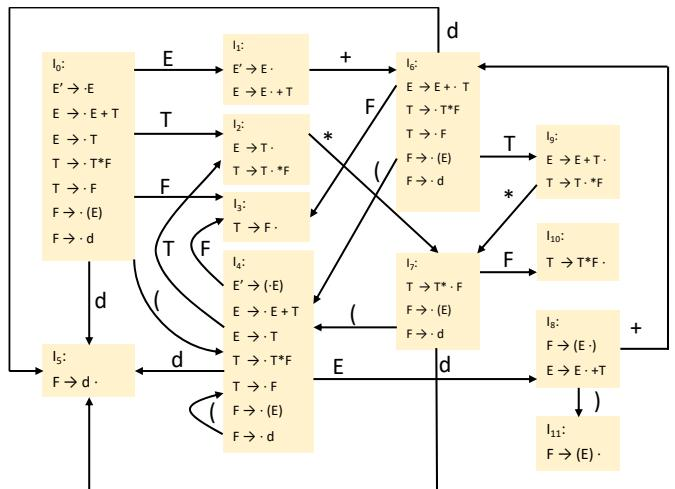

## Extend LR Parse Stack[扩展分析栈]

• Save synthesized attributes into the stack[栈中额外存放综合属性值]

◆ Place the attributes along with the grammar symbols (or LR states that associated with these symbols) in records on stack

◆ If there are multiple attributes

 Make the records large enough or by putting pointers to records on the stack [栈记录足够大，或栈记录中存放指针]

## • Example: A -> XYZ

◆ x, y, z are attributes of X, Y, Z respectively

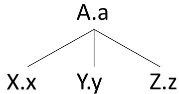

◆ After the action, A and its attributes are at the top (i.e., m-2)

State:

$$
\mathsf { S } _ { 0 } \ldots \mathsf { S } _ { \mathsf { m } - 2 } \mathsf { S } _ { \mathsf { m } - 1 } \mathsf { S } _ { \mathsf { m } }
$$

Symbol:


$$
s _ { Ḋ } \mathrm { t a t e }  \textsf { S } _ { 0 } \ldots \textsf { S } _ { m - 2 }
$$

Attribute:

$$
\mathsf { S y m b o l \to \Sigma ~ S ~ \Sigma ~ \{ m \} }
$$

## Stack Manipulation[栈操作]

• Rewrite the actions to manipulate the parser stack

◆ The manipulation can be done automatically by the parser

stack[top-2].symbol= A   
stack[top-2].val = f(stack[top-2].val, stack[top-1].val, stack[top].val)top = top-2

$$
\mathsf { A } \to \mathsf { X Y Z } \left\{ \mathsf { A } . \mathsf { a } = \mathsf { f } ( \dot { \mathsf { X } } . \mathsf { x } , \dot { \mathsf { Y } } . \mathsf { y } , \mathsf { Z } . \mathsf { z } ) \right\}
$$

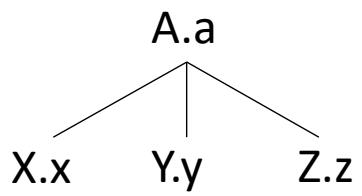

State: $S _ { 0 } \ldots S _ { m - 2 } \ s _ { m - 1 } \ s _ { m }$

$$
\mathsf { S } _ { 0 } \ldots \mathsf { S } _ { \mathrm { m } - 2 }
$$


## Example

## • Rewrite the actions to manipulate the parser stack

◆ The manipulation can be done automatically by the parser

<table><tr><td rowspan=1 colspan=1>Productions</td><td rowspan=1 colspan=1> Semantic rules</td><td rowspan=1 colspan=1>Semantic Actions</td></tr><tr><td rowspan=1 colspan=1> $( 1 ) L  E$ </td><td rowspan=1 colspan=1> print(E.val)</td><td rowspan=1 colspan=1>{print(stack[top].val);}</td></tr><tr><td rowspan=1 colspan=1> $( 2 ) E  \mathsf { E } _ { 1 } + \mathsf { T }$ </td><td rowspan=1 colspan=1> E.val= E1.val+T.val</td><td rowspan=1 colspan=1>{ stack[top-2].val= stack[top-2].val + stack[top].val;top = top-2;}</td></tr><tr><td rowspan=1 colspan=1>(3)E-&gt;T</td><td rowspan=1 colspan=1> E.val=T.val</td><td rowspan=1 colspan=1></td></tr><tr><td rowspan=1 colspan=1> $( 4 ) \mathsf { T } \to \mathsf { T } _ { 1 } ^ { * } \mathsf { F }$ </td><td rowspan=1 colspan=1> $\mathsf { T . v a l = T _ { \mathrm { 1 } } . v a l ^ { * } F . v a l }$ </td><td rowspan=1 colspan=1>{stack[top-2].val= stack[top-2].val * stack[top].val;top = top-2;}</td></tr><tr><td rowspan=1 colspan=1>(5)T-&gt;F</td><td rowspan=1 colspan=1>T.val=F.val</td><td rowspan=1 colspan=1></td></tr><tr><td rowspan=1 colspan=1>(6)F-&gt; (E)</td><td rowspan=1 colspan=1>F.val=E.val</td><td rowspan=1 colspan=1> $\{ { \mathsf { s t a c k } } [ { \mathsf { t o p } } - 2 ] . { \mathsf { v a l } } = ( { \mathsf { s t a c k } } [ { \mathsf { t o p } } - 1 ] . { \mathsf { v a l } } ) ;$ top = top-2;}</td></tr><tr><td rowspan=1 colspan=1>(7)F-&gt; digit</td><td rowspan=1 colspan=1> F.val=digit.lexval</td><td rowspan=1 colspan=1></td></tr></table>

## Example

<table><tr><td>Productions</td><td>Semantic Actions</td></tr><tr><td> $( 1 ) L \mathrm {  } E$   $( 2 ) E \mathrm {  } E 1 + T$ </td><td> $\{ p r i n t ( s t a c k [ t o p ] . v a I ) ; \}$   $\{ s t a c k [ t o p - 2 ] . v a I = s t a c k [ t o p - 2 ] . v a I$   ${ } + s t a c k l t o p . v a l ; \quad t o p = t o p { - } 2 ; \lambda$ </td></tr><tr><td> $( 3 ) E \mathrm { - } > T$   $( 4 ) T {  } T _ { 1 } { ^ { * } F }$ </td><td> $\{ s t a c k [ t o p - 2 ] . v a I = s t a c k [ t o p - 2 ] . v a I$ </td></tr><tr><td> $( 5 ) T \cdot > F$ </td><td> $^ { * } s t a c k l t o p { \jmath } . v a l ; \quad t o p = t o p - 2 ; \jmath$ </td></tr><tr><td> $( \epsilon ) F {  } ( E )$   $( 7 ) F {  } d i g i t$ </td><td> $\{ s t a c k [ t o p - 2 ] . v a I = s t a c k [ t o p - 1 ] . v a I ;$   $t o p = t o p \cdot 2 ; j$ </td></tr></table>

Input: $3 ^ { * } 5 + 4$

state -> $\mathsf { S } _ { 0 } \mathsf { S } _ { 2 } \mathsf { S } _ { 7 } \mathsf { S } _ { 1 0 }$

Symbol -> \$ T \* F

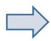

Attribute -> - 3 - 5 (top)

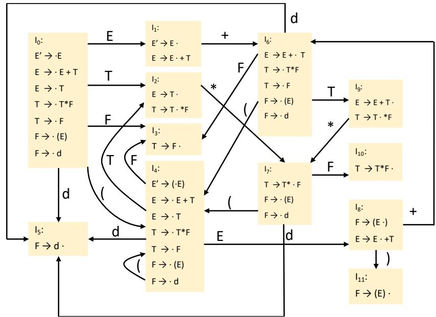

state $\because S _ { 0 } S _ { n }$ Symbol -> \$ T Attribute -> - 15 (top)

## Example

Input: 3\*5+4

<table><tr><td>Productions</td></tr><tr><td>(1)L-&gt; E n (2)E-&gt; E1+ T</td></tr><tr><td>(3)E-&gt; T</td></tr><tr><td>(4)T-&gt; T1* F</td></tr><tr><td>(5)T-&gt; F (6)F-&gt; (E) (7)F-&gt; digit</td></tr></table>


<table><tr><td rowspan=1 colspan=1> Step</td><td rowspan=1 colspan=1> States(Illustrative)</td><td rowspan=1 colspan=1>Attributes</td><td rowspan=1 colspan=1>Input</td><td rowspan=1 colspan=1>Code</td><td rowspan=1 colspan=1> Output</td></tr><tr><td rowspan=1 colspan=1>1</td><td rowspan=1 colspan=1>$</td><td rowspan=1 colspan=1>$</td><td rowspan=1 colspan=1>3*5+4n$</td><td rowspan=1 colspan=1></td><td rowspan=1 colspan=1></td></tr><tr><td rowspan=1 colspan=1>2</td><td rowspan=1 colspan=1>$3</td><td rowspan=1 colspan=1>$3</td><td rowspan=1 colspan=1>*5+4n$</td><td rowspan=1 colspan=1></td><td rowspan=1 colspan=1>F → digit</td></tr><tr><td rowspan=1 colspan=1>3</td><td rowspan=1 colspan=1>$F</td><td rowspan=1 colspan=1>$3</td><td rowspan=1 colspan=1>*5+4n$</td><td rowspan=1 colspan=1></td><td rowspan=1 colspan=1>T→F</td></tr><tr><td rowspan=1 colspan=1>4</td><td rowspan=1 colspan=1>$T</td><td rowspan=1 colspan=1>$3</td><td rowspan=1 colspan=1>*5+4n$</td><td rowspan=1 colspan=1></td><td rowspan=1 colspan=1></td></tr><tr><td rowspan=1 colspan=1>5</td><td rowspan=1 colspan=1>$T*</td><td rowspan=1 colspan=1>$3*</td><td rowspan=1 colspan=1>5+4n$</td><td rowspan=1 colspan=1></td><td rowspan=1 colspan=1></td></tr><tr><td rowspan=1 colspan=1>6</td><td rowspan=1 colspan=1>$T*5</td><td rowspan=1 colspan=1>$3*5</td><td rowspan=1 colspan=1>+4n$</td><td rowspan=1 colspan=1>1111</td><td rowspan=1 colspan=1>F → digit</td></tr><tr><td rowspan=1 colspan=1>7</td><td rowspan=1 colspan=1>$T*F</td><td rowspan=1 colspan=1>$3*5</td><td rowspan=1 colspan=1>+4n$</td><td rowspan=1 colspan=1>3*5</td><td rowspan=1 colspan=1>T→T*F</td></tr><tr><td rowspan=1 colspan=1>8</td><td rowspan=1 colspan=1>$T</td><td rowspan=1 colspan=1>$15</td><td rowspan=1 colspan=1>+4n$</td><td rowspan=1 colspan=1></td><td rowspan=1 colspan=1>E →</td></tr><tr><td rowspan=1 colspan=1>9</td><td rowspan=1 colspan=1>$E</td><td rowspan=1 colspan=1>$15</td><td rowspan=1 colspan=1>+ 4n$</td><td rowspan=1 colspan=1></td><td rowspan=1 colspan=1></td></tr><tr><td rowspan=1 colspan=1>10</td><td rowspan=1 colspan=1>$E+</td><td rowspan=1 colspan=1>$15+</td><td rowspan=1 colspan=1>4 n $</td><td rowspan=1 colspan=1></td><td rowspan=1 colspan=1></td></tr><tr><td rowspan=1 colspan=1>11</td><td rowspan=1 colspan=1>$E+4</td><td rowspan=1 colspan=1>$15+4</td><td rowspan=1 colspan=1>n $</td><td rowspan=1 colspan=1></td><td rowspan=1 colspan=1>F → digit</td></tr><tr><td rowspan=1 colspan=1>12</td><td rowspan=1 colspan=1>$E+F</td><td rowspan=1 colspan=1>$15+4</td><td rowspan=1 colspan=1>n$</td><td rowspan=1 colspan=1></td><td rowspan=1 colspan=1>T→F</td></tr><tr><td rowspan=1 colspan=1>13</td><td rowspan=1 colspan=1>$E+T</td><td rowspan=1 colspan=1>$15+4</td><td rowspan=1 colspan=1>n $</td><td rowspan=1 colspan=1>15+4</td><td rowspan=1 colspan=1>E→E+T</td></tr><tr><td rowspan=1 colspan=1>14</td><td rowspan=1 colspan=1>$E</td><td rowspan=1 colspan=1>$19</td><td rowspan=1 colspan=1>n $</td><td rowspan=1 colspan=1></td><td rowspan=1 colspan=1></td></tr><tr><td rowspan=1 colspan=1>15</td><td rowspan=1 colspan=1>$En</td><td rowspan=1 colspan=1>$19 n</td><td rowspan=1 colspan=1>$</td><td rowspan=1 colspan=1>print(19)</td><td rowspan=1 colspan=1>→</td></tr><tr><td rowspan=1 colspan=1>16</td><td rowspan=1 colspan=1>$L</td><td rowspan=1 colspan=1>$19</td><td rowspan=1 colspan=1>$</td><td rowspan=1 colspan=1>accept</td><td rowspan=1 colspan=1></td></tr></table>

## Implement L-SDD

## • We have examined S-SDD -> SDT -> implementation

◆ S-SDD can be converted to SDT with actions at production ends

◆ The SDT can be parsed and translated by bottom-up, as long as the underlying grammar is LR-parsable

## • What about the more-general L-attributed SDD?

◆ Rule for turning L-SDD into an SDT

1. Embed the action that computes the inherited attributes for a nonterminal A immediately before the occurrence of A in the production body

2. Place the actions that compute a synthesized attribute for the LHS at the end of the production body

## Example

• A -> B {C.inh} C {A.syn}

◆ C的继承属性: 在C之前

◆ A的综合属性: 在RHS末尾

<table><tr><td> Productions</td><td> Semantic rules</td></tr><tr><td>(1  $) T - s \mathsf { F T } ^ { \prime }$ </td><td> $\mathsf { T } ^ { \prime } . \mathsf { i n h } = \mathsf { F } . \mathsf { v a l }$   $\mathsf { T } . \mathsf { V a l } = \mathsf { T } ^ { \prime } . \mathsf { S } \mathsf { V } \mathsf { n }$ </td></tr><tr><td>(2)  $\mathsf { T } ^ { \prime } \mathsf { - } > \mathsf { \Omega } ^ { \ast } \mathsf { F } \mathsf { T } _ { 1 } ^ { \prime }$ </td><td> $\mathsf { T } _ { 1 } ^ { \prime } . \mathsf { i n h } = \mathsf { T } ^ { \prime } . \mathsf { i n t } ^ { * }$  F.val  $\bar { \mathsf { T } } ^ { \prime } . \mathsf { S y n } = \bar { \mathsf { T } } _ { 1 } ^ { \prime } . \mathsf { S y n }$ </td></tr><tr><td>(3)  $\pi ^ { \prime } { \cdot } > \varepsilon$ </td><td> $ { \top }  { \cdot }  { \mathsf { S y n } } =  { \mathsf { T } } ^ { \prime } .  { \mathsf { i n h } }$ </td></tr><tr><td>(4)F-&gt; digit</td><td> $\mathsf { F . v a l } = \mathsf { d i g i t . l e x v a l }$ </td></tr></table>

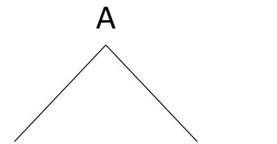  
C.inh C A.syn

<table><tr><td> SDT</td></tr><tr><td>四②③④  ${ \mathsf { T } } { \mathsf { - } } { \mathsf { \textsf { P } } } \left\{ { \mathsf { T } } ^ { \prime } { \mathrm { . i n h } } = { \mathsf { F } } { \mathsf { . v a l } } \right\} { \mathsf { T } } ^ { \prime } \left\{ { \mathsf { T } } { \cdot } { \mathsf { v a l } } = { \mathsf { T } } ^ { \prime } { \mathrm { . } } { \mathsf { . } } { \mathsf { s y n } } \right\}$   ${ \sf T ^ { \prime } }  { \mathrm { \Large ~ * } } _ { \sf { F } } \ \{ { \sf T } _ { 1 } ^ { \prime } . \mathrm { i n h } = { \sf T } ^ { \prime } . \mathrm { i n t } ^ { * } \ { \sf F } . { \mathrm { v a l } } \} \ { \sf T } _ { 1 } ^ { \prime } \ \{ { \sf T ^ { \prime } } . { \mathrm { S y n } } = { \sf T } _ { 1 } ^ { \prime } . { \mathrm { S y n } } \}$   $\mathsf { T ^ { \prime } { \cdot } } { \mathsf { > } } \mathsf { \beta } \notin \{ \top ^ { \prime } . \mathsf { S } \forall \mathsf { n } = \mathsf { T ^ { \prime } } . \mathsf { i n h } \}$   $\mathsf { F } \to \mathsf { d i g i t } \ \{ \mathsf { F } . \mathsf { v a l } = \mathsf { d i g i t } . \mathsf { l e x v a l } \}$ </td></tr></table>

## Implement L-SDD

• If the underlying grammar is LL-parsable, then the SDT of L-SDD can be implemented during LL or LR parsing [若文法是LL可解析的，则可在LL或 LR语法分析过程中实现]

• Semantic translation during parsing

◆ An LL recursive-descent parser[递归下降的LL分析]

 Augment non-terminal functions to both parsing and attributes handling

◆ An LL predictive parser[非递归的LL预测分析]

 Extend the parse stack to hold actions and certain data items needed for attribute evaluation

◆ An LR parser[LR分析]

 Rewrite grammars to involve marker

## • For the top-down ones, we need to eliminate left recursion first!

## Eliminating left recursion

• A motivating example: a simple case

• Trick: treating actions as terminals if they do not calculate any attributes.

$$
E \stackrel { * } { = } > E + \mathsf { T } + \mathsf { T } + \mathsf { T } . . .
$$

$$
\mathbb { A } \to \mathbb { A } \alpha \mid \beta \quad \Rightarrow \mathbb { A } \to \beta \mathbb { A } ^ { \prime } ; \mathbb { A } ^ { \prime } \to \alpha \mathbb { A } ^ { \prime } \mid \varepsilon
$$

$$
\begin{array} { r l } { \mathsf { E } } & { { } \to \quad \mathsf { T } \mathsf { R } } \\ { \mathsf { R } } & { { } \to \quad + \mathsf { T } \mathsf { R } \mid \varepsilon } \end{array}
$$

$$
\begin{array} { r l } { \mathsf { E } } & { { } \to \quad \mathsf { E } + \mathsf { T } \underbrace { \{ \mathsf { p r i n t } ( { \mathsf { \Omega } } ^ { \dag } + { } ^ { \dag } ) \} } _ { \mathsf { a s i n g l e t e r m i n a l } } } \end{array}
$$

$$
\begin{array} { r l } { \mathsf { E } } & { { } \to \mathsf { ~ \Gamma ~ } ^ { \mathsf { T } } \mathsf { R } } \\ { \mathsf { R } } & { { } \to \mathsf { ~ \Gamma ~ } + \mathsf { T } \mathrm { ~ \{ ~ p r i n t ( \vec { \Omega } \cdot \vec { \Omega } ) ~ \} ~ } \mathsf { R } } \\ { \mathsf { R } } & { { } \to \mathrm { ~ \Omega ~ } \mathnormal \varepsilon } \end{array}
$$


## Semantic Analysis Revisit

## • Implementing L-SDD: top-down/bottom-up

• L-SDD -> SDT:

1. Embed the action that computes the inherited attributes for a nonterminal A immediately before the occurrence of A in the production body

2. Place the actions that compute a synthesized attribute for the LHS at the end of the production body

A -> B {C.inh} C {A.syn}

⚫ C的继承属性: 在C之前

⚫ A的综合属性: 在RHS末尾

  
C.inh C A.syn

## • Eliminating left recursion！

## Eliminating left recursion

## • A more complex case

$$
\begin{array} { r l } & { \mathsf { E _ { \tau } } \to \mathsf { E } _ { 1 } + \mathsf { T _ { \tau } } \left\{ \mathsf { E } . \mathsf { v a l } = \mathsf { E } _ { 1 } . \mathsf { v a l } + \mathsf { T } . \mathsf { v a l } ; \right\} } \\ & { \mathsf { E _ { \tau } } \to \mathsf { E } _ { 1 } - \mathsf { T _ { \tau } } \left\{ \mathsf { E } . \mathsf { v a l } = \mathsf { E } _ { 1 } . \mathsf { v a l } - \mathsf { T } . \mathsf { v a l } ; \right\} } \\ & { \mathsf { E _ { \tau } } \to \mathsf { T _ { \tau } } \qquad \{ \mathsf { E } . \mathsf { v a l } = \mathsf { T } . \mathsf { v a l } ; \} } \\ & { \mathsf { T _ { \tau } } \to \mathsf { ( E ) _ { \tau } } \quad \{ \mathsf { T } . \mathsf { v a l } = \mathsf { E } . \mathsf { v a l } ; \} } \\ & { \mathsf { T _ { \tau } } \to \mathsf { n u m } \quad \{ \mathsf { T } . \mathsf { v a l } = \mathsf { n u m } . \mathsf { v a l } ; \} } \end{array}
$$

$$
\mathrm { ~ { ~ \bf ~ R ~ } ~ } \to \mathrm { ~ { ~ \bf ~ \varepsilon ~ } ~ } \varepsilon
$$

$$
\begin{array} { c } { { \mathsf { A } \to \mathsf { \{ B A } } ^ { \prime } \mathsf { ; } }  \\ { { \mathsf { A } ^ { \prime } \to \alpha \mathsf { A } ^ { \prime } \mathrm { ~ | ~ } \mathsf { \varepsilon } } } \end{array}
$$

$$
\begin{array} { r l } { \mathsf { E } \quad } & { { } \to \mathrm { ~ \mathsf { ~ T ~ } ~ } \{ \mathrm { ~ R . i = { \bar { ~ } T . v a l } } ; \mathrm { ~ \mathsf { ~ R ~ } ~ } \{ \mathrm { ~ { ~ E . v a l } } = \mathsf { R . S } ; \mathrm { ~ } \} } \\ { \mathsf { R } \quad } & { { } \to \mathrm { ~ \mathsf { ~ + ~ T ~ } ~ } \{ \mathrm { ~ R _ { \lambda } . i = R . i + { \bar { ~ } T . v a l } } ; \mathrm { ~ \mathsf { ~ R } _ { \lambda } ~ } \{ \mathrm { ~ R . ~ S = R _ { \lambda } . S } ; \mathrm { ~ } \} } \\ { \mathsf { R } \quad } & { { } \to \mathrm { ~ - ~ \mathsf { ~ T ~ } ~ } \{ \mathrm { ~ R _ { \lambda } . i = R . i - { \bar { ~ } T . v a l } } ; \mathrm { ~ \mathsf { ~ R } _ { \lambda } ~ } \{ \mathrm { ~ R . ~ S = R _ { \lambda } . S } ; \mathrm { ~ } \} } \\ { \mathsf { R } \quad } &  { } \to \mathrm { ~ \mathsf { ~ \Omega ~ } } \& { { } \nmid \mathrm { ~ R . s = R . i } ; \mathrm { ~ } } \\ { \mathsf { T } \quad } & { { } \to \mathrm { ~ \mathsf { ~ ( ~ E ~ ) ~ } } \{ \mathrm { ~ { ~ T . v a l } ~ } = \mathsf { E . v a l } ; \mathrm { ~ } \} } \\ { \mathsf { T } \quad } & { { } \to \mathrm { ~ \mathsf { ~ n u m ~ } } \{ \mathrm { ~ { ~ \bar { ~ } T . v a l } ~ } = \mathsf { n u m . v a l } ; \mathrm { ~ } \} } \end{array}
$$

解决左递归斩断了产生式 (及actions) E→E + T => E→TR R→ +TR R→ 

用新引入的R，传递属性值，实现计算 R.i (属性传递) R.s (属性返回)

通过R->，将计算结果传回

## Eliminating left recursion

$$
\mathsf { R  + T \{ R _ { 1 } . i = R . i + T . v \mathsf { a } | ; \} R } _ { 1 } \{ \mathsf { R } . s = \mathsf { R } _ { 1 } . s \mathrm { : \ } \}
$$

$$
\mathsf { R  - T } \ \{ \mathsf { R } _ { 1 } . \mathsf { i } = \mathsf { R } . \mathsf { i } - \mathsf { T } . \mathsf { v } \mathsf { a } | ; \} \ \mathsf { R } _ { 1 } \ \{ \mathsf { R } . \mathsf { s } = \mathsf { R } _ { 1 } . \mathsf { s } _ { \prime } ^ { \circ } \ \}
$$


## Eliminating left recursion

## • General rules

• Only available for S-SDD (postfix translation schemes), a subset of L-SDD

$$
\begin{array} { r l } { \mathsf { A } } & { { } \to \quad \mathsf { A } _ { 1 } \mathsf { Y } \ \{ \mathsf { A } . \mathsf { a } = \mathsf { g } ( \mathsf { A } _ { 1 } . \mathsf { a } , \mathsf { Y } . \mathsf { y } ) \ \} } \\ { \mathsf { A } } & { { } \to \quad \mathsf { X } \ \{ \mathsf { A } . \mathsf { a } = \mathsf { f } ( \mathsf { X } . \mathsf { x } ) \ \} } \end{array}
$$

$$
\begin{array} { r l } { \mathsf { A } \quad } & { \to \quad \mathsf { X } \mathrm { ~ \{ ~ R . i = f ( X . x ) ~ \} ~ \mathsf { R } ~ \{ ~ A . a = R . S ~ \} ~ } } \\ { \mathsf { R } \quad } & { \to \quad \mathsf { Y } \mathrm { ~ \{ ~ R _ { 1 } . i = g ( R . i , Y . y ) ~ \} ~ \mathsf { R } _ { 1 } ~ \{ ~ R . s = R _ { 1 } . S ~ \} ~ } } \\ { \mathsf { R } \quad } & { \to \quad \mathsf { \{ ~ R . S = R . i ~ \} ~ } } \end{array}
$$

$$
\begin{array} { r l } & { \mathbb { A } . \hat { \mathbf { a } } = \mathbb { g } ( \mathbb { g } ( \mathbf { f } ( \mathbb { X } . \mathbb { X } ) , \vee _ { 1 } , \vee _ { 2 } , \mathbb { Y } ) } \\ & { \mathbb { A } . \hat { \mathbf { a } } = \mathbb { g } ( \mathbf { f } ( \mathbb { X } . \mathbb { X } ) , \vee _ { 1 : } \mathbb { Y } ) } \\ & { \mathbb { A } . \hat { \mathbf { a } } = \mathbf { f } ( \mathbb { X } . \mathbb { X } ) \qquad \forall _ { 1 } \qquad \left[ \begin{array} { l } { \mathbb { Y } _ { 2 } \mathbb { Y } } \\ { \mathbb { Y } } \end{array} \right] } \\ & { \mathbb { I } } \\ & { \mathbb { I } \qquad \times } \end{array}
$$

$$
\mathsf { A } \stackrel { * } { = } { > } \mathsf { X Y Y Y . . . }
$$

$$
\begin{array} { r l } { \displaystyle } & { { } \forall _ { 1 } } \\ { \displaystyle } & { { } \forall _ { 2 } } \end{array}
$$

$$
\forall _ { 1 } \qquad \mathsf { R . i } = \mathsf { g } ( \mathsf { f } ( \mathsf { X . x } ) , \mathsf { Y } _ { 1 } . \mathsf { y } ) \quad \{ \mathsf { R . s } = \mathsf { R } _ { 1 } . \mathsf { S } \}
$$

$$
\mathrm  ~ \tt ~ \tt ~ \tt ~ \tt ~ \tt ~ \tt ~ \tt ~ \tt ~ \tt ~ \tt ~ \tt ~ \tt ~ \tt ~ \tt ~ 
$$


## Semantic Analysis Revisit

• Evaluation order -> DAG -> topological sort -> circle is NOT allowed

• SDD Subsets without circle: S-SDD and L-SDD

• S-SDD: Synthesized attributes only

• L-SDD: Synthesized and Inherited attributes $( A \to \mathsf { X } _ { 1 } \mathsf { X } _ { 2 } . . . \mathsf { X } _ { \mathrm { i } - 1 } \mathsf { X } _ { \mathrm { i } } )$

• $X _ { j }$ .inh can depend on: (i) A.inh, (ii) $\mathsf { X } _ { \mathrm { j } } . \mathsf { a t t r } , \mathrm { j } < \mathrm { i } ,$ (iii) ${ \mathsf { X } } _ { \mathrm { i } }$ .attr with no circles

## • Implementation:

• Based on parser tree or AST

• Any computation order without dependency circles

• Along with Parser

• Strictly follows the parsing order: Top-down or Bottom-up L-SDD S/L-SDD

## Semantic Analysis Revisit

## • Implementing S-SDD: bottom-up

• S-SDD -> SDT: Place each action at the end of the production

• Slack manuscription: enable automation

S-SDD
<table><tr><td> Productions</td><td> Semantic rules</td></tr><tr><td> $( 1 ) L  E$ </td><td> $p r i n t ( E . v a I )$ </td></tr><tr><td> $( 2 ) E \mathrm { \right. } E _ { 1 } \mathrm { \left. } T$ </td><td> $E . v a l = E _ { \mathit { 1 } } . v a l + T . v a l$ </td></tr><tr><td> $( 3 ) E \mathrm { > } T$ </td><td> $E , v a { \vert } { = } T . v a { \vert }$ </td></tr><tr><td> $( 4 ) T {  } T _ { 1 } { ^ { * } F }$ </td><td> $T . v a l { = } T _ { 1 } . v a l x F . v a l$ </td></tr><tr><td> $( 5 ) T _ { - } > F$ </td><td>T.val=F.val</td></tr><tr><td> $( \epsilon ) F {  } ( E )$ </td><td>F.val=E.val</td></tr><tr><td> $( 7 ) F {  } d i g i t$ </td><td>F.val=digit.lexval</td></tr></table>

## • Example: A -> XYZ

◆ x, y, z are attributes of X, Y, Z respectively

◆ After the action, A and its attributes are at the top (i.e., m-2)

State: $\mathsf { S } _ { 0 } \ldots \mathsf { S } _ { \mathsf { m } - 2 } \mathsf { S } _ { \mathsf { m } - 1 } \mathsf { S } _ { \mathsf { m } }$


Symbol:

$$
s _ { Ḋ } \mathrm { t a t e }  \textsf { S } _ { 0 } \ldots \textsf { S } _ { m - 2 }
$$

Attribute:

$$
\cdots \times . \times \quad \forall . \forall \quad Z . Z
$$

$$
\mathsf { S y m b o l \to \Sigma ~ S ~ \Sigma ~ \{ m \} }
$$

$$
\mathsf { A t t r i b u t e - s \_ s \_ w } \mathsf { A } . \mathsf { a }
$$

## Semantic Analysis Revisit

## • Implementing L-SDD: top-down/bottom-up

• L-SDD -> SDT:

1. Embed the action that computes the inherited attributes for a nonterminal A immediately before the occurrence of A in the production body

2. Place the actions that compute a synthesized attribute for the LHS at the end of the production body

A -> B {C.inh} C {A.syn}

⚫ C的继承属性: 在C之前

⚫ A的综合属性: 在RHS末尾

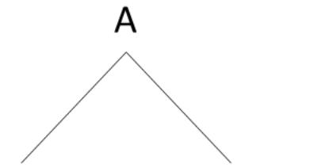  
C.inh C A.syn

## • Eliminating left recursion！

## Eliminating left recursion

## • A more complex case

$$
\begin{array} { l l } { \mathsf { E } \to \mathsf { E } _ { 1 } + \mathsf { T } } & { \{ \mathsf { E } . \mathsf { V a l } = \mathsf { E } _ { 1 } . \mathsf { V a l } + \mathsf { T } . \mathsf { V a l } ; \} } \\ { \mathsf { E } \to \mathsf { E } _ { 1 } - \mathsf { T } } & { \{ \mathsf { E } . \mathsf { V a l } = \mathsf { E } _ { 1 } . \mathsf { V a l } - \mathsf { T } . \mathsf { V a l } ; \} } \\ { \mathsf { E } \to \mathsf { T } } & { \{ \mathsf { E } . \mathsf { V a l } = \mathsf { T } . \mathsf { V a l } ; \} } \\ { \mathsf { T } \to \mathsf { ( E ) } } & { \{ \mathsf { T } . \mathsf { V a l } = \mathsf { E } . \mathsf { V a l } ; \} } \\ { \mathsf { T } \to \mathsf { n u m } } & { \{ \mathsf { T } . \mathsf { V a l } = \mathsf { n u m } . \mathsf { V a l } ; \} } \end{array}
$$

$$
\mathrm { ~ { ~ \bf ~ R ~ } ~ } \to \mathrm { ~ { ~ \bf ~ \varepsilon ~ } ~ } \varepsilon
$$

$$
\begin{array} { c } { { \mathsf { A } \to \mathsf { \{ B A } } ^ { \prime } \mathsf { ; } }  \\ { { \mathsf { A } ^ { \prime } \to \alpha \mathsf { A } ^ { \prime } \mathrm { ~ | ~ } \mathsf { \varepsilon } } } \end{array}
$$

$$
\begin{array} { r l } { \mathsf { E } \quad } & { { } \to \mathrm { ~ \mathsf { ~ T ~ } ~ } \{ \mathrm { ~ R . i = { \bar { ~ } T . v a l } } ; \mathrm { ~ \mathsf { ~ R ~ } ~ } \{ \mathrm { ~ { ~ E . v a l } } = \mathsf { R . S } ; \mathrm { ~ } \} } \\ { \mathsf { R } \quad } & { { } \to \mathrm { ~ \mathsf { ~ + ~ T ~ } ~ } \{ \mathrm { ~ R _ { \lambda } . i = R . i + { \bar { ~ } T . v a l } } ; \mathrm { ~ \mathsf { ~ R } _ { \lambda } ~ } \{ \mathrm { ~ R . ~ S = R _ { \lambda } . S } ; \mathrm { ~ } \} } \\ { \mathsf { R } \quad } & { { } \to \mathrm { ~ - ~ \mathsf { ~ T ~ } ~ } \{ \mathrm { ~ R _ { \lambda } . i = R . i - { \bar { ~ } T . v a l } } ; \mathrm { ~ \mathsf { ~ R } _ { \lambda } ~ } \{ \mathrm { ~ R . ~ S = R _ { \lambda } . S } ; \mathrm { ~ } \} } \\ { \mathsf { R } \quad } &  { } \to \mathrm { ~ \mathsf { ~ \Omega ~ } } \& { { } \nmid \mathrm { ~ R . s = R . i } ; \mathrm { ~ } } \\ { \mathsf { T } \quad } & { { } \to \mathrm { ~ \mathsf { ~ ( ~ E ~ ) ~ } } \{ \mathrm { ~ { ~ T . v a l } ~ } = \mathsf { E . v a l } ; \mathrm { ~ } \} } \\ { \mathsf { T } \quad } & { { } \to \mathrm { ~ \mathsf { ~ n u m ~ } } \{ \mathrm { ~ { ~ \bar { ~ } T . v a l } ~ } = \mathsf { n u m . v a l } ; \mathrm { ~ } \} } \end{array}
$$

解决左递归斩断了产生式 (及actions) E→E + T => E→TR R→ +TR R→ 


用新引入的R，传递属性值，实现计算 R.i (属性传递) R.s (属性返回)

通过R->，将计算结果传回

## Eliminating left recursion

## • General rules

• Only available for S-SDD (postfix translation schemes), a subset of L-SDD

$$
\begin{array} { r l } { \mathsf { A } } & { { } \to \quad \mathsf { A } _ { 1 } \mathsf { Y } \ \{ \mathsf { A } . \mathsf { a } = \mathsf { g } ( \mathsf { A } _ { 1 } . \mathsf { a } , \mathsf { Y } . \mathsf { y } ) \ \} } \\ { \mathsf { A } } & { { } \to \quad \mathsf { X } \ \{ \mathsf { A } . \mathsf { a } = \mathsf { f } ( \mathsf { X } . \mathsf { x } ) \ \} } \end{array}
$$

$$
\begin{array} { r l } { \mathsf { A } \quad } & { \to \quad \mathsf { X } \mathrm { ~ \{ ~ R . i = f ( X . x ) ~ \} ~ \mathsf { R } ~ \{ ~ A . a = R . S ~ \} ~ } } \\ { \mathsf { R } \quad } & { \to \quad \mathsf { Y } \mathrm { ~ \{ ~ R _ { 1 } . i = g ( R . i , Y . y ) ~ \} ~ \mathsf { R } _ { 1 } ~ \{ ~ R . s = R _ { 1 } . S ~ \} ~ } } \\ { \mathsf { R } \quad } & { \to \quad \mathsf { \{ ~ R . S = R . i ~ \} ~ } } \end{array}
$$

$$
\begin{array} { r l } & { \quad \mathbb { A } . \bar { \alpha } = \mathbb { g } ( \mathbb { g } ( \mathbf { f } ( \mathsf { X } . \mathsf { x } ) , \mathsf { V } _ { 1 } . \mathsf { V } ) , \mathsf { V } _ { 2 } . \mathsf { V } ) } \\ & { \quad \quad \quad \quad \quad \quad \quad \quad \quad \quad \quad \quad \quad \quad \quad \quad \quad \quad } \\ & { \quad \quad \quad \quad \quad \quad \quad \quad \quad \quad \quad \quad \quad \quad \quad \quad \quad \quad \quad \quad \quad \quad \quad \quad \quad \quad \quad \quad \quad \quad \quad } \\ & { \quad \quad \quad \quad \quad \quad \quad \quad \quad \quad \quad \quad \quad \quad \quad \quad \quad \quad \quad \quad \quad \quad \quad \quad \quad \quad } \\ & { \quad \quad \quad \quad \quad \quad \quad \quad \quad \quad \quad \quad \quad \quad \quad \quad \quad \quad \quad \quad \quad \quad \quad \quad \quad \quad } \\ & { \quad \quad \quad \quad \quad \quad \quad \quad \quad \quad \quad \quad \quad \quad \quad \quad \quad \quad \quad \quad \quad \quad \quad \quad \quad \quad \quad \quad } \\ & { \quad \quad \quad \quad \quad \quad \quad \quad \quad \quad \quad \quad \quad \quad \quad \quad \quad \quad \quad \quad \quad \quad \quad \quad \quad \quad \quad } \\ & { \quad \quad \quad \quad \quad \quad \quad \quad \quad \quad \quad \quad \quad \quad \quad \quad \quad \quad \quad \quad \quad \quad \quad \quad } \\ & { \quad \quad \quad \quad \quad \quad \quad \quad \quad \quad \quad \quad \quad \quad \quad \quad \quad \quad } \\ & { \quad \quad \quad \quad \quad \quad \quad \quad \quad \quad \quad \quad \quad \quad \quad \quad \quad \quad \quad \quad } \\ & { \quad \quad \quad \quad \quad \quad \quad \quad \quad \quad \quad \quad \quad \quad \quad \quad \quad } \\ & { \quad \quad \quad \quad \quad \quad \quad \quad \quad \quad \quad \quad \quad \quad \quad \quad } \\ & { \quad \quad \quad \quad \quad \quad \quad \quad \quad \quad \quad \quad \quad \quad } \\ & { \quad \quad \quad \quad \quad \quad \quad \quad \quad \quad \quad \quad \quad } \end{array}
$$

$$
\mathsf { A } \stackrel { * } { = } { > } \mathsf { X Y Y Y . . . }
$$

$$
\begin{array} { r l } { \displaystyle } & { { } \forall _ { 1 } } \\ { \displaystyle } & { { } } \\ { \displaystyle } & { { } \forall _ { 2 } } \end{array}
$$


$$
\mathrm  ~ \tt ~ \tt ~ \tt ~ \tt ~ \tt ~ \tt ~ \tt ~ \tt ~ \tt ~ \tt ~ \tt ~ \tt ~ \tt ~ \tt ~ 
$$

## L-SDD in Recursive Decent Parsing

• A recursive-descent parser has a function A for each nonterminal A [递归预测分析方法]

◆ Non-terminal expansion implemented by a function call

 (Recursive) calls to functions for non-terminals in RHS

• Synthesized attributes: evaluate at end of function[综合属性: 最后计算] ◆ All calls for RHS would have done by then

• Inherited attributes: pass as argument to function[继承属性：参数传递]

◆ Values may come from parent or siblings

◆ L-attributed guarantees they have been computed (can only come from already computed portion of RHS)

It becomes clearer here that the inherited attributes of symbols at RHS cannot depend on the synthesized attribute of the LHS

## Example

• Function arguments and return[参数和返回值]

◆ Inherited: arguments

◆ Synthesized: return

## Augmentation:

• Use local variables[增加局部变量]

• Embed semantic actions[嵌入语义动作]

SDT   
(1) T-> F {T’.inh = F.val} T’ {T.val = T’.syn}   
(2) T’-> \*F {T1’.inh = T’.inh \* F.val} T1’ {T’.syn = T1’.syn}   
(3) T’-> Ɛ {T’.syn = T’.inh}   
(4) F-> digit {F.val = digit.lexval}

```javascript
T’.syn T’(token, T’.inh) {
if token = “*”, then{
getnext(token);
F.val = F(token);
T1’.inh = T’.inh * F.val
getnext(token);
T1’.syn = T1’(token, T1’.inh);
T’.syn = T1’.syn
return T’.syn
} else if token = “$”, then {
T’.syn = T’.inh;
return T’.syn;
} else
Error;
```


## L-SDD in LL Parsing[非递归预测]

## • Extend the stack to hold actions and certain data items needed for attribute evaluation[扩展语法分析栈]

◆ Action-record[动作记录]: represent the actions to be executed

◆ Synthesize-record[综合记录]: hold synthesized attributes for non-terminals

◆ Typically, the data items are copies of attributes[属性备份]

## • Manage attributes on the stack[管理属性信息]

<table><tr><td rowspan=1 colspan=1>Action</td><td rowspan=1 colspan=1>Code</td></tr><tr><td rowspan=1 colspan=1>A</td><td rowspan=1 colspan=1>Inh Attr.</td></tr><tr><td rowspan=1 colspan=1>A.syn</td><td rowspan=1 colspan=1> Syn Attr.</td></tr></table>

◆ The inherited attributes of a nonterminal A are placed in the stack that represents that terminal[A的继承属性直接放在符号位]

 Action-record to evaluate these attributes are immediately above A

◆ The synthesized attributes of a nonterminal A are placed in a separate synthesize-record that is immediately below A[A的综合属性另存放在A后]

## L-SDD in LL Parsing (cont.)

## Table-driven LL-parser

◆ Mimics a leftmost derivation -> stack expansion

• A-> BC, suppose nonterminal C has an inherited attr C.i

◆ C.i may depend not only on the inherited attr A.i, but on all attrs of B

◆ As an L-SDD, it ensures A.i are available when A is on the stack top  Thus, available to be copied into C

◆ A’s synthesized attrs A.s remain on the stack,

below B and C when expansion happens

<table><tr><td rowspan=1 colspan=1>Action</td><td rowspan=1 colspan=1>Code</td></tr><tr><td rowspan=1 colspan=1>A</td><td rowspan=1 colspan=1> Inh Attr.</td></tr><tr><td rowspan=1 colspan=1>A.syn</td><td rowspan=1 colspan=1> Syn Attr.</td></tr></table>

<table><tr><td rowspan=1 colspan=1>Action</td><td rowspan=1 colspan=1>Code</td></tr><tr><td rowspan=1 colspan=1>B</td><td rowspan=1 colspan=1> Inh Attr.</td></tr><tr><td rowspan=1 colspan=1>B.syn</td><td rowspan=1 colspan=1> Syn Attr.</td></tr><tr><td rowspan=1 colspan=1>C</td><td rowspan=1 colspan=1> Inh Attr.</td></tr><tr><td rowspan=1 colspan=1>C.syn</td><td rowspan=1 colspan=1> Syn Attr.</td></tr><tr><td rowspan=1 colspan=1>A.syn</td><td rowspan=1 colspan=1> Syn Attr.</td></tr></table>

## L-SDD in LL Parsing (cont.)

• A-> BC: C.i may depend not only on the inherited attr A.I, but on all the attrs of B

◆ Thus, need to process B completely before C.i can be evaluated

◆ Save temporary copies of all attrs needed by C.i in the action-record that evaluates C.i;

◆ Otherwise, when the parser replaces A on top of the stack by BC, the A.i will be gone, along with its stack record Action Code

1. 左部展开时（i.e., 左部符号本身的记录出栈时），若其含有继承属性，则要将继承属性复制给后面的动作记录

2. 综合属性出栈时，要将综合属性值复制给后面的动作记录

<table><tr><td rowspan=1 colspan=1>Action</td><td rowspan=1 colspan=1>Code</td></tr><tr><td rowspan=1 colspan=1>B</td><td rowspan=1 colspan=1> Inh Attr.</td></tr><tr><td rowspan=1 colspan=1> B.syn</td><td rowspan=1 colspan=1> Syn Attr.</td></tr><tr><td rowspan=1 colspan=1>C</td><td rowspan=1 colspan=1> Inh Attr.</td></tr><tr><td rowspan=1 colspan=1>C.syn</td><td rowspan=1 colspan=1> Syn Attr.</td></tr><tr><td rowspan=1 colspan=1>A.syn</td><td rowspan=1 colspan=1> Syn Attr.</td></tr></table>

## Example

Three kinds of symbols:

(1) Terminal

(2) Non-terminal

(3) Action symbol

(1) T -> F {T’.inh = F.val} T’ {T.val = T’.syn}   
(2) ${ \sf T ^ { \prime } }  { \sf \mathrm { ^ * } } \sf { F } \ \{ { \sf T _ { 1 } } \mathrm { ^ { \prime } } \mathrm { i n h } = { \sf T ^ { \prime } } \mathrm { . i n t } \times { \sf F } \mathrm { . v } { \sf a } | \} \ { \sf T _ { 1 } } ^ { \prime } \ \{ \sf T ^ { \prime }  . { \sf s } \gamma { \sf n } = { \sf T _ { 1 } } ^ { \prime } . { \sf s } \gamma { \sf n } \}$   
(3) T’-> Ɛ {T’.syn = T’.inh }   
(4) F -> digit {F.val = digit.lexval }

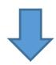

(1)T-> F {a1} T’ {a2} a1: T’.inh = F.val   
a2: T.val = T’.syn   
(2)T’-> \* F {a3} T1’ {a4} a3: T1’ inh = T’.inh x F.val   
$\begin{array} { r l } { \mathbf { \sigma } } & { { } = \mathsf { T } \mathbf { 1 } ^ { \prime } \mathbf { \nabla } . 5 \mathsf { y } \mathsf { n } } \end{array}$   
(3)T’-> Ɛ {a5} $\begin{array} { r l } { \mathbf { \tau } } & { { } = \mathsf { T ^ { \prime } } . \mathsf { i n h } } \end{array}$   
(4)F-> digit {a6} a6: F.val = digit.lexval


## Example (cont.)

Input: $3 ^ { * } 5$

Stack top ‘digit’ matches the input $\prime 3 \prime$

pop ‘digit’, but value copy is needed

<table><tr><td>（1  $J { \boldsymbol { T } } { \boldsymbol { - } } > F \ \{ { \boldsymbol { a } } _ { 1 }  \boldsymbol { \} } \tau ^ { \prime } \ \{ \textbf { \textit { ? } } \}$   $) T ^ { \prime } {  } ^ { * } F \ \{ a _ { 3 } \} \ T _ { 1 } ^ { \prime }$   $a _ { 3 } { : } T _ { 1 } { ' } i n h = T ^ { \prime } . i n h \times F . v a I$ </td><td> $a _ { 1 } { : } T _ { \cdot } ^ { \prime } i n h = F . v a I$   $a _ { 2 } { : } T . v a l = T ^ { \prime } { . } s y n$ </td></tr></table>

$$
\mathsf { T } \to \mathsf { F } \left\{ \mathsf { a } _ { 1 } \right\} \mathsf { T } ^ { \prime } \left\{ \mathsf { a } _ { 2 } \right\}
$$

a6: stack[top-1].val= stack[top].d_lexval

F -> digit $\{ \ r { \mathrm { a } } _ { 6 } \}$

<table><tr><td rowspan=1 colspan=1>digit</td><td rowspan=1 colspan=1> $\{ \mathsf { a } _ { 6 } \}$ </td><td rowspan=1 colspan=1> $\mathsf { F } ^ { \prime } \mathsf { s y n }$ </td><td rowspan=1 colspan=1> $\{ \mathsf { a } _ { 1 } \}$ </td><td rowspan=1 colspan=1> ${ \bar { \mathbf { \Gamma } } } ^ { \prime }$ </td><td rowspan=1 colspan=1> ${ \mathsf { T } } ^ { \prime } { \mathsf { s y n } }$ </td><td rowspan=1 colspan=1> $\{ \mathsf { a } _ { 2 } \}$ </td><td rowspan=1 colspan=1>Tsyn</td><td rowspan=1 colspan=1>S</td></tr><tr><td rowspan=1 colspan=1> $\mathsf { l e x v } { = } 3$ </td><td rowspan=1 colspan=1> ${ \mathsf { d } } \_ { \mathsf { I e x v } } = 3$ </td><td rowspan=1 colspan=1> $v a l = 3$ </td><td rowspan=1 colspan=1> $v a l = 3$ </td><td rowspan=1 colspan=1>inh</td><td rowspan=1 colspan=1>val</td><td rowspan=1 colspan=1></td><td rowspan=1 colspan=1>val</td><td rowspan=1 colspan=1></td></tr></table>

## L-SDD in LR Parsing

## • What we already learnt

$$
( 1 ) { \textsf { T } } { \textsf { > F } } \left\{ { \mathsf { T } } ^ { \prime } . { \mathsf { i n h } } = { \mathsf { F } } . { \mathsf { v a l } } \right\} { \textsf { T } } ^ { \prime } \left\{ { \mathsf { T } } . { \mathsf { v a l } } = { \mathsf { T } } ^ { \prime } . { \mathsf { s y n } } \right\}
$$

LR > LL, w.r.t parsing power

$$
( 2 ) \mathsf { T ^ { \prime } { \circ } { > } ^ { * } F } \left\{ \mathsf { T _ { 1 } } ^ { \prime } . \mathsf { i n h } = \mathsf { T ^ { \prime } } . \mathsf { i n t } \times \mathsf { F } . \mathsf { v a l } \right\} \mathsf { T _ { 1 } } ^ { \prime } \left\{ \mathsf { T ^ { \prime } } . \mathsf { S } \mathsf { V } \mathsf { n } = \mathsf { T _ { 1 } } ^ { \prime } . \mathsf { S } \mathsf { V } \mathsf { n } \right\}
$$

$$
\left( 3 \right) { \mathsf { T } } ^ { \prime } { \mathsf { - } } > \mathsf { E } \ \left\{ \top ^ { \prime } . \mathsf { S } \forall \mathsf { \Pi } \right. = { \mathsf { T } } ^ { \prime } . \mathsf { i n h } \ \}
$$

$$
( 4 ) \textsf { F } {  } { \mathrm { d i g i t ~ } } \{ \textsf { F } , \textsf { v a l } = { \mathrm { d i g i t . l e x v a l ~ } } \}
$$

 We can do bottom-up if we can do top-down

◆ S-attributed SDD can be implemented in bottom-up way

 All semantic actions are at the end of productions, i.e., triggered in reduce

## • For L-SDD on an LL grammar, can it be implemented during bottom-up parsing? Action

◆ Problem: semantic actions can be in anywhere of the production body

<table><tr><td rowspan=1 colspan=1>Action</td><td rowspan=1 colspan=1>Code</td></tr><tr><td rowspan=1 colspan=1>B</td><td rowspan=1 colspan=1> Inh Attr.</td></tr><tr><td rowspan=1 colspan=1>B.syn</td><td rowspan=1 colspan=1> Syn Attr.</td></tr><tr><td rowspan=1 colspan=1>C</td><td rowspan=1 colspan=1> Inh Attr.</td></tr><tr><td rowspan=1 colspan=1>C.syn</td><td rowspan=1 colspan=1> Syn Attr.</td></tr><tr><td rowspan=1 colspan=1>A.syn</td><td rowspan=1 colspan=1> Syn Attr.</td></tr></table>

## L-SDD in LR - The Problem

• It is not natural to evaluate inherited attributes

◆ Example: how to get T’.inh

• Claims: inherited attributes are on the stack

◆ L-SDD guarantee they’ve already been computed

◆ But computed by previous productions - deep in the stack

## • Solution

◆ Hack the stack to dig out those values

```ocaml
(1) T -> F {T’.inh = F.val} T’ {T.val = T’.syn}
(2) T’-> *F {T1’.inh = T’.int x F.val} T1’ {T’.syn = T1’.syn}
(3) T’-> Ɛ 8 {T’.syn = T’.inh }
(4) F -> digit {F.val = digit.lexval }
```

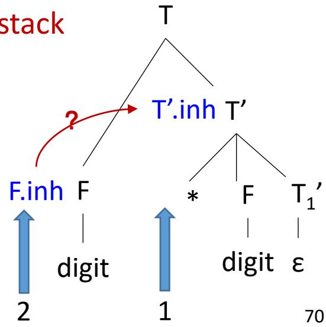

## L-SDD in LR - Marker

• Given the following SDD, where $| \alpha | \neq | \beta |$

◆ A-> X⍺ {Y.in= X.s} Y | Xβ {Y.in= X.s} Y

◆ $\forall  \vee \ \{ \forall . 5 = \mathfrak { f } ( \forall . \mathfrak { i } \mathfrak { n } ) \}$

• Problem: cannot generate stack location for Y.in

◆ Because X.s is at different relative locations from Y in the stack

• Solution: insert markers $\mathsf { M } _ { 1 } , \mathsf { M } _ { 2 }$ right before Y

◆ A-> X ⍺ M1Y | X β M2 Y

◆ M -> ε {M .s= stack[top-|⍺|].s} // M1.s= X.s

◆ M2-> ε {M2.s= stack[top-|β|].s} // M2.s= X.s

◆ Y -> γ {Y.s= f(stack[top-|γ|].s) } // Y.s= M1.s or Y.s= M2.s

• Marker: a non-terminal marking a location that is the same with the symbol that has an inherited attribute


• Always produces ε since it is only a placeholder for an action

## Modify Grammar with Marker

• Given an L-SDD on an LL grammar, we can adapt the grammar to compute the same SDD during an LR parse

◆ Put a marker non-terminal[标记非终结符] in the place of each embedded action  Each of such places gets a distinct marker, say M, where M -> ε [空产生式]

◆ Modify the action {a} if marker M replaces it in some production $A - > a$ {a} β, and associate with M -> ε an action $\{ \exists ^ { \prime } \}$ that

1. Copies, as inherited attrs of M, any attrs of A or symbols of ⍺ that action {a} needs (e.g., M.i=A.i)[M的继承属性为{a}的输入]

2. Compute sattrs in the same way as {a}, but makes those attrs be synthesized attrs of M (e.g., ${ \mathsf { M } } . { \mathsf { S } } = { \mathsf { f } } ( { \mathsf { M } } . { \mathsf { i } } ) )$ [M的综合属性为{a}中的输出]

$$
\mathsf { A } \to \{ \mathsf { B } . \mathsf { i } = \mathsf { f } ( \mathsf { A } . \mathsf { i } ) \} \mathsf { B C }
$$

$$
\begin{array} { r l } & { A \mathrm { - } > \textsf { M B C } } \\ & { M \mathrm { - } > \varepsilon \{ \mathsf { M . i } = \mathsf { A . i } ; \mathsf { M . s } = \mathrm { f } ( \mathsf { M . i } ) \} } \end{array}
$$


## Example

(1)T -> F {T’.inh = F.val} T’ {T.val = T’.syn}   
(2) T’ -> \*F {T1’ .inh = T’.int \* F.val} T1’ {T’.syn = T1’ .syn}   
(3) T’ -> Ɛ {T’.syn = T’.inh }   
(4) F -> digit {F.val = digit.lexval }


(1)T-> F M T’ {T.val = T’.syn}   
M->ε {M.i=F.val; M.s= M.i;}   
(2) T’-> \*F N T1’ {T’.syn = T1’ .syn}   
N->ε {N.i1=T.inh; N.i2= F.val; N.s = N.i1 \* N.i2 }   
(3) T’-> Ɛ {T’.syn = T’.inh }   
(4) F-> digit {F.val = digit.lexval }

A -> {B.i= f(A.i)} BC  
↓  
A-> M B C  
M-> ε {M.i=A.i; M.s= f(M.i)}

## Stack Manipulation[栈操作]

```ocaml
(1)T -> F {T’.inh = F.val} T’ {T.val = T’.syn}
(2) T’ -> *F {T1’ .inh = T’.int x F.val} T1’ {T’.syn = T1’ .syn}
(3) T’ -> Ɛ {T’.syn = T’.inh }
(4) F -> digit {F.val = digit.lexval }
```

```javascript
(1)T-> FMT’ {stack[top-2].val= stack[top].syn; top = top-2;}
M->ε {stack[top+1].T’inh= stack[top].val; top = top + 1; }
(2)T’-> * FNT1’ { stack[top-3].syn= stack[top].syn; top = top-3;}
N->ε {stack[top+1].T’inh= stack[top-2].T’inh * stack[top].val; top = top + 1; }
(3)T’->ε {stack[top+1].syn= stack[top].T’inh; top = top + 1;}
(4)F-> digit {stack[top].val=stack[top].lexval;}
```

## Content

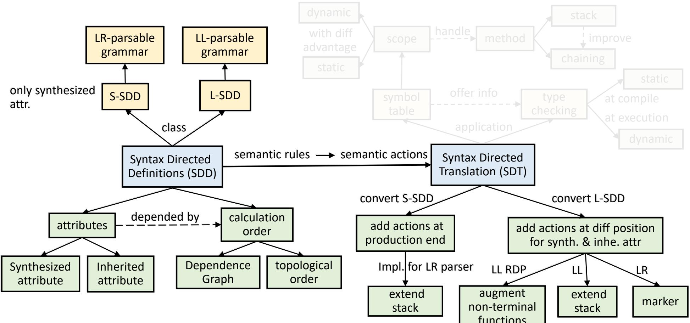

## Content

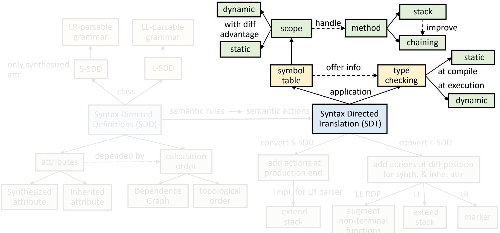

## Binding [绑定]

• Binding: matching identifier use with definition[使用-定义]

◆ Definition: associating an id with a memory location

◆ Binding is an essential step before machine code generation

• If there are multiple definitions, which one to use?

void foo()   
{   
char x; /\* allocated at mem[0x100] \*/   
int x; /\* allocated at mem[0x200] \*/   
W   
x = x + 1; /\* add mem[0x100],1 ? add mem[0x200],1 ?

## Scope [作用域]

• Scope: program region where a definition can be bound

◆Uses of identifier in the scope is bound to that definition

◆ For Java: private, global, static, etc...

• Some properties of scopes

◆Use not in scope of any definition results in undefined error

◆Scopes for the same identifier can never overlap  There is at most one binding at any given time

• Two types: static scoping and dynamic scoping [静态/动态作用域] ◆Depending on how scopes are formed

## Static Scoping [静态作用域]

• Scopes formed by where definitions are in program text[声明起作用 的那段区域]

◆Also known as lexical scoping since related to program text C/C++, Java, Python, JavaScript[也叫词法作用域]

• Rule: bind to the closest enclosing definition

void foo()   
char x;   
... 个   
{   
int x;   
x = x + 1;

## Dynamic Scoping[动态作用域]

• Scopes formed by when definitions happen during runtime[运行时 决定]

◆Perl, Bash, LISP, Scheme

• Rule: bind to most recent definition in current execution

void foo()   
{   
(1) char x;   
(2) if (...) {   
(3) int x;   
(4) x=x+1;   
}   
(5) x=‘a’;   
}

• Which x’s definition is the most recent? ◆ Execution (a): ...(1)...(2)...(5) ◆ Execution (b): ...(1)...(2)...(3)...(4)...(5)

## Static vs. Dynamic Scoping[对比]

• Most languages that started with dynamic scoping (LISP, Scheme, Perl) added static scoping afterwards

• Why? With dynamic scoping...

◆All bindings are done at execution time

◆Hard to figure out by eyeballing, for both compiler and human

• Pros of static scoping[静态的好处]

◆Static scoping leads to fewer programmer errors

 Bindings readily apparent from lexical structure of code

◆Static scoping leads to more efficient code

 Can determine bindings at compile time – allow code optimization

## What is Symbol Table[符号表]

• Symbol: same thing as identifier (used interchangeably)

• Symbol table: a data structure that tracks info about all symbols

◆Each entry represents a definition of that identifier[标识符的定义]

◆Maintains definitions that reach current program point[当前作用域中的定义]

◆List updated whenever scopes are entered or exited [随作用域改变而更新]

◆Used to perform binding of identifier uses [用于绑定变量定义与使用]

 Traversing the parse tree in a separate pass after parsing [单独扫描语法树]

 Using semantic actions as an integral part of parsing pass [或与语义分析同时]

◆Usually discarded after generating executable binary

 Machine code instructions no longer contain symbols

◆For use in debuggers, symbol tables may be included

 To display symbol names instead of addresses in debuggers

 For GCC, using ‘gcc -g” includes debug symbol tables

## Maintaining Symbol Table[维护]

## • Basic idea:

int x=0; ... void foo() { int x=0; ... x=x+1; } ... x=x+1 ...

◆Start processing foo:

 Add definition of x, overriding old definition of x if any

◆After processing foo:

 Remove definition of x, restoring old definition of x if any

## • Operations:

◆enter_scope() start a new scope

◆exit_scope() exit current scope

◆find_symbol(x) find the information about x

◆add_symbol(x) add a symbol x to the symbol table

◆check_symbol(x) true if x is defined in current scope

## Symbol Table Structure [结构]

## • Front-end time is affected by symbol table access time[符号表访问 时间影响编译前端性能]

◆ Front-end: lexical, syntax, semantic analysis

◆ Frequent searches on any large data structure is expensive

◆ Symbol table design is important for compiler performance

## • What data structure to choose? [可选数据结构]

List[线性表]

Binary tree[二叉树]

◆ Hash table[哈希表]

## • Tradeoffs: time vs. space[空间和时间的权衡]

◆ Let us first consider the organization without scope

## Symbol Table Structure (cont.)

• Array: no space wasted, insert/delete: O(n) , search: O(n)

• Linked list: extra pointer space, insert/delete: O(1), search: O(n)

◆Optimization: move recently used identifier to the head

◆Frequently used identifiers are found more quickly

• Binary tree: use more space than array/list

◆But insert/delete/search is O(logn) on balanced tree

◆In the worst case, tree may reduce to linked list  Then insert/delete/search becomes O(n)

<table><tr><td rowspan=1 colspan=1>id1</td><td rowspan=1 colspan=1>inf01</td></tr><tr><td rowspan=1 colspan=1>id2</td><td rowspan=1 colspan=1>inf02</td></tr><tr><td rowspan=1 colspan=1></td><td rowspan=1 colspan=1></td></tr></table>

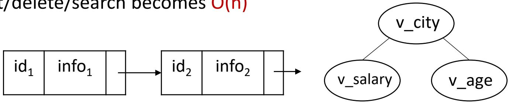

## SDD Implementation Revisit

## • S-SDD & LR: Slack manipulation

## • L-SDD: Remove Left Recursion

## • L-SDD & RDP: Extend RDP Function + Slack manipulation

◆ Inherited: arguments; Synthesized: return

◆ Use local variables[增加局部变量]

◆ Embed semantic actions[嵌入语义动作]

1. 左部展开时（i.e., 左部符号本身的记录出栈时），若其含有继承属性，则要将继承属性复制给后面的动作记录

综合属性出栈时，要将综合属性值复制给后面的动作记录

◆ Inherited: along with the symbol; Synthesized: right below the symbol

• L-SDD & LL(1): Slack manipulation

• L-SDD & LR: Marker + Slack manipulation

$$
\begin{array} { r l } & { A  \lbrace \mathsf { B } . \mathsf { i } = \mathsf { f } ( \mathsf { A } . \mathsf { i } ) \rbrace \mathsf { B C } } \\ & { \qquad \downarrow } \\ & { \qquad \mathsf { A } {  } \mathsf { M } \textsf { B C } } \\ & { \qquad \mathsf { M } {  } \varepsilon \lbrace \mathsf { M } . \mathsf { i } = \mathsf { A } . \mathsf { i } ; \mathsf { M } . \mathsf { s } = \mathsf { f } ( \mathsf { M } . \mathsf { i } ) \rbrace } \end{array}
$$


## Symbol Table Revisit

• Binding: matching identifier use with definition[使用-定义]

• Scoping:

• Static: Can be obtained by static code analysis

Dynamic: becomes clear only during execution

• Symbol: same thing as identifier

• Symbol table: a data structure that tracks info about all symbols

• Constructing Symbol table: a tradeoff between time and space

• Array, Linked list, Binary tree, Hash table

<table><tr><td rowspan=1 colspan=1>id1</td><td rowspan=1 colspan=1>inf01</td></tr><tr><td rowspan=1 colspan=1>id2</td><td rowspan=1 colspan=1>inf02</td></tr><tr><td rowspan=1 colspan=1></td><td rowspan=1 colspan=1></td></tr></table>

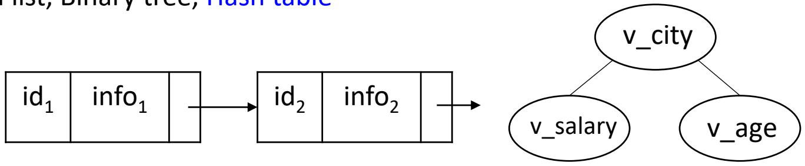

## Symbol Table Structure (cont.)

## • hash(id_name) → index[哈希表]

◆ A hash function decides mapping from identifier to index

◆ Conflicts resolved by chaining multiple IDs to same index

## • Memory consumption from hash table (N << M)

◆ M: the size of hash table

◆ N: the number of stored identifiers

• But insert/delete/search in O(1) time

◆ Can become O(n) with frequent conflicts and long chains

• Most compilers choose hash table for its quick access time

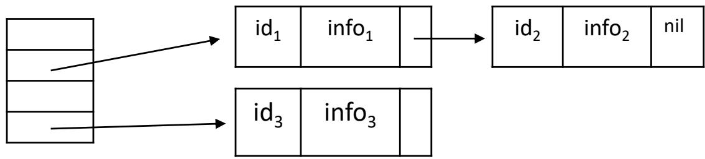

## Adding Scope to Symbol Table[作用域]

• To handle multiple scopes in a program [处理多个作用域]

Conceptually, need an individual table for each scope  In order to be able to enter and exit scopes

◆ Sometimes symbols in scope can be discarded on exit:

if (...) { int v; } /\* block scope \*/   
/\* v is no longer valid \*/

◆Sometimes not:

```javascript
class X { ... void foo() {...} ... } /* class scope */
/* foo() is no longer valid */
X v;
call v.foo(); /* v.foo() is still valid */
```

• How can scoping be enforced without discarding symbols?

◆ Keep a stack of active scopes at a given point

◆ Keep a list of all reachable scopes in the entire program

## Handle Scopes with Stack

• Organize all symbol tables into a scope stack[作用域栈]

◆An individual symbol table for each scope

 Scope is defined by nested lexical structure, e.g., $\{ \mathsf { C } _ { 1 } \{ \mathsf { C } _ { 2 } \{ \mathsf { C } _ { 3 } \} \} \{ \mathsf { C } _ { 4 } \} \}$

◆Stack holds one entry for each open scope

 Inner-most scope is stored at the top of the stack

• Stack push/pop happen when entering/exiting a scope

Parsing here

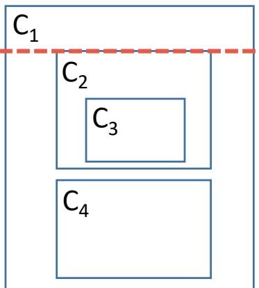

C1’s Symbol Table

Symbol tables

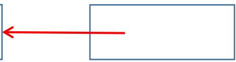  
Scope stack

## Handle Scopes with Stack (cont.)

## • Operations:

◆When entering a scope

 Create a new symbol table to hold all variables declared in that scope

 Push a pointer to the symbol table on the stack

◆Pop the pointer to the symbol table when exiting scope

◆Search from the top of the stack

Parsing here

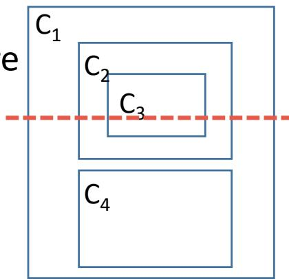

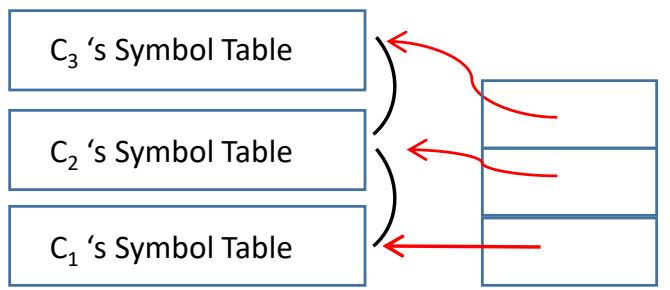  
Symbol tables  
Scope stack

## Info Stored in Symbol Table

• Entry in symbol table

◆ String: the name of identifier

◆Kind: variable, function, struct type, class type

<table><tr><td>string</td><td>kind</td><td>attributes</td></tr></table>

• Attributes vary with the kind of symbols

◆variable: type, address of variable

◆function: prototype, address of function body

◆struct type: field names, field types

◆class type: symbol table for class

## Attribute List in Symbol Table

• Type info can be arbitrarily complicated

◆ Type can be an array with multiple dimensions char arr[20][20];

Type can be a struct with multiple fields

• Store all type info in an attribute list

◆ Entry for an array variable with 2 dimensions

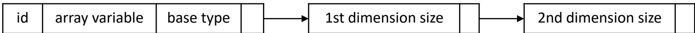

Entry for a struct variable

<table><tr><td>id</td><td>struct variable</td><td></td></tr><tr><td></td><td></td><td></td></tr></table>

point to struct type entry

Entry for a struct type with 2 fields

<table><tr><td rowspan=1 colspan=1>id</td><td rowspan=1 colspan=1> struct type</td><td rowspan=1 colspan=1>total size</td><td rowspan=1 colspan=1></td><td rowspan=1 colspan=1>+</td><td rowspan=1 colspan=1>field id</td><td rowspan=1 colspan=1>type</td><td rowspan=1 colspan=1>size</td><td rowspan=1 colspan=1></td><td rowspan=1 colspan=1>£</td><td rowspan=1 colspan=1>field2 id</td><td rowspan=1 colspan=1>type</td><td rowspan=1 colspan=1>size</td></tr></table>

## Use Type Information[类型信息]

• Each variable or function entry contains type info

• Type info is used in later code generation stage[代码生成]

◆To calculate how much memory to alloc for a variable  Should a variable assignment be a 4 byte or 8 byte copy?

◆To translate uses of variables to machine instructions  Should a ’+’ on variable be an integer or a floating point add?

◆To translate calls to functions to machine instructions  What are the types of arguments and return value of the function?

• Also used in later code optimization stage[代码优化]

◆To help compiler understand semantics of program

• Also used in semantic analysis stage for Type Checking

◆Uses types to check semantic correctness of program

## Type and Type Checking

• Type: a set of values and a set of operations on these values

• Type checking: verifying type consistency across program

◆A program is type consistent if all operators are consistent with the operand value types

◆Much of what we do in semantic analysis is type checking

• Some type checking examples:

◆Given char \*str = “Hello”;

 str[2] is consistent: char\* type allows [] operator

 str/2 is not: char\* type does not allow / operator

◆Given int pi = 3;

 pi/2 is consistent: int type allows / operator

 pi=3.14 is not: = operator not allowed on different types

 Compiler must type convert implicitly to make it consistent

## Static Type Checking[静态类型检查]

## • Static type checking at compile time

◆Infers[推断] whether the program is type consistent through code analysis

 Collect info via declarations that store in symbol table

 Check the types involved in each operation

 E.g., int a, b, c; a = b + c; can be proven type consistent because the addition of two ints is still an int

## • Difficult for a language to only do static type checking

◆Some type errors usually cannot be detected at compile time

 E.g., a and b are of type int, a \* b may not in the valid range of int

 Typecasting can be a pretty risky thing to do - Basically, typecast suspends type checking unsigned a; (int) a;

## Dynamic Type Checking[动态检查]

## Dynamic type checking at execution time

◆Type consistency by checking types of runtime values

◆Include type info for each data location at runtime

 E.g., a variable of type double would contain both the actual double value and some kind of tag indicating “double type”

 The execution of any operation begins by first checking these type tags

 The operation is performed only if everything checks out

 Otherwise, a type error occurs and usually halts execution

◆Array bounds check:

 Is int A[10], i; … A[i] = i; type consistent?

## • Static type checking is always more desirable. Why?

◆Always good to catch more errors before runtime

◆Dynamic type checking carries runtime overhead

## Static vs. Dynamic Typing[静态-动态]

## • Static typing: C/C++, Java, …

◆Variables have static types → hold only one type of value

 E.g. int x; → x can only hold ints

 E.g. char \*x; → x can only hold char pointers

◆How are types assigned to variables?

 C/C++, Java: types are explicitly defined

int x; → explicit assignment of type int to x

## • Pros/cons of static typing

## ◆ More programmer effort

 Programmer must adhere to strict type rules

 Defining advanced types can be quite complex (e.g. classes)

## ◆ Less bugs and execution time

 Thanks to static type checking

## Static vs. Dynamic Typing (cont.)

• Dynamic Typing: Python, JavaScript, PHP, ...

◆Variables have dynamic types → can hold multiple types

var x; /\* var declaration without a static type \*/

x = 1; /\* now x holds an integer value \*/

x = "one"; /\* now x holds a string value \*/

◆How are types assigned to variables?

 Type is a runtime property → type tags stored with values

 Dynamic type checking must be done during runtime

## • Pros/cons of dynamic typing

◆Less programmer effort

 Flexible type rule means program is more malleable[可塑性强]

 Absence of types declarations means shorter code

 Suitable for scripting or prototyping languages

◆More program bugs and execution time

 Due to dynamic type checking

## Type System[类型系统]

• Static/dynamic typing are type systems

◆Type System: types and type rules of a language

• Static/dynamic type checking are methods

◆Methods to enforce the rules of the given type system

• Static type checking is not used only for static typing ◆Also used for dynamic typing if types can be inferred at compile time

• Dynamic type checking is not used only for dynamic typing ◆Some features of statically typed languages require it  e.g., downcasting[父类向子类的强制类型转换]

## Summary

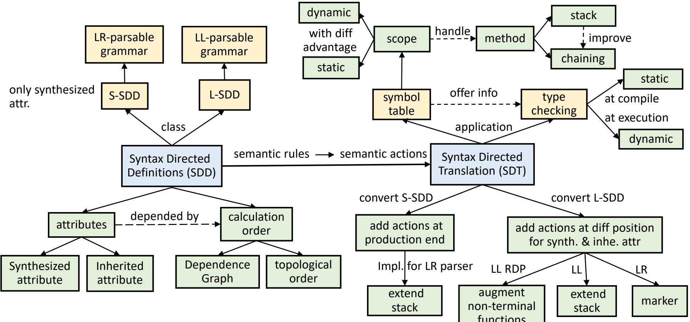

## Summary

• SDD & SDT

• Synthesized & inherited attribute

• Evaluation order – DAG & topological order

• S-SDD & L-SDD

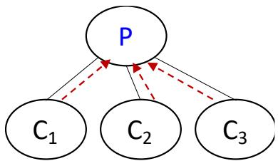

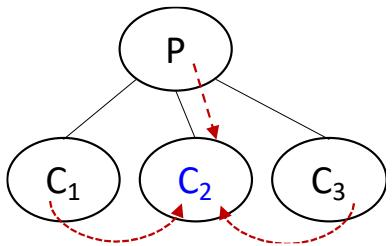

• S-SDD -> SDT -> Implementation

• (LR only) Postfix SDT -> stack extension -> stack manipulation

• L-SDD -> SDT -> Implementation

• LL: Eliminate left recursion

• RDP: inherited attributes (arguments) and synthesized attributes (return values)


• Predictive Parsing: stack extension (action and synthesized records)

• LR: Marker -> postfix SDT -> stack extension -> stack manipulation

## Summary

• Static and Dynamic Scoping

◆ Pros of static: fewer errors + more efficient

• Symbol and Symbol Table

◆ Structuring: array, list, binary tree, hash table

Trade-off between time and space

• Scope handling

◆ Stack: Inefficient searching and use of memory

◆ So chaining is introduced

• Static and dynamic typing and type checking

◆ Static: less bugs and execution time, but more effort

◆ Dynamic: less effort, but more bugs and execution time

◆ Static ones are more desirable, but is often insufficient, e.g., downcasting

## Further Reading

## • Dragon Book, 2nd Edition

Comprehensive Reading:

 Section 5.1-5.3 on introduction to syntax-directed translation.

 Section 5.4-5.5 on the implementation of translation schemes in top-down and bottom-up LR parsing.

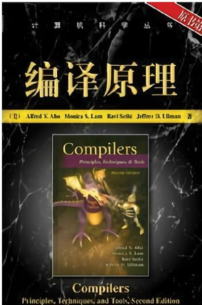

## 编译原理 Complier Principles

赵帅

计算机学院

中山大学

## Exercise

• 对于一个无二义性文法G，它的一个句子的最左与最右推导产生的分析树一定是一样的吗?

• 对的，是这样的。语法树会隐去推导顺序

• 怎么样判断一个文法是否为LL(1)型文法?

• 对文法中的每个产生式 A → α | β:

FIRST(α) ∩ FIRST(β) = ∅.

• If β ⇒ ε, then FIRST(α) ∩ FOLLOW(A) = ∅.

• LL(1)语法分析表行数与列数分别由哪些因素确定?

• 行数是该文法的非终结符个数，列数为终结符个数+1（ 结束符号\$ ）

• 设句型aaAb 的最右推导为 S⇒aBb⇒ aaAb ，句柄为aA ，该句型的活前缀是?• a, aa, aaA

## Exercise

• 找出以下文法中的句型的所有短语，直接短语，句柄

• 文法: G(E): E → T | E+T; T → F | T\*F; F → (E) | a | b | c

• 句型: a \* b + c

• 第一步：画出语法树

• 第二步：找出语法树的叶子节点• a, \*, b, +, c

• 第三步：由叶子节点找出短语

• a, a\*b, b, c, a\*b+c (why not \*b, b+c, \*, +?)

• 第四步：从短语中找出直接短语• a, b, c

. 第五步：从直接短语中找出句柄

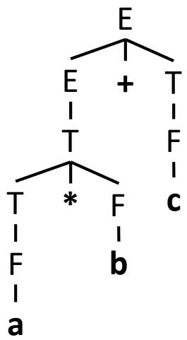

## Exercise

• 给定一下文法G(S), 请构建该文法的LL(1)分析表

$\mathsf { S } \to \mathsf { A }$

$\mathsf { A } \to \mathsf { \varepsilon } _ { \mathsf { E } }$

$\mathsf { A } \to \mathsf { b b A }$

## • FIRST & Follow:

$\mathsf { S } \to \mathsf { A } ; \mathsf { F l R S T } ( \alpha ) = \{ \mathsf { b } , \mathsf { \varepsilon } \}$

$A  \varepsilon \colon \mathsf { F l R S T } ( \alpha ) = \{ \varepsilon \}$

• A → bbA: FIRST(α) = {b}

$\mathsf { F O L L O W } ( \mathsf { S } ) = \{ \mathsf { S } \}$

$\mathsf { F O L L O W } ( \mathsf { A } ) = \{ \mathsf { S } \}$

## • Parse Table:


<table><tr><td rowspan=1 colspan=3>b                       $</td><td rowspan=4 colspan=1></td></tr><tr><td rowspan=1 colspan=1>s</td><td rowspan=1 colspan=1></td><td rowspan=1 colspan=1></td></tr><tr><td rowspan=1 colspan=3>A</td></tr><tr><td rowspan=1 colspan=3></td></tr><tr><td rowspan=1 colspan=3>b                        $</td><td rowspan=1 colspan=1></td></tr><tr><td rowspan=1 colspan=1>s</td><td rowspan=1 colspan=1> $\mathsf { S } \to \mathsf { A }$ </td><td rowspan=1 colspan=1></td><td rowspan=1 colspan=1>use FIRST</td></tr><tr><td rowspan=1 colspan=3>A      $\mathsf { A } \to \mathsf { b b A }$ </td><td rowspan=2 colspan=1></td></tr><tr><td rowspan=1 colspan=3></td></tr><tr><td rowspan=1 colspan=3>b                        $</td><td rowspan=1 colspan=1></td></tr><tr><td rowspan=1 colspan=1>S</td><td rowspan=1 colspan=1> $\mathsf { S } \to \mathsf { A }$ </td><td rowspan=1 colspan=1> $\mathsf { S } \to \mathsf { A }$ </td><td rowspan=1 colspan=1>use FOLLOW</td></tr><tr><td rowspan=1 colspan=3>A       $\mathsf { A } \to \mathsf { b b A }$              $\mathsf { A } \to \mathsf { \varepsilon } _ { \mathsf { E } }$ </td><td rowspan=1 colspan=1>118</td></tr></table>

## Exercise

• 给定一下文法G(S) , 请构建识别活前缀的DFA与LR(1)分析表

$\mathsf { S } \to \mathsf { A }$

$\mathsf { A } \to \mathsf { A } + \mathsf { A } \mathsf { \Omega } | \mathsf { B } + \mathsf { + }$

• B → y

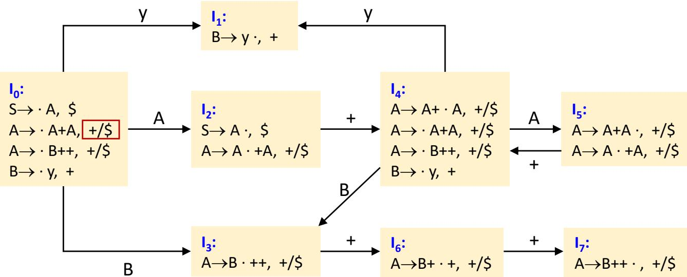

## Exercise

• 给定一下文法G(S) , 请构建识别活前缀的DFA与LR(1)分析表

• (1) S → A

• (2) A → A + A

• (3) A → B + +

• (4) B → y

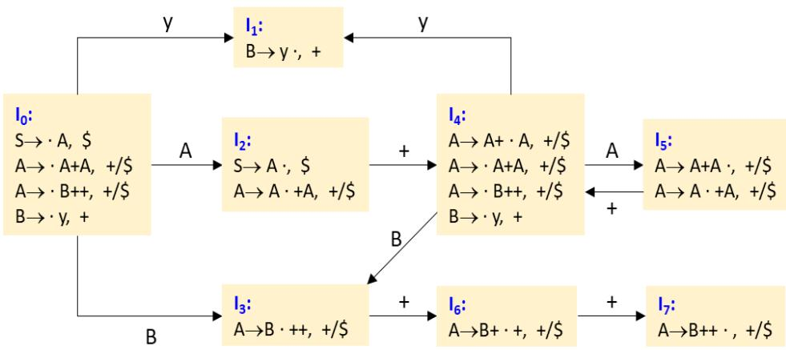

<table><tr><td rowspan=1 colspan=1>S</td><td rowspan=1 colspan=3>ACTOION</td><td rowspan=1 colspan=2>GOTO</td></tr><tr><td rowspan=1 colspan=1></td><td rowspan=1 colspan=1>y</td><td rowspan=1 colspan=1>+</td><td rowspan=1 colspan=1>$</td><td rowspan=1 colspan=1>A</td><td rowspan=1 colspan=1>B</td></tr><tr><td rowspan=1 colspan=1>０</td><td rowspan=1 colspan=1>s1</td><td rowspan=1 colspan=1></td><td rowspan=1 colspan=1></td><td rowspan=1 colspan=1>2</td><td rowspan=1 colspan=1>3</td></tr><tr><td rowspan=1 colspan=1>1</td><td rowspan=1 colspan=1></td><td rowspan=1 colspan=1>r4</td><td rowspan=1 colspan=1></td><td rowspan=1 colspan=1></td><td rowspan=1 colspan=1></td></tr><tr><td rowspan=1 colspan=1>2</td><td rowspan=1 colspan=1></td><td rowspan=1 colspan=1>s4</td><td rowspan=1 colspan=1>acc</td><td rowspan=1 colspan=1></td><td rowspan=1 colspan=1></td></tr><tr><td rowspan=1 colspan=1>3</td><td rowspan=1 colspan=1></td><td rowspan=1 colspan=1>s6</td><td rowspan=1 colspan=1></td><td rowspan=1 colspan=1></td><td rowspan=1 colspan=1></td></tr><tr><td rowspan=1 colspan=1>4</td><td rowspan=1 colspan=1>s1</td><td rowspan=1 colspan=1></td><td rowspan=1 colspan=1></td><td rowspan=1 colspan=1>5</td><td rowspan=1 colspan=1>3</td></tr><tr><td rowspan=1 colspan=1>5</td><td rowspan=1 colspan=1></td><td rowspan=1 colspan=1>r2/s4</td><td rowspan=1 colspan=1>r2</td><td rowspan=1 colspan=1></td><td rowspan=1 colspan=1></td></tr><tr><td rowspan=1 colspan=1>6</td><td rowspan=1 colspan=1></td><td rowspan=1 colspan=1>s7</td><td rowspan=1 colspan=1></td><td rowspan=1 colspan=1></td><td rowspan=1 colspan=1></td></tr><tr><td rowspan=1 colspan=1>7</td><td rowspan=1 colspan=1></td><td rowspan=1 colspan=1>r3</td><td rowspan=1 colspan=1>r3</td><td rowspan=1 colspan=1></td><td rowspan=1 colspan=1></td></tr></table>

## Exercise

• 该文法是LR(1)型文法吗? 若不是，应如何解决? (有多种选择)

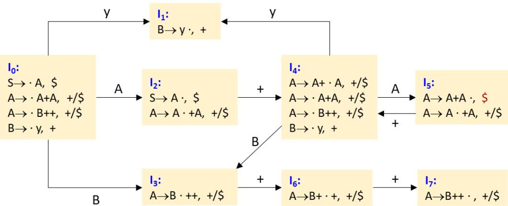

<table><tr><td rowspan=1 colspan=1>S</td><td rowspan=1 colspan=3>ACTOION</td><td rowspan=1 colspan=2>GOTO</td></tr><tr><td rowspan=1 colspan=1></td><td rowspan=1 colspan=1>y</td><td rowspan=1 colspan=1>+</td><td rowspan=1 colspan=1>$</td><td rowspan=1 colspan=1>A</td><td rowspan=1 colspan=1>B</td></tr><tr><td rowspan=1 colspan=1>０</td><td rowspan=1 colspan=1>s1</td><td rowspan=1 colspan=1></td><td rowspan=1 colspan=1></td><td rowspan=1 colspan=1>2</td><td rowspan=1 colspan=1>3</td></tr><tr><td rowspan=1 colspan=1>1</td><td rowspan=1 colspan=1></td><td rowspan=1 colspan=1>r4</td><td rowspan=1 colspan=1></td><td rowspan=1 colspan=1></td><td rowspan=1 colspan=1></td></tr><tr><td rowspan=1 colspan=1>2</td><td rowspan=1 colspan=1></td><td rowspan=1 colspan=1>s4</td><td rowspan=1 colspan=1>acc</td><td rowspan=1 colspan=1></td><td rowspan=1 colspan=1></td></tr><tr><td rowspan=1 colspan=1>3</td><td rowspan=1 colspan=1></td><td rowspan=1 colspan=1>s6</td><td rowspan=1 colspan=1></td><td rowspan=1 colspan=1></td><td rowspan=1 colspan=1></td></tr><tr><td rowspan=1 colspan=1>4</td><td rowspan=1 colspan=1>s1</td><td rowspan=1 colspan=1></td><td rowspan=1 colspan=1></td><td rowspan=1 colspan=1>5</td><td rowspan=1 colspan=1>3</td></tr><tr><td rowspan=1 colspan=1>5</td><td rowspan=1 colspan=1></td><td rowspan=1 colspan=1>s4</td><td rowspan=1 colspan=1>r2</td><td rowspan=1 colspan=1></td><td rowspan=1 colspan=1></td></tr><tr><td rowspan=1 colspan=1>6</td><td rowspan=1 colspan=1></td><td rowspan=1 colspan=1>s7</td><td rowspan=1 colspan=1></td><td rowspan=1 colspan=1></td><td rowspan=1 colspan=1></td></tr><tr><td rowspan=1 colspan=1>7</td><td rowspan=1 colspan=1></td><td rowspan=1 colspan=1>r3</td><td rowspan=1 colspan=1>r3</td><td rowspan=1 colspan=1></td><td rowspan=1 colspan=1></td></tr></table>

## Exercise

• 对于句子y++, 请给出其分析流程，并说明y++是否为该文法的一个句子?

(1) ${ \mathsf S } \to { \mathsf A } ;$ (2) $\mathsf { A } \to \mathsf { A } + \mathsf { A } ;$ (3) $\mathsf { A } \to \mathsf { B } + + ;$ (4) $\mathsf { B } \to \mathsf { y } ;$

<table><tr><td colspan="2">Stack</td><td>Input</td><td>ACTION</td><td>GOTO</td></tr><tr><td>0</td><td>$</td><td>Y++$</td><td></td><td></td></tr></table>


<table><tr><td rowspan=1 colspan=1>S</td><td rowspan=1 colspan=3>ACTOION</td><td rowspan=1 colspan=2>GOTO</td></tr><tr><td rowspan=1 colspan=1></td><td rowspan=1 colspan=1>y</td><td rowspan=1 colspan=1>+</td><td rowspan=1 colspan=1>S</td><td rowspan=1 colspan=1>A</td><td rowspan=1 colspan=1>B</td></tr><tr><td rowspan=1 colspan=1>0</td><td rowspan=1 colspan=1>s1</td><td rowspan=1 colspan=1></td><td rowspan=1 colspan=1></td><td rowspan=1 colspan=1>2</td><td rowspan=1 colspan=1>3</td></tr><tr><td rowspan=1 colspan=1>1</td><td rowspan=1 colspan=1></td><td rowspan=1 colspan=1>r4</td><td rowspan=1 colspan=1></td><td rowspan=1 colspan=1></td><td rowspan=1 colspan=1></td></tr><tr><td rowspan=1 colspan=1>2</td><td rowspan=1 colspan=1></td><td rowspan=1 colspan=1>s4</td><td rowspan=1 colspan=1>acc</td><td rowspan=1 colspan=1></td><td rowspan=1 colspan=1></td></tr><tr><td rowspan=1 colspan=1>3</td><td rowspan=1 colspan=1></td><td rowspan=1 colspan=1>s6</td><td rowspan=1 colspan=1></td><td rowspan=1 colspan=1></td><td rowspan=1 colspan=1></td></tr><tr><td rowspan=1 colspan=1>4</td><td rowspan=1 colspan=1>s1</td><td rowspan=1 colspan=1></td><td rowspan=1 colspan=1></td><td rowspan=1 colspan=1>5</td><td rowspan=1 colspan=1>3</td></tr><tr><td rowspan=1 colspan=1>5</td><td rowspan=1 colspan=1></td><td rowspan=1 colspan=1>s4</td><td rowspan=1 colspan=1>r2</td><td rowspan=1 colspan=1></td><td rowspan=1 colspan=1></td></tr><tr><td rowspan=1 colspan=1>6</td><td rowspan=1 colspan=1></td><td rowspan=1 colspan=1>s7</td><td rowspan=1 colspan=1></td><td rowspan=1 colspan=1></td><td rowspan=1 colspan=1></td></tr><tr><td rowspan=1 colspan=1>7</td><td rowspan=1 colspan=1></td><td rowspan=1 colspan=1>r3</td><td rowspan=1 colspan=1>r3</td><td rowspan=1 colspan=1></td><td rowspan=1 colspan=1></td></tr></table>

## Exercise

• 对于句子y++, 请给出其分析流程，并说明y++是否为该文法的一个句子?

(1) ${ \mathsf S } \to { \mathsf A } ;$ (2) $\mathsf { A } \to \mathsf { A } + \mathsf { A } ;$ (3) $\mathsf { A } \to \mathsf { B } + + ;$ (4) $\mathsf { B } \to \mathsf { y } ;$

<table><tr><td colspan="2">Stack</td><td>Input</td><td>ACTION</td><td>GOTO</td></tr><tr><td>10</td><td>$</td><td>Y++$</td><td>s1</td><td></td></tr></table>


<table><tr><td rowspan=1 colspan=1>S</td><td rowspan=1 colspan=3>ACTOION</td><td rowspan=1 colspan=2>GOTO</td></tr><tr><td rowspan=1 colspan=1></td><td rowspan=1 colspan=1>y</td><td rowspan=1 colspan=1>+</td><td rowspan=1 colspan=1>S</td><td rowspan=1 colspan=1>A</td><td rowspan=1 colspan=1>B</td></tr><tr><td rowspan=1 colspan=1>0</td><td rowspan=1 colspan=1>s1</td><td rowspan=1 colspan=1></td><td rowspan=1 colspan=1></td><td rowspan=1 colspan=1>2</td><td rowspan=1 colspan=1>3</td></tr><tr><td rowspan=1 colspan=1>1</td><td rowspan=1 colspan=1></td><td rowspan=1 colspan=1>r4</td><td rowspan=1 colspan=1></td><td rowspan=1 colspan=1></td><td rowspan=1 colspan=1></td></tr><tr><td rowspan=1 colspan=1>2</td><td rowspan=1 colspan=1></td><td rowspan=1 colspan=1>s4</td><td rowspan=1 colspan=1>acc</td><td rowspan=1 colspan=1></td><td rowspan=1 colspan=1></td></tr><tr><td rowspan=1 colspan=1>3</td><td rowspan=1 colspan=1></td><td rowspan=1 colspan=1>s6</td><td rowspan=1 colspan=1></td><td rowspan=1 colspan=1></td><td rowspan=1 colspan=1></td></tr><tr><td rowspan=1 colspan=1>4</td><td rowspan=1 colspan=1>s1</td><td rowspan=1 colspan=1></td><td rowspan=1 colspan=1></td><td rowspan=1 colspan=1>5</td><td rowspan=1 colspan=1>3</td></tr><tr><td rowspan=1 colspan=1>5</td><td rowspan=1 colspan=1></td><td rowspan=1 colspan=1>s4</td><td rowspan=1 colspan=1>r2</td><td rowspan=1 colspan=1></td><td rowspan=1 colspan=1></td></tr><tr><td rowspan=1 colspan=1>6</td><td rowspan=1 colspan=1></td><td rowspan=1 colspan=1>s7</td><td rowspan=1 colspan=1></td><td rowspan=1 colspan=1></td><td rowspan=1 colspan=1></td></tr><tr><td rowspan=1 colspan=1>7</td><td rowspan=1 colspan=1></td><td rowspan=1 colspan=1>r3</td><td rowspan=1 colspan=1>r3</td><td rowspan=1 colspan=1></td><td rowspan=1 colspan=1></td></tr></table>

## Exercise

• 对于句子y++, 请给出其分析流程，并说明y++是否为该文法的一个句子?

(1) ${ \mathsf S } \to { \mathsf A } ;$ (2) $\mathsf { A } \to \mathsf { A } + \mathsf { A } ;$ (3) $\mathsf { A } \to \mathsf { B } + + ;$ (4) $\mathsf { B } \to \mathsf { y } ;$

<table><tr><td>Stack</td><td>Input</td><td>ACTION</td><td>GOTO</td></tr><tr><td>0 $</td><td>Y++$</td><td>s1</td><td></td></tr><tr><td>01 $y</td><td>++$</td><td></td><td></td></tr></table>

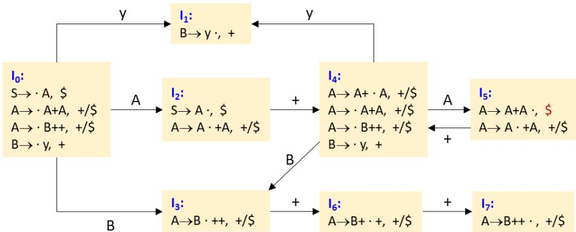

<table><tr><td rowspan=1 colspan=1>S</td><td rowspan=1 colspan=3>ACTOION</td><td rowspan=1 colspan=2>GOTO</td></tr><tr><td rowspan=1 colspan=1></td><td rowspan=1 colspan=1>y</td><td rowspan=1 colspan=1>+</td><td rowspan=1 colspan=1>$</td><td rowspan=1 colspan=1>A</td><td rowspan=1 colspan=1>B</td></tr><tr><td rowspan=1 colspan=1>0</td><td rowspan=1 colspan=1>s1</td><td rowspan=1 colspan=1></td><td rowspan=1 colspan=1></td><td rowspan=1 colspan=1>2</td><td rowspan=1 colspan=1>3</td></tr><tr><td rowspan=1 colspan=1>1</td><td rowspan=1 colspan=1></td><td rowspan=1 colspan=1>r4</td><td rowspan=1 colspan=1></td><td rowspan=1 colspan=1></td><td rowspan=1 colspan=1></td></tr><tr><td rowspan=1 colspan=1>2</td><td rowspan=1 colspan=1></td><td rowspan=1 colspan=1>s4</td><td rowspan=1 colspan=1>acc</td><td rowspan=1 colspan=1></td><td rowspan=1 colspan=1></td></tr><tr><td rowspan=1 colspan=1>3</td><td rowspan=1 colspan=1></td><td rowspan=1 colspan=1>s6</td><td rowspan=1 colspan=1></td><td rowspan=1 colspan=1></td><td rowspan=1 colspan=1></td></tr><tr><td rowspan=1 colspan=1>4</td><td rowspan=1 colspan=1>s1</td><td rowspan=1 colspan=1></td><td rowspan=1 colspan=1></td><td rowspan=1 colspan=1>5</td><td rowspan=1 colspan=1>3</td></tr><tr><td rowspan=1 colspan=1>5</td><td rowspan=1 colspan=1></td><td rowspan=1 colspan=1>s4</td><td rowspan=1 colspan=1>r2</td><td rowspan=1 colspan=1></td><td rowspan=1 colspan=1></td></tr><tr><td rowspan=1 colspan=1>6</td><td rowspan=1 colspan=1></td><td rowspan=1 colspan=1>s7</td><td rowspan=1 colspan=1></td><td rowspan=1 colspan=1></td><td rowspan=1 colspan=1></td></tr><tr><td rowspan=1 colspan=1>7</td><td rowspan=1 colspan=1></td><td rowspan=1 colspan=1>r3</td><td rowspan=1 colspan=1>r3</td><td rowspan=1 colspan=1></td><td rowspan=1 colspan=1></td></tr></table>

## Exercise

• 对于句子y++, 请给出其分析流程，并说明y++是否为该文法的一个句子?

(1) ${ \mathsf S } \to { \mathsf A } ;$ (2) $\mathsf { A } \to \mathsf { A } + \mathsf { A } ;$ (3) $\mathsf { A } \to \mathsf { B } + + ;$ (4) $\mathsf { B } \to \mathsf { y } ;$

<table><tr><td colspan="2">Stack</td><td>Input</td><td>ACTION</td><td>GOTO</td></tr><tr><td>0</td><td>$</td><td>Y++$</td><td>s1</td><td></td></tr><tr><td>01</td><td>$y</td><td>++$</td><td>r4(B → γ)</td><td></td></tr></table>


<table><tr><td rowspan=1 colspan=1>S</td><td rowspan=1 colspan=3>ACTOION</td><td rowspan=1 colspan=2>GOTO</td></tr><tr><td rowspan=1 colspan=1></td><td rowspan=1 colspan=1>y</td><td rowspan=1 colspan=1>+</td><td rowspan=1 colspan=1>$</td><td rowspan=1 colspan=1>A</td><td rowspan=1 colspan=1>B</td></tr><tr><td rowspan=1 colspan=1>0</td><td rowspan=1 colspan=1>s1</td><td rowspan=1 colspan=1></td><td rowspan=1 colspan=1></td><td rowspan=1 colspan=1>2</td><td rowspan=1 colspan=1>3</td></tr><tr><td rowspan=1 colspan=1>1</td><td rowspan=1 colspan=1></td><td rowspan=1 colspan=1>r4</td><td rowspan=1 colspan=1></td><td rowspan=1 colspan=1></td><td rowspan=1 colspan=1></td></tr><tr><td rowspan=1 colspan=1>2</td><td rowspan=1 colspan=1></td><td rowspan=1 colspan=1>s4</td><td rowspan=1 colspan=1>acc</td><td rowspan=1 colspan=1></td><td rowspan=1 colspan=1></td></tr><tr><td rowspan=1 colspan=1>3</td><td rowspan=1 colspan=1></td><td rowspan=1 colspan=1>s6</td><td rowspan=1 colspan=1></td><td rowspan=1 colspan=1></td><td rowspan=1 colspan=1></td></tr><tr><td rowspan=1 colspan=1>4</td><td rowspan=1 colspan=1>s1</td><td rowspan=1 colspan=1></td><td rowspan=1 colspan=1></td><td rowspan=1 colspan=1>5</td><td rowspan=1 colspan=1>3</td></tr><tr><td rowspan=1 colspan=1>5</td><td rowspan=1 colspan=1></td><td rowspan=1 colspan=1>s4</td><td rowspan=1 colspan=1>r2</td><td rowspan=1 colspan=1></td><td rowspan=1 colspan=1></td></tr><tr><td rowspan=1 colspan=1>6</td><td rowspan=1 colspan=1></td><td rowspan=1 colspan=1>s7</td><td rowspan=1 colspan=1></td><td rowspan=1 colspan=1></td><td rowspan=1 colspan=1></td></tr><tr><td rowspan=1 colspan=1>7</td><td rowspan=1 colspan=1></td><td rowspan=1 colspan=1>r3</td><td rowspan=1 colspan=1>r3</td><td rowspan=1 colspan=1></td><td rowspan=1 colspan=1></td></tr></table>

## Exercise

• 对于句子y++, 请给出其分析流程，并说明y++是否为该文法的一个句子?

(1) S → A; (2) $\mathsf { A } \to \mathsf { A } + \mathsf { A } ;$ (3) A → B + +; (4) B → y;

<table><tr><td colspan="2"> Stack</td><td>Input</td><td>ACTION</td><td>GOTO</td></tr><tr><td>0</td><td>$</td><td>Y++$</td><td>s1</td><td></td></tr><tr><td>01</td><td>$y</td><td>++$</td><td>r4(B → ν)</td><td></td></tr><tr><td>0</td><td>$B</td><td>+$</td><td></td><td>3</td></tr></table>


<table><tr><td rowspan=1 colspan=1>S</td><td rowspan=1 colspan=3>ACTOION</td><td rowspan=1 colspan=2>GOTO</td></tr><tr><td rowspan=1 colspan=1></td><td rowspan=1 colspan=1>y</td><td rowspan=1 colspan=1>+</td><td rowspan=1 colspan=1>$</td><td rowspan=1 colspan=1>A</td><td rowspan=1 colspan=1>B</td></tr><tr><td rowspan=1 colspan=1>0</td><td rowspan=1 colspan=1>s1</td><td rowspan=1 colspan=1></td><td rowspan=1 colspan=1></td><td rowspan=1 colspan=1>2</td><td rowspan=1 colspan=1>3</td></tr><tr><td rowspan=1 colspan=1>1</td><td rowspan=1 colspan=1></td><td rowspan=1 colspan=1>r4</td><td rowspan=1 colspan=1></td><td rowspan=1 colspan=1></td><td rowspan=1 colspan=1></td></tr><tr><td rowspan=1 colspan=1>2</td><td rowspan=1 colspan=1></td><td rowspan=1 colspan=1>s4</td><td rowspan=1 colspan=1>acc</td><td rowspan=1 colspan=1></td><td rowspan=1 colspan=1></td></tr><tr><td rowspan=1 colspan=1>3</td><td rowspan=1 colspan=1></td><td rowspan=1 colspan=1>s6</td><td rowspan=1 colspan=1></td><td rowspan=1 colspan=1></td><td rowspan=1 colspan=1></td></tr><tr><td rowspan=1 colspan=1>4</td><td rowspan=1 colspan=1>s1</td><td rowspan=1 colspan=1></td><td rowspan=1 colspan=1></td><td rowspan=1 colspan=1>5</td><td rowspan=1 colspan=1>3</td></tr><tr><td rowspan=1 colspan=1>5</td><td rowspan=1 colspan=1></td><td rowspan=1 colspan=1>s4</td><td rowspan=1 colspan=1>r2</td><td rowspan=1 colspan=1></td><td rowspan=1 colspan=1></td></tr><tr><td rowspan=1 colspan=1>6</td><td rowspan=1 colspan=1></td><td rowspan=1 colspan=1>s7</td><td rowspan=1 colspan=1></td><td rowspan=1 colspan=1></td><td rowspan=1 colspan=1></td></tr><tr><td rowspan=1 colspan=1>7</td><td rowspan=1 colspan=1></td><td rowspan=1 colspan=1>r3</td><td rowspan=1 colspan=1>r3</td><td rowspan=1 colspan=1></td><td rowspan=1 colspan=1></td></tr></table>

## Exercise

• 对于句子y++, 请给出其分析流程，并说明y++是否为该文法的一个句子?

(1) S → A; (2) A → A + A; (3) A → B + +; (4) B → y;

<table><tr><td colspan="2"> Stack</td><td>Input</td><td>ACTION</td><td>GOTO</td></tr><tr><td>0</td><td>$</td><td>Y++$</td><td>s1</td><td></td></tr><tr><td>01</td><td> $y</td><td>++$</td><td>r4(B→ y)</td><td></td></tr><tr><td>0</td><td>$B</td><td>++$</td><td></td><td>3</td></tr><tr><td>03</td><td>$B</td><td>++$</td><td>s6</td><td></td></tr></table>

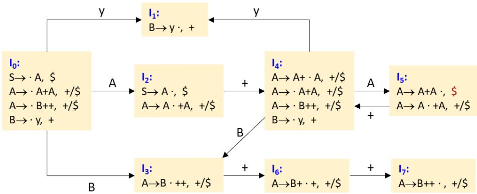

<table><tr><td rowspan=1 colspan=1>S</td><td rowspan=1 colspan=3>ACTOION</td><td rowspan=1 colspan=2>GOTO</td></tr><tr><td rowspan=1 colspan=1></td><td rowspan=1 colspan=1>y</td><td rowspan=1 colspan=1>+</td><td rowspan=1 colspan=1>$</td><td rowspan=1 colspan=1>A</td><td rowspan=1 colspan=1>B</td></tr><tr><td rowspan=1 colspan=1>0</td><td rowspan=1 colspan=1>s1</td><td rowspan=1 colspan=1></td><td rowspan=1 colspan=1></td><td rowspan=1 colspan=1>2</td><td rowspan=1 colspan=1>3</td></tr><tr><td rowspan=1 colspan=1>1</td><td rowspan=1 colspan=1></td><td rowspan=1 colspan=1>r4</td><td rowspan=1 colspan=1></td><td rowspan=1 colspan=1></td><td rowspan=1 colspan=1></td></tr><tr><td rowspan=1 colspan=1>2</td><td rowspan=1 colspan=1></td><td rowspan=1 colspan=1>s4</td><td rowspan=1 colspan=1>acc</td><td rowspan=1 colspan=1></td><td rowspan=1 colspan=1></td></tr><tr><td rowspan=1 colspan=1>3</td><td rowspan=1 colspan=1></td><td rowspan=1 colspan=1>s6</td><td rowspan=1 colspan=1></td><td rowspan=1 colspan=1></td><td rowspan=1 colspan=1></td></tr><tr><td rowspan=1 colspan=1>4</td><td rowspan=1 colspan=1>s1</td><td rowspan=1 colspan=1></td><td rowspan=1 colspan=1></td><td rowspan=1 colspan=1>5</td><td rowspan=1 colspan=1>3</td></tr><tr><td rowspan=1 colspan=1>5</td><td rowspan=1 colspan=1></td><td rowspan=1 colspan=1>s4</td><td rowspan=1 colspan=1>r2</td><td rowspan=1 colspan=1></td><td rowspan=1 colspan=1></td></tr><tr><td rowspan=1 colspan=1>6</td><td rowspan=1 colspan=1></td><td rowspan=1 colspan=1>s7</td><td rowspan=1 colspan=1></td><td rowspan=1 colspan=1></td><td rowspan=1 colspan=1></td></tr><tr><td rowspan=1 colspan=1>7</td><td rowspan=1 colspan=1></td><td rowspan=1 colspan=1>r3</td><td rowspan=1 colspan=1>r3</td><td rowspan=1 colspan=1></td><td rowspan=1 colspan=1></td></tr></table>

## Exercise

• 对于句子y++, 请给出其分析流程，并说明y++是否为该文法的一个句子?

(1) S → A; (2) A → A + A; (3) A → B + +; (4) B → y;

<table><tr><td colspan="2"> Stack</td><td>Input</td><td>ACTION</td><td>GOTO</td></tr><tr><td>0</td><td></td><td>$Y++$</td><td>s1</td><td></td></tr><tr><td>$y 01</td><td></td><td></td><td>±+$r4(B→ γ)</td><td></td></tr><tr><td>$B 0</td><td></td><td>++$</td><td></td><td>3</td></tr><tr><td>03</td><td>$B</td><td>++$</td><td>s6</td><td></td></tr><tr><td>036</td><td>$B+</td><td>+$</td><td>s7</td><td></td></tr></table>


<table><tr><td rowspan=1 colspan=1>S</td><td rowspan=1 colspan=3>ACTOION</td><td rowspan=1 colspan=2>GOTO</td></tr><tr><td rowspan=1 colspan=1></td><td rowspan=1 colspan=1>y</td><td rowspan=1 colspan=1>+</td><td rowspan=1 colspan=1>S</td><td rowspan=1 colspan=1>A</td><td rowspan=1 colspan=1>B</td></tr><tr><td rowspan=1 colspan=1>0</td><td rowspan=1 colspan=1>s1</td><td rowspan=1 colspan=1></td><td rowspan=1 colspan=1></td><td rowspan=1 colspan=1>2</td><td rowspan=1 colspan=1>3</td></tr><tr><td rowspan=1 colspan=1>1</td><td rowspan=1 colspan=1></td><td rowspan=1 colspan=1>r4</td><td rowspan=1 colspan=1></td><td rowspan=1 colspan=1></td><td rowspan=1 colspan=1></td></tr><tr><td rowspan=1 colspan=1>2</td><td rowspan=1 colspan=1></td><td rowspan=1 colspan=1>s4</td><td rowspan=1 colspan=1>acc</td><td rowspan=1 colspan=1></td><td rowspan=1 colspan=1></td></tr><tr><td rowspan=1 colspan=1>3</td><td rowspan=1 colspan=1></td><td rowspan=1 colspan=1>s6</td><td rowspan=1 colspan=1></td><td rowspan=1 colspan=1></td><td rowspan=1 colspan=1></td></tr><tr><td rowspan=1 colspan=1>4</td><td rowspan=1 colspan=1>s1</td><td rowspan=1 colspan=1></td><td rowspan=1 colspan=1></td><td rowspan=1 colspan=1>5</td><td rowspan=1 colspan=1>3</td></tr><tr><td rowspan=1 colspan=1>5</td><td rowspan=1 colspan=1></td><td rowspan=1 colspan=1>s4</td><td rowspan=1 colspan=1>r2</td><td rowspan=1 colspan=1></td><td rowspan=1 colspan=1></td></tr><tr><td rowspan=1 colspan=1>6</td><td rowspan=1 colspan=1></td><td rowspan=1 colspan=1>s7</td><td rowspan=1 colspan=1></td><td rowspan=1 colspan=1></td><td rowspan=1 colspan=1></td></tr><tr><td rowspan=1 colspan=1>7</td><td rowspan=1 colspan=1></td><td rowspan=1 colspan=1>r3</td><td rowspan=1 colspan=1>r3</td><td rowspan=1 colspan=1></td><td rowspan=1 colspan=1></td></tr></table>

## Exercise

• 对于句子y++, 请给出其分析流程，并说明y++是否为该文法的一个句子?

(1) S → A; (2) A → A + A; (3) A → B + +; (4) B → y;

<table><tr><td>Stack</td><td>Input</td><td>ACTION</td><td>GOTO</td></tr><tr><td>0 $</td><td>Y++$</td><td>s1</td><td></td></tr><tr><td>01 $y</td><td>++$</td><td>r4(B → ν)</td><td></td></tr><tr><td>0 $B</td><td>++$</td><td></td><td>3</td></tr><tr><td>03 $B</td><td>++$</td><td>s6</td><td></td></tr><tr><td>036 $B+</td><td>+$</td><td>s7</td><td></td></tr><tr><td>0367 $B++</td><td>$</td><td>r3(A→ B++)</td><td></td></tr></table>


<table><tr><td rowspan=1 colspan=1>S</td><td rowspan=1 colspan=3>ACTOION</td><td rowspan=1 colspan=2>GOTO</td></tr><tr><td rowspan=1 colspan=1></td><td rowspan=1 colspan=1>y</td><td rowspan=1 colspan=1>+</td><td rowspan=1 colspan=1>S</td><td rowspan=1 colspan=1>A</td><td rowspan=1 colspan=1>B</td></tr><tr><td rowspan=1 colspan=1>0</td><td rowspan=1 colspan=1>s1</td><td rowspan=1 colspan=1></td><td rowspan=1 colspan=1></td><td rowspan=1 colspan=1>2</td><td rowspan=1 colspan=1>3</td></tr><tr><td rowspan=1 colspan=1>1</td><td rowspan=1 colspan=1></td><td rowspan=1 colspan=1>r4</td><td rowspan=1 colspan=1></td><td rowspan=1 colspan=1></td><td rowspan=1 colspan=1></td></tr><tr><td rowspan=1 colspan=1>2</td><td rowspan=1 colspan=1></td><td rowspan=1 colspan=1>s4</td><td rowspan=1 colspan=1>acc</td><td rowspan=1 colspan=1></td><td rowspan=1 colspan=1></td></tr><tr><td rowspan=1 colspan=1>3</td><td rowspan=1 colspan=1></td><td rowspan=1 colspan=1>s6</td><td rowspan=1 colspan=1></td><td rowspan=1 colspan=1></td><td rowspan=1 colspan=1></td></tr><tr><td rowspan=1 colspan=1>4</td><td rowspan=1 colspan=1>s1</td><td rowspan=1 colspan=1></td><td rowspan=1 colspan=1></td><td rowspan=1 colspan=1>5</td><td rowspan=1 colspan=1>3</td></tr><tr><td rowspan=1 colspan=1>5</td><td rowspan=1 colspan=1></td><td rowspan=1 colspan=1>s4</td><td rowspan=1 colspan=1>r2</td><td rowspan=1 colspan=1></td><td rowspan=1 colspan=1></td></tr><tr><td rowspan=1 colspan=1>6</td><td rowspan=1 colspan=1></td><td rowspan=1 colspan=1>s7</td><td rowspan=1 colspan=1></td><td rowspan=1 colspan=1></td><td rowspan=1 colspan=1></td></tr><tr><td rowspan=1 colspan=1>7</td><td rowspan=1 colspan=1></td><td rowspan=1 colspan=1>r3</td><td rowspan=1 colspan=1>r3</td><td rowspan=1 colspan=1></td><td rowspan=1 colspan=1></td></tr></table>

## Exercise

• 对于句子y++, 请给出其分析流程，并说明y++是否为该文法的一个句子?

(1) S → A; (2) A → A + A; (3) A → B + +; (4) B → y;

<table><tr><td colspan="2"> Stack</td><td>Input</td><td>ACTION</td><td>GOTO</td></tr><tr><td>0</td><td>$</td><td>Y++$</td><td>s1</td><td></td></tr><tr><td>01</td><td> $y</td><td>++$</td><td>r4(B→ ν)</td><td></td></tr><tr><td>0</td><td>$B</td><td>+$</td><td></td><td>3</td></tr><tr><td>03</td><td>$B</td><td>++$</td><td>s6</td><td></td></tr><tr><td>036</td><td>$B+</td><td>+$</td><td>s7</td><td></td></tr><tr><td>0367</td><td> $B++</td><td>$</td><td>r3(A→ B++)</td><td></td></tr><tr><td>0</td><td>$A</td><td>$</td><td></td><td>2</td></tr></table>

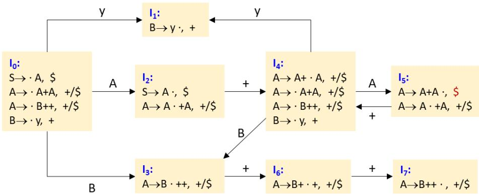

<table><tr><td rowspan=1 colspan=1>S</td><td rowspan=1 colspan=3>ACTOION</td><td rowspan=1 colspan=2>GOTO</td></tr><tr><td rowspan=1 colspan=1></td><td rowspan=1 colspan=1>y</td><td rowspan=1 colspan=1>+</td><td rowspan=1 colspan=1>S</td><td rowspan=1 colspan=1>A</td><td rowspan=1 colspan=1>B</td></tr><tr><td rowspan=1 colspan=1>0</td><td rowspan=1 colspan=1>s1</td><td rowspan=1 colspan=1></td><td rowspan=1 colspan=1></td><td rowspan=1 colspan=1>2</td><td rowspan=1 colspan=1>3</td></tr><tr><td rowspan=1 colspan=1>1</td><td rowspan=1 colspan=1></td><td rowspan=1 colspan=1>r4</td><td rowspan=1 colspan=1></td><td rowspan=1 colspan=1></td><td rowspan=1 colspan=1></td></tr><tr><td rowspan=1 colspan=1>2</td><td rowspan=1 colspan=1></td><td rowspan=1 colspan=1>s4</td><td rowspan=1 colspan=1>acc</td><td rowspan=1 colspan=1></td><td rowspan=1 colspan=1></td></tr><tr><td rowspan=1 colspan=1>3</td><td rowspan=1 colspan=1></td><td rowspan=1 colspan=1>s6</td><td rowspan=1 colspan=1></td><td rowspan=1 colspan=1></td><td rowspan=1 colspan=1></td></tr><tr><td rowspan=1 colspan=1>4</td><td rowspan=1 colspan=1>s1</td><td rowspan=1 colspan=1></td><td rowspan=1 colspan=1></td><td rowspan=1 colspan=1>5</td><td rowspan=1 colspan=1>3</td></tr><tr><td rowspan=1 colspan=1>5</td><td rowspan=1 colspan=1></td><td rowspan=1 colspan=1>s4</td><td rowspan=1 colspan=1>r2</td><td rowspan=1 colspan=1></td><td rowspan=1 colspan=1></td></tr><tr><td rowspan=1 colspan=1>6</td><td rowspan=1 colspan=1></td><td rowspan=1 colspan=1>s7</td><td rowspan=1 colspan=1></td><td rowspan=1 colspan=1></td><td rowspan=1 colspan=1></td></tr><tr><td rowspan=1 colspan=1>7</td><td rowspan=1 colspan=1></td><td rowspan=1 colspan=1>r3</td><td rowspan=1 colspan=1>r3</td><td rowspan=1 colspan=1></td><td rowspan=1 colspan=1></td></tr></table>

## Exercise

• 对于句子y++, 请给出其分析流程，并说明y++是否为该文法的一个句子?

(1) S → A; (2) A → A + A; (3) A → B + +; (4) B → y;

<table><tr><td colspan="2">Stack</td><td>Input</td><td>ACTION</td><td>GOTO</td></tr><tr><td>0</td><td>$</td><td>Y++$</td><td>s1</td><td></td></tr><tr><td>01</td><td>$y</td><td>+$</td><td>r4(B→ y)</td><td></td></tr><tr><td>0</td><td>SB </td><td>++$</td><td></td><td>3</td></tr><tr><td>03</td><td>$B</td><td>++$</td><td>s6</td><td></td></tr><tr><td>036</td><td>$B+</td><td>+$</td><td>s7</td><td></td></tr><tr><td>0367</td><td> $B++</td><td>S-</td><td>r3(A → B+ +)</td><td></td></tr><tr><td>0</td><td>$A</td><td>$</td><td></td><td>2</td></tr><tr><td>02</td><td>$A</td><td>$</td><td>acc</td><td></td></tr></table>


<table><tr><td rowspan=1 colspan=1>S</td><td rowspan=1 colspan=3>ACTOION</td><td rowspan=1 colspan=2>GOTO</td></tr><tr><td rowspan=1 colspan=1></td><td rowspan=1 colspan=1>y</td><td rowspan=1 colspan=1>+</td><td rowspan=1 colspan=1>S</td><td rowspan=1 colspan=1>A</td><td rowspan=1 colspan=1>B</td></tr><tr><td rowspan=1 colspan=1>0</td><td rowspan=1 colspan=1>s1</td><td rowspan=1 colspan=1></td><td rowspan=1 colspan=1></td><td rowspan=1 colspan=1>2</td><td rowspan=1 colspan=1>3</td></tr><tr><td rowspan=1 colspan=1>1</td><td rowspan=1 colspan=1></td><td rowspan=1 colspan=1>r4</td><td rowspan=1 colspan=1></td><td rowspan=1 colspan=1></td><td rowspan=1 colspan=1></td></tr><tr><td rowspan=1 colspan=1>2</td><td rowspan=1 colspan=1></td><td rowspan=1 colspan=1>s4</td><td rowspan=1 colspan=1>acc</td><td rowspan=1 colspan=1></td><td rowspan=1 colspan=1></td></tr><tr><td rowspan=1 colspan=1>3</td><td rowspan=1 colspan=1></td><td rowspan=1 colspan=1>s6</td><td rowspan=1 colspan=1></td><td rowspan=1 colspan=1></td><td rowspan=1 colspan=1></td></tr><tr><td rowspan=1 colspan=1>4</td><td rowspan=1 colspan=1>s1</td><td rowspan=1 colspan=1></td><td rowspan=1 colspan=1></td><td rowspan=1 colspan=1>5</td><td rowspan=1 colspan=1>3</td></tr><tr><td rowspan=1 colspan=1>5</td><td rowspan=1 colspan=1></td><td rowspan=1 colspan=1>s4</td><td rowspan=1 colspan=1>r2</td><td rowspan=1 colspan=1></td><td rowspan=1 colspan=1></td></tr><tr><td rowspan=1 colspan=1>6</td><td rowspan=1 colspan=1></td><td rowspan=1 colspan=1>s7</td><td rowspan=1 colspan=1></td><td rowspan=1 colspan=1></td><td rowspan=1 colspan=1></td></tr><tr><td rowspan=1 colspan=1>7</td><td rowspan=1 colspan=1></td><td rowspan=1 colspan=1>r3</td><td rowspan=1 colspan=1>r3</td><td rowspan=1 colspan=1></td><td rowspan=1 colspan=1></td></tr></table>

## Exercise

给定文法G(S):

(1) 拓广文法后，用LR(0)项目构造一个识别G(S)所有活前缀的DFA

(2) 判断该文法是否为LR(0)文法，并阐明原因

(3) 判断该文法是否为LR(1)文法，并阐明原因。

(4) 试构造该文法的SLR(1)分析表。

## Exercise

给定文法G(S):

$$
\begin{array} { l } { 5  5 \mathsf { b } \mid \mathsf { b A a } } \\ { \mathsf { A }  \mathsf { a S c } \mid \mathsf { a S b } \mid \mathsf { a } } \end{array}
$$

(1) 拓广文法后，用LR(0)项目构造一个识别G(S)所有活前缀的DFA

$$
\begin{array} { r l } & { [ \begin{array} { l } { \mathbf { I } _ { 1 } \leq \mathbf { S }  \mathbf { S } } \\ { \mathbf { S }  \mathbf { S } \mathbf { b } } \\ { \mathbf { S }  \mathbf { S } \mathbf { A } \mathbf { a } } \end{array} ] \xrightarrow { \mathbf { S } } [ \begin{array} { l } { \mathbf { I } _ { 1 } ; \mathbf { S }  \mathbf { S } \cdot \mathbf { \Phi } } \\ { \mathbf { S }  \mathbf { S } \cdot \mathbf { b } } \end{array} ] \xrightarrow { \mathbf { b } } [ \begin{array} { l } { \mathbf { I } _ { 1 } ; \mathbf { S }  \mathbf { S } \mathbf { b } \cdot \mathbf { \Phi } } \\ { \mathbf { S }  \mathbf { S } \cdot \mathbf { b } } \end{array} ] } \\ & { \xrightarrow { \mathbf { S }  \mathbf { b } \mathbf { A } \mathbf { a } } \qquad [ \begin{array} { l } { \mathbf { I } _ { 1 } ; \mathbf { S }  \mathbf { b } \mathbf { A } \cdot \mathbf { a } } \\ { \mathbf { I } _ { 2 } ; \mathbf { S }  \mathbf { b } \cdot \mathbf { A } \mathbf { a } } \end{array} ] \xrightarrow { \mathbf { a } } \qquad [ \begin{array} { l } { \mathbf { I } _ { 1 } ; \mathbf { S }  \mathbf { b } \mathbf { A } \mathbf { a } \cdot \mathbf { \Phi } } \\ { \mathbf { I } _ { 2 } ; \mathbf { A }  \mathbf { a } \mathbf { S } \mathbf { a } \cdot \mathbf { \Phi } } \end{array} ] } \\ & { \qquad \quad \mathbf { A }  \mathbf { a } \mathbf { S } } \\ & { \qquad \quad \mathbf { A }  \mathbf { a } \mathbf { S } } \\ & { \qquad \quad \mathbf { A }  \mathbf { a } \mathbf { a } } \end{array}
$$

## Exercise

给定文法G(S):

$$
\mathsf { S } \Rightarrow \mathsf { S } \mathsf { b } \mid \mathsf { b } \mathsf { A } \mathsf { a }
$$

$$
\mathsf { A } \to \mathsf { a S c } \mid \mathsf { a S b } \mid \mathsf { a }
$$

(2) 判断该文法是否为LR(0)文法，并阐明原因

. 移进—归约： ${ \bf I } _ { 1 } , ~ { \bf I } _ { 5 }$

归约—归约： $\mathbf { I } _ { 9 }$

$$
\begin{array} { r l } & { | \begin{array} { l l } { \mathbf { I } _ { 0 } ; \mathbf { S }  \mathbf { S } } \\ { \mathbf { S }  \mathbf { S } \mathbf { b } } \\ { \mathbf { S }  \mathbf { S } \mathbf { A } \mathbf { a } } \end{array} | \overset { \mathrm {  ~ S ~ } } { \longrightarrow } [ \begin{array} { l } { \mathbf { I } _ { 1 } ; \mathbf { S }  \mathbf { S } \cdot \mathbf { \Phi } } \\ { \mathbf { S }  \mathbf { S } \cdot \mathbf { b } } \end{array} ] \xrightarrow [ ] { \mathbf { I } _ { 1 } ; \mathbf { S }  \mathbf { S } \cdot \mathbf { \Phi } } [ \begin{array} { l } { \mathbf { I } _ { 1 } ; \mathbf { S } + \mathbf { S } \mathbf { b } \cdot \mathbf { \Phi } } \\ { \mathbf { S }  \mathbf { S } \mathbf { A } \mathbf { a } } \end{array} ] } \\ & { \qquad \frac { \mathrm {  ~ S ~ }  \mathbf { I } _ { 0 } ; \mathbf { I } _ { 0 } } { \mathrm {  ~ I ~ } _ { 2 } ; \mathbf { S }  \mathbf { I } \cdot \mathbf { A } \mathbf { a } } } \\ & { \qquad \mathrm {  ~ A ~ }  \mathbf { a } \cdot \mathbf { a } } \\ & { \qquad \mathrm { \textbf { A } }  \mathbf { a } \cdot \mathbf { a } } \end{array} ] \xrightarrow [ \mathbf { a } ] { \mathrm {  ~ L ~ i ~ } } \frac { \mathrm {  ~ S ~ } \mathrm {  ~ A ~ } \cdot \mathbf { A } \cdot \mathbf { \Phi } } { \mathrm {  ~ I ~ A ~ }  \mathbf { a } \cdot \mathbf { S } \mathbf { A } }  \\ &  \qquad \xrightarrow [ ] { \mathrm {  ~ A ~ }  \mathbf { a } \cdot \mathbf { a } } \frac { \mathrm {  ~ I ~ } _ { 0 } } { \mathrm {  ~ I ~ } _ { 0 } } [ \begin{array} { l } { \mathbf { A }  \mathbf { a } \cdot \mathbf { S } } \\ { \mathbf { A }  \mathbf { a } \cdot \mathbf { S } \mathbf { b } } \\ { \mathbf { S }  \mathbf { A } \mathbf { a } } \end{array} ] \xrightarrow [ ]  \mathrm   ~ S
$$

## Exercise

## 给定文法G(S):

$$
\mathsf { S } \Rightarrow \mathsf { S } \mathsf { b } \mid \mathsf { b } \mathsf { A } \mathsf { a }
$$

$$
\mathsf { A } \to \mathsf { a S c } \mid \mathsf { a S b } \mid \mathsf { a }
$$

(3) 判断该文法是否为LR(1)文法，并阐明原因

. 该文法是SLR(1)的，所以自然就是LR(1)文法。

理由:

• I1: 由于b ∉ $\mathrm { F O L L O W ( S ^ { ' } ) }$ )，冲突可通过Lookahead解析

I5: 考虑b ∉ FOLLOW(A)，同理可解析

• I9: FOLLOW(A) ∩ FOLLOW(S) = ∅

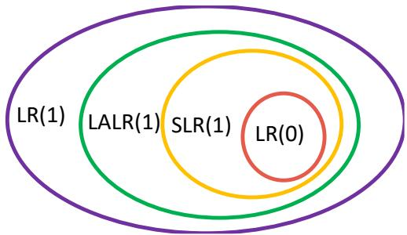

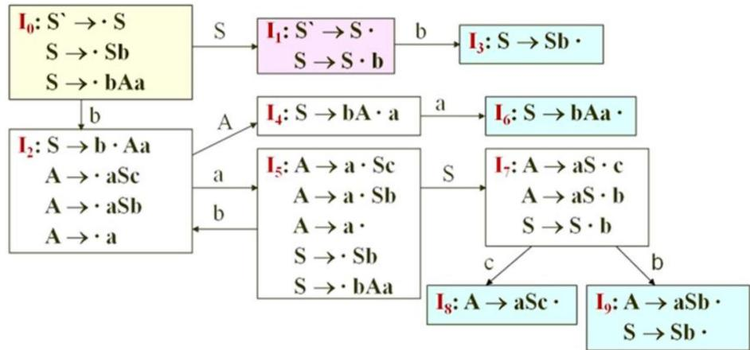

## Exercise

给定文法G(S):

$$
\mathsf { S } \Rightarrow \mathsf { S } \mathsf { b } \mid \mathsf { b } \mathsf { A } \mathsf { a }
$$

$$
\mathsf { A } \to \mathsf { a S c } \mid \mathsf { a S b } \mid \mathsf { a }
$$

(4) 试构造该文法的SLR(1)分析表

$$
( 1 ) \mathsf { S } \Rightarrow \mathsf { S } \mathsf { b }
$$

$$
( 2 ) \mathsf { S } \Rightarrow \mathsf { b } \mathsf { A } \mathsf { a }
$$

$$
( 3 ) \mathsf { A } \to \mathsf { a s c }
$$

$$
( 4 ) \mathsf { A } \to \mathsf { a S b }
$$

$$
( 5 ) \mathsf { A } \to \mathsf { a }
$$

推荐写增广后的文法

$$
\begin{array} { r l } & { [ \begin{array} { l } { \mathbf { I } _ { 4 } \cdot \mathbf { S }  \cdot \mathbf { S } } \\ { \mathbf { S }  \cdot \mathbf { S } \mathbf { b } } \\ { \mathbf { S }  \cdot \mathbf { b } \mathbf { A } } \end{array} ] \xrightarrow { \mathrm { ~ \mathbb { S } ~ } } [ \begin{array} { l } { \mathbf { I } _ { 1 } \cdot \mathbf { S }  \mathbf { S } \cdot \mathbf { \Phi } } \\ { \mathbf { S }  \mathbf { S } \cdot \mathbf { b } } \end{array} ] - [ \begin{array} { l } { \mathbf { I } _ { 3 } \cdot \mathbf { S }  \mathbf { S } \cdot \mathbf { \Phi } } \\ { \mathbf { I } _ { 4 } \cdot \mathbf { S }  \mathbf { b } \mathbf { A } \cdot \mathbf { \Phi } } \end{array} ] } \\ & { \xrightarrow [ \mathbf { I } _ { 2 } \cdot \mathbf { S }  \mathbf { b } \cdot \mathbf { A } \mathbf { a } ] { \mathrm { ~ \mathbb { A } ~ } } \xrightarrow [ \mathbf { I } _ { 4 } \cdot \mathbf { S }  \mathbf { b } \mathbf { A } \cdot \mathbf { a } ] { \mathrm { ~ \mathbb { A } ~ } } - [ \begin{array} { l } { \mathbf { I } _ { 4 } \cdot \mathbf { S }  \mathbf { b } \mathbf { A } \mathbf { a } \cdot \mathbf { \Phi } } \\ { \mathbf { I } _ { 5 } \cdot \mathbf { A }  \mathbf { a } \mathbf { S } \cdot \mathbf { c } } \end{array} ] } \\ &  \xrightarrow [ \mathbf { A }  \mathbf { a } ] { \mathrm { ~ \mathbb { A } ~ } } [ \begin{array} { l } { \mathbf { I } _ { 4 } \cdot \mathbf { A }  \mathbf { a } \cdot \mathbf { S } \mathbf { c } } \\ { \mathbf { A }  \mathbf { a } \cdot \mathbf { S } \mathbf { b } } \\ { \mathbf { A }  \mathbf { a } \cdot \mathbf { \Phi } } \end{array} ] \xrightarrow [ \mathbf { A }  \mathbf { a } ] { \mathrm { ~ \mathbb { A } ~ } } [ \begin{array} { l } { \mathbf { S } \cdot \mathbf { A }  \mathbf { a } \cdot \mathbf { b } } \\  \mathbf { S }  \mathbf { S } \cdot \ \end{array} \end{array}
$$

<table><tr><td rowspan=1 colspan=1></td><td rowspan=1 colspan=1>a</td><td rowspan=1 colspan=1>b</td><td rowspan=1 colspan=1>C</td><td rowspan=1 colspan=1>#</td><td rowspan=1 colspan=1>S</td><td rowspan=1 colspan=1>A</td></tr><tr><td rowspan=1 colspan=1>0</td><td rowspan=1 colspan=1></td><td rowspan=1 colspan=1>b2</td><td rowspan=1 colspan=1></td><td rowspan=1 colspan=1></td><td rowspan=1 colspan=1>S1</td><td rowspan=1 colspan=1></td></tr><tr><td rowspan=1 colspan=1>1</td><td rowspan=1 colspan=1></td><td rowspan=1 colspan=1>b3</td><td rowspan=1 colspan=1></td><td rowspan=1 colspan=1>OK</td><td rowspan=1 colspan=1></td><td rowspan=1 colspan=1></td></tr><tr><td rowspan=1 colspan=1>2</td><td rowspan=1 colspan=1>a5</td><td rowspan=1 colspan=1></td><td rowspan=1 colspan=1></td><td rowspan=1 colspan=1></td><td rowspan=1 colspan=1></td><td rowspan=1 colspan=1>A4</td></tr><tr><td rowspan=1 colspan=1>3</td><td rowspan=1 colspan=1>r(1)</td><td rowspan=1 colspan=1>r(1)</td><td rowspan=1 colspan=1>r(1)</td><td rowspan=1 colspan=1>r(1)</td><td rowspan=1 colspan=1></td><td rowspan=1 colspan=1></td></tr><tr><td rowspan=1 colspan=1>4</td><td rowspan=1 colspan=1>a6</td><td rowspan=1 colspan=1></td><td rowspan=1 colspan=1></td><td rowspan=1 colspan=1></td><td rowspan=1 colspan=1></td><td rowspan=1 colspan=1></td></tr><tr><td rowspan=1 colspan=1>5</td><td rowspan=1 colspan=1>r(5)</td><td rowspan=1 colspan=1>b2</td><td rowspan=1 colspan=1></td><td rowspan=1 colspan=1></td><td rowspan=1 colspan=1>S7</td><td rowspan=1 colspan=1></td></tr><tr><td rowspan=1 colspan=1>6</td><td rowspan=1 colspan=1>r(2)</td><td rowspan=1 colspan=1>r(2)</td><td rowspan=1 colspan=1>r(2)</td><td rowspan=1 colspan=1>r(2)</td><td rowspan=1 colspan=1></td><td rowspan=1 colspan=1></td></tr><tr><td rowspan=1 colspan=1>7</td><td rowspan=1 colspan=1></td><td rowspan=1 colspan=1>b9</td><td rowspan=1 colspan=1>c8</td><td rowspan=1 colspan=1></td><td rowspan=1 colspan=1></td><td rowspan=1 colspan=1></td></tr><tr><td rowspan=1 colspan=1>8</td><td rowspan=1 colspan=1>r(3)</td><td rowspan=1 colspan=1>r(3)</td><td rowspan=1 colspan=1>r(3)</td><td rowspan=1 colspan=1>r(3)</td><td rowspan=1 colspan=1></td><td rowspan=1 colspan=1></td></tr><tr><td rowspan=1 colspan=1>9</td><td rowspan=1 colspan=1>r(4)</td><td rowspan=1 colspan=1>r(3)</td><td rowspan=1 colspan=1>r(3)</td><td rowspan=1 colspan=1>r(3)</td><td rowspan=1 colspan=1></td><td rowspan=1 colspan=1></td></tr></table>

也可以按照课件中的分析表写法

## Exercise

## • 判断题

• 在L-属性定义（L-Attributed Definition）中，每一个属性都是继承属性（Inherited Attribute）。

• 错。在L-属性定义中，要么是综合属性，要么是受限的继承属性，并非都是继承属性。

• 如果一个翻译模式（Translation Scheme）中存在嵌入在产生式右部的左边或中间的语义动作，则该翻译模式只适合使用递归下降预测翻译器（Recursive Descent Predictive Translator）来实现，无法使用LR分析技术来实现。

• 错。翻译器分析技术的使用并不是由语义动作的实现决定，而是由文法的特点、语义动作的需求以及性能考虑决定。

## Exercise

已知文法 G：S’→ S

$$
\cdot \varsigma \to ( \lfloor \varsigma \rfloor ) / \ : \mathsf { a }
$$

$$
\cdot \ l \longrightarrow \lfloor , \mathsf { S } \mid \mathsf { S }
$$

其语法制导翻译定义如下：

若输入为(a,(a))，且采用自底向上的分析方法，则输出为 。2

<table><tr><td rowspan=1 colspan=1>产生式</td><td rowspan=1 colspan=1>语义动作</td></tr><tr><td rowspan=1 colspan=1>S&#x27;→S</td><td rowspan=1 colspan=1>print(S.num)</td></tr><tr><td rowspan=1 colspan=1>S→(L)</td><td rowspan=1 colspan=1>S.num = L.num +1</td></tr><tr><td rowspan=1 colspan=1>s→a</td><td rowspan=1 colspan=1>S.num = 0</td></tr><tr><td rowspan=1 colspan=1>L→L,S</td><td rowspan=1 colspan=1>L.num = L1.num + S.num</td></tr><tr><td rowspan=1 colspan=1>L→S</td><td rowspan=1 colspan=1>L.num = S.num</td></tr></table>

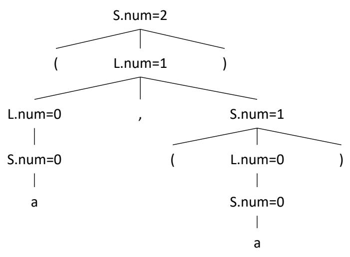

## Exercise

假设我们有一个产生式A→BCD。A、B、C、D这四个非终结符号都有两个属性：s是一个综合属性，而i是一个继承属性。对于下面的每组规则，请回答：这些规则是否满足S属性定义的要求？这些规则是否满足L属性定义的要求？并给出理由。

• A.s = B.s + D.s

• 该规则满足S属性定义的要求（每个属性都是综合属性），也满足L属性定义的要求（无继承属性） 0

• A.s = B.i + C.s

• 该规则不满足S属性定义的要求（存在继承属性i），满足L属性定义的要求（存在满足限制条件的继承属性i） 。

• A.s = D.i，B.i = A.s + C.s，C.i = B.s，D.i = B.i + C.i

• 该规则不满足S属性定义的要求（存在继承属性i），也不满足L属性定义的要求（存在不满足限制条件的继承属性B.i, 其依赖右兄弟的综合属性） o

## Exercise

考虑一个非标准的二进制数值系统，其中的每个二进制数b的值（value）被定义为从右至左的非零二进制数字表示的十进制数的交替和。例如， $\mathsf { v a l u e ~ \left( \varepsilon \right) ~ = ~ 0 , ~ \mathsf { v a l u e ~ \left( 1 0 \right) ~ = ~ 2 ^ { 1 } = ~ 2 } }$ ，value（100100）= 22 –25 =–28，value（11110）=21–22 + 23–24 = –10。已知表示非标准二进制数字b的文法G如下：

• S → T | ε

• T → 0T | 1T

• T → 0 | 1

请在表中添加相应的语义动作以计算value（b），你只能使用val和tmp两个属性。

<table><tr><td rowspan=1 colspan=1>产生式</td><td rowspan=1 colspan=1>语义动作</td></tr><tr><td rowspan=1 colspan=1> $\mathsf { S } \to \mathsf { T }$ </td><td rowspan=1 colspan=1> $\mathsf { S } . \mathsf { v a l } = \mathsf { T } . \mathsf { v a l } ;$ </td></tr><tr><td rowspan=1 colspan=1> $\mathbb { S } \to \pmb { \varepsilon }$ </td><td rowspan=1 colspan=1>S.val = 0;</td></tr><tr><td rowspan=1 colspan=1> $\mathsf T _ { 1 } \to 0 \mathsf T _ { 2 }$ </td><td rowspan=1 colspan=1> $\mathsf { T } _ { 1 } . \mathsf { t m p } = \mathsf { T } _ { 2 } . \mathsf { t m p } ^ { \mathrm { ~ \star ~ } } 2 ;$  $\underline { { \mathsf { T } _ { 1 } . \mathsf { v } \mathsf { a } \mathsf { I } } } = \mathsf { T } _ { 2 } . \mathsf { v } \mathsf { a } \mathsf { I } ;$ </td></tr><tr><td rowspan=1 colspan=1> $\mathsf T _ { 1 } \to 1 \mathsf T _ { 2 }$ </td><td rowspan=1 colspan=1> $-$  $\mathsf { T 1 . v a l } = \mathsf { T 2 . v a l } + \mathsf { T 1 . t m p } ;$ </td></tr><tr><td rowspan=1 colspan=1>T→0</td><td rowspan=1 colspan=1>T.tmp = -1;T.val = 0;</td></tr><tr><td rowspan=1 colspan=1>T→1</td><td rowspan=1 colspan=1>T.tmp = 1; $\underline { { \mathsf { T } . \mathsf { V } \mathsf { a } \mathsf { l } } } = \mathsf { 1 } ;$ </td></tr></table>