## 编译原理 Complier Principles

赵帅

计算机学院

中山大学

## Revisit


## Compilation Phases[编译阶段]

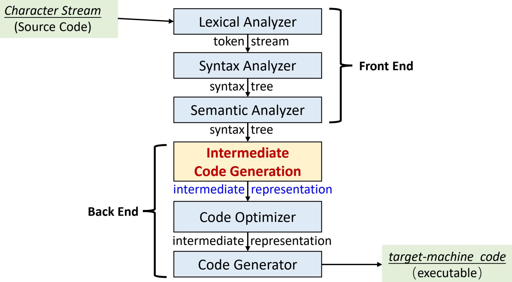

## Intermediate Code[中间代码生成]

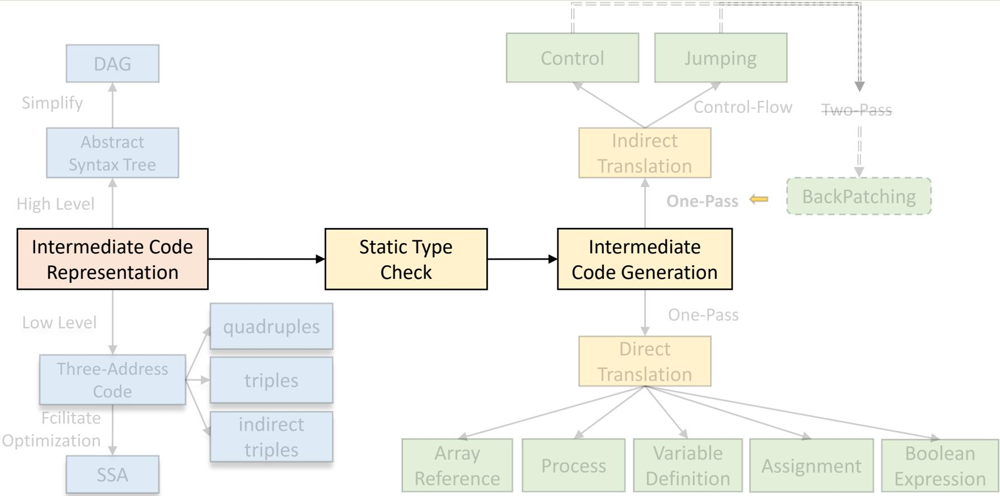

## Compilation Phases[编译阶段]

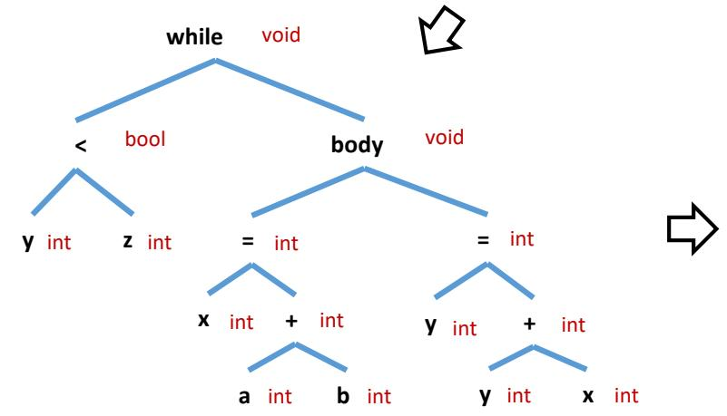  
Annotated AST/Decorated AST [带标注的抽象语法树]

$$
\begin{array} { r l } & { \mathrm { g o t o ~ L 1 } } \\ & { \mathrm { L 2 : } } \\ & { \mathrm { t 1 : } = \mathsf { a } + \mathsf { b } } \\ & { \qquad \mathrm { x : } = \mathsf { t 1 } } \\ & { \qquad \mathrm { t 2 : } = \mathsf { y } + \mathsf { x } } \\ & { \qquad \mathrm { y : } = \mathsf { t 2 } } \\ & { \mathrm { L 1 : } } \\ & { \qquad \mathrm { i f ~ } \forall < \mathsf { z } \mathrm { ~ g o t o ~ L 2 ~ } } \end{array}
$$

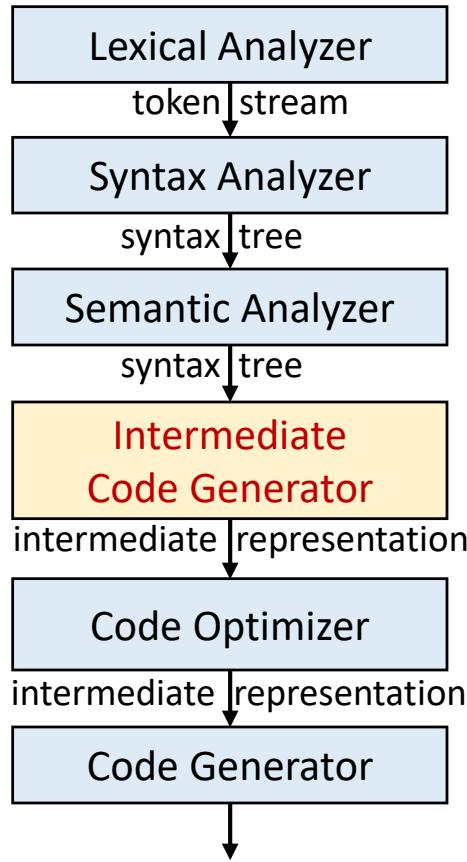

## Multiple IR Levels [不同层级的中间表示]

• IR provides advantages [中间表示的优势]

Increased abstraction and cleaner separation

• A compiler may construct a sequence of intermediate representations.

Source High-Level Low-Level Target Program IR … IR Code

• Modern compilers use different IRs at different stages.

High-level IR are close to the source code [接近源语言]

Example: Parse Tree, Abstract Syntax Tree [抽象语法树]

◆ Language dependent (a high-level IR for each language)

◆ Purpose: semantic analysis of program

## Multiple Level IR[不同层级的中间表示]

## • Low-level IR are close to assembly [接近汇编]

◆ E.g., three address code (TAC) [三地址码], static single assignment [静态单赋值]

◆ Essentially an instruction set [指令集] for an abstract machine

◆ Language and Machine independent (one common IR)

◆ Purpose: compiler optimizations to make code efficient

 All optimizations written in this IR is automatically applicable to all languages and machines

## • Machine-Level IR [机器层级]

Example: x86 IR, ARM IR, …

◆ Actual instructions for a concrete machine ISA [指令集架构]

◆ Machine dependent (a machine-level IR for each ISA)

◆ Purpose: code generation, CPU register allocation, etc

## Multiple Level IR[不同层级的中间表示]

• Possible to have only one IR (AST) — some compilers follows this

◆ Generate machine code from AST after semantic analysis [AST直接到机器码]

◆ Makes sense if compilation time is the primary concern (e.g., JIT)  Skip the IR generation step

## Why multiple IRs?

1. Better to have an appropriate IR for the task at hand [针对性]  Semantic analysis much easier with high-level IR (AST)  Compiler optimizations much easier with low-level IR (TAC)  Register allocation only possible with machine-level IR (ISA)

## Multiple Level IR[不同层级的中间表示]

## Why multiple IRs?

2. Easier to add a new front-end (language) or back-end (ISA) [易于扩展]

 Front-end: a new AST → low-level IR converter

 Back-end: a new low-level IR → machine IR converter

 Low-level IR acts as a bridge between multiple front-ends and backends, such that they can be reused

• If one IR (AST), and adding a new front-end...

◆Reimplement all compiler optimizations for new AST

◆A new AST → machine code converter for each ISA

◆Same goes for adding a new back-end

## Intermediate Code[中间代码生成]

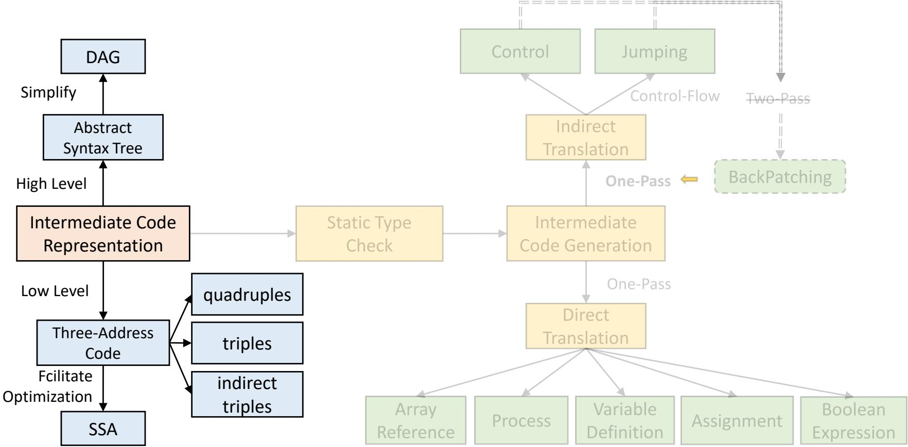

## Intermediate Representation[中间表示]

## Two Most important IR:

◆Trees [树形结构], including parse trees and (abstract) syntax trees [语法分析 树和抽象语法树]

◆Directed Acyclic Graph (DAG) [有向无环图]

◆Linear representations [线性表示形式], especially “three-address code” [三 地址代码] do-while

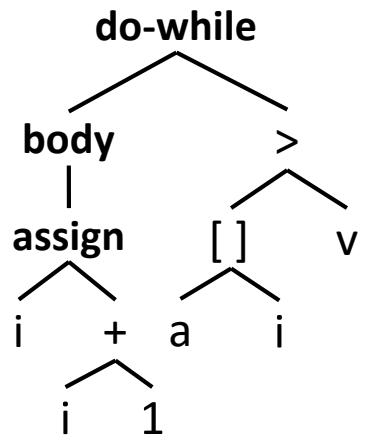

$$
1 { : } \dot { 1 } = \dot { 1 } + 1
$$

$$
2 \colon \mathsf { t } _ { 1 } = \mathsf { a } \left[ \mathsf { i } \right]
$$

3: if $\mathfrak { t } _ { 1 } < \mathfrak { v }$ goto 1

Fig. Two forms of intermediate code for ${ } ^ { \prime \prime } { \mathsf { d o i } } = { \mathsf { i } } + 1$ ; while(a[i]<v);”

## Three-Address Code[三地址代码]

• At most one operator on the right side of an instruction in threeaddress code, e.g., $\times + \ y ^ { * } z$ translated into $\mathbf { { t } } _ { 1 } = \mathsf { y } ^ { \ast } \textbf { { z } } ~ \mathbf { { t } } _ { 2 } = \mathsf { x } + \mathbf { { t } } _ { 1 }$

• Generic form is X = Y op Z [最多3个操作数]

◆where X, Y, Z can be variables, constants, or compiler-generated temporaries holding intermediate values.

• Characteristics [特性]

◆a linearized representation of a syntax tree or a DAG.

◆Assembly code for an “abstract machine”

◆Long expressions are converted to multiple instructions

◆Control flow statements are converted to jumps [控制流->跳转]

◆Machine independent

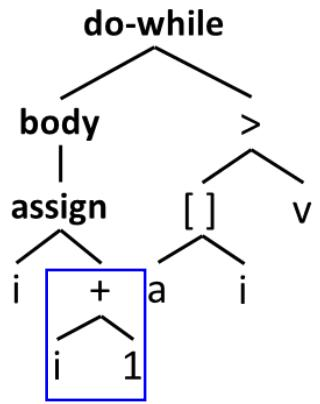

• Design goal: for easier machine-independent optimization

## Three-Address Code[三地址代码]

• Example: $\textsf { a } ^ { * } \textsf { b } + \textsf { a } ^ { * }$ b is translated to $\mathbf { t } _ { 1 } = \mathbf { a } ^ { * } \mathbf { b }$

$$
\mathbf { t } _ { 2 } = \mathbf { a } ^ { * } \mathbf { b }
$$

$$
\mathbf { t } _ { 3 } = \mathbf { t } _ { 1 } + \mathbf { t } _ { 2 }
$$

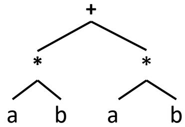

◆t1, t2, t3 are temporary variables

◆Can be generated through a depth-first traversal of $\mathsf { A S T } ,$ and internal nodes in AST are translated to temporary variables

• The repetition of $\textsf { a } ^ { * }$ b can be eliminated by a compiler optimization called common subexpression elimination (CSE)[通用子表达式消除]

$$
\begin{array} { l } { \mathbf { { t } _ { 1 } } = \mathbf { a } * \mathbf { b } } \\ { \mathbf { { t } _ { 3 } } = \mathbf { { t } _ { 1 } } + \mathbf { { t } _ { 1 } } } \end{array}
$$

• Using 3-address code rather than AST makes it:

• Easier to spot optimization opportunities

• Easier to manipulate IR.

## Addresses in three-address code[地址]

• An address can be one of the following:

◆A name[名字]. For convenience, we allow source-program names to appear as address in three-address code.

◆A constant[常量]. In practice, a complier must deal with many different types of constants and variables.

◆A complier-generated temporary[编译器生成的临时变量]. Creating a distinct name each time a temporary is needed [在每次需要临时变量时产生一个新名字是必要的], especially in optimizing compliers.

 These temporaries can be combined, if possible, when registers are allocated to variables.

## Three-Address Instruction Form[三地址指令形式]

1. Assignment instructions [二元赋值]

◆x = y op z, op is a binary arithmetic[双目算术符] or logical operation [逻辑运算符]

2. Assignment instructions [一元赋值]

◆x = op y, where op is a unary operation[单目运算符]. Essential unary operations include unary minus, logical negation, shift operators, and conversion operators.

3. Copy instructions [复制]

◆x = y, where x is assigned the value of y [把y的值赋给x].

4. Unconditional Jump instructions [无条件转移指令]

◆goto L: the three-address instruction with label L is the next to be executed.

5. Conditional Jump instructions [条件转移指令]

◆ if x goto L if False x goto L if (x relop y) goto L

◆where relop is a relational operator such as ==, >, <, etc.

## Three-Address Instruction Form[三地址指令形式]

## 6. Procedure calls [程序调用]

◆param x for parameters [参数传递];

◆ call $p , n$ for procedure call – p: the procedure, n: the number of params.

◆Part of a call of the procedure $p ( x _ { 1 } , x _ { 2 } . . . , x _ { \mathfrak { n } } )$

7. Procedure calls return statement [程序调用返回] ◆return y, y representing a returned value, is optional.

## Three-Address Instruction Form[三地址指令形式]

8. Indexed copy instructions [带下标的复制指令]

$\cdot \mathsf { x } = \mathsf { y } [ \mathsf { i } ] \quad \mathsf { x } [ \mathsf { i } ] = \mathsf { y }$

◆x = y[i] sets x to the value in the location i memory units beyond location y.

◆x[i]=y sets the contents of the location i units beyond x to the value of y.

9. Address and pointer assignments instructions. [地址及指针赋值指令]

◆ $x = \& y$ a pointer x is set to address of y [取址]

◆x = \*y x is set to the value of location pointed to by pointer y [y地址指向的值赋给x]

◆ $\ast _ { \mathsf { X } } = \mathsf { y }$ location pointed to by x is assigned y [y的值赋给x地址指向的位置]

## Example

Source program

$$
\begin{array}{c} \begin{array} { c } { \overbrace { \mathbf { \Lambda } } ^ { \mathrm { d o - w h i l e } } } \\ { \overbrace { \mathbf { \Lambda } } } \\ { \overbrace { \mathbf { \Lambda } } } \end{array} \overset { > } { \overbrace { \mathbf { \Lambda } } }  \\ { \overbrace { \mathbf { \Lambda } } } \\ { \overbrace { \mathbf { \Lambda } } } \end{array}
$$

Syntax tree

$$
\mathfrak { t } _ { 6 } = { ^ { \ast } \mathfrak { t } } _ { 5 }\tag{a[i]}
$$

$$
\mathfrak { t } _ { 6 } < \mathfrak { v }
$$

Three-address code

## Implementation of Three-address Code[实现]

• Three representations. (and more)

◆quadruples. [四元式]

◆triples. [三元式]

◆indirect triples. [间接三元式]

• Trade-offs between space, speed, ease of manipulation.

## • Quadruples. [四元式]

◆A quadruple has four fields, which we call op, $\mathsf { a r g } _ { 1 } , \mathsf { a r g } _ { 2 } ,$ result.

◆Examples & some exceptions:

$$
\mathtt { u } \mathtt { x } = \mathtt { y } + \mathtt { z } \ \Rightarrow \ \left( + , \mathtt { y } , \mathtt { z } , \mathtt { x } \right)
$$

 Note that for a copy statement like x = y, op is =, while for most other operations, the assignment operator is implied. [隐含表示的]

## Quadruples[四元式]

## • Quadruples. [四元式]

Examples & some exceptions:

 x = minus y => (minus, y, , x)

 Instructions with unary[一元] operators like x = minus y or x = y do not use arg2.

 Operators like param use neither arg2 nor result.

 (param, x1, , )

 goto L => (goto, , , L)

 Conditional and Unconditional jumps put the target label in result. [条件或非条件转移指令将目标标号放入result字段]

## Quadruples[四元式]

## • Example: $a = b ^ { 2 } ( - c ) + b ^ { 2 } ( - c )$

◆The special operator minus is used to distinguish the unary minus operator, as in $" ( " ,$ from the binary minus operator, as in $^ { \prime \prime } \mathrm { b - c } ^ { \prime \prime }$

$$
\mathbf { t } _ { 1 } = \mathsf { m i n u s c }
$$

$$
\mathfrak { t } _ { 2 } = \mathfrak { b } ^ { * } \mathfrak { t } _ { 1 }
$$

$$
\mathbf { t } _ { 3 } = \mathsf { m i n u s c }
$$

$$
\mathfrak { t } _ { 4 } = \mathfrak { b } ^ { * } \mathfrak { t } _ { 3 }
$$

$$
\mathfrak { t } _ { 5 } = \mathfrak { t } _ { 2 } + \mathfrak { t } _ { 4 }
$$

$$
\mathsf { a } = \mathsf { t } _ { 5 }
$$

<table><tr><td>op</td><td> $\mathbf { a r } \pmb { \mathrm { g } } _ { 1 }$ </td><td> $\yen 82$ </td><td>result</td></tr><tr><td>（0） minus</td><td>C</td><td></td><td> $\mathfrak { t } _ { 1 }$ </td></tr><tr><td>(1) *</td><td>b</td><td> $\mathfrak { t } _ { 1 }$ </td><td> $\ t _ { 2 }$ </td></tr><tr><td>(2)minusc</td><td>C </td><td></td><td> $\ t _ { 3 }$ </td></tr><tr><td>（3） *</td><td>b</td><td> $\ t _ { 3 }$ </td><td> $\mathfrak { t } _ { 4 }$ </td></tr><tr><td>（4) +</td><td> $\ t _ { 2 }$ </td><td> $\mathfrak { t } _ { 4 }$ </td><td> $\ t _ { 5 }$ </td></tr><tr><td>（5）</td><td> $\ t _ { 5 }$ </td><td></td><td>a</td></tr><tr><td colspan="4">Quadruples</td></tr></table>

## Three-address code

## Triples[三元式]

• A triple has only three fields, which we call op, arg1, arg2.

◆Quadruple without the result field.

 x = y + z => (+, y, z)

 the assignment operator (x=) is implied

◆ Result field is implicitly index of instruction.

◆Result referred to by index of instructions computing it.

 See example in the next slide

## Triples[三元式]

## • Example: $a = b ^ { 2 } ( - c ) + b ^ { 2 } ( - c )$

◆The copy statement $a = t _ { 5 }$ is encoded in the triple representation by placing a in the a $\mathsf { r } \mathsf { g } _ { 1 }$ field and (4) in the a $\mathsf { f } \mathsf { g } _ { 2 }$ field.

<table><tr><td rowspan=1 colspan=4>op          $\mathbf { a r } \pmb { \mathrm { g } } _ { 1 }$           $\yen 82$       result</td></tr><tr><td rowspan=1 colspan=1>(0)</td><td rowspan=1 colspan=1>minus</td><td rowspan=1 colspan=1>C</td><td rowspan=1 colspan=1> $\mathfrak { t } _ { 1 }$ </td></tr><tr><td rowspan=1 colspan=1>(1)</td><td rowspan=1 colspan=1>*</td><td rowspan=1 colspan=1>b                $\mathfrak { t } _ { 1 }$ </td><td rowspan=1 colspan=1> $\ t _ { 2 }$ </td></tr><tr><td rowspan=1 colspan=1>(2)</td><td rowspan=1 colspan=1> minus</td><td rowspan=1 colspan=1>c</td><td rowspan=1 colspan=1> $\mathrm { t } _ { 3 }$ </td></tr><tr><td rowspan=1 colspan=1>（3)</td><td rowspan=1 colspan=1>*</td><td rowspan=1 colspan=1>b               $\ t _ { 3 }$ </td><td rowspan=1 colspan=1> $\mathrm { t } _ { 4 }$ </td></tr><tr><td rowspan=1 colspan=1>(4)</td><td rowspan=1 colspan=1>+</td><td rowspan=1 colspan=1> $\ t _ { 2 }$                $5 4$ </td><td rowspan=1 colspan=1> $\mathrm { t } _ { 5 }$ </td></tr><tr><td rowspan=1 colspan=3>(5)          =               $\mathrm { t } _ { 5 }$ </td><td rowspan=1 colspan=1>a</td></tr></table>

Quadruples

<table><tr><td colspan="2">op</td><td> $\mathbf { a r } \pmb { \mathrm { g } } _ { 1 }$ </td><td> $\mathsf { a r g } _ { 2 }$ </td></tr><tr><td>(0)</td><td>minus</td><td>C</td><td></td></tr><tr><td>(1)</td><td>*</td><td>b</td><td>(0)</td></tr><tr><td>(2)</td><td>minus</td><td>C</td><td></td></tr><tr><td>(3)</td><td>*</td><td>b</td><td>(2)</td></tr><tr><td>(4)</td><td>+</td><td>(1)</td><td>(3)</td></tr><tr><td>(5)</td><td>=</td><td>a</td><td>(4)</td></tr><tr><td colspan="2"></td><td>Triples</td><td>23</td></tr></table>

## More About Triples[三元式]

• How can the following statements be expressed in triple?

◆ Array location (e.g. x[i] = y)

◆Pointer location $\left( \mathbf { e . g . \nabla ^ { * } } ( \mathsf { x } + \mathsf { i } ) = \mathsf { y } \right)$

◆ Struct field location (e.g. x.i = y)

• Example: x[i] = y

◆Requires two entries in the triple structure.

◆ is translated to:

<table><tr><td colspan="2">op</td><td colspan="2"> $\mathbf { a r } \mathbf { g } _ { 1 }$ </td></tr><tr><td>(0)</td><td>[]</td><td>X</td><td> $\yen 12$  i</td></tr><tr><td>(1)</td><td>=</td><td>（0)</td><td>Y</td></tr></table>

Complex LHS may require more triples to compute address

// Compute address of x[i] location

// Assign y to that location

## Problems About Triples[三元式]

## • Problem with triples

◆In code optimization, instructions are often moved around.

◆With triples, the result of an operation is referred to by its position, so moving an instruction may require us to change all references to that result.

<table><tr><td></td><td>op  $\mathbf { a r } \pmb { \mathrm { g } } _ { 1 }$ </td><td> $\yen 82$ </td><td>result</td></tr><tr><td>(0) minus</td><td>C</td><td></td><td> $\mathfrak { t } _ { 1 }$ </td></tr><tr><td>(1)</td><td>* b</td><td> $\mathfrak { t } _ { 1 }$ </td><td> $\ t _ { 2 }$ </td></tr><tr><td>(2)</td><td>minus -----c--</td><td></td><td>t3</td></tr><tr><td>(3)</td><td>* --b---</td><td>t</td><td> $\mathfrak { t } _ { 4 }$ </td></tr><tr><td>(4.(2) +</td><td> $\ t _ { 2 }$ </td><td> $i _ { 4 } ^ { \cdot \phantom { } } t _ { 2 } ^ { \phantom { } }$ </td><td> $\ t _ { 5 }$ </td></tr><tr><td>(5/. (3)</td><td> $\ t _ { 5 }$ </td><td></td><td>a</td></tr></table>

$$
\mathbf { t } _ { 1 } = \mathbf { a } ^ { * } \mathbf { b }
$$

$$
t _ { 2 } = a + b
$$

<table><tr><td rowspan=1 colspan=3>op          $\mathbf { a r } \pmb { \mathrm { g } } _ { 1 }$           $\yen 82$ </td></tr><tr><td rowspan=1 colspan=1>(0)</td><td rowspan=1 colspan=1>minus</td><td rowspan=1 colspan=1>C</td></tr><tr><td rowspan=1 colspan=1>(1)</td><td rowspan=1 colspan=1>*</td><td rowspan=1 colspan=1>b(0)</td></tr><tr><td rowspan=1 colspan=1> (2)</td><td rowspan=1 colspan=1>-minus-</td><td rowspan=1 colspan=1></td></tr><tr><td rowspan=1 colspan=1>(3)</td><td rowspan=1 colspan=1></td><td rowspan=1 colspan=1>*----(2)</td></tr><tr><td rowspan=1 colspan=1>. (2)</td><td rowspan=1 colspan=1>+</td><td rowspan=1 colspan=1>(1)          (1)</td></tr><tr><td rowspan=1 colspan=1>（S. (3)</td><td rowspan=1 colspan=1>二</td><td rowspan=1 colspan=1>a            (4)</td></tr></table>

$$
\mathbf { t } _ { 3 } = \mathbf { t } _ { 1 } + \mathbf { t } _ { 2 }
$$

$$
\mathbf { t } _ { 1 } = \mathbf { a } ^ { * } \mathbf { b }
$$

$$
\mathbf { t } _ { 3 } = \mathbf { t } _ { 1 } + \mathbf { t } _ { 1 }
$$

## Problems About Triples[三元式]

## • Problem with triples

◆In code optimization, instructions are often moved around.

◆With triples, the result of an operation is referred to by its position, so moving an instruction may require us to change all references to that result.

<table><tr><td colspan="2">op</td><td> $\mathbf { a r g } _ { 1 }$ </td><td> $\yen 82$ </td><td>result</td></tr><tr><td rowspan="2">(0)</td><td>minus</td><td>C</td><td></td><td> $\mathfrak { t } _ { 1 }$ </td></tr><tr><td>*</td><td>b</td><td> $\mathfrak { t } _ { 1 }$ </td><td> $\ t _ { 2 }$ </td></tr><tr><td>(1) (2)</td><td>+</td><td> $\ t _ { 2 }$ </td><td> $\ t _ { 2 }$ </td><td> ${ \sf T } _ { 5 }$ </td></tr><tr><td>(3)</td><td>=</td><td> $\ t _ { 5 }$ </td><td></td><td>a</td></tr></table>

<table><tr><td colspan="2">op</td><td> $\mathbf { a r g } _ { 1 }$ </td><td> $\yen 82$ </td></tr><tr><td>(0)</td><td>minus</td><td>C</td><td></td></tr><tr><td>(1)</td><td>*</td><td>b</td><td>（0）</td></tr><tr><td>(2)</td><td>+</td><td>(1)</td><td>(1)</td></tr><tr><td>(3)</td><td>=</td><td>a</td><td>(4)X .</td></tr></table>

Instruction (3) refers to (4) which is no longer there.

## Three-Address Code[三地址代码] (Recap)

• Generic form is X = Y op Z [最多3个操作数]

• Three representations. (and more)

<table><tr><td rowspan="2">←quadruples[四元式] □ x=y+ z =&gt; (+,y, z,x)</td><td>step</td><td>instruction</td><td colspan="4">α triple&#x27;database&#x27;</td></tr><tr><td>0</td><td>（0)</td><td> index</td><td>op</td><td>arg1</td><td>arg2</td></tr><tr><td>←triples[三元式]</td><td>1</td><td>(1)</td><td>(0)</td><td>+</td><td>a</td><td>b</td></tr><tr><td>□ X = y + z =&gt;(1) (+,y, z), use index for the result</td><td>2</td><td>(2)</td><td>(1)</td><td>*</td><td>（0）</td><td>C</td></tr><tr><td></td><td>3</td><td>(0)</td><td>(2)</td><td>=</td><td>×</td><td>(1)</td></tr><tr><td>←indirect triples[间接三元式]</td><td>4</td><td>(3)</td><td>(3)</td><td>/</td><td>d</td><td>（0）</td></tr><tr><td>□ use an index list for TAC execution</td><td>5</td><td>(4)</td><td>(4)</td><td>=</td><td>y</td><td>(3)</td></tr></table>

## • Single Static Assignment

• Every variable is assigned exactly once statically[仅一次]

## Indirect Triples[间接三元式]

• The problem does not occur with indirect triples.

• Indirect triples consist of a listing of pointers to triples, rather than a

listing of triples themselves.

<table><tr><td>step</td><td>instruction</td></tr><tr><td>0</td><td>（0）</td></tr><tr><td>1</td><td>(1)</td></tr><tr><td>2</td><td>(2)</td></tr><tr><td>3</td><td>(3)</td></tr><tr><td>4</td><td>(4)</td></tr><tr><td>5</td><td>(5)</td></tr></table>

Triples are stored in a triple ‘database’

<table><tr><td>index</td><td>op</td><td> $\mathbf { a r } \mathbf { g } _ { 1 }$ </td><td> $\yen 82$ </td></tr><tr><td>(0)</td><td>minus</td><td>C</td><td></td></tr><tr><td>(1)</td><td>*</td><td>b</td><td>（0）</td></tr><tr><td>(2)</td><td>minus</td><td>C</td><td></td></tr><tr><td>(3)</td><td>*</td><td>b</td><td>(2)</td></tr><tr><td>(4)</td><td>+</td><td>(1)</td><td>(3)</td></tr><tr><td>(5)</td><td>=</td><td>a</td><td>(4)</td></tr></table>

## Indirect Triples[间接三元式]

• After CSE, empty entries in database can be reused

◆Code in triple database becomes non-contiguous over time

◆That’s fine since the listing is the code, not the database

Triples are stored in a triple ‘database’

<table><tr><td>step</td><td>instruction</td></tr><tr><td>0</td><td>（0）</td></tr><tr><td>1</td><td>(1)</td></tr><tr><td>2</td><td> (4)</td></tr><tr><td>3</td><td>(5)</td></tr></table>

<table><tr><td>index</td><td>op</td><td> $\mathbf { a r g } _ { 1 }$ </td><td> $\yen 82$ </td></tr><tr><td>（0）</td><td>minus</td><td>C</td><td></td></tr><tr><td>(1)</td><td>*</td><td>b</td><td>（0）</td></tr><tr><td>(2)</td><td></td><td>empty</td><td></td></tr><tr><td>(3)</td><td></td><td>empty</td><td></td></tr><tr><td>(4)</td><td>+</td><td>(1)</td><td>(1)</td></tr><tr><td>(5)</td><td>=</td><td>a</td><td>(4)</td></tr></table>

## Indirect Triples[间接三元式]

• Another Example: ${ \sf X } = ( \sf { a } + \sf { b } ) ^ { * } { \sf c } ;$ $\mathsf { y } = \mathsf { d } / ( \mathsf { a } + \mathsf { b } )$

<table><tr><td>step</td><td>instruction</td></tr><tr><td>0</td><td>(0)</td></tr><tr><td>1</td><td>(1)</td></tr><tr><td>2</td><td>(2) </td></tr><tr><td>3</td><td>(0)</td></tr><tr><td>4</td><td>(3)</td></tr><tr><td>5</td><td>(4)</td></tr></table>

<table><tr><td>index</td><td>op</td><td> $\mathbf { a r } \mathbf { g } _ { 1 }$ </td><td> $\yen 12$ </td></tr><tr><td>(0)</td><td>+</td><td>a</td><td>b</td></tr><tr><td>(1)</td><td>*</td><td>（0）</td><td>C</td></tr><tr><td>(2)</td><td>=</td><td>X </td><td>(1)</td></tr><tr><td>(3)</td><td>/</td><td>d</td><td>（0)</td></tr><tr><td>(4)</td><td>=</td><td>Y</td><td>(3)</td></tr></table>

• With indirect triples, an optimizing complier can move an instruction by reordering the instruction list, without affecting the triples themselves.

## Single Static Assignment[静态单赋值]

• Every variable is assigned exactly once statically[仅一次]

◆Give variable a different version name on every assignment

 e.g. ${ \sf x }  { \sf x } _ { 1 } , { \sf x } _ { 2 } , . . . , { \sf x } _ { 5 }$ for each static assignment of x

◆Now value of each variable guaranteed not to change

◆On a control flow merge, φ-function combines two versions

 e.g. $\mathsf { x } _ { 5 } = \Phi ( \mathsf { x } _ { 3 } , \mathsf { x } _ { 4 } )$ : means $\mathsf { x } _ { 5 }$ is either $\mathsf { x } _ { 3 }$ or $\mathsf { x } _ { 4 }$

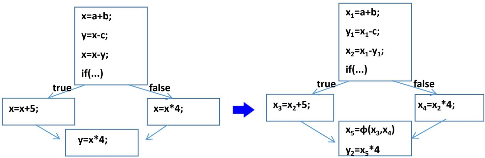

## Benefits of SSA

• SSA is an IR that facilitates code optimization

◆SSA tells you when an optimization should not happen

◆Suppose compiler performs CSE on previous example:

 Without SSA, (incorrectly) tempted to eliminate second $\times ^ { * } 4$

$$
\times = \times ^ { * } 4 ; ~ \forall = \times ^ { * } 4 ; ~  ~ \times = \times ^ { * } 4 ; ~ \forall = \times ^ { * }
$$

 With SSA, ${ \sf x } _ { 2 } ^ { * }$ 4 and ${ \sf X } _ { 5 } ^ { * }$ 4 are clearly different values

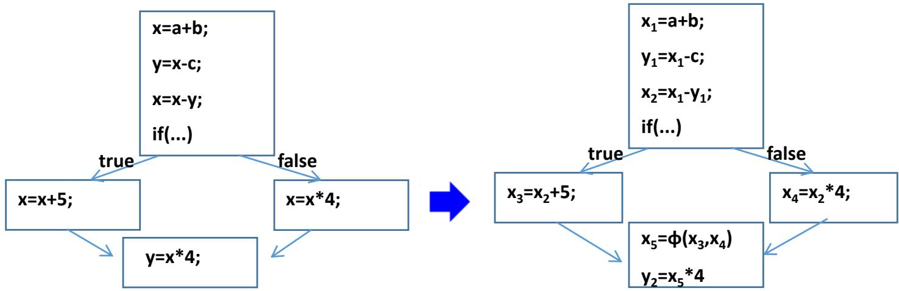

## Benefits of SSA (cont.)

## • SSA is an IR that facilitates code optimizations

◆ SSA tells you when an optimization should happen

◆ Suppose compiler performs dead code elimination (DCE): (DCE removes code that computes dead values)

Without SSA, not very clear whether there are dead values

◆ With SSA, x1 is never used and clearly a dead value

$$
\mathsf { x } = \mathsf { a } + \mathsf { b } ;
$$

$$
\mathsf { x } _ { 1 } = \mathsf { a } + \mathsf { b } ;
$$

$$
{ \mathsf { x } } = { \mathsf { c } } - { \mathsf { d } } ;
$$

$$
\mathsf { x } _ { 2 } = \mathsf { c } - \mathsf { d } ;
$$

$$
{ \mathsf { y } } = { \mathsf { x } } ^ { * } { \mathsf { b } } ;
$$

$$
\forall 1 = \mathsf { x } _ { 2 } \ast \mathsf { b } ;
$$

• Why does SSA work so well with compiler optimizations?

◆ SSA makes flow of values explicit in the IR

◆ Without SSA, need a separate dataflow graph

◆ Will discuss more in Compiler Optimization section

## Syntax Directed Translation[语法制导翻译]

## • Syntax directed translation can be used again for code generation [代码生成]

◆ Code generation is dependent on syntax/AST

◆ Code generation is to translate the syntactic structures

• What language structures do we need to translate?[翻译]

Definitions (variables, functions, ...)

◆ Assignment statements

Array references

◆ Boolean expressions

◆ Control flow statements (if-then-else, for, etc)...

• We are going to use the following strategy:

◆ Specify SDD semantic rules (without ordering)

◆ Convert SDD rules to SDT actions (with ordering)

## Intermediate Code[中间代码生成]

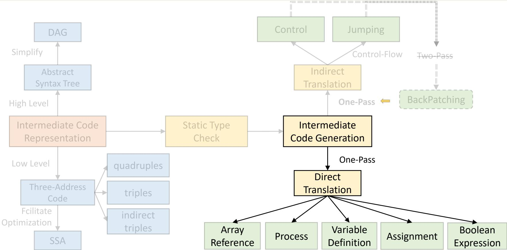

## Code Generation Overview[代码生成]

• Program code is a collection of functions

◆By now, all functions are listed in symbol table

• Goal is to generate code for each function in that list

• Generating code for a function involves two steps:

◆Processing variable definitions[变量定义] -> Laying out variables in memory

◆Processing statements[语句] -> Generating instructions for statements

 Assignments, array references, boolean expressions, control-flow statements

• We will start with variable definitions

## Processing Variable Definitions[变量定义]

• To lay out a variable, both location and width are needed

◆ Location: where variable is located in memory

◆ Width: how much space variable takes up in memory

• Attributes for variable definition:

◆ T V, e.g., int x;

◆ T: non-terminal for type name

 T.type: type (int, float, ...)

 T.width: width of type in bytes (e.g., 4 for int)

V: non-terminal for variable name

 V.type: type (int, float, ...)

 V.width: width of variable according to type

V.offset: offset of variable in memory

## ◆ But offset from what...?

## Variable Location from Offset

• Naive method: reserve a big memory section for all data

Size data section to be large enough to contain all variables

◆ Location = var offset + base of data section

• Naive method wastes a lot of memory

◆ Vars with limited scope only live briefly in memory

 E.g., function variables last only for duration of call

• Solution: allocate memory for each scope[域内]

◆ Allocate when entering scope, free when exiting scope

Variables in the same scope are allocated / freed together

Location = var offset + base of scope memory section

◆ Will discuss more later in Runtime Management

## Storage Layout of Variables in a Functi 中山大学

• When there are multiple variables defined in a function

◆ Compiler lays out variables in memory sequentially

Current offset used to place variable x in memory

 address(x) ← offset

 offset += sizeof(x.type)

```c
void foo() {
int a;
int b;
long long c;
int d;
```

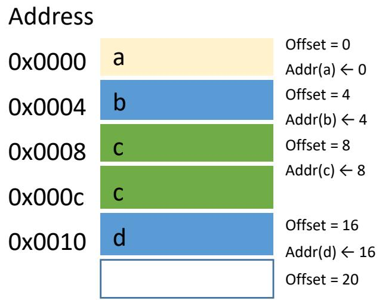

## More about Storage Layout

## • Allocation alignment[对齐]

Enforce addr(x) % sizeof(x.type) == 0

◆ Most machine architectures are designed such that computation is most efficient at sizeof(x.type) boundaries

 E.g. most machines are designed to load integer values at integer word boundaries  If not on word boundary, need to load two words with shift & concatenate → inefficient

## void foo() {

void foo() {

char a;

$$
/ / \mathsf { a d d r } ( \mathsf { a } ) = 0
$$

int b;

$$
/ / \mathsf { a d d r } ( \mathsf { b } ) = 1
$$

int c;

$$
/ / \mathsf { a d d r } ( \mathsf { a } ) = 0
$$

char a;

$$
/ / \mathsf { a d d r } ( \mathsf { c } ) = 5
$$


long long d;

int b;

$$
/ / \mathsf { a d d r } ( \mathsf { b } ) = 4
$$

int c;

long long d;

```c
#include<stdio.h>
struct{
char x; int y;
}Test;
int main() {
printf("%d\n",sizeof(Test));
return 0;
}
```

What is the output? Not aligned: 5, Aligned: 8

## Code Generation[代码生成]

## • We will use the syntax-directed formalisms to specify translation

◆ Variable definitions[变量定义] -> Recall semantic analysis & symbol table

◆ Assignment[赋值]

◆ Array references[数组引用]

◆ Boolean expressions[布尔表达式]

◆ Control-flow statements[控制流语句]

## • To generate three-address codes (TACs)

Lay out variables in memory

◆ Generate TAC for any subexpressions or substatements

◆ Using the result, generate TAC for the overall expression

## Intermediate Code[中间代码生成]


## Code Generation[代码生成]

## • SSA (Single Static Assignment)

## • We will use the syntax-directed formalisms to specify translation

◆ Variable definitions[变量定义] -> Recall semantic analysis & symbol table

◆ Assignment[赋值]

◆ Array references[数组引用]

◆ Boolean expressions[布尔表达式]

◆ Control-flow statements[控制流语句]

## • To generate three-address codes (TACs)

Lay out variables in memory

◆ Generate TAC for any subexpressions or substatements

◆ Using the result, generate TAC for the overall expression

## CodeGen: Assignment Statement

• Translate into three-address code[赋值语句]

◆An expression with more than one operator will be translated into instructions with at most one operator per instruction

• Helper functions in translation

◆lookup(id): search id in symbol table, return null if none

◆emit()/gen(): generate three-address IR

◆newtemp(): get a new temporary location

Assignment statement:

$$
\textcircled { 1 } { \mathsf S }  { \mathsf i } { \mathsf d } = { \mathsf E } ;
$$

$$
\mathsf { a } = \mathsf { b } + \left( - \mathsf { c } \right)
$$

$$
\textcircled { 2 } \mathsf { E }  \mathsf { E } _ { 1 } + \mathsf { E } _ { 2 } ;
$$

Three-address code:

$$
\textcircled{3} E  - E _ { 1 }
$$

$$
\mathrm { t } _ { 1 } = \mathsf { m i n u s c }
$$

$$
\textcircled{4} \mathsf E \to ( \mathsf E _ { 1 } )
$$

$$
\mathfrak { t } _ { 2 } = \mathfrak { b } + \mathfrak { t } _ { 1 }
$$

$$
\textcircled{5} E \textcircled { - } \mathsf { i d }
$$

$$
\mathsf { a } = \mathsf { t } _ { 2 }
$$

## SDT Translation of Assignment

• Attributes code and addr

◆ S.code and E.code denote the TAC for S and E, respectively

◆ E.addr denotes the address that will hold the value of E (can be a name, constant, or a compiler-generated temporary) Assignment statement Assignment statement:

$$
\textcircled { 1 } { \mathsf S }  { \mathsf i } { \mathsf d } = { \mathsf E } ;
$$

$$
\mathsf { a } = \mathsf { b } + \left( - \mathsf { c } \right)
$$

$$
\textcircled { 2 } \mathsf E \to \mathsf E _ { 1 } + \mathsf E _ { 2 } ;
$$

Three-address code:

$$
\textcircled{3} E  - E _ { 1 }
$$

$$
\mathrm { t } _ { 1 } = \mathsf { m i n u s c }
$$

$$
\textcircled{4} \mathsf E \to ( \mathsf E _ { 1 } )
$$

$$
\mathfrak { t } _ { 2 } = \mathfrak { b } + \mathfrak { t } _ { 1 }
$$

$$
\textcircled{5} E \textcircled { - } \mathsf { i d }
$$

$$
\mathsf { a } = \mathsf { t } _ { 2 }
$$

```javascript
① S -> id = E; { p = lookup(id.lexeme); if !p then error; S.code = E.code || gen( p ‘=’ E.addr ); }
② E -> E1 + E2; { E.addr = newtemp(); E.code = E1.code || E2.code ||gen(E.addr ‘=’ E1.addr ‘+’ E2.addr); }
③ E -> - E1 { E.addr = newtemp(); E.code = E1.code || gen(E.addr ‘=’ ‘minus’ E1.addr); }
④ E -> (E1) { E.addr = E1.addr; E.code = E1.code; }
⑤ E -> id { E.addr = lookup(id.lexeme); if !E.addr then error; E.code = ’’; }
```


## Incremental Translation[增量翻译]

• Generate only the new three-address instructions

◆ gen() not only constructs a three-address inst, it appends the inst to the sequence

S -> id = E; { p = lookup(id.lexeme); if !p then error; S.code = E.code || gen( p ‘=‘ E.addr ); }   
② E -> E1 + E2; { E.addr = newtemp(); E.code = E1.code || E2.code || gen(E.addr ‘=‘ E1.addr ‘+’ E2.addr); }   
③ E -> - E1 { E.addr = newtemp(); E.code = E1.code || gen(E.addr ‘=‘ ‘minus’ E1.addr); }   
④ E -> (E1) { E.addr = E1.addr; E.code = E1.code; }   
⑤ E -> id { E.addr = lookup(id.lexeme); if !E.addr then error; E.code = ’’; }

## Code Generation[代码生成]

## • We will use the syntax-directed formalisms to specify translation

◆ Variable definitions[变量定义] -> Recall semantic analysis & symbol table

Assignment[赋值]

Array references[数组引用]

◆ Boolean expressions[布尔表达式]

◆ Control-flow statements[控制流语句]

## • To generate three-address codes (TACs)

Lay out variables in memory

◆ Generate TAC for any subexpressions or substatements

◆ Using the result, generate TAC for the overall expression

## CodeGen: Array Reference[数组引用]

• Primary problem in generating code for array references is to determine the address of element

• 1D array:

int A[N];

A[i] ++;

◆base: address of the first element

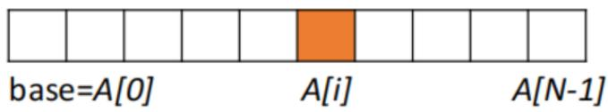

◆ width: width of each element

 i \* width is the offset


• Addressing an array element

◆ addr(A[i]) = base + i ⨉ width

## N-dimensional Array

• Laying out 2D array in 1D memory

$$
\begin{array} { l } { { \mathsf { i n t } \mathsf { A } [ \mathsf { N } _ { 1 } ] [ \mathsf { N } _ { 2 } ] ; ~ / ^ { * } \mathsf { i n t } \mathsf { A } [ 0 . . \mathsf { N } _ { 1 } ] [ 0 . . \mathsf { N } _ { 2 } ] ^ { * } / } } \\ { { \mathsf { A } [ \mathsf { i } _ { 1 } ] [ \mathsf { i } _ { 2 } ] + + ; } } \end{array}
$$

• Organization by row-major or column-major

◆ C language uses row major (i.e., row by row)

$$
\begin{array} { r } { \Phi \mathrm { a d d r } ( \mathsf { A } [ \mathsf { i } _ { 1 } , \mathsf { i } _ { 2 } ] ) = \mathsf { b a s e } + ( \mathsf { i } _ { 1 } \times \underbrace { \mathsf { N } _ { 2 } } _ { \mathsf { W } _ { 1 } } \sp { * } \underbrace { \mathsf { w i d t h } } _ { \mathsf { W } _ { 2 } } + \mathsf { i } _ { 2 } \times \underbrace { \mathsf { w i d t h } } _ { \mathsf { W } _ { 2 } } ) } \\ { \overbrace { \mathfrak { s p i } } \mathsf { i } _ { 1 } \overleftarrow { \mathsf { f } } \quad \overbrace { \mathfrak { s p i } } _ { 2 } \overleftarrow { \mathsf { y } } \mathsf { l } } \end{array}
$$

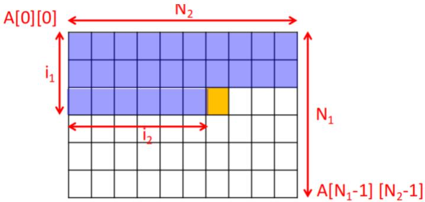

$$
\mathsf { N } _ { 2 } \dot { . }
$$

• k-dimensional array

◆ add $\mathsf { r } \left( \mathsf { A } [ \mathsf { i } _ { 1 } ] [ \mathsf { i } _ { 2 } ] \ldots [ \mathsf { i } _ { \mathsf { k } } ] \right) = \mathsf { b a s e } + \mathsf { i } _ { 1 } \mathsf { X } \mathsf { W } _ { 1 } + \mathsf { i } _ { 2 } \mathsf { X } \mathsf { W } _ { 2 } + \ldots + \mathsf { i } _ { \mathsf { k } } \mathsf { X } \mathsf { W } _ { \mathsf { k } }$

## Translation of Array References

• Type(a) = array(10, int)

◆ c = a[i];

$$
\mathsf { a d d r } ( \mathsf { a } [ \mathsf { i } ] ) = \mathsf { b a s e } + \mathsf { i } ^ { \ast } 4
$$

$$
\mathfrak { t } _ { 1 } = \mathfrak { i } ^ { * } 4
$$

$$
\mathfrak { t } _ { 2 } = \mathsf { a } [ \mathfrak { t } _ { 1 } ]
$$

3行5列

$$
{ \sf c } = { \sf t } _ { 2 }
$$

• Type(a) = array(3, array(5, int))

◆ c = a[i1][i2];

$$
\mathsf { a d d r } ( \mathsf { A } [ \mathsf { i } _ { 1 } , \mathsf { i } _ { 2 } ] ) = \mathsf { b a s e } + ( \mathsf { i } _ { 1 } \times \mathsf { N } _ { 2 } ^ { \ast } \mathsf { w i d t h } + \mathsf { i } _ { 2 } \times \mathsf { w i d t h } )
$$

$$
\mathsf { a d d r } ( \mathsf { a } [ \mathsf { i } _ { 1 } ] [ \mathsf { i } _ { 2 } ] ) = \mathsf { b a s e } + \mathsf { i } _ { 1 } ^ { \ast } 2 0 + \mathsf { i } _ { 2 } ^ { \ast } 4
$$

$$
\mathsf { t } _ { 1 } = \mathsf { i } _ { 1 } ^ { \star } 2 0
$$

$$
\mathfrak { t } _ { 2 } = \mathfrak { i } _ { 2 } ^ { \ * } 4
$$

3个5行8列

$$
\mathfrak { t } _ { 3 } = \mathfrak { t } _ { 1 } + \mathfrak { t } _ { 2 }
$$

${ \mathsf { T y p e } } ( \mathsf { a } ) = \mathsf { a r r a y } ( 3 ,$ , array(5, array(8, int)))

$$
\mathfrak { t } _ { 4 } = \mathsf { a } [ \mathfrak { t } _ { 3 } ]
$$

$$
\pmb { \cdot } \mathsf { c } = \mathsf { a } [ \mathsf { i } _ { 1 } ] [ \mathsf { i } _ { 2 } ] [ \mathsf { i } _ { 3 } ]
$$

$$
\mathsf { C } = \mathsf { t } _ { 4 }
$$

$$
\begin{array} { r l } & { \mathsf { a d d r } ( \mathsf { a } [ \mathsf { i } _ { 1 } ] [ \mathsf { i } _ { 2 } ] [ \mathsf { i } _ { 3 } ] ) = \mathsf { b a s e } + \mathsf { i } _ { 1 } ^ { \ast } \mathsf { W } _ { 1 } + \mathsf { i } _ { 2 } ^ { \ast } \mathsf { W } _ { 2 } + \mathsf { i } _ { 3 } ^ { \ast } \mathsf { W } _ { 3 } } \\ & { = \mathsf { b a s e } + \mathsf { i } _ { 1 } ^ { \ast } 1 6 0 + \mathsf { i } _ { 2 } ^ { \ast } 3 2 + \mathsf { i } _ { 3 } ^ { \ast } 4 } \end{array}
$$

## Translation of Array References (cont.)

• A[i1][i2][i3], type(a) = array(3, array(5, array(8, int)))

◆ L.array: a pointer to the symbol-table entry for the array name  L.array.base gives the array’s base address

◆ L.type: the type of the subarray generated by L

◆ L.addr: a temporary that is used while computing the offset for the array referenced by summing the terms $\mathsf { i } _ { \mathrm { j } } \times \mathsf { w } _ { \mathrm { j } }$

$$
\textcircled { 2 } \mathsf { E } \to \mathsf { E } _ { 1 } + \mathsf { E } _ { 2 } \mid - \mathsf { E } _ { 1 } \mid ( \mathsf { E } _ { 1 } ) \mid \mathsf { i d } \mid
$$

$$
\textcircled { 3 } \mathsf { L } \mathsf { \to i d } \mathsf { \left[ E \right] } | \mathsf { L } _ { 1 } \mathsf { \left[ E \right] }
$$

$$
\mathsf { b a s e } + \mathsf { i } _ { 1 } { \times } \mathsf { w } _ { 1 } + \mathsf { i } _ { 2 } { \times } \mathsf { w } _ { 2 } + \ldots + \mathsf { i } _ { \mathsf { k } } { \times } \mathsf { w } _ { \mathsf { k } }\tag{[E]}
$$

(i3)

## Translation of Array References (cont.)

```julia
• A[i1][i2][i3], type(a) = array(3, array(5, array(8, int)))
```

```javascript
① S -> id = E; | L = E; { gen(L.array.base‘[’L.addr‘]’ ‘=’ E.addr); }
② E -> E1 + E2 | - E1 | (E1) | id | L { E.addr = newtemp(); gen(E.addr ‘=’ L.array.base‘[’L.addr‘]’); }
③ L -> L1 [E] { L.array = L1.array; L.type = L1.type.elem; t = newtemp(); gen(t ‘=’ E.addr ‘*’
L.type.width); L.addr = newtemp(); gen(L.addr ‘=’ L1.addr ‘+’ t; } |
id [E] { L.array = lookup(id.lexeme); if !L.array then error; L.type = L.array.type.elem; L.offset =
newtemp(); gen(L.addr ‘=’ E.addr ‘*’ L.type.width); }
```

$$
\begin{array} { r l r } & { } & { a r o r o y : a n } \\ & { } & { t y p e a i n t } \\ & { } & { s p g e t \underline { { i } } _ { \mathrm { i } \times 1 } \mathrm { k 6 0 ~ i _ { 2 } \times 3 2 + i _ { 3 } \times 4 } } \\ & { } & { \cdot \underline { { a r f } } } \\ & { } & { \cdot \underline { { a r f } } } \\ & { } & { \underline { { i _ { \mathrm { B P e } } } } = a r o r o y ( \underline { { \theta } } , i n t ) } \\ & { } & { L _ { \mathrm { i } \mathrm { p p e } } ^ { - \bar { a r } \bar { a r } \bar { a y } = a } \quad \partial f \bar { f } \bar { e } t = i _ { 1 } \times 1 \mathrm { 6 0 } + i _ { 3 } \times 3 2 } \\ & { } & { L _ { \mathrm { i } \mathrm { p p e } } ^ { - \bar { a r } \bar { a r } \bar { a y } = a } \quad \partial ( f \bar { \xi } , a r a r y ( \underline { { \theta } } , i n t ) ) [ \begin{array} { l l l } { F } & { i } \\ { F } & { i } \end{array}  } \\ & { } & {  \begin{array} { l l l } { \bar { f } } & { i _ { \mathrm { i } } } \\ { \bar { f } \bar { f } \bar { f } \bar { e } \bar { e } \bar { e } \bar { e } \bar { e } \bar { e } \bar { e } \mathrm { i } \mathrm { i } \cdot \bar { \times } 4 6 } & { \bar { f } \bar { \xi } \bar { i } \bar { e } \bar { i } \bar { e } \bar { i } \cdot \bar { \times } 3 2 } \\ { \bar { f } \bar { f } \bar { e } \bar { e } \bar { e } \bar { e } \bar { e } \mathrm { i } \cdot \bar { \times } 5 \bar { i } \mathrm { k } \bar { e } \mathrm { 0 } } & { i _ { 3 } \times 3 } \end{array} ] } \\ & { } &   \begin{array} { l l l } { [ } & { i } & { \bar { f } } \\ { \bar { f } ] } & { } &  \bar { f } \bar { i } \bar { e } \bar { i } \quad \partial ( i _ \end{array} \end{array}
$$

$$
\begin{array} { r l } & { \mathbf { t } _ { 1 } = \mathbf { i } _ { 1 } ^ { \ * } \ 1 6 0 \qquad \mathbf { t } _ { 4 } = \mathbf { i } _ { 3 } ^ { \ * } \ 4 } \\ & { \mathbf { t } _ { 2 } = \mathbf { i } _ { 2 } ^ { \ * } \ 3 2 \qquad \mathbf { t } _ { 5 } = \mathbf { t } _ { 3 } + \mathbf { t } 4 } \\ & { \mathbf { t } _ { 3 } = \mathbf { t } _ { 1 } + \mathbf { t } 2 \qquad \mathbf { c } = \mathsf { a } [ \mathbf { t } _ { 5 } ] } \end{array}
$$

  
中国中山大学

## Code Generation[代码生成]

## • We will use the syntax-directed formalisms to specify translation

◆ Variable definitions[变量定义] -> Recall semantic analysis & symbol table

Assignment[赋值]

Array references[数组引用]

◆ Boolean expressions[布尔表达式]

◆ Control-flow statements[控制流语句]

## • To generate three-address codes (TACs)

Lay out variables in memory

◆ Generate TAC for any subexpressions or substatements

◆ Using the result, generate TAC for the overall expression

## CodeGen: Boolean Expressions

## • Boolean expression: a op b

◆ where op can be $< , < = , \mid = , > , > = , \& \& , \mid \mid , = = ,$

• Short-circuit evaluation[短路计算]: to skip evaluation of the rest of a boolean expression once a boolean value is known

◆ Given following C code: if (flag || foo()) { bar(); };

 If flag is true, foo() never executes

 Equivalent to: if (flag) { bar(); } else if (foo()) { bar(); };

◆ Given following C code: if (flag && foo()) { bar(); };

 If flag is false, foo() never executes

 Equivalent to: if (!flag) { } else if (foo()) { bar(); };

• For control flow, boolean operators is translated to jump statements

## Boolean Expressions

• Computed just like any other arithmetic expression

$$
E  ( a < b ) o r ( c < d a n d e < f )
$$

$$
t _ { 1 } = a < b
$$

$$
t _ { 2 } = c < d
$$

$$
t _ { 3 } = e < f
$$

$$
t _ { 4 } = t _ { 2 } \& \& t _ { 3 }
$$

$$
t _ { 5 } = t _ { 1 } \mid \mid t _ { 4 }
$$

• Then, used in control-flow statements

◆S.next: label for code generated after S

$$
S \to i f E S _ { 1 }
$$

if (!t5) goto S.next

$$
S _ { \it 1 } . c o d e
$$

$$
\ S . n e x t { : \dots }
$$

## Boolean Expressions

## • Implemented via a series of jumps[利用跳转]

◆ converted to two gotos (true and false)

◆ Remaining evaluation skipped when result known in middle

## • Example

◆ E.true: label for code to execute when E is ‘true’

◆ E.false: label for code to execute when E is ‘false’

◆ E.g. if above is condition for a do-while loop

 E.true would be label at beginning of loop body

 E.false would be label for code after the loop

E -> (a < b) or (c < d and e < f)

goto $L _ { 1 }$

goto E.false

goto E.false

E为真：只要a < b真

a < b假：继续评估

a < b假、 c < d真：继续评估

E为假：a < b假，c < d假

E为真：a < b假，c < d真，e < f真

E为假：a < b假，c < d真，e < f假

## Boolean Expressions

• Boolean expressions are composed of

◆Boolean operators $\left( = = , \& \& , \ | \ \right)$ applied to elements that are boolean variables or relational expressions (E1 relop E2)

$$
t _ { 1 } = a < b
$$

$$
t _ { 2 } = c < d
$$

• Computed just like any other arithmetic expression

$$
t _ { 3 } = e < f
$$

$$
t _ { 4 } = t _ { 2 } \& \& t _ { 3 }
$$

$$
E  ( a < b ) o r ( c < d a n d e < f )
$$

$$
t _ { 5 } = t _ { 1 } / / t _ { 4 }
$$

• Then, used in control-flow statements

◆S.next: label for code generated after S

if (!t5) goto S.next

$$
S _ { \substack { 1 } \cdot \ b { C O d e } }
$$

$$
S \to i f E S _ { 1 }
$$

S.next: ...

## SDT Translation of Booleans[布尔表达式]

## • B -> B1 || B2

◆ B1.true is same as B.true, B2 must be evaluated if B1 is false[B1假才评估B2]

◆ The true and false exits of B2 are the same as B[B2与B同真假]

## • B -> E1 relop E2

◆ Translated directly into a comparison TAC inst with jumps

```ocaml
① B -> { B1.true = B.true; B1.false = newlabel(); } B1|| { label(B1.false); B2.true = B.true; B2.false = B.false; } B2
② B -> { B1.true = newlabel(); B1.false = B.false; } B1 && { label(B1.true); B2.true = B.true; B2.false = B.false; } B2
③ B -> E1 relop E2 { gen(‘if’ E1.addr relop E2.addr ‘goto’ B.true); gen(‘goto’ B.false; }
④ B -> ! { B1.true = B.false; B1.false = B.true; } B1
⑤ B -> true { gen(‘goto’ B.true; }
⑥ B -> false { gen(‘goto’ B.false; }
```

## Intermediate Code[中间代码生成]

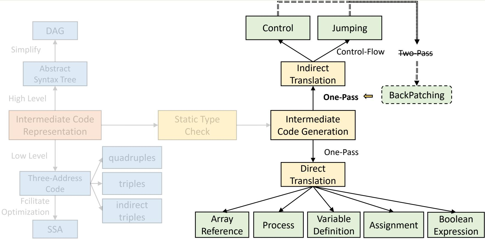

## Code Generation[代码生成]

## • We will use the syntax-directed formalisms to specify translation

◆ Variable definitions[变量定义] -> Recall semantic analysis & symbol table

Assignment[赋值]

Array references[数组引用]

◆ Boolean expressions[布尔表达式]

◆ Control-flow statements[控制流语句]

## • To generate three-address codes (TACs)

Lay out variables in memory

◆ Generate TAC for any subexpressions or substatements

◆ Using the result, generate TAC for the overall expression

## CodeGen: Control Statement[控制语句]

## • Inherited attributes[继承属性]

◆ B.true: the label to which control flows if B is true (依赖于S1)

◆ B.false: the label to which control flows if B is false (依赖于S2)

◆S.next: a label for the instruction immediately after the code of S

① S -> if ( B ) S1   
② S -> if ( B ) S1 else S2   
③ S -> while ( B ) S1

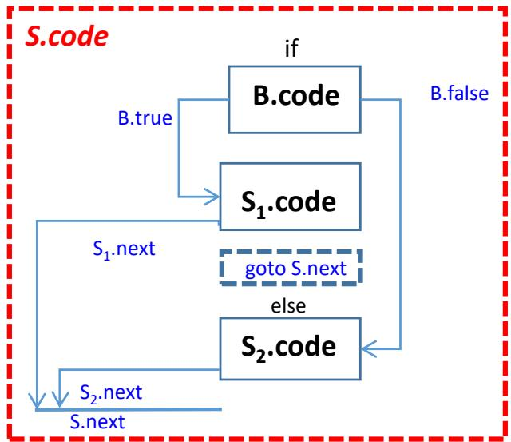

## Translation of Controls

## Helper functions[辅助函数]

◆newlabel(): creates a new label

◆label(L): attaches label L to the next three address inst to be generated

① S -> if ( B ) S1   
② S -> if ( B ) S1 else S2   
③ S -> while ( B ) S1

```javascript
S -> if { B.true = newlabel();
B.false = newlabel(); }
( B ) { label(B.true); S1.next = S.next; }
S1 { gen(‘goto’ S.next); }
else { label(B.false); S2.next = S.next; } S2
```

If false B goto B.false

B.false:

S.next:

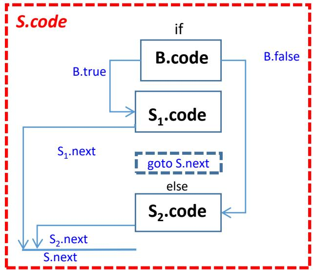

## Translation of Controls (cont.)

① S -> if ( B ) S1   
② S -> if ( B ) S1 else S2   
③ S -> while ( B ) S1

S -> if { B.true = newlabel(); B.false = S.next; }   
(B) { label(B.true); S1.next = S.next; }   
S

S -> while { S.begin = newlabel();   
label(S.begin);   
B.true = newlabel();   
B.false = S.next; }   
( B ) { label(B.true); S1.next = S.begin; }   
S1 { gen(‘goto’ S.begin); }

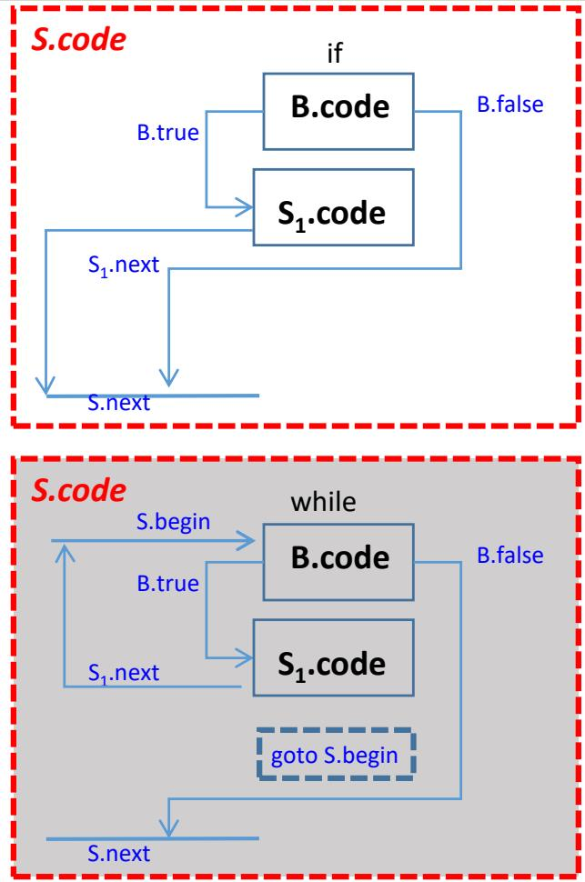

## Jumping Labels[跳转标签]

• Key of generating code for Boolean and flow-control: matching a jump inst with the target of jump[跳转指令匹配到跳转目标]

◆Forward jump: a jump to an instruction in below

◆Label for jump target has not yet been generated

B -> { B1.true = newlabel(); B1.false = B.false; } B1 && { label(B1.true); B2.true = B.true; B2.false = B.false; } B2   
S -> if { B.true = newlabel(); B.false = S.next; } ( B ) { label(B.true); S1.next = S.next; } S1

## Handle Jumping Labels

• Idea: generate code using dummy labels first, then patch them with addresses later after labels are generated

• Two-pass approach: requires two scans of code

◆ Pass 1:

 Generate code creating dummy labels for forward jumps. (Insert label into a hashtable)

 When label emitted, record address in hashtable

◆ Pass 2:

 Replace dummy labels with target addresses (Use previously built hashtable for mapping)

## • One-pass approach

◆ Generate holes when forward jumping to an un-generated label

Maintain a list of holes for that label

Fill in holes with addresses when label generated later on

## One-Pass Code Generation[单遍生成]

• One Pass Generation takes less time along with LR parser

• However, given the example below, we need to know the address of E2.label to insert jumps in E1

◆E.g. E1.false = E2.label in E → E1 || E2

## • Solution: Backpatching[回填]

◆Leave holes in IR in place of forward jump addresses

◆Record indices of jump instructions in a hole list

◆When target address of label for jump is eventually known, backpatch holes using the hole list for that particular label

## Backpatching[回填]

## • Synthesized attributes[综合属性]. S -> if (B) S1

◆ B.truelist: a list of jump or conditional jump insts into which we must insert the label to which control goes if B is true[B为真时控制流应该转向的指令的标号]

◆ B.falselist: a list of insts that eventually get the label to which control goes when B is false[B为假时控制流应该转向的指令的标号]

◆ S.nextlist: a list of jumps to the inst immediately following the code for S[紧跟在S代 码之后的指令的标号]

## • Helper functions to implement backpatching

◆ makelist(i): creates a new list out of statement index i

merge(p1, p2): returns merged list of p1 and p2

backpatch(p, i): fill holes in list p with statement index i

## Backpatching of Control-Flow

## • Slightly modify the grammar

① S -> if (B) M $\mathsf { S } _ { 1 }$ { backpatch(B.truelist, M.inst)   
S.nextlist = merge(B.falselist, S1.nextlist); }

② S -> if (B) $\mathsf { M } _ { 1 } \mathsf { S } _ { 1 }$ N else $\mathsf { M } _ { 2 } \mathsf { S } _ { 2 }$ { backpatch(B.truelist, M1.inst);   
backpatch(B.falselist, M2.inst);   
temp = merge(S1.nextlist, N.nextlist);   
S.nextlist = merge(temp, S2.nextlist); }

③ S -> while $\mathsf { M } _ { 1 }$ (B) $\mathsf { M } _ { 2 } \mathsf { S } _ { 1 }$ {backpatch(B.truelist, M2.inst);   
backpatch(S1.nextlist, M1.inst);   
S.nextlist = B.falselist);   
gen(‘goto’ M1.inst); }

M -> ε { M.inst = nextinst; }   
⑤ N -> ε { N.nextlist = makelist(nextinst); gen(‘goto _’); }

• makelist(i): creates a new list out of statement index i

• merge(p1, p2): returns merged list of p1 and p2

• backpatch(p, i): fill holes in list p with statement index i

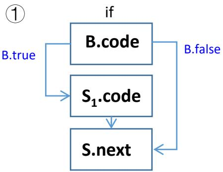

## Backpatching of Control-Flow

## • Slightly modify the grammar

① S -> if (B) M $\mathsf { S } _ { 1 }$ { backpatch(B.truelist, M.inst)   
S.nextlist = merge(B.falselist, S1.nextlist); }

② S -> if (B) $\mathsf { M } _ { 1 } \mathsf { S } _ { 1 }$ N else M2 S2 { backpatch(B.truelist, M1.inst);   
backpatch(B.falselist, M2.inst);   
temp = merge(S1.nextlist, N.nextlist);   
S.nextlist = merge(temp, S2.nextlist); }

③ S -> while ${ \sf M } _ { 1 }$ (B) M2 S1 {backpatch(B.truelist, M2.inst);   
backpatch(S1.nextlist, M1.inst);   
S.nextlist = B.falselist);   
gen(‘goto’ M1.inst); }

M -> ε { M.inst = nextinst; }   
⑤ N -> ε { N.nextlist = makelist(nextinst); gen(‘goto _’); }

• makelist(i): creates a new list out of statement index i

• merge(p1, p2): returns merged list of p1 and p2

• backpatch(p, i): fill holes in list p with statement index i

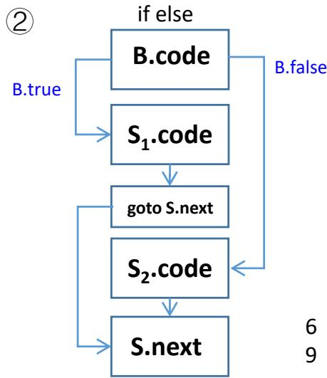

## Backpatching of Control-Flow

## • Slightly modify the grammar

① S -> if (B) M S1 { backpatch(B.truelist, M.inst)   
S.nextlist = merge(B.falselist, S1.nextlist); }

② S -> if (B) $\mathsf { M } _ { 1 } \mathsf { S } _ { 1 }$ N else M2 S2 { backpatch(B.truelist, M1.inst);   
backpatch(B.falselist, M2.inst);   
temp = merge(S1.nextlist, N.nextlist);   
S.nextlist = merge(temp, S2.nextlist); }

③ S -> while $\mathsf { M } _ { 1 }$ (B) M2 S1 {backpatch(B.truelist, M2.inst);   
backpatch(S1.nextlist, M1.inst);   
S.nextlist = B.falselist);   
gen(‘goto’ M1.inst); }

M -> ε { M.inst = nextinst; }   
⑤ N -> ε { N.nextlist = makelist(nextinst); gen(‘goto _’); }

• makelist(i): creates a new list out of statement index i

• merge(p1, p2): returns merged list of p1 and p2

• backpatch(p, i): fill holes in list p with statement index i

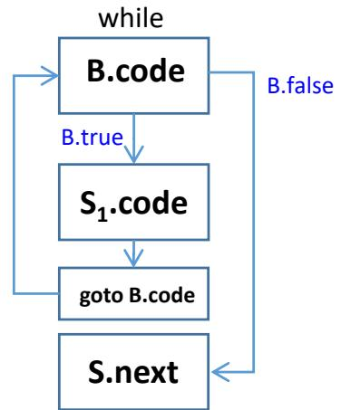

## Intermediate Code[中间代码生成]

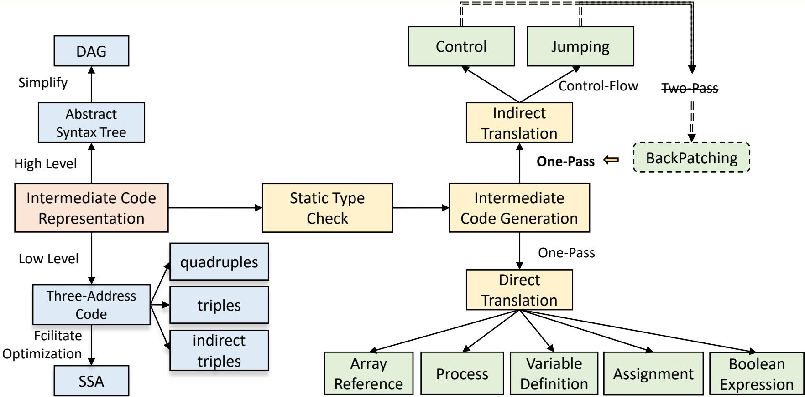

## Summary

• Three-Address Code: X = Y op Z

◆ Three representations

 quadruples [四元式]

 triples [三元式]

 indirect triples [间接三元式]

## • Single Static Assignment

• Code generation: TAC instructions using syntax directed translation

Variable definitions[变量定义]

◆ Expressions and statements

 Assignment[赋值]

 Array references[数组引用]

 Boolean expressions[布尔表达式]


 Control-flow[控制流]

## Further Reading

## • Dragon Book, 2nd Edition

## ◆ Comprehensive Reading:

 Section 6.2 on introduction to intermediate representations.

 Section 6.5 on type checking.

 Section 6.3, 6.4, 6.6 and 6.7 on translations of various program constructs.

## ◆ Skip Reading:

 Section 6.1 on AST and DAG.

 Section 6.8 and 6.9 on translations of switches and procedures.

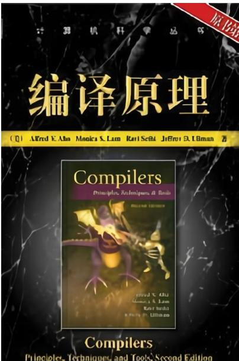